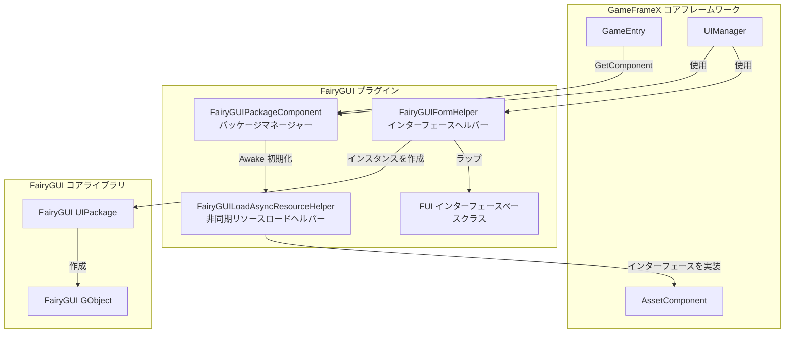
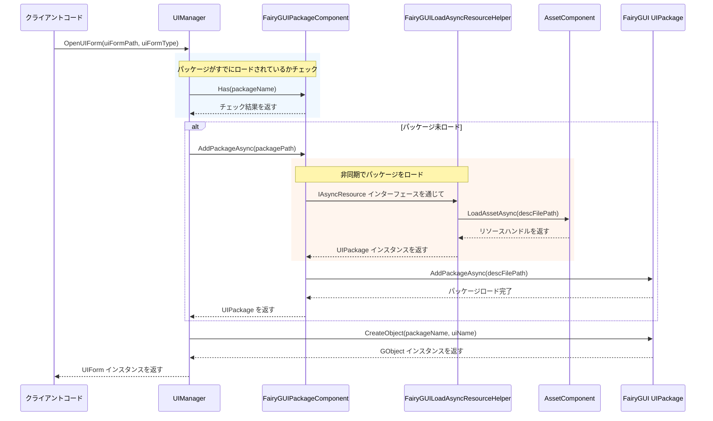

# パッケージマネージャー

パッケージマネージャーは、FairyGUI プラグインのコアコンポーネントであり、すべての UI パッケージのロード、キャッシュ、アンロード操作を管理します。同期と非同期の2つのロード方式を提供し、GameFrameX のリソース管理系统と深く統合されています。

## 概要

`FairyGUIPackageComponent` は `GameFrameworkComponent` を継承する Unity コンポーネントであり、FairyGUI と GameFrameX リソースシステムの間のブリッジとして機能します。その主な責務は次のとおりです：

- **パッケージロード管理**：UI パッケージの同期・非同期ロードをサポート
- **パッケージキャッシュメカニズム**：ロード済みのパッケージはキャッシュされ、重複ロードを避ける
- **リソース清理**：パッケージのアンロード機能を提供し、メモリリソースを解放
- **非同期リソースロード**：`IAsyncResource` インターフェースを実装することで、FairyGUI の非同期リソースロード要件をサポート

### コア責務

パッケージマネージャーの設計目標は、UI パッケージの管理フローを簡素化し、開発者がインターフェースロジック而不是リソースロードの詳細に集中できるようにすることです。UI インターフェースを表示する必要がある場合、パッケージマネージャーは対象パッケージがすでにロードされているかを自動的にチェックします：

- パッケージがすでにロードされている場合 → キャッシュされたパッケージを使用して直接インターフェースインスタンスを作成
- パッケージが未ロードの場合 → パッケージをロードしてからインターフェースインスタンスを作成

この設計により、UI 開発フローが大幅に簡素化され、開発効率が向上します。

## アーキテクチャ設計

パッケージマネージャーのシステムにおける位置と相互作用の関係は次のとおりです：



### コアクラスの説明

| クラス名 | 責務 | アクセスレベル |
|------|------|----------|
| `FairyGUIPackageComponent` | UI パッケージ管理コアコンポーネント | `public` |
| `FairyGUILoadAsyncResourceHelper` | IAsyncResource インターフェースを実装し、非同期リソースロードを処理 | `internal` |
| `UIPackageData` | ロード済みパッケージの情報を хранится | `public` (ネストされたクラス) |

## コア機能

### パッケージロードメカニズム

パッケージマネージャーは二重ロード戦略を採用し、同期と非同期のロード方式を同時にサポートしています：

#### 非同期ロード（推奨）

```csharp
/// <summary>
/// UI パッケージを非同期で追加。
/// </summary>
/// <param name="descFilePath">説明ファイルパス</param>
/// <param name="isLoadAsset">リソースをロードするか</param>
/// <returns>UI パッケージの非同期タスク</returns>
public Task<UIPackage> AddPackageAsync(string descFilePath, bool isLoadAsset = true)
```

非同期ロードは推奨される使用方式であり、大量の UI リソースを動的にロードする必要があるシナリオに特大都市しています。ロードプロセス中にメインスレッドがブロックされず、流畅なユーザー体験を維持できます。

> Source: [FairyGUIPackageComponent.cs#L148-L179](https://github.com/GameFrameX/com.gameframex.unity.ui.fairygui/blob/main/Runtime/FairyGUIPackageComponent.cs#L148-L179)

#### 同期ロード

```csharp
/// <summary>
/// UI パッケージを同期で追加。
/// </summary>
/// <param name="descFilePath">説明ファイルパス</param>
/// <param name="isLoadAsset">リソースをロードするか</param>
public void AddPackageSync(string descFilePath, bool isLoadAsset = true)
```

同期ロードはエディター環境またはゲームの起動時のプリロードシナリオに適しています。

> Source: [FairyGUIPackageComponent.cs#L190-L203](https://github.com/GameFrameX/com.gameframex.unity.ui.fairygui/blob/main/Runtime/FairyGUIPackageComponent.cs#L190-L203)

### パッケージクエリ操作

```csharp
/// <summary>
/// 指定された名前の UI パッケージが存在するかチェック。
/// </summary>
public bool Has(string uiPackageName)

/// <summary>
/// 指定された名前の UI パッケージを取得。
/// </summary>
public UIPackage Get(string uiPackageName)
```

> Source: [FairyGUIPackageComponent.cs#L265-L290](https://github.com/GameFrameX/com.gameframex.unity.ui.fairygui/blob/main/Runtime/FairyGUIPackageComponent.cs#L265-L290)

### パッケージアンロードメカニズム

パッケージマネージャーは精细なアンロード制御を提供します：

```csharp
/// <summary>
/// 指定された名前の UI パッケージを削除。
/// </summary>
public void RemovePackage(string packageName)

/// <summary>
/// すべての UI パッケージを削除。
/// </summary>
public void RemoveAllPackages()
```

アンロード操作は次のステップを実行します：
1. `Package.UnloadAssets()` を呼び出してリソースをアンロード
2. FairyGUI からパッケージを削除
3. リソースヘルパーを通じて下位リソースを解放
4. キャッシュ辞書からレコードを削除

> Source: [FairyGUIPackageComponent.cs#L213-L254](https://github.com/GameFrameX/com.gameframex.unity.ui.fairygui/blob/main/Runtime/FairyGUIPackageComponent.cs#L213-L254)

## ロードフロー

インターフェースマネージャー（UIManager）が UI インターフェースを開くとき、パッケージマネージャーの呼び出しフローは次のとおりです：



### 重要な設計ポイント

1. **自動パッケージロード**：インターフェースマネージャーは必要な UI パッケージを自動的にチェックしてロードし、開発者は手動で管理する必要がありません
2. **同時ロード制御**：`m_UIPackageLoading` 辞書を通じて同一パッケージの重複ロード要求を防止
3. **リソースタイプ区別**：リソースタイプ（画像、音声、フォントなど）に基づいて異なるロード戦略を使用

## 非同期リソースロードヘルパー

`FairyGUILoadAsyncResourceHelper` は、パッケージマネージャーの内部コンポーネントであり、FairyGUI の `IAsyncResource` インターフェースを実装しています。その主な機能は：

- GameFrameX の `AssetComponent` を FairyGUI が使用できるようにラップ
- UI パッケージリソースの非同期ロードを管理
- 異なるタイプのリソースのロードロジックを処理（画像、アトラス、フォント、音声など）

### サポートするリソースタイプ

| リソースタイプ | FairyGUI タイプ | ロード方式 |
|----------|---------------|----------|
| 画像 | `PackageItemType.Image` | Texture |
| アトラス | `PackageItemType.Atlas` | Texture |
| 音声 | `PackageItemType.Sound` | AudioClip |
| フォント | `PackageItemType.Font` | Font |
| Spine アニメーション | `PackageItemType.Spine` | TextAsset |
| ドラゴンアニメーション | `PackageItemType.DragoneBones` | DragonBonesData |

> Source: [FairyGUILoadAsyncResourceHelper.cs#L124-L252](https://github.com/GameFrameX/com.gameframex.unity.ui.fairygui/blob/main/Runtime/FairyGUILoadAsyncResourceHelper.cs#L124-L252)

## 使用例

### パッケージマネージャーインスタンスを取得

```csharp
var packageComponent = GameEntry.GetComponent<FairyGUIPackageComponent>();
```

### パッケージが存在するかチェック

```csharp
bool exists = packageComponent.Has("MyUIPackage");
```

### 手動でパッケージをロード

```csharp
// 非同期ロード
var package = await packageComponent.AddPackageAsync("UIPackages/MyUIPackage");

// 同期ロード
packageComponent.AddPackageSync("UIPackages/MyUIPackage");
```

### ロード済みのパッケージを取得

```csharp
var package = packageComponent.Get("MyUIPackage");
if (package != null)
{
    // パッケージを使用してオブジェクトを作成
    var obj = package.CreateObject("MainPanel");
}
```

### パッケージをアンロード

```csharp
// 指定したパッケージをアンロード
packageComponent.RemovePackage("MyUIPackage");

// すべてのパッケージをアンロード
packageComponent.RemoveAllPackages();
```

## 内部実装の詳細

### パッケージデータストレージ

ロードされた各パッケージは `UIPackageData` インスタンスを作成してストレージに保管します：

```csharp
[Serializable]
public sealed class UIPackageData
{
    public string DescFilePath { get; }      // 説明ファイルパス
    public bool IsLoadAsset { get; }          // リソースをロードするか
    public UIPackage Package { get; }         // パッケージインスタンス
    public string Name { get; }               // パッケージ名
}
```

> Source: [FairyGUIPackageComponent.cs#L64-L136](https://github.com/GameFrameX/com.gameframex.unity.ui.fairygui/blob/main/Runtime/FairyGUIPackageComponent.cs#L64-L136)

### コンポーネント初期化

パッケージマネージャーは `Awake` 段階で初期化されます：

```csharp
protected override void Awake()
{
    IsAutoRegister = false;
    base.Awake();
    m_ResourceHelper = new FairyGUILoadAsyncResourceHelper();
    UIPackage.SetAsyncLoadResource(m_ResourceHelper);
}
```

ここに `IsAutoRegister = false` が設定されており、GameEntry に自動登録されないことを意味します。これは初期化順序を手動で制御するためです。

> Source: [FairyGUIPackageComponent.cs#L300-L306](https://github.com/GameFrameX/com.gameframex.unity.ui.fairygui/blob/main/Runtime/FairyGUIPackageComponent.cs#L300-L306)

## API リファレンス

### `FairyGUIPackageComponent` クラス

#### メソッド

| メソッド | 戻り値タイプ | 説明 |
|------|----------|------|
| `AddPackageAsync(string, bool)` | `Task<UIPackage>` | UI パッケージを非同期で追加 |
| `AddPackageSync(string, bool)` | `void` | UI パッケージを同期で追加 |
| `RemovePackage(string)` | `void` | 指定された名前の UI パッケージを削除 |
| `RemoveAllPackages()` | `void` | すべての UI パッケージを削除 |
| `Has(string)` | `bool` | 指定された名前の UI パッケージが存在するかチェック |
| `Get(string)` | `UIPackage` | 指定された名前の UI パッケージを取得 |

#### プロパティ

| プロパティ | タイプ | 説明 |
|------|------|------|
| `m_UILoadedPackages` | `Dictionary<string, UIPackageData>` | ロード済みパッケージのキャッシュ辞書 |
| `m_UIPackageLoading` | `Dictionary<string, TaskCompletionSource<UIPackage>>` | ロード中のパッケージ辞書 |

### `UIPackageData` ネストされたクラス

| プロパティ | タイプ | 説明 |
|------|------|------|
| `DescFilePath` | `string` | 説明ファイルパスを取得 |
| `IsLoadAsset` | `bool` | リソースをロードするかを取得 |
| `Package` | `UIPackage` | UI パッケージインスタンスを取得 |
| `Name` | `string` | UI パッケージ名を取得 |

## よくある質問

### パッケージロードに失敗した

パッケージロードに失敗した場合は、以下を確認してください：
1. 説明ファイルパスが正しいか
2. パッケージリソースが指定されたパスに存在するか
3. リソースシステムが正しく初期化されているか

### メモリリーク

UI パッケージが不要になったら `RemovePackage` または `RemoveAllPackages` を呼び出して解放し、メモリリークを避けてください。

### リソースタイプがサポートされていない

現在のバージョンは画像、アトラス、音声、フォント、Spine、ドラゴンアニメーションをサポートしています。他のタイプをサポートする必要がある場合は、`FairyGUILoadAsyncResourceHelper` のロードロジックを参照して拡張してください。

## 関連リンク

- [FUI インターフェースベースクラス](./4-core-concepts.1-fui-base-class) - FairyGUI インターフェースを作成方法を理解
- [インターフェースマネージャー](./4-core-concepts.2-ui-manager) - インターフェースを開く・閉じるフローを理解
- [インターフェースヘルパー](./4-core-concepts.4-form-helper) - インターフェースインスタンス化と解放メカニズムを理解
- [FairyGUIPackageComponent API リファレンス](./5-api-reference.2-package-component) - 完全な API ドキュメント