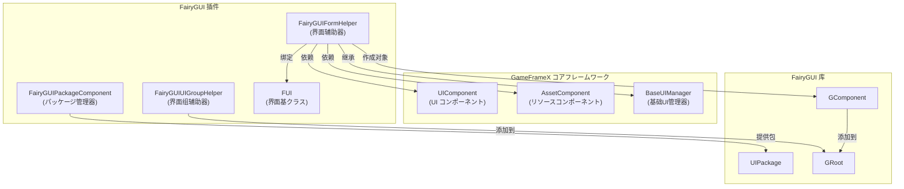
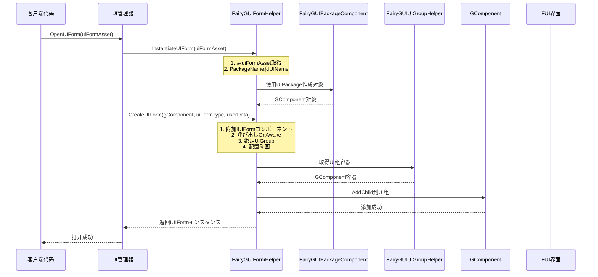
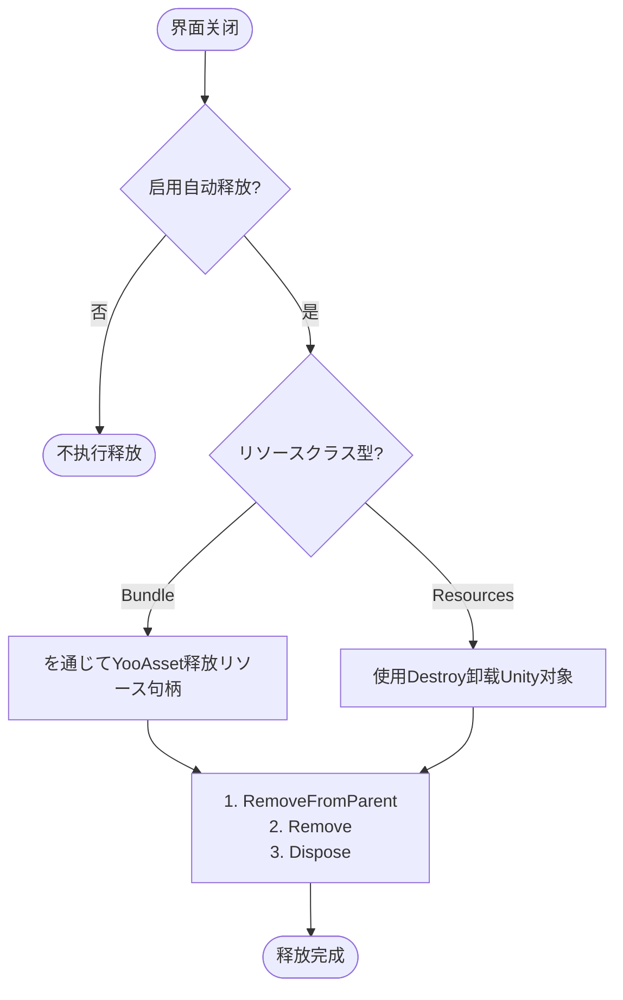

# 界面辅助器

`FairyGUIFormHelper` 是 GameFrameX 插件中负责 FairyGUI 界面インスタンス化、作成和释放的コアコンポーネント。它を継承 `UIFormHelperBase`，为 FairyGUI 界面提供します与フレームワーク其他部分无缝集成的能力。

## 概要

界面辅助器是 UI 系统中的关键コンポーネント，负责处理 UI 界面的生命周期管理。在 GameFrameX 的 FairyGUI 插件中，`FairyGUIFormHelper` 承担了以下コア职责：

- **インスタンス化界面**：将 UI リソース转换为可交互的界面对象
- **作成界面**：将界面逻辑クラス型附加到视图对象上，并完成界面组的绑定
- **释放界面**：正确清理界面リソース，包括视图对象和关联的リソース

该コンポーネントを通じて実装 `UIFormHelperBase` 定义的抽象メソッド，提供します FairyGUI 特定的界面管理実装。

> Source: [FairyGUIFormHelper.cs](https://github.com/GameFrameX/com.gameframex.unity.ui.fairygui/blob/main/Runtime/FairyGUIFormHelper.cs#L1-L233)

## 架构

### コンポーネント关系

`FairyGUIFormHelper` 在 UI 系统中的位置如下：



### 设计意图

**为什么必要界面辅助器？**

1. **解耦视图与逻辑**：FairyGUI 使用 GComponent 作为视图层，而ゲーム业务逻辑必要を通じて実装了 `IUIForm` インターフェース的クラス来处理。界面辅助器充当了两者之间的桥梁。

2. **统一リソース管理**：を通じて集成 `AssetComponent`，界面辅助器可能正确管理 UI リソース的加载和释放，避免リソース泄漏。

3. **配置驱动**：使用特性（Attribute）来配置界面行为（如所属界面组、显示/隐藏动画），使得界面配置与代码解耦。

## コア機能

### 1. インスタンス化界面

`InstantiateUIForm` メソッド负责将 UI リソース数据转换为 FairyGUI 的 GComponent 对象：

```csharp
public override object InstantiateUIForm(object uiFormAsset)
{
    var openUIFormInfoData = (OpenUIFormInfoData)uiFormAsset;
    GameFrameworkGuard.NotNull(openUIFormInfoData, nameof(uiFormAsset));

    return UIPackage.CreateObject(openUIFormInfoData.PackageName, openUIFormInfoData.UIName);
}
```

> Source: [FairyGUIFormHelper.cs#L63-L69](https://github.com/GameFrameX/com.gameframex.unity.ui.fairygui/blob/main/Runtime/FairyGUIFormHelper.cs#L63-L69)

**关键点**：
- 接收 `OpenUIFormInfoData` 对象，包含包名和界面名
- 使用 FairyGUI 的 `UIPackage.CreateObject()` メソッド作成对象
- 返回 `GComponent` インスタンス供后续处理

### 2. 作成界面

`CreateUIForm` メソッド将 UI 逻辑クラス型附加到 GComponent 上，并完成界面组的绑定：

```csharp
public override IUIForm CreateUIForm(object uiFormInstance, Type uiFormType, object userData)
{
    GComponent component = uiFormInstance as GComponent;
    if (component == null)
    {
        Log.Error("UI form instance is invalid.");
        return null;
    }

    // 将 UI 逻辑クラス型作为コンポーネント添加到 GameObject
    var componentType = component.displayObject.gameObject.GetOrAddComponent(uiFormType);
    var uiForm = componentType as IUIForm;
    if (uiForm == null)
    {
        Log.Error("UI form instance is invalid.");
        return null;
    }

    // 呼び出し OnAwake 初期化
    if (uiForm.IsAwake == false)
    {
        uiForm.OnAwake();
    }

    // 取得或作成界面组
    var uiGroup = uiForm.UIGroup;
    if (uiGroup == null)
    {
        var attribute = uiFormType.GetCustomAttribute(typeof(OptionUIGroupAttribute));
        if (attribute is OptionUIGroupAttribute optionUIGroup)
        {
            uiGroup = m_UIComponent.GetUIGroup(optionUIGroup.GroupName);
        }
        uiForm.UIGroup = uiGroup;
    }

    // 配置显示动画
    var showAnimationAttribute = uiFormType.GetCustomAttribute(typeof(OptionUIShowAnimationAttribute));
    if (showAnimationAttribute is OptionUIShowAnimationAttribute optionShowAnimation)
    {
        uiForm.EnableShowAnimation = optionShowAnimation.Enable;
        uiForm.ShowAnimationName = optionShowAnimation.AnimationName;
    }
    else
    {
        uiForm.EnableShowAnimation = m_UIComponent.IsEnableUIShowAnimation;
    }

    // 配置隐藏动画
    var hideAnimationAttribute = uiFormType.GetCustomAttribute(typeof(OptionUIHideAnimationAttribute));
    if (hideAnimationAttribute is OptionUIHideAnimationAttribute optionHideAnimation)
    {
        uiForm.EnableHideAnimation = optionHideAnimation.Enable;
        uiForm.HideAnimationName = optionHideAnimation.AnimationName;
    }
    else
    {
        uiForm.EnableHideAnimation = m_UIComponent.IsEnableUIHideAnimation;
    }

    // 验证界面组
    if (uiGroup == null)
    {
        Log.Error("UI group is invalid.");
        return null;
    }

    // 取得界面组容器并添加子コンポーネント
    DisplayObjectInfo displayObjectInfo = ((MonoBehaviour)uiGroup.Helper).gameObject.GetComponent<DisplayObjectInfo>();
    if (displayObjectInfo == null)
    {
        Log.Error("Display object info is invalid.");
        return null;
    }

    var uiGroupComponent = displayObjectInfo.displayObject.gOwner as GComponent;
    if (uiGroupComponent == null)
    {
        Log.Error("UI group component is invalid.");
        return null;
    }

    uiGroupComponent.AddChild(component);
    return uiForm;
}
```

> Source: [FairyGUIFormHelper.cs#L82-L161](https://github.com/GameFrameX/com.gameframex.unity.ui.fairygui/blob/main/Runtime/FairyGUIFormHelper.cs#L82-L161)

**关键处理フロー**：

1. **クラス型转换**：将 UI インスタンス转换为 `GComponent`
2. **コンポーネント挂载**：使用 `GetOrAddComponent` 将 UI 逻辑クラス型添加到 GameObject
3. **初期化呼び出し**：呼び出し `OnAwake()` メソッド完成界面初期化
4. **界面组绑定**：を通じて特性或默认配置取得界面组
5. **动画配置**：从特性读取或使用グローバル設定設定显示/隐藏动画
6. **容器添加**：将コンポーネント添加到界面组的 GComponent 容器中

### 3. 释放界面

`ReleaseUIForm` メソッド负责正确释放界面リソース：

```csharp
public override void ReleaseUIForm(object uiFormAsset, object uiFormInstance, object assetHandle, string uiFormAssetPath, string uiFormAssetName)
{
    if (!m_UIComponent.EnableAutoReleaseUIForm)
    {
        return;
    }

    if (uiFormInstance is GComponent component)
    {
        component.RemoveFromParent();
        component.Remove();
        component.Dispose();
    }

    if (uiFormAssetPath.IndexOf(Utility.Asset.Path.BundlesDirectoryName, StringComparison.OrdinalIgnoreCase) >= 0)
    {
        if (assetHandle is YooAsset.AssetHandle handle)
        {
            handle.Release();
        }
        m_AssetComponent.UnloadAsset(uiFormAssetPath);
    }
    else
    {
        // Resources リソース卸载：仅当インスタンス非 GComponent 时才必要销毁 Unity 对象
        if (!(uiFormInstance is GComponent) && uiFormInstance is UnityEngine.Object unityObject)
        {
            Destroy(unityObject);
            UnityEngine.Resources.UnloadAsset(unityObject);
        }
    }
}
```

> Source: [FairyGUIFormHelper.cs#L175-L207](https://github.com/GameFrameX/com.gameframex.unity.ui.fairygui/blob/main/Runtime/FairyGUIFormHelper.cs#L175-L207)

**リソース释放逻辑**：

1. **自动释放开关**：检查是否启用自动释放機能
2. **GComponent 清理**：移除父容器、移除子对象、释放リソース
3. **Bundle リソース**：を通じて YooAsset 处理リソース句柄并卸载
4. **Resources リソース**：使用 Unity 的 Destroy 和 UnloadAsset メソッド

## 界面作成フロー

以下序列图展示了从打开界面到界面完全作成的完整フロー：



## 界面释放フロー



## 設定选项

### 界面组配置

を通じて特性可能指定界面所属的界面组：

```csharp
[OptionUIGroup("MainUI")]
public class MainForm : FUI
{
    // 界面逻辑
}
```

### 显示/隐藏动画配置

可能を通じて特性配置界面的显示和隐藏动画：

```csharp
[OptionUIShowAnimation(true, "FadeIn")]
[OptionUIHideAnimation(true, "FadeOut")]
public class MainForm : FUI
{
    // 界面逻辑
}
```

> 注意：这些特性定义在 GameFrameX.Runtime 包中，具体使用お願いします参阅関連文档。

## 依赖コンポーネント

`FairyGUIFormHelper` 在运行时依赖以下コンポーネント：

| コンポーネント | 説明 |
|------|------|
| `UIComponent` | 取得界面组信息、动画配置、全局释放設定 |
| `AssetComponent` | 卸载 UI リソース（Bundle 模式下） |

这些コンポーネントを通じて `Awake()` メソッド自动取得：

```csharp
private void Awake()
{
    m_AssetComponent = GameEntry.GetComponent<AssetComponent>();
    if (m_AssetComponent == null)
    {
        Log.Fatal("Asset component is invalid.");
        return;
    }

    m_UIComponent = GameEntry.GetComponent<UIComponent>();
    if (m_UIComponent == null)
    {
        Log.Fatal("UI component is invalid.");
        return;
    }
}
```

> Source: [FairyGUIFormHelper.cs#L216-L231](https://github.com/GameFrameX/com.gameframex.unity.ui.fairygui/blob/main/Runtime/FairyGUIFormHelper.cs#L216-L231)

## 関連リンク

- [FUI 界面基クラス](./4-core-concepts.1-fui-base-class) - FairyGUI 界面的基クラス実装
- [界面管理器](./4-core-concepts.2-ui-manager) - 负责界面打开、关闭和生命周期管理
- [パッケージ管理器](./4-core-concepts.3-package-manager) - 管理 FairyGUI 包的加载和卸载
- [界面组辅助器](./4-core-concepts.5-ui-group-helper) - 管理界面组的作成和深度
- [API 参考 - FairyGUIFormHelper クラス](./5-api-reference.3-form-helper) - 完整的 API 文档
- [GObjectHelper 工具クラス](./5-api-reference.4-gobject-helper) - GObject 与 FUI 的映射管理
