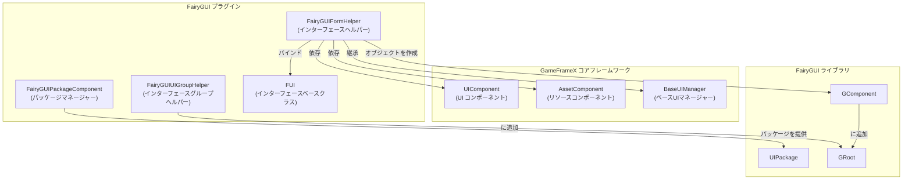
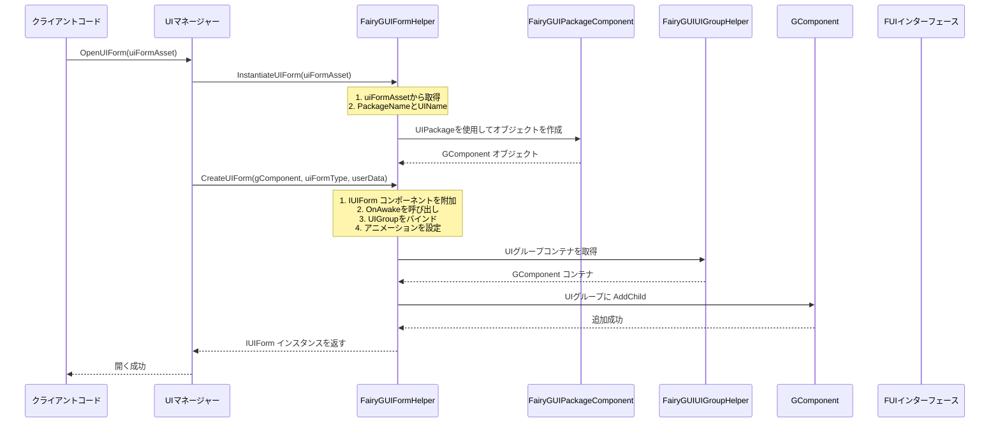
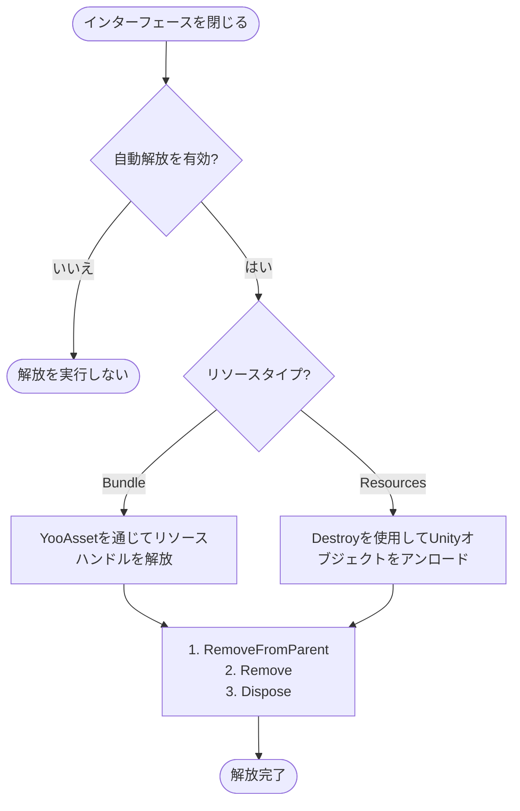

# インターフェースヘルパー

`FairyGUIFormHelper` は、GameFrameX プラグインにおいて FairyGUI インターフェースのインスタンス化、作成、解放を担当するコアコンポーネントです。`UIFormHelperBase` を継承し、FairyGUI インターフェースにフレームワークの他の部分とのシームレスな統合機能を提供します。

## 概要

インターフェースヘルパーは、UI システムにおいて重要なコンポーネントであり、UI インターフェースのライフサイクル管理を処理します。GameFrameX の FairyGUI プラグインにおいて、`FairyGUIFormHelper` は以下のコア責務を負っています：

- **インターフェースをインスタンス化**：UI リソースを対話可能なインターフェースオブジェクトに変換
- **インターフェースを作成**：インターフェース論理タイプをビューオブジェクトに付加し、インターフェースグループのバインディングを完了
- **インターフェースを解放**：ビューオブジェクトと関連リソースを含むインターフェースリソースを正しく清理

このコンポーネントは `UIFormHelperBase` で定義された抽象メソッドを実装し、FairyGUI 固有のインターフェース管理を提供します。

> Source: [FairyGUIFormHelper.cs](https://github.com/GameFrameX/com.gameframex.unity.ui.fairygui/blob/main/Runtime/FairyGUIFormHelper.cs#L1-L233)

## アーキテクチャ

### コンポーネント関係

`FairyGUIFormHelper` は UI システムにおける次の位置にあります：



### 設計意図

**なぜインターフェースヘルパーが必要인가？**

1. **ビューとロジックの分離**：FairyGUI はビュー層として GComponent を使用し、ゲームビジネスロジックは `IUIForm` インターフェースを実装したクラスで処理する必要があります。インターフェースヘルパーは両者の橋渡し役を果たします。

2. **統一リソース管理**：`AssetComponent` を統合することで、インターフェースヘルパーは UI リソースのロードと解放を正しく管理し、リソースリークを回避できます。

3. **設定駆動**：属性（Attribute）を使用してインターフェース動作（所属インターフェースグループ、表示/非表示アニメーションなど）を設定し、インターフェース設定とコードを分離します。

## コア機能

### 1. インターフェースをインスタンス化

`InstantiateUIForm` メソッドは、UI リソースデータを FairyGUI の GComponent オブジェクトに変換します：

```csharp
public override object InstantiateUIForm(object uiFormAsset)
{
    var openUIFormInfoData = (OpenUIFormInfoData)uiFormAsset;
    GameFrameworkGuard.NotNull(openUIFormInfoData, nameof(uiFormAsset));

    return UIPackage.CreateObject(openUIFormInfoData.PackageName, openUIFormInfoData.UIName);
}
```

> Source: [FairyGUIFormHelper.cs#L63-L69](https://github.com/GameFrameX/com.gameframex.unity.ui.fairygui/blob/main/Runtime/FairyGUIFormHelper.cs#L63-L69)

**重要なポイント**：
- `OpenUIFormInfoData` オブジェクトを受け取り、パッケージ名とインターフェース名を含む
- FairyGUI の `UIPackage.CreateObject()` メソッドを使用してオブジェクトを作成
- 後続処理のために `GComponent` インスタンスを返す

### 2. インターフェースを作成

`CreateUIForm` メソッドは、UI 論理タイプを GComponent に付加し、インターフェースグループのバインディングを完了します：

```csharp
public override IUIForm CreateUIForm(object uiFormInstance, Type uiFormType, object userData)
{
    GComponent component = uiFormInstance as GComponent;
    if (component == null)
    {
        Log.Error("UI form instance is invalid.");
        return null;
    }

    // UI 論理タイプをコンポーネントとして GameObject に追加
    var componentType = component.displayObject.gameObject.GetOrAddComponent(uiFormType);
    var uiForm = componentType as IUIForm;
    if (uiForm == null)
    {
        Log.Error("UI form instance is invalid.");
        return null;
    }

    // OnAwake 初期化を呼び出し
    if (uiForm.IsAwake == false)
    {
        uiForm.OnAwake();
    }

    // インターフェースグループを取得または作成
    var uiGroup = uiForm.UIGroup;
    if (uiGroup == null)
    {
        var attribute = uiFormType.GetCustomAttribute(typeof(OptionUIGroupAttribute));
        if (attribute is OptionUIGroupAttribute optionUIGroup)
        {
            uiGroup = m_UIComponent.GetUIGroup(optionUIGroup.GroupName);
        }
        uiForm.UIGroup = uiGroup;
    }

    // 表示アニメーションを設定
    var showAnimationAttribute = uiFormType.GetCustomAttribute(typeof(OptionUIShowAnimationAttribute));
    if (showAnimationAttribute is OptionUIShowAnimationAttribute optionShowAnimation)
    {
        uiForm.EnableShowAnimation = optionShowAnimation.Enable;
        uiForm.ShowAnimationName = optionShowAnimation.AnimationName;
    }
    else
    {
        uiForm.EnableShowAnimation = m_UIComponent.IsEnableUIShowAnimation;
    }

    // 非表示アニメーションを設定
    var hideAnimationAttribute = uiFormType.GetCustomAttribute(typeof(OptionUIHideAnimationAttribute));
    if (hideAnimationAttribute is OptionUIHideAnimationAttribute optionHideAnimation)
    {
        uiForm.EnableHideAnimation = optionHideAnimation.Enable;
        uiForm.HideAnimationName = optionHideAnimation.AnimationName;
    }
    else
    {
        uiForm.EnableHideAnimation = m_UIComponent.IsEnableUIHideAnimation;
    }

    // インターフェースグループを検証
    if (uiGroup == null)
    {
        Log.Error("UI group is invalid.");
        return null;
    }

    // インターフェースグループコンテナを取得して子コンポーネントを追加
    DisplayObjectInfo displayObjectInfo = ((MonoBehaviour)uiGroup.Helper).gameObject.GetComponent<DisplayObjectInfo>();
    if (displayObjectInfo == null)
    {
        Log.Error("Display object info is invalid.");
        return null;
    }

    var uiGroupComponent = displayObjectInfo.displayObject.gOwner as GComponent;
    if (uiGroupComponent == null)
    {
        Log.Error("UI group component is invalid.");
        return null;
    }

    uiGroupComponent.AddChild(component);
    return uiForm;
}
```

> Source: [FairyGUIFormHelper.cs#L82-L161](https://github.com/GameFrameX/com.gameframex.unity.ui.fairygui/blob/main/Runtime/FairyGUIFormHelper.cs#L82-L161)

**主要な処理フロー**：

1. **タイプ変換**：UI インスタンスを `GComponent` に変換
2. **コンポーネント装着**：`GetOrAddComponent` を使用して UI 論理タイプを GameObject に追加
3. **初期化呼び出し**：`OnAwake()` メソッドを呼び出してインターフェースを初期化
4. **インターフェースグループバインディング**：属性またはデフォルト設定からインターフェースグループを取得
5. **アニメーション設定**：属性から読み取るかグローバル設定を使用して表示/非表示アニメーションを設定
6. **コンテナに追加**：コンポーネントをインターフェースグループの GComponent コンテナに追加

### 3. インターフェースを解放

`ReleaseUIForm` メソッドは、インターフェースリソースを正しく解放します：

```csharp
public override void ReleaseUIForm(object uiFormAsset, object uiFormInstance, object assetHandle, string uiFormAssetPath, string uiFormAssetName)
{
    if (!m_UIComponent.EnableAutoReleaseUIForm)
    {
        return;
    }

    if (uiFormInstance is GComponent component)
    {
        component.RemoveFromParent();
        component.Remove();
        component.Dispose();
    }

    if (uiFormAssetPath.IndexOf(Utility.Asset.Path.BundlesDirectoryName, StringComparison.OrdinalIgnoreCase) >= 0)
    {
        if (assetHandle is YooAsset.AssetHandle handle)
        {
            handle.Release();
        }
        m_AssetComponent.UnloadAsset(uiFormAssetPath);
    }
    else
    {
        // Resources リソースのアンパイ：CComponent ではない場合のみ Unity オブジェクトを破棄する必要がある
        if (!(uiFormInstance is GComponent) && uiFormInstance is UnityEngine.Object unityObject)
        {
            Destroy(unityObject);
            UnityEngine.Resources.UnloadAsset(unityObject);
        }
    }
}
```

> Source: [FairyGUIFormHelper.cs#L175-L207](https://github.com/GameFrameX/com.gameframex.unity.ui.fairygui/blob/main/Runtime/FairyGUIFormHelper.cs#L175-L207)

**リソース解放ロジック**：

1. **自動解放スイッチ**：自動解放機能が有効になっているかチェック
2. **GComponent 清理**：親コンテナを削除、子オブジェクトを削除、リソースを解放
3. **Bundle リソース**：YooAsset を通じてリソースハンドルを処理してアンロード
4. **Resources リソース**：Unity の Destroy と UnloadAsset メソッドを使用

## インターフェース作成フロー

以下のシーケンス図は、インターフェースを開くことからインターフェースが完全に作成されるまでの完全なフローを示しています：



## インターフェース解放フロー



## 設定オプション

### インターフェースグループ設定

属性を通じてインターフェースが属するインターフェースグループを指定できます：

```csharp
[OptionUIGroup("MainUI")]
public class MainForm : FUI
{
    // インターフェースロジック
}
```

### 表示/非表示アニメーション設定

属性を通じてインターフェースの表示と非表示アニメーションを設定できます：

```csharp
[OptionUIShowAnimation(true, "FadeIn")]
[OptionUIHideAnimation(true, "FadeOut")]
public class MainForm : FUI
{
    // インターフェースロジック
}
```

> 注：これらの属性は GameFrameX.Runtime パッケージで定義されており、詳細については関連ドキュメントを参照してください。

## 依存コンポーネント

`FairyGUIFormHelper` は実行時に以下のコンポーネントに依存しています：

| コンポーネント | 説明 |
|------|------|
| `UIComponent` | インターフェースグループ情報、アニメーション設定、グローバル解放設定を取得 |
| `AssetComponent` | UI リソースをアンロード（Bundle モード下） |

これらのコンポーネントは `Awake()` メソッドを通じて自動的に取得されます：

```csharp
private void Awake()
{
    m_AssetComponent = GameEntry.GetComponent<AssetComponent>();
    if (m_AssetComponent == null)
    {
        Log.Fatal("Asset component is invalid.");
        return;
    }

    m_UIComponent = GameEntry.GetComponent<UIComponent>();
    if (m_UIComponent == null)
    {
        Log.Fatal("UI component is invalid.");
        return;
    }
}
```

> Source: [FairyGUIFormHelper.cs#L216-L231](https://github.com/GameFrameX/com.gameframex.unity.ui.fairygui/blob/main/Runtime/FairyGUIFormHelper.cs#L216-L231)

## 関連リンク

- [FUI インターフェースベースクラス](./4-core-concepts.1-fui-base-class) - FairyGUI インターフェースの基本クラス実装
- [インターフェースマネージャー](./4-core-concepts.2-ui-manager) - インターフェースを開く、閉じる、ライフサイクル管理を担当
- [パッケージマネージャー](./4-core-concepts.3-package-manager) - FairyGUI パッケージのロードとアンロードを管理
- [インターフェースグループヘルパー](./4-core-concepts.5-ui-group-helper) - インターフェースグループの作成と深度を管理
- [API リファレンス - FairyGUIFormHelper クラス](./5-api-reference.3-form-helper) - 完全な API ドキュメント
- [GObjectHelper ユーティリティクラス](./5-api-reference.4-gobject-helper) - GObject と FUI のマッピング管理