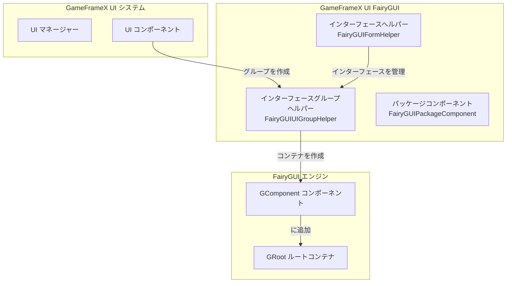
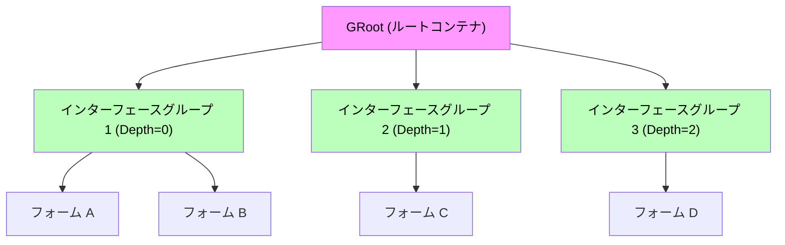
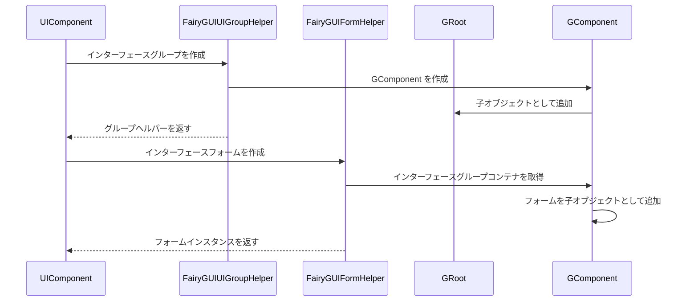

# インターフェースグループヘルパー

`FairyGUIUIGroupHelper` は、GameFrameX UI FairyGUI プラグインのコアコンポーネントの一つであり、FairyGUI レンダリングエンジン内で UI インターフェースグループを作成・管理する 담당합니다。インターフェースグループは、複数のインターフェースフォーム（ウィンドウ）を組織・管理するコンテナであり、深度（Depth）を通じてインターフェースの表示レイヤを制御します。

## 概要

インターフェースグループヘルパーは、GameFrameX UI システムと FairyGUI レンダリングエンジンの間のブリッジコンポーネントです。`UIGroupHelperBase` 抽象クラスを継承し、FairyGUI 固有のインターフェースグループ実装を提供します。UI システムでは、インターフェースグループは関連するインターフェースフォームを一つのグループに組織し、深度値を通じてインターフェースの被覆関係と表示順序を制御するために使用されます。

**コア責務：**
- FairyGUI インターフェースグループコンテナ（GComponent）を作成
- インターフェースグループの深度（Z 順序）を管理
- インターフェースグループ全画面表示を設定
- GameFrameX コアシステムと統合

> Source: [FairyGUIUIGroupHelper.cs](https://github.com/GameFrameX/com.gameframex.unity.ui.fairygui/blob/main/Runtime/FairyGUIUIGroupHelper.cs#L36-L97)

## アーキテクチャ設計

### クラス図構造

```mermaid
classDiagram
    class UIGroupHelperBase {
        <<abstract>>
        +Depth: int { get; protected set; }
        +Handler(root, groupName, helperTypeName, customHelper, depth) IUIGroupHelper
        +SetDepth(depth) void
    }

    class FairyGUIUIGroupHelper {
        +Depth: int { get; protected set; }
        +Handler(root, groupName, helperTypeName, customHelper, depth) IUIGroupHelper
        +SetDepth(depth) void
    }

    class GComponent {
        +name: string
        +opaque: bool
        +displayObject: DisplayObject
        +AddRelation(target, type) void
        +MakeFullScreen() void
    }

    class GRoot {
        +inst: GRoot
    }

    UIGroupHelperBase <|-- FairyGUIUIGroupHelper
    FairyGUIUIGroupHelper --> GComponent : creates
    GComponent --> GRoot : added as child
```

### システム統合アーキテクチャ



### インターフェースグループ階層関係



## コア機能

### インターフェースグループを作成

`Handler` メソッドは、インターフェースグループヘルパーのコアメソッドであり、新しい FairyGUI インターフェースグループを作成して初期化します。

```csharp
public override IUIGroupHelper Handler(Transform root, string groupName, string uiGroupHelperTypeName, IUIGroupHelper customUIGroupHelper, int depth = 0)
{
    SetDepth(depth);
    GComponent component = new GComponent();
    GRoot.inst.AddChild(component);
    var comName = groupName;
    component.displayObject.name = comName;
    component.gameObjectName = comName;
    component.name = comName;
    component.opaque = false;
    component.AddRelation(GRoot.inst, RelationType.Width);
    component.AddRelation(GRoot.inst, RelationType.Height);
    component.MakeFullScreen();
    return GameFrameX.Runtime.Helper.CreateHelper(component.displayObject.gameObject, uiGroupHelperTypeName, (UIGroupHelperBase)customUIGroupHelper, 0);
}
```

> Source: [FairyGUIUIGroupHelper.cs](https://github.com/GameFrameX/com.gameframex.unity.ui.fairygui/blob/main/Runtime/FairyGUIUIGroupHelper.cs#L82-L96)

**作成フロー説明：**

1. **深度を設定**：`SetDepth(depth)` を呼び出してインターフェースグループの Z 順序を設定
2. **コンポーネントを作成**：`new GComponent()` を使用して FairyGUI コンテナコンポーネントを作成
3. **ルートコンテナに追加**：コンポーネントを `GRoot.inst`（FairyGUI グローバルルートコンテナ）に追加
4. **名前を設定**：コンポーネントの `name`、`gameObjectName`、`displayObject.name` を設定
5. **透明を設定**：`opaque = false` を設定してインターフェースグループコンテナ自体を透明に
6. **全画面設定**：幅と高さの関係を追加し、`MakeFullScreen()` を使用してコンポーネントを全画面に
7. **ヘルパーを作成**：`GameFrameX.Runtime.Helper.CreateHelper` を使用して実際のヘルパーインスタンスを作成

### インターフェース深度を設定

`SetDepth` メソッドは、インターフェースグループの深度値を設定するために使用され、この値はインターフェースの表示レイヤを決定します。

```csharp
public override void SetDepth(int depth)
{
    Depth = depth;
    transform.localPosition = new Vector3(0, 0, depth * 100);
}
```

> Source: [FairyGUIUIGroupHelper.cs](https://github.com/GameFrameX/com.gameframex.unity.ui.fairygui/blob/main/Runtime/FairyGUIUIGroupHelper.cs#L63-L67)

**深度設定の原理：**
- FairyGUI は Z 軸座標を使用して表示レイヤを制御
- 各深度レベルは 100 単位の Z 軸距離に対応
- 深度値が大きいほど、インターフェースは前面に表示される（深度値が小さいインターフェースを覆う）

## インターフェースグループとフォームの関係

インターフェースグループとインターフェースフォーム（Form）の間には一対多の包含関係があります：



### インターフェースグループ割り当て

FairyGUI システムでは、インターフェースフォームは `OptionUIGroupAttribute` 属性を通じて指定されたインターフェースグループに割り当てられます：

```csharp
[OptionUIGroup("MainUI")]
public class MainMenuForm : FUI
{
    // インターフェースフォームロジック
}
```

> Source: [FairyGUIFormHelper.cs](https://github.com/GameFrameX/com.gameframex.unity.ui.fairygui/blob/main/Runtime/FairyGUIFormHelper.cs#L108-L115)

システムは `OptionUIGroup` 属性で指定されたグループ名に対応するインターフェースグループインスタンスを取得し、インターフェースフォームをそのインターフェースグループの GComponent コンテナに追加します。

## 使用例

### 基本設定

インターフェースグループヘルパーを使用する前に、GameFrameX 起動設定で FairyGUI 関連のコンポーネントを登録する必要があります：

```csharp
// GameFrameworkComponent で設定
// FairyGUIUIGroupHelper をインターフェースグループヘルパー実装として使用
```

### インターフェースグループ定義の例

```csharp
// インターフェースグループは UIManager が実行時に自動的に作成
// 以下はシステム内部の作成ロジック

// 1. 新しいインターフェースを作成する必要がある時、対応するインターフェースグループが存在するかチェック
// 2. 存在しない場合、FairyGUIUIGroupHelper を使用して新しいインターフェースグループを作成
// 3. インターフェースグループの深度はシステムに基づいて設定または自動的に増加して割り当て
```

## API リファレンス

### `FairyGUIUIGroupHelper` クラス

**名前空間：** `GameFrameX.UI.FairyGUI.Runtime`

**継承：** `UIGroupHelperBase`

---

### プロパティ

#### `Depth`

```csharp
public override int Depth { get; protected set; }
```

インターフェースグループの深度値を取得します。

- **タイプ：** `int`
- **説明：** インターフェースグループの Z 軸深度を表し、インターフェースの表示レイヤを制御するために使用

---

### メソッド

#### `Handler`

```csharp
public override IUIGroupHelper Handler(
    Transform root,
    string groupName,
    string uiGroupHelperTypeName,
    IUIGroupHelper customUIGroupHelper,
    int depth = 0
)
```

FairyGUI インターフェースグループを作成して初期化します。

**パラメータ：**
- `root` (Transform): ルートノード（現在実装では未使用）
- `groupName` (string): インターフェースグループの名前
- `uiGroupHelperTypeName` (string): インターフェースグループヘルパーのタイプ名
- `customUIGroupHelper` (IUIGroupHelper): カスタムインターフェースグループヘルパーインスタンス
- `depth` (int): インターフェースグループの深度値（デフォルトは 0）

**戻り値：**
- `IUIGroupHelper`: 作成されたインターフェースグループヘルパーインスタンス

**実装説明：**
1. インターフェースグループ深度を設定
2. `GComponent` をインターフェースグループコンテナとして作成
3. コンテナを `GRoot.inst` に追加
4. 全画面表示プロパティを設定
5. ヘルパーインスタンスを作成して返す

---

#### `SetDepth`

```csharp
public override void SetDepth(int depth)
```

インターフェースグループの深度を設定します。

**パラメータ：**
- `depth` (int): インターフェースグループの深度値

**実装説明：**
`transform.localPosition` の Z 座標を変更して深度設定を実現し、Z 座標計算式は `depth * 100` です。この設計により、異なる深度のインターフェース間に十分な Z 軸間隔を確保し、レンダリング衝突を避けます。

---

## 関連リンク

- [FUI インターフェースベースクラス](./4-core-concepts.1-fui-base-class) - FairyGUI インターフェースフォームの基本クラス実装
- [インターフェースマネージャー](./4-core-concepts.2-ui-manager) - インターフェースシステムのコアマネージャー
- [パッケージマネージャー](./4-core-concepts.3-package-manager) - FairyGUI リソースパッケージ管理
- [インターフェースヘルパー](./4-core-concepts.4-form-helper) - インターフェースフォームの作成と解放管理
- [インターフェースグループ設定](./6-configuration.2-ui-group-config) - インターフェースグループの構成オプション
- [GitHub リポジトリ](https://github.com/GameFrameX/com.gameframex.unity.ui.fairygui.git) - プラグインソースコード