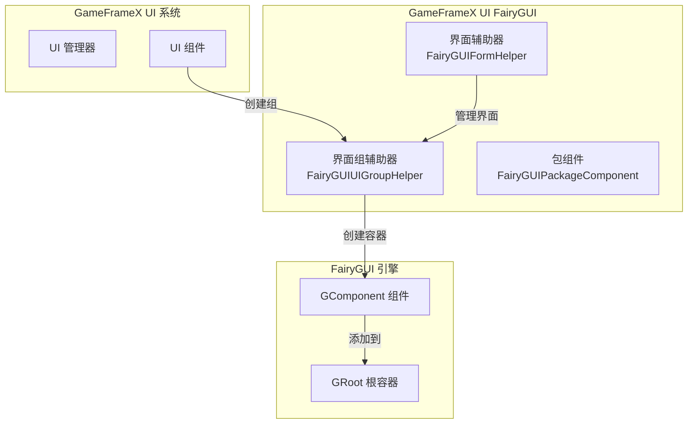
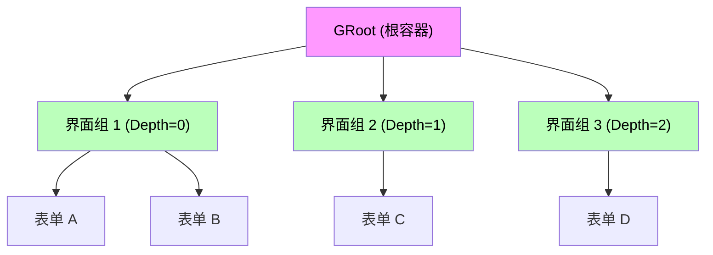
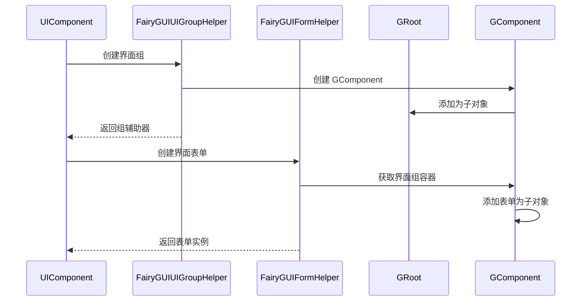

# 界面组辅助器

`FairyGUIUIGroupHelper` 是 GameFrameX UI FairyGUI プラグイン的コアコンポーネント之一，负责在 FairyGUI 渲染引擎中作成和管理 UI 界面组。界面组是组织和管理多个界面表单（ウィンドウ）的容器，通过深度（Depth）控制界面的显示层级。

## 概要

界面组辅助器是 GameFrameX UI 系统与 FairyGUI 渲染引擎之间的桥梁コンポーネント。它継承自 `UIGroupHelperBase` 抽象类，提供します FairyGUI 特定的界面组実装。在 UI 系统中，界面组用于将相关的界面表单组织在一起，并通过深度值控制界面的遮挡关系和显示顺序。

**コア职责：**
- 作成 FairyGUI 界面组容器（GComponent）
- 管理界面组的深度（Z 顺序）
- 設定界面组全屏显示
- 与 GameFrameX コア系统集成

> Source: [FairyGUIUIGroupHelper.cs](https://github.com/GameFrameX/com.gameframex.unity.ui.fairygui/blob/main/Runtime/FairyGUIUIGroupHelper.cs#L36-L97)

## アーキテクチャ設計

### 类图结构

```mermaid
classDiagram
    class UIGroupHelperBase {
        <<abstract>>
        +Depth: int { get; protected set; }
        +Handler(root, groupName, helperTypeName, customHelper, depth) IUIGroupHelper
        +SetDepth(depth) void
    }
    
    class FairyGUIUIGroupHelper {
        +Depth: int { get; protected set; }
        +Handler(root, groupName, helperTypeName, customHelper, depth) IUIGroupHelper
        +SetDepth(depth) void
    }
    
    class GComponent {
        +name: string
        +opaque: bool
        +displayObject: DisplayObject
        +AddRelation(target, type) void
        +MakeFullScreen() void
    }
    
    class GRoot {
        +inst: GRoot
    }
    
    UIGroupHelperBase <|-- FairyGUIUIGroupHelper
    FairyGUIUIGroupHelper --> GComponent : creates
    GComponent --> GRoot : added as child
```

### 系统集成アーキテクチャ



### 界面组层级关系



## コア機能

### 作成界面组

`Handler` メソッド是界面组辅助器的コアメソッド，负责作成并初期化一个新的 FairyGUI 界面组。

```csharp
public override IUIGroupHelper Handler(Transform root, string groupName, string uiGroupHelperTypeName, IUIGroupHelper customUIGroupHelper, int depth = 0)
{
    SetDepth(depth);
    GComponent component = new GComponent();
    GRoot.inst.AddChild(component);
    var comName = groupName;
    component.displayObject.name = comName;
    component.gameObjectName = comName;
    component.name = comName;
    component.opaque = false;
    component.AddRelation(GRoot.inst, RelationType.Width);
    component.AddRelation(GRoot.inst, RelationType.Height);
    component.MakeFullScreen();
    return GameFrameX.Runtime.Helper.CreateHelper(component.displayObject.gameObject, uiGroupHelperTypeName, (UIGroupHelperBase)customUIGroupHelper, 0);
}
```

> Source: [FairyGUIUIGroupHelper.cs](https://github.com/GameFrameX/com.gameframex.unity.ui.fairygui/blob/main/Runtime/FairyGUIUIGroupHelper.cs#L82-L96)

**作成フロー説明：**

1. **設定深度**：呼び出し `SetDepth(depth)` 設定界面组的 Z 顺序
2. **作成コンポーネント**：使用 `new GComponent()` 作成 FairyGUI 容器コンポーネント
3. **追加到根容器**：将コンポーネント追加到 `GRoot.inst`（FairyGUI 全局根容器）
4. **設定名称**：設定コンポーネント的 `name`、`gameObjectName` 和 `displayObject.name`
5. **設定透明**：設定 `opaque = false` 使界面组容器本身透明
6. **全屏設定**：追加宽度和高度关联，使用 `MakeFullScreen()` 使コンポーネント占满全屏
7. **作成辅助器**：使用 `GameFrameX.Runtime.Helper.CreateHelper` 作成实际的辅助器インスタンス

### 設定界面深度

`SetDepth` メソッド用于設定界面组的深度值，该值决定了界面的显示层级。

```csharp
public override void SetDepth(int depth)
{
    Depth = depth;
    transform.localPosition = new Vector3(0, 0, depth * 100);
}
```

> Source: [FairyGUIUIGroupHelper.cs](https://github.com/GameFrameX/com.gameframex.unity.ui.fairygui/blob/main/Runtime/FairyGUIUIGroupHelper.cs#L63-L67)

**深度設定原理：**
- FairyGUI 使用 Z 轴坐标控制显示层级
- 每个深度等级对应 100 单位的 Z 轴距离
- 深度值越大，界面显示越靠前（覆盖深度值较小的界面）

## 界面组与表单的关系

界面组与界面表单（Form）之间是一对多的パッケージ含关系：



### 界面组分配

在 FairyGUI 系统中，界面表单通过 `OptionUIGroupAttribute` 特性分配到指定的界面组：

```csharp
[OptionUIGroup("MainUI")]
public class MainMenuForm : FUI
{
    // 界面表单逻辑
}
```

> Source: [FairyGUIFormHelper.cs](https://github.com/GameFrameX/com.gameframex.unity.ui.fairygui/blob/main/Runtime/FairyGUIFormHelper.cs#L108-L115)

系统会根据 `OptionUIGroup` 特性中指定的组名称取得对应的界面组インスタンス，并将界面表单追加到该界面组的 GComponent 容器中。

## 使用例

### 基本設定

在使用界面组辅助器之前，〜する必要があります在 GameFrameX 启动設定中登録 FairyGUI 相关的コンポーネント：

```csharp
// 在 GameFrameworkComponent 中配置
// 使用 FairyGUIUIGroupHelper 作为界面组辅助器实现
```

### 界面组定義例

```csharp
// 界面组通过 UIManager 在运行时自动创建
// 以下是系统内部的创建逻辑

// 1. 当需要创建新界面时，检查是否存在对应的界面组
// 2. 如果不存在，使用 FairyGUIUIGroupHelper 创建新的界面组
// 3. 界面组的深度由系统根据配置或自动递增分配
```

## API リファレンス

### `FairyGUIUIGroupHelper` 类

**名前空間：** `GameFrameX.UI.FairyGUI.Runtime`

**継承：** `UIGroupHelperBase`

---

### プロパティ

#### `Depth`

```csharp
public override int Depth { get; protected set; }
```

取得界面组的深度值。

- **タイプ：** `int`
- **説明：** 表示界面组的 Z 轴深度，用于控制界面的显示层级

---

### メソッド

#### `Handler`

```csharp
public override IUIGroupHelper Handler(
    Transform root,
    string groupName,
    string uiGroupHelperTypeName,
    IUIGroupHelper customUIGroupHelper,
    int depth = 0
)
```

作成并初期化一个 FairyGUI 界面组。

**パラメータ：**
- `root` (Transform): 根节点（当前実装未使用）
- `groupName` (string): 界面组的名称
- `uiGroupHelperTypeName` (string): 界面组辅助器タイプ名称
- `customUIGroupHelper` (IUIGroupHelper): 自定義的界面组辅助器インスタンス
- `depth` (int): 界面组的深度值，デフォルト为 0

**戻り値：** 
- `IUIGroupHelper`: 作成的界面组辅助器インスタンス

**実装説明：**
1. 設定界面组深度
2. 作成 `GComponent` 作为界面组容器
3. 将容器追加到 `GRoot.inst`
4. 設定全屏显示プロパティ
5. 作成并返す辅助器インスタンス

---

#### `SetDepth`

```csharp
public override void SetDepth(int depth)
```

設定界面组的深度。

**パラメータ：**
- `depth` (int): 界面组的深度值

**実装説明：**
通过変更 `transform.localPosition` 的 Z 坐标来実装深度設定，Z 坐标计算公式为：`depth * 100`。这种設計確認してください不同深度的界面之间有足够的 Z 轴间隔，避免渲染冲突。

---

## 関連リンク

- [FUI 界面基底クラス](./4-core-concepts.1-fui-base-class) - FairyGUI 界面表单的基底クラス実装
- [界面マネージャー](./4-core-concepts.2-ui-manager) - 界面系统的コアマネージャー
- [パッケージマネージャー](./4-core-concepts.3-package-manager) - FairyGUI リソースパッケージ管理
- [界面辅助器](./4-core-concepts.4-form-helper) - 界面表单的作成和解放管理
- [界面组設定](./6-configuration.2-ui-group-config) - 界面组的設定オプション
- [GitHub リポジトリ](https://github.com/GameFrameX/com.gameframex.unity.ui.fairygui.git) - プラグインソースコード
