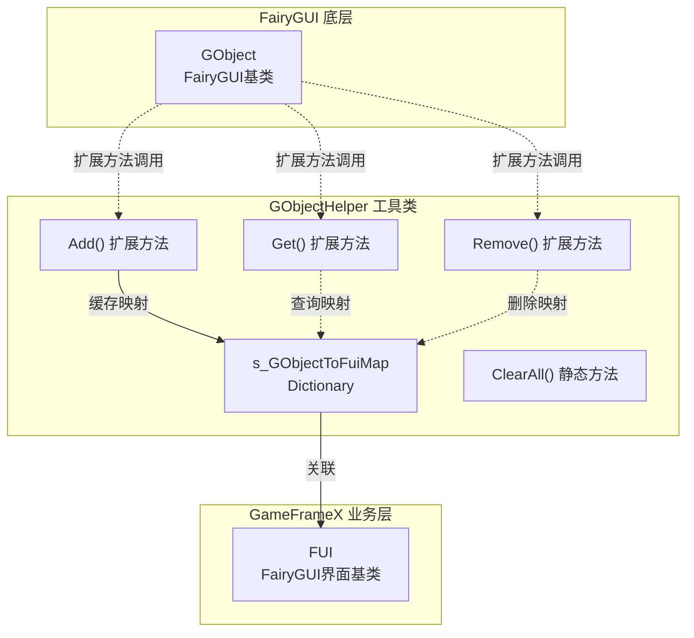
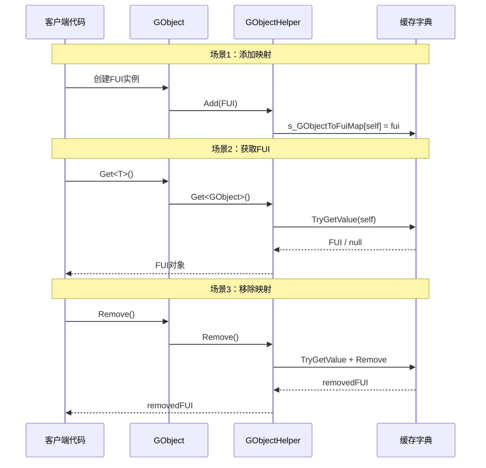

# GObjectHelper 工具类

GObjectHelper は静态工具类，用于管理 FairyGUI 的 GObject 对象与 FUI 界面对象之间的映射关系，提供缓存和查找機能。

## 概要

GObjectHelper 是 GameFrameX プラグイン中用于连接 FairyGUI 底层对象（FUI 的 GObject）与业务逻辑层（FUI 界面类）的桥梁。在 FairyGUI 界面系统中，每个界面都由一个 GObject インスタンス表示，而 GObjectHelper 提供します在ランタイム根据 GObject 快速取得对应 FUI 对象的能力。

**設計意图：**
- 解决 FairyGUI 的 GObject 与业务层 FUI 对象之间的关联問題
- 提供効率的的查找机制，避免在複雑界面树中逐层遍历
- サポート界面的动态作成和破棄时的リソース管理

**使用シーン：**
- 在イベントコールバック中〜する必要があります取得トリガーイベント的界面对象
- 在コンポーネント级别操作时〜する必要があります快速关联到对应的 FUI
- 界面アンロード时清理相关リソース

## アーキテクチャ



**アーキテクチャ説明：**
- GObjectHelper 维护一个私有的静态字典 `s_GObjectToFuiMap`，用于存储 GObject 到 FUI 的映射关系
- 通过 C# 拡張メソッド的形式为 GObject 追加 Get、Add、Remove メソッド
- 所有操作都是线程安全的（内部使用 Dictionary）

## コア機能

### 1. 取得关联的 FUI 对象

通过 GObject 拡張メソッド，〜できます快速取得与之关联的 FUI 对象：

```csharp
// 假设有一个 GObject 实例
GObject gObject = someComponent.GetChild("Button");

// 获取关联的 FUI 对象（需要类型转换）
MyFUI fui = gObject.Get<MyFUI>();
```
> Source: [GObjectHelper.cs](https://github.com/GameFrameX/com.gameframex.unity.ui.fairygui/blob/main/Runtime/GObjectHelper.cs#L69-L77)

**メソッド签名：**
```csharp
public static T Get<T>(this GObject self) where T : FUI
```

### 2. 追加 FUI 映射

将 FUI 对象追加到缓存池中，建立 GObject 与 FUI 的关联：

```csharp
// 创建 FUI 实例
FUI fui = new MyFUI(gObject);

// 添加到缓存
gObject.Add(fui);
```
> Source: [GObjectHelper.cs](https://github.com/GameFrameX/com.gameframex.unity.ui.fairygui/blob/main/Runtime/GObjectHelper.cs#L88-L94)

### 3. 移除 FUI 映射

从缓存中移除指定的 FUI 映射，并返す被移除的 FUI 对象：

```csharp
// 移除映射并获取被删除的 FUI
FUI removedFui = gObject.Remove();
```
> Source: [GObjectHelper.cs](https://github.com/GameFrameX/com.gameframex.unity.ui.fairygui/blob/main/Runtime/GObjectHelper.cs#L105-L114)

### 4. 清理所有缓存

在界面系统閉じる或重新初期化时，清空所有缓存的映射关系：

```csharp
// 清理所有缓存
GObjectHelper.ClearAll();
```
> Source: [GObjectHelper.cs](https://github.com/GameFrameX/com.gameframex.unity.ui.fairygui/blob/main/Runtime/GObjectHelper.cs#L54-L57)

## 使用フロー



## 使用例

### 基本用法

```csharp
using FairyGUI;
using GameFrameX.UI.FairyGUI.Runtime;

// 假设有一个按钮组件
GObject buttonObj = container.GetChild("SubmitButton");

// 获取关联的 FUI
MainPanelFUI fui = buttonObj.Get<MainPanelFUI>();

if (fui != null)
{
    // 可以对 FUI 进行操作
    fui.Visible = true;
}
```

### 界面作成时的映射

```csharp
// 在 FairyGUIFormHelper 创建界面时
public override IUIForm CreateUIForm(object uiFormInstance, Type uiFormType, object userData)
{
    GComponent component = uiFormInstance as GComponent;
    var componentType = component.displayObject.gameObject.GetOrAddComponent(uiFormType);
    var uiForm = componentType as IUIForm;
    
    // 建立映射关系
    component.Add(uiForm as FUI);
    
    return uiForm;
}
```

### 清理リソース

```csharp
// 在游戏退出或重新加载场景时
private void OnDestroy()
{
    // 清理所有 FUI 映射
    GObjectHelper.ClearAll();
}
```

## API リファレンス

### `Get<T>(this GObject self): T`

从缓存中取得与当前 GObject 关联的 FUI 对象。

**ジェネリックパラメータ：**
- `T`: FUI 的派生タイプ

**パラメータ：**
- `self` (GObject): 呼び出し拡張メソッド的 GObject インスタンス

**返す：**
- 关联的 FUI 对象；もし不存在则返すタイプデフォルト值（reference type 为 null）

**例：**
```csharp
MyPanelFUI fui = gObject.Get<MyPanelFUI>();
```

---

### `Add(this GObject self, FUI fui): void`

将 FUI 对象追加到缓存，建立 GObject 与 FUI 的映射关系。

**パラメータ：**
- `self` (GObject): 呼び出し拡張メソッド的 GObject インスタンス
- `fui` (FUI): 要追加的 FUI 对象

**例：**
```csharp
gObject.Add(new MyPanelFUI(gObject));
```

---

### `Remove(this GObject self): FUI`

从缓存中移除指定 GObject 的 FUI 映射，并返す被移除的 FUI 对象。

**パラメータ：**
- `self` (GObject): 呼び出し拡張メソッド的 GObject インスタンス

**返す：**
- 被移除的 FUI 对象；もし不存在则返すデフォルト值

**例：**
```csharp
FUI removed = gObject.Remove();
```

---

### `ClearAll(): void`

清空所有缓存的 FUI 映射关系。

**注意：** 此操作不可逆，呼び出し后所有 GObject 与 FUI 的关联将被清除。

**例：**
```csharp
GObjectHelper.ClearAll();
```

## 関連リンク

- [FUI 类](./5-api-reference.1-fui-class) - FairyGUI 界面基底クラス
- [FairyGUIFormHelper 类](./5-api-reference.3-form-helper) - 界面辅助器
- [FairyGUIPackageComponent 类](./5-api-reference.2-package-component) - パッケージマネージャーコンポーネント
- [界面マネージャー](./4-core-concepts.2-ui-manager) - 界面管理コアコンセプト
- [快速开始：打开和閉じる界面](./3-getting-started.2-open-close-ui)
