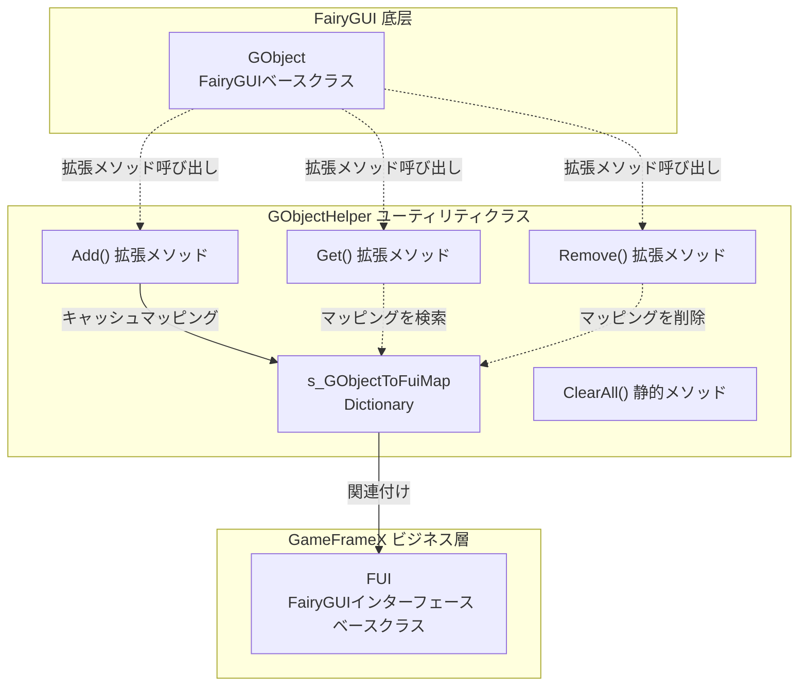
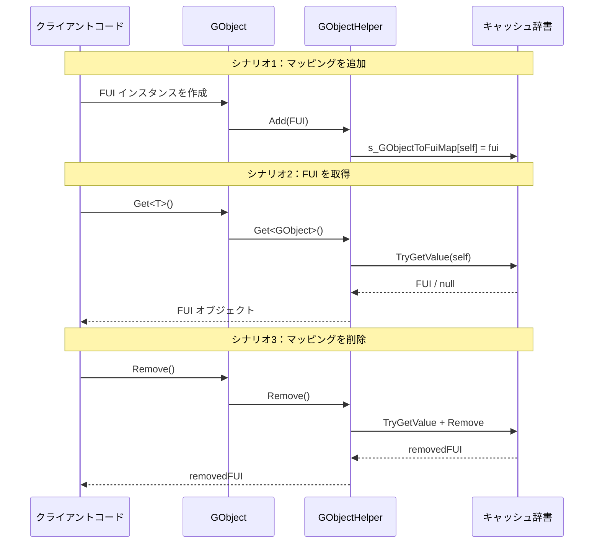

# GObjectHelper ユーティリティクラス

GObjectHelper は静的ユーティリティクラスであり、FairyGUI の GObject オブジェクトと FUI インターフェースオブジェクト間のマッピング関係を管理し、キャッシュと検索機能を提供します。

## 概要

GObjectHelper は、GameFrameX プラグインにおいて FairyGUI の下位オブジェクト（FUI の GObject）とビジネスロジック層（FUI インターフェースクラス）を接続するブリッジです。FairyGUI インターフェースシステムでは、各インターフェースは GObject インスタンスで表され、GObjectHelper は実行時に GObject に基づいて対応する FUI オブジェクトを迅速に取得する機能を提供します。

**設計意図：**
- FairyGUI の GObject とビジネス層 FUI オブジェクト間の関連問題を解決
- 効率的な検索メカニズムを提供し、複雑なインターフェースツリーでの階層的検索を回避
- インターフェースの動的な作成と破棄時のリソース管理をサポート

**使用シナリオ：**
- イベントコールバックでイベントをトリガーしたインターフェースオブジェクトを取得する必要がある
- コンポーネントレベルで操作する際に、対応する FUI に迅速に関連付ける必要がある
- インターフェースがアンロードされる時に関連リソースをクリーンアップ

## アーキテクチャ



**アーキテクチャ説明：**
- GObjectHelper はプライベート静的辞書 `s_GObjectToFuiMap` を維持し、GObject から FUI へのマッピング関係を保存
- C# 拡張メソッドの形式で GObject に Get、Add、Remove メソッドを追加
- すべての操作はスレッドセーフ（内部で Dictionary を使用）

## コア機能

### 1. 関連する FUI オブジェクトを取得

GObject 拡張メソッドを通じて、関連する FUI オブジェクトを迅速に取得できます：

```csharp
// GObject インスタンスを仮定
GObject gObject = someComponent.GetChild("Button");

// 関連する FUI オブジェクトを取得（タイプ変換が必要）
MyFUI fui = gObject.Get<MyFUI>();
```
> Source: [GObjectHelper.cs](https://github.com/GameFrameX/com.gameframex.unity.ui.fairygui/blob/main/Runtime/GObjectHelper.cs#L69-L77)

**メソッド署名：**
```csharp
public static T Get<T>(this GObject self) where T : FUI
```

### 2. FUI マッピングを追加

FUI オブジェクトをキャッシュプールに追加し、GObject と FUI の関連を確立します：

```csharp
// FUI インスタンスを作成
FUI fui = new MyFUI(gObject);

// キャッシュに追加
gObject.Add(fui);
```
> Source: [GObjectHelper.cs](https://github.com/GameFrameX/com.gameframex.unity.ui.fairygui/blob/main/Runtime/GObjectHelper.cs#L88-L94)

### 3. FUI マッピングを削除

キャッシュから指定した FUI マッピングを削除し、削除された FUI オブジェクトを返します：

```csharp
// マッピングを削除して削除された FUI を取得
FUI removedFui = gObject.Remove();
```
> Source: [GObjectHelper.cs](https://github.com/GameFrameX/com.gameframex.unity.ui.fairygui/blob/main/Runtime/GObjectHelper.cs#L105-L114)

### 4. すべてのキャッシュをクリア

インターフェースシステムが閉じるか再初期化する時に、すべてのキャッシュされたマッピング関係を空にします：

```csharp
// すべてのキャッシュをクリア
GObjectHelper.ClearAll();
```
> Source: [GObjectHelper.cs](https://github.com/GameFrameX/com.gameframex.unity.ui.fairygui/blob/main/Runtime/GObjectHelper.cs#L54-L57)

## 使用フロー



## 使用例

### 基本的な使用方法

```csharp
using FairyGUI;
using GameFrameX.UI.FairyGUI.Runtime;

// ボタコンポーネントを仮定
GObject buttonObj = container.GetChild("SubmitButton");

// 関連する FUI を取得
MainPanelFUI fui = buttonObj.Get<MainPanelFUI>();

if (fui != null)
{
    // FUI を操作可能
    fui.Visible = true;
}
```

### インターフェース作成時のマッピング

```csharp
// FairyGUIFormHelper がインターフェースを作成する時
public override IUIForm CreateUIForm(object uiFormInstance, Type uiFormType, object userData)
{
    GComponent component = uiFormInstance as GComponent;
    var componentType = component.displayObject.gameObject.GetOrAddComponent(uiFormType);
    var uiForm = componentType as IUIForm;

    // マッピング関係を確立
    component.Add(uiForm as FUI);

    return uiForm;
}
```

### リソースをクリーンアップ

```csharp
// ゲームを終了するか、シーンを再読み込みする時
private void OnDestroy()
{
    // すべての FUI マッピングをクリア
    GObjectHelper.ClearAll();
}
```

## API リファレンス

### `Get<T>(this GObject self): T`

キャッシュから現在の GObject に関連する FUI オブジェクトを取得します。

**ジェネリックパラメータ：**
- `T`: FUI の派生タイプ

**パラメータ：**
- `self` (GObject): 拡張メソッドを呼び出す GObject インスタンス

**戻り値：**
- 関連する FUI オブジェクト。存在しない場合はタイプのデフォルト値（参照タイプは null）

**例：**
```csharp
MyPanelFUI fui = gObject.Get<MyPanelFUI>();
```

---

### `Add(this GObject self, FUI fui): void`

FUI オブジェクトをキャッシュに追加し、GObject と FUI のマッピング関係を確立します。

**パラメータ：**
- `self` (GObject): 拡張メソッドを呼び出す GObject インスタンス
- `fui` (FUI): 追加する FUI オブジェクト

**例：**
```csharp
gObject.Add(new MyPanelFUI(gObject));
```

---

### `Remove(this GObject self): FUI`

キャッシュから指定した GObject の FUI マッピングを削除し、削除された FUI オブジェクトを返します。

**パラメータ：**
- `self` (GObject): 拡張メソッドを呼び出す GObject インスタンス

**戻り値：**
- 削除された FUI オブジェクト。存在しない場合はデフォルト値

**例：**
```csharp
FUI removed = gObject.Remove();
```

---

### `ClearAll(): void`

すべてのキャッシュされた FUI マッピング関係を空にします。

**注意：** この操作は不可逆であり、呼び出し後すべての GObject と FUI の関連がクリアされます。

**例：**
```csharp
GObjectHelper.ClearAll();
```

## 関連リンク

- [FUI クラス](./5-api-reference.1-fui-class) - FairyGUI インターフェースベースクラス
- [FairyGUIFormHelper クラス](./5-api-reference.3-form-helper) - インターフェースヘルパー
- [FairyGUIPackageComponent クラス](./5-api-reference.2-package-component) - パッケージマネージャーコンポーネント
- [インターフェースマネージャー](./4-core-concepts.2-ui-manager) - インターフェース管理コアコンセプト
- [クイックスタート：インターフェースを開く・閉じる](./3-getting-started.2-open-close-ui)