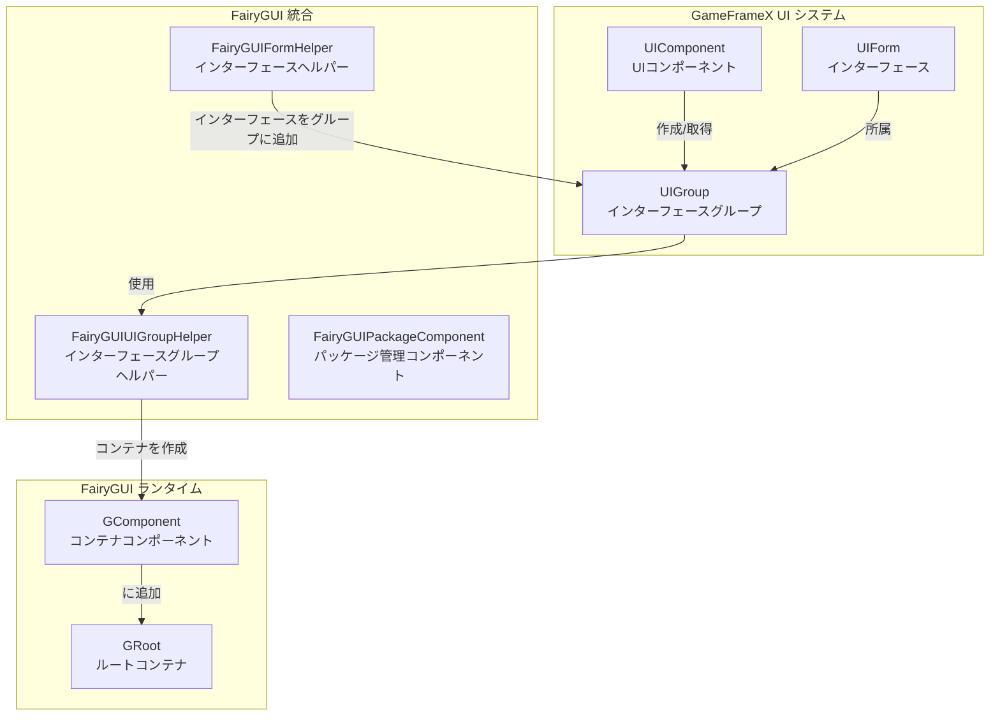
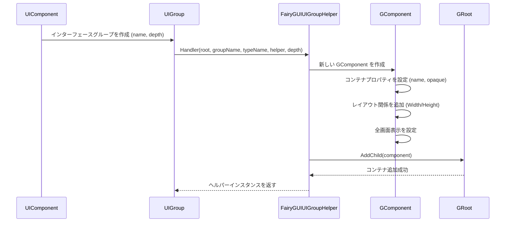
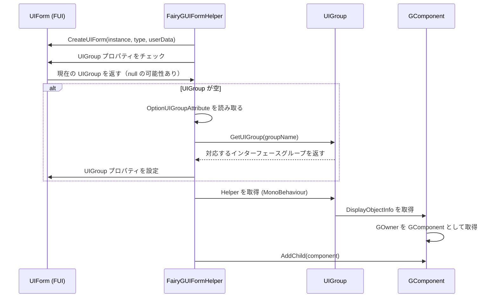

# インターフェースグループ設定

インターフェースグループ（UI Group）は、GameFrameX フレームワークにおいて UI インターフェースのレイヤと表示順序を管理するコアメカニズムです。FairyGUI プラグインは `FairyGUIUIGroupHelper` クラスを提供し、FairyGUI レンダリング特性に従ったインターフェースグループ機能を実装します。

## 概要

インターフェースグループ設定は主に以下の目的で使用されます：

- **レイヤ管理**：異なるタイプのインターフェースの表示レイヤを制御（ポップアップ、ダイアログ、メインインターフェースなど）
- **深度制御**：Z 軸位置を設定してインターフェースの前後の順序を決定
- **コンテナ組織**：関連するインターフェースを同じコンテナに組織化し、管理と制御を容易にする

FairyGUI 統合では、インターフェースグループは GComponent コンテナを通じて実装され、各グループは独立したコンテナに対応し、インターフェースは子要素として対応するグループコンテナに追加されます。

## アーキテクチャ



**アーキテクチャ説明：**

1. **UIComponent**：GameFrameX コアコンポーネントであり、すべてのインターフェースグループとインターフェースインスタンスを管理
2. **UIGroup**：インターフェースグループの抽象であり、`IUIGroupHelper` への参照を保持
3. **FairyGUIUIGroupHelper**：FairyGUI 固有のインターフェースグループヘルパー実装であり、GComponent コンテナを作成して深度を管理
4. **FairyGUIFormHelper**：インターフェースヘルパーであり、インターフェースインスタンスを対応するインターフェースグループコンテナに追加
5. **GRoot**：FairyGUI のルートコンテナであり、すべてのインターフェースグループコンテナがここに追加されます

## コアメカニズム

### インターフェースグループ作成フロー



### インターフェースをグループに分配



## 設定オプション

### FairyGUIUIGroupHelper プロパティ

| プロパティ | タイプ | 説明 |
|------|------|------|
| `Depth` | int | インターフェースグループの深度を取得または設定し、Z 軸順序を制御するために使用 |

### FairyGUIUIGroupHelper メソッド

#### `SetDepth(int depth)`

インターフェースグループの深度を設定します。このメソッドは `transform.localPosition` の Z 座標を変更して深度制御を実装します。

```csharp
public override void SetDepth(int depth)
{
    Depth = depth;
    transform.localPosition = new Vector3(0, 0, depth * 100);
}
```

> Source: [FairyGUIUIGroupHelper.cs](https://github.com/GameFrameX/com.gameframex.unity.ui.fairygui/blob/main/Runtime/FairyGUIUIGroupHelper.cs#L63-L67)

**パラメータ：**
- `depth` (int): インターフェースグループの深度値、数値が大きいほど前面に表示

#### `Handler(Transform root, string groupName, string uiGroupHelperTypeName, IUIGroupHelper customUIGroupHelper, int depth = 0)`

インターフェースグループプロセッサを作成します。

```csharp
public override IUIGroupHelper Handler(Transform root, string groupName, string uiGroupHelperTypeName, IUIGroupHelper customUIGroupHelper, int depth = 0)
{
    SetDepth(depth);
    GComponent component = new GComponent();
    GRoot.inst.AddChild(component);
    var comName = groupName;
    component.displayObject.name = comName;
    component.gameObjectName = comName;
    component.name = comName;
    component.opaque = false;
    component.AddRelation(GRoot.inst, RelationType.Width);
    component.AddRelation(GRoot.inst, RelationType.Height);
    component.MakeFullScreen();
    return GameFrameX.Runtime.Helper.CreateHelper(component.displayObject.gameObject, uiGroupHelperTypeName, (UIGroupHelperBase)customUIGroupHelper, 0);
}
```

> Source: [FairyGUIUIGroupHelper.cs](https://github.com/GameFrameX/com.gameframex.unity.ui.fairygui/blob/main/Runtime/FairyGUIUIGroupHelper.cs#L82-L96)

**パラメータ：**
- `root` (Transform): ルートノード
- `groupName` (string): インターフェースグループ名
- `uiGroupHelperTypeName` (string): インターフェースグループヘルパーのタイプ名
- `customUIGroupHelper` (IUIGroupHelper): カスタムインターフェースグループヘルパー
- `depth` (int): インターフェースグループの深度（デフォルトは 0）

**戻り値：** 作成されたインターフェースグループヘルパーインスタンス

## 使用方法

### インターフェースが属するグループを宣言

`OptionUIGroupAttribute` 属性を通じてマークし、インターフェースを指定されたインターフェースグループに分配します：

```csharp
using GameFrameX.UI.Runtime;

[OptionUIGroup("Dialog")]
public class MyDialogForm : FUI
{
    // インターフェース実装
}
```

> Source: [FairyGUIFormHelper.cs](https://github.com/GameFrameX/com.gameframex.unity.ui.fairygui/blob/main/Runtime/FairyGUIFormHelper.cs#L108-L114)

**説明：**
- インターフェースグループ名は GameFrameX コアフレームワークの UIComponent で設定
- FairyGUIUIGroupHelper は対応する名前の GComponent コンテナを自動的に作成
- 深度値はインターフェースの表示順序を決定し、数値が大きいほど前面に表示

### インターフェースグループの深度を設定

インターフェースグループの深度は通常、ゲームフレームワークの初期化時に設定されます：

```csharp
// UIComponent 設定でインターフェースグループの深度を設定
// 異なるインターフェースグループは異なる深度値を使用してレイヤ分離を実現可能
// 例: Background=0, Normal=10, Dialog=20, Toast=30
```

## 一般的なシナリオ

### シナリオ1：ポップアップインターフェースグループ

すべてのポップアップタイプインターフェースを独立したインターフェースグループに配置し、ポップアップが常に通常インターフェースより前面に表示されることを確認します：

```csharp
[OptionUIGroup("Dialog")]
public class ConfirmDialog : FUI { }

[OptionUIGroup("Dialog")]
public class AlertDialog : FUI { }
```

### シナリオ2：Toast ヒントグループ

一時的なヒント情報を最上位レイヤに配置します：

```csharp
[OptionUIGroup("Toast")]
public class ToastForm : FUI { }
```

### シナリオ3：背景インターフェースグループ

背景インターフェースを最下位レイヤに配置します：

```csharp
[OptionUIGroup("Background")]
public class MainBackground : FUI { }
```

## 関連リンク

- [FUI インターフェースベースクラス](../4-core-concepts.1-fui-base-class)
- [インターフェースマネージャー](../4-core-concepts.2-ui-manager)
- [インターフェースヘルパー](../4-core-concepts.4-form-helper)
- [パッケージマネージャー](../4-core-concepts.3-package-manager)
- [エディター設定](./6-configuration.1-editor-config)
- [API リファレンス - FairyGUIUIGroupHelper クラス](./5-api-reference.3-form-helper)