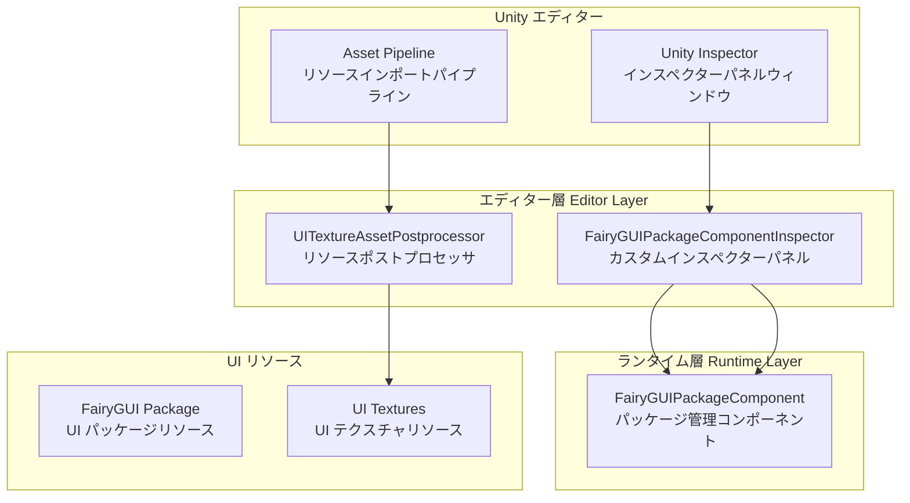
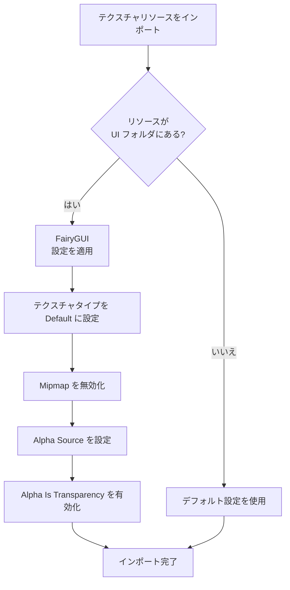

# エディター設定

エディター設定ドキュメントでは、GameFrameX UI FairyGUI プラグインの Unity エディターにおける設定機能について説明します。カスタムインスペクターパネルとリソースポストプロセッサを含みます。

## 概要

GameFrameX UI FairyGUI プラグインは、Unity エディターでの UI 開発ワークフローを簡素化するための完全なエディター設定メカニズムを提供します。これらのエディター機能は主に次の2つのコアコンポーネントで構成されています：

1. **カスタムインスペクターパネル (Custom Inspector)** - FairyGUIPackageComponent にビジュアル設定インターフェースを提供
2. **リソースポストプロセッサ (Asset Postprocessor)** - UI テクスチャリソースのインポート設定を自動構成

これらのエディター設定機能により、開発効率が大幅に向上し、手動設定作業が削減され、UI リソースがベストプラクティスを使用することが保証されます。

## アーキテクチャ



## カスタムインスペクターパネル

### FairyGUIPackageComponentInspector

カスタムインスペクターパネルは GameFrameX ベースエディタープレームワークを継承し、FairyGUIPackageComponent コンポーネントのビジュアル設定インターフェースを提供します。

```csharp
// Source: Editor/Inspector/FairyGUIPackageComponentInspector.cs
using GameFrameX.Editor;
using GameFrameX.UI.FairyGUI.Runtime;
using UnityEditor;

namespace GameFrameX.UI.FairyGUI.Editor
{
    [CustomUnityEditor(typeof(FairyGUIPackageComponent))]
    internal sealed class UIFairyGUIPackageComponentInspector : GameFrameworkInspector
    {
        public override void OnInspectorGUI()
        {
            base.OnInspectorGUI();
            Repaint();
        }
    }
}
```

> Source: [FairyGUIPackageComponentInspector.cs](https://github.com/GameFrameX/com.gameframex.unity.ui.fairygui/blob/main/Editor/Inspector/FairyGUIPackageComponentInspector.cs#L38-L46)

**機能的特性：**
- Unity Inspector パネルに自動的に統合
- GameFrameworkInspector 基本クラスを継承し、統一されたエディターインターフェーススタイルを提供
- コンポーネントのランタイム設定查看をサポート
- `GameFrameX/FairyGUIPackage` メニュー項目を追加し、迅速にコンポーネントを作成

**使用方法：**
1. Unity シーンで空のゲームオブジェクトを作成
2. `FairyGUIPackageComponent` コンポーネントを追加（メニュー `GameFrameX/FairyGUIPackage` から迅速に追加可能）
3. Inspector パネルでコンポーネントプロパティを確認して設定

## リソースポストプロセッサ

### UITextureAssetPostprocessor

リソースポストプロセッサはエディター設定のコアコンポーネントであり、UI テクスチャリソースがインポートされる時に正しい設定を自動的に適用し、UI リソースが FairyGUI の要件を満たすことを保証します。

```csharp
// Source: Editor/UITextureAssetPostprocessor.cs
#if ENABLE_UI_FAIRYGUI
using GameFrameX.Runtime;
using UnityEditor;

namespace GameFrameX.UI.FairyGUI.Editor
{
    internal sealed class UITextureAssetPostprocessor : AssetPostprocessor
    {
        void OnPreprocessTexture()
        {
            if (assetPath.Contains(PathHelper.Combine(Utility.Asset.Path.BundlesPath, "UI")))
            {
                TextureImporter textureImporter = (TextureImporter)assetImporter;
                if (textureImporter.textureType != TextureImporterType.Default)
                {
                    textureImporter.textureType = TextureImporterType.Default;
                }

                if (textureImporter.mipmapEnabled)
                {
                    textureImporter.mipmapEnabled = false;
                }

                textureImporter.alphaSource = TextureImporterAlphaSource.FromInput;
                textureImporter.alphaIsTransparency = true;
            }
        }
    }
}
#endif
```

> Source: [UITextureAssetPostprocessor.cs](https://github.com/GameFrameX/com.gameframex.unity.ui.fairygui/blob/main/Editor/UITextureAssetPostprocessor.cs#L41-L59)

### 自動設定プロパティの説明

| 設定項目 | 設定値 | 説明 |
|--------|--------|------|
| Texture Type | Default | デフォルトテクスチャタイプを使用し、FairyGUI が正しく識別できるようにする |
| Mipmap | 無効化 | UI テクスチャは通常 Mipmap を必要としないため、無効化してメモリを節約 |
| Alpha Source | FromInput | テクスチャチャンネルから Alpha 情報を読み取る |
| Alpha Is Transparency | 有効化 | Alpha チャンネルを透明度として扱い、レンダリングを最適化 |

### 処理範囲

リソースポストプロセッサは UI フォルダ内のテクスチャリソースのみを処理します。UI フォルダパスは `PathHelper.Combine(Utility.Asset.Path.BundlesPath, "UI")` によって決定され、通常は `Assets/Bundles/UI` です。

### ワークフロー



## 設定オプションまとめ

### エディターアセンブリ定義

エディターコードは独立したアセンブリにあり、ランタイムコードから分離されています：

```json
// Source: Editor/GameFrameX.UI.FairyGUI.Editor.asmdef
{
  "name": "GameFrameX.UI.FairyGUI.Editor",
  "references": [
    "GameFrameX.UI.FairyGUI.Runtime",
    "GameFrameX.Editor",
    "GameFrameX.Runtime",
    "FairyGUI.Editor",
    "FairyGUI.Runtime"
  ],
  "includePlatforms": [
    "Editor"
  ]
}
```

> Source: [GameFrameX.UI.FairyGUI.Editor.asmdef](https://github.com/GameFrameX/com.gameframex.unity.ui.fairygui/blob/main/Editor/GameFrameX.UI.FairyGUI.Editor.asmdef#L1-L21)

### コンパイル条件

エディターコードは `ENABLE_UI_FAIRYGUI` コンパイルシンボルによって制御され、FairyGUI モジュールが有効な場合にのみ関連コードがコンパイルされます。

## 一般的な設定問題

### テクスチャインポート問題

UI テクスチャに正しい設定が自動的に適用されない場合は、以下を確認してください：

1. **UI リソースパスを確認**：テクスチャは UI フォルダにある必要があります（例：`Assets/Bundles/UI/`）
2. **コンパイルシンボルをチェック**：`ENABLE_UI_FAIRYGUI` が定義されていることを確認
3. **リソースデータベースを更新**：Unity で `Assets > Refresh` を選択するか、`Ctrl+R` を押して強制更新

### Inspector にカスタムパネルが表示されない

カスタムインスペクターパネルが正常に表示されない場合は：

1. GameFrameX.Editor 依存パッケージがインストールされていることを確認
2. FairyGUIPackageComponentInspector クラスが正しく継承されているか確認
3. アセンブリ定義が Editor プラットフォームを正しく含んでいることを確認

## 関連リンク

- [FUI インターフェースベースクラス](../4-core-concepts.1-fui-base-class) - FUI ベースクラスの使用方法を理解
- [FairyGUIPackageComponent クラス](../5-api-reference.2-package-component) - パッケージ管理コンポーネントの詳細 API ドキュメント
- [インターフェースマネージャー](../4-core-concepts.2-ui-manager) - インターフェースマネージャーの設定と使用を理解
- [インストールガイド](../2-installation.1-install-methods) - プラグインインストール説明
- [依存関係設定](../2-installation.2-dependencies) - 依存項目設定説明