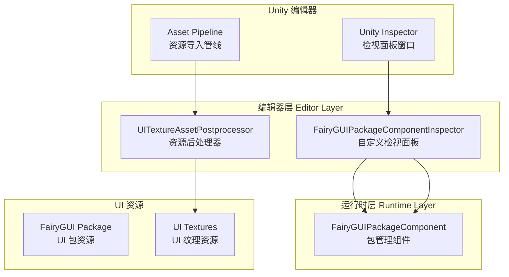
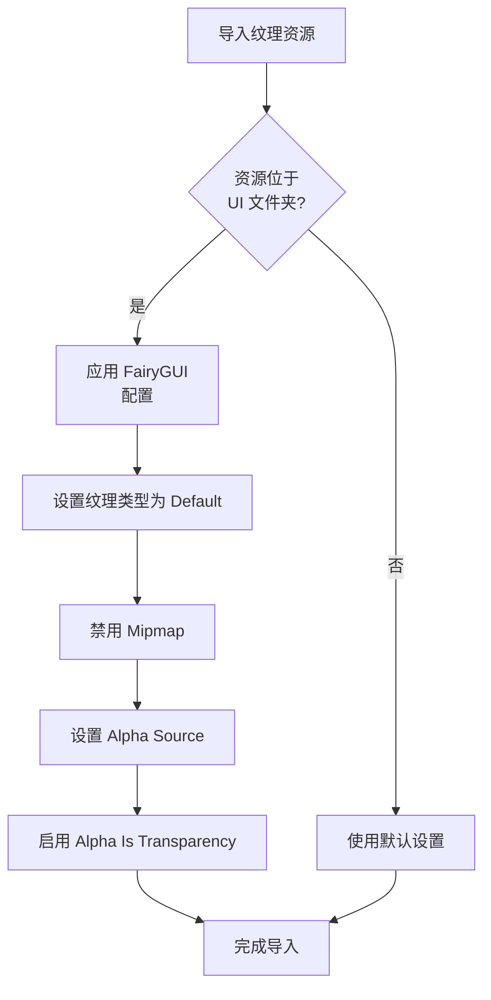

# エディタ設定

エディタ設定ドキュメント介绍 GameFrameX UI FairyGUI プラグイン在 Unity エディタ中的設定機能，含みます自定義检视パネル和リソース后処理器。

## 概要

GameFrameX UI FairyGUI プラグイン提供します一套完全な的エディタ設定机制，用于簡素化在 Unity エディタ中的 UI 开发工作フロー。这些エディタ機能主なパッケージ含以下两个コアコンポーネント：

1. **自定義检视パネル (Custom Inspector)** - 为 FairyGUIPackageComponent 提供可视化設定界面
2. **リソース后処理器 (Asset Postprocessor)** - 自动設定 UI 纹理リソース的导入設定

这些エディタ設定機能〜できます显著提升开发效率，减少手动設定工作，并確認してください UI リソース使用最佳实践。

## アーキテクチャ



## 自定義检视パネル

### FairyGUIPackageComponentInspector

自定義检视パネル継承自 GameFrameX 基本エディタフレームワーク，提供します FairyGUIPackageComponent コンポーネント的可视化設定界面。

```csharp
// Source: Editor/Inspector/FairyGUIPackageComponentInspector.cs
using GameFrameX.Editor;
using GameFrameX.UI.FairyGUI.Runtime;
using UnityEditor;

namespace GameFrameX.UI.FairyGUI.Editor
{
    [CustomEditor(typeof(FairyGUIPackageComponent))]
    internal sealed class UIFairyGUIPackageComponentInspector : GameFrameworkInspector
    {
        public override void OnInspectorGUI()
        {
            base.OnInspectorGUI();
            Repaint();
        }
    }
}
```

> Source: [FairyGUIPackageComponentInspector.cs](https://github.com/GameFrameX/com.gameframex.unity.ui.fairygui/blob/main/Editor/Inspector/FairyGUIPackageComponentInspector.cs#L38-L46)

**機能特点：**
- 自动集成到 Unity Inspector パネル
- 継承自 GameFrameworkInspector 基底クラス，提供統一された的エディタ界面风格
- サポートコンポーネント的ランタイム設定確認
- 追加了 `GameFrameX/FairyGUIPackage` メニュー项，方便快速作成コンポーネント

**使用方法：**
1. 在 Unity シーン中作成空物体
2. 追加 `FairyGUIPackageComponent` コンポーネント（可通过メニュー `GameFrameX/FairyGUIPackage` 快速追加）
3. 在 Inspector パネル中確認和設定コンポーネントプロパティ

## リソース后処理器

### UITextureAssetPostprocessor

リソース后処理器是エディタ設定的コアコンポーネント，它会在 UI 纹理リソース导入时自动应用正确的設定，確認してください UI リソース符合 FairyGUI 的要求。

```csharp
// Source: Editor/UITextureAssetPostprocessor.cs
#if ENABLE_UI_FAIRYGUI
using GameFrameX.Runtime;
using UnityEditor;

namespace GameFrameX.UI.FairyGUI.Editor
{
    internal sealed class UITextureAssetPostprocessor : AssetPostprocessor
    {
        void OnPreprocessTexture()
        {
            if (assetPath.Contains(PathHelper.Combine(Utility.Asset.Path.BundlesPath, "UI")))
            {
                TextureImporter textureImporter = (TextureImporter)assetImporter;
                if (textureImporter.textureType != TextureImporterType.Default)
                {
                    textureImporter.textureType = TextureImporterType.Default;
                }

                if (textureImporter.mipmapEnabled)
                {
                    textureImporter.mipmapEnabled = false;
                }

                textureImporter.alphaSource = TextureImporterAlphaSource.FromInput;
                textureImporter.alphaIsTransparency = true;
            }
        }
    }
}
#endif
```

> Source: [UITextureAssetPostprocessor.cs](https://github.com/GameFrameX/com.gameframex.unity.ui.fairygui/blob/main/Editor/UITextureAssetPostprocessor.cs#L41-L59)

### 自动設定プロパティ説明

| 設定项 | 設定值 | 説明 |
|--------|--------|------|
| Texture Type | Default | 使用デフォルト纹理タイプ，確認してください FairyGUI 能正确识别 |
| Mipmap | 禁用 | UI 纹理通常不〜する必要があります Mipmap，禁用可节省内存 |
| Alpha Source | FromInput | 从纹理通道读取 Alpha 情報 |
| Alpha Is Transparency | 启用 | 将 Alpha 通道视为透明度，最適化渲染 |

### 処理范围

リソース后処理器仅処理位于 UI ファイル夹中的纹理リソース。UI ファイル夹路径由 `PathHelper.Combine(Utility.Asset.Path.BundlesPath, "UI")` 决定，通常为 `Assets/Bundles/UI`。

### ワークフロー



## 設定オプション汇总

### エディタアセンブリ定義

エディタコード位于独立的アセンブリ中，与ランタイムコード分离：

```json
// Source: Editor/GameFrameX.UI.FairyGUI.Editor.asmdef
{
  "name": "GameFrameX.UI.FairyGUI.Editor",
  "references": [
    "GameFrameX.UI.FairyGUI.Runtime",
    "GameFrameX.Editor",
    "GameFrameX.Runtime",
    "FairyGUI.Editor",
    "FairyGUI.Runtime"
  ],
  "includePlatforms": [
    "Editor"
  ]
}
```

> Source: [GameFrameX.UI.FairyGUI.Editor.asmdef](https://github.com/GameFrameX/com.gameframex.unity.ui.fairygui/blob/main/Editor/GameFrameX.UI.FairyGUI.Editor.asmdef#L1-L21)

### コンパイル条件

エディタコード受 `ENABLE_UI_FAIRYGUI` コンパイル符号控制，確認してください只有在启用 FairyGUI モジュール时才会コンパイル相关コード。

## 常见設定問題

### 纹理导入問題

もし UI 纹理未自动应用正确設定，请確認：

1. **確認 UI リソースパス**：纹理〜しなければなりません位于 UI ファイル夹中（如 `Assets/Bundles/UI/`）
2. **確認コンパイル符号**：確認 `ENABLE_UI_FAIRYGUI` 已定義
3. **刷新リソース数据库**：在 Unity 中选择 `Assets > Refresh` 或按 `Ctrl+R` 强制刷新

### Inspector 不显示自定義パネル

もし自定義检视パネル未正常显示：

1. 確認已インストール GameFrameX.Editor 依赖パッケージ
2. 確認 FairyGUIPackageComponentInspector 类是否正确継承
3. 確認してくださいアセンブリ定義正确パッケージ含 Editor プラットフォーム

## 関連リンク

- [FUI 界面基底クラス](../4-core-concepts.1-fui-base-class) - 理解する FUI 基底クラス的使用メソッド
- [FairyGUIPackageComponent 类](../5-api-reference.2-package-component) - パッケージ管理コンポーネント的詳細 API ドキュメント
- [界面マネージャー](../4-core-concepts.2-ui-manager) - 理解する界面マネージャー的設定和使用
- [インストールガイド](../2-installation.1-install-methods) - プラグインインストール説明
- [依赖設定](../2-installation.2-dependencies) - 依赖项設定説明
