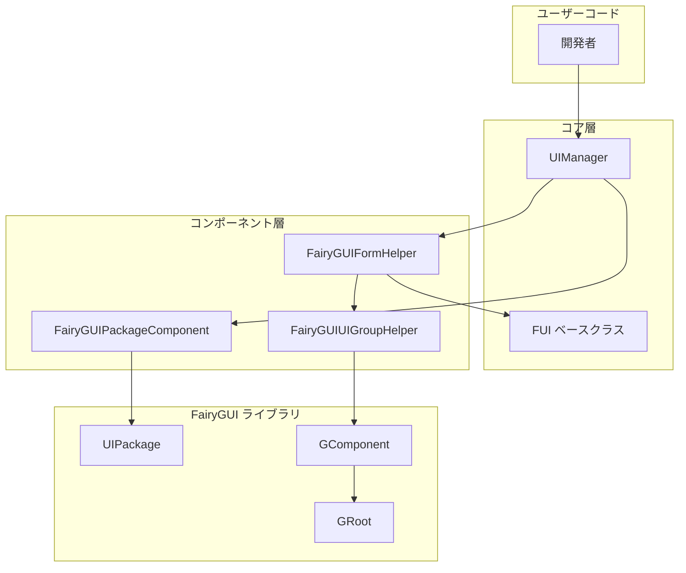

# よくある質問

このドキュメントでは、GameFrameX Unity UI FairyGUI プラグインの使用中に発生する可能性のある一般的な問題とその解決策を収集しています。

## 概要

GameFrameX Unity UI FairyGUI プラグインは、Unity ゲームに FairyGUI UI コンポーネントの統合ラッパーを提供します。使用中に、開発者はインターフェースロードの失敗、コンポーネントが見つからない、リソースパスエラーなどの問題が発生する可能性があります。このドキュメントは、開発者がこれらの一般的な問題を迅速に特定して解決するのに役立ちます。

## インストールと設定の問題

### Q1: FairyGUI プラグインを正しくインストールする方法は？

**問題の説明**：Unity プロジェクトにプラグインをインストールした後、コンパイルエラーまたは機能の異常が発生します。

**解決策**：
1. すべての依存関係がインストールされていることを確認してください：
   - `com.gameframex.unity` (1.1.1+)
   - `com.gameframex.unity.ui` (1.0.0+)
   - `com.gameframex.unity.asset` (1.0.6+)
   - `com.gameframex.unity.event` (1.0.0+)

2. インストール方法（いずれかを選択）：
   - `manifest.json` に追加：
     ```json
     {"com.gameframex.unity.ui.fairygui": "https://github.com/GameFrameX/com.gameframex.unity.ui.fairygui.git"}
     ```
   - Unity の Package Manager で Git URL を使用：`https://github.com/gameframex/com.gameframex.unity.ui.fairygui.git`
   - リポジトリを直接ダウンロードして Unity プロジェクトの `Packages` ディレクトリ下に配置

3. Unity バージョンの要件：2019.4 以上

> 詳細については、[インストール方法](./2-installation.1-install-methods) を参照してください。

---

### Q2: FairyGUIPackageComponent コンポーネントが見つからない？

**問題の説明**：実行時に `FairyGuiPackage is invalid` または類似のエラーが表示されます。

**解決策**：
1. シーンに FairyGUIPackageComponent コンポーネントが存在することを確認
2. このコンポーネントはゲームオブジェクトにアタッチ되어いなければならない
3. コンポーネントが正しく初期化されているか確認

> 詳細については、[パッケージマネージャー](./4-core-concepts.3-package-manager) を参照してください。

---

## インターフェースロードの問題

### Q3: インターフェースを開けない。「Load UI form failure」と表示される？

**問題の説明**：インターフェースを開くメソッドを呼び出すと失敗し、エラーメッセージに "Load UI form failure" が含まれる。

**考えられる原因**：
1. リソースパスが正しくない
2. FairyGUI パッケージが正しくロードされていない
3. リソースファイルが存在しない

**解決策**：
1. リソースパスの形式が正しいことを確認
2. FairyGUI パッケージ（.bin ファイル）が正しいディレクトリに置かれていることを確認
3. UI リソースがパックされているか確認

> 詳細については、[インターフェースを開く・閉じる](./3-getting-started.2-open-close-ui) を参照してください。

---

### Q4: UI パッケージのロードに失敗した？

**問題の説明**：UI パッケージのロードに失敗したか、パッケージ名が空であると表示される。

**考えられる原因**：
1. パッケージパスの形式が正しくない
2. パッケージ名とリソース名が一致しない

**解決策**：
1. リソースパスの形式：`{パッケージ名}/{リソース名}` または `{パッケージ名}`
2. パッケージ名が FairyGUI エディターでパブリッシュされたパッケージ名と一致していることを確認
3. リソースが正しいディレクトリ（Resources または Bundles）にあるか確認

---

### Q5: 非同期でインターフェースをロードすると白紙表示される？

**問題の説明**：非同期方式でインターフェースを開くと、インターフェースは表示されるがコンテンツが空である。

**考えられる原因**：
1. パッケージのロードタイミングが早すぎる
2. リソースが完全にロードされていない

**解決策**：
1. `await` を使用してパッケージのロードが完了するのを待つ
2. `isLoadAsset` パラメータが正しく設定されているか確認

```csharp
// 正しい例
var package = await FairyGuiPackage.AddPackageAsync("uipackage");
var ui = UIPackage.CreateObject("uipackage", "MainForm");
```

> 詳細については、[FairyGUIPackageComponent](./5-api-reference.2-package-component) を参照してください。

---

## インターフェースコンポーネントの問題

### Q6: 「UI form instance is invalid」と表示される？

**問題の説明**：インターフェースのインスタンス化に失敗し、「UI form instance is invalid」と表示される。

**考えられる原因**：
1. インターフェースクラスが FUI 基本クラスを継承していない
2. FairyGUIFormHelper が正しく設定されていない

**解決策**：
1. インターフェースクラスが FUI を継承していることを確認：
   ```csharp
   public class MainForm : FUI
   {
       // インターフェースロジック
   }
   ```
2. FairyGUIFormHelper がシーンに追加されていることを確認

> 詳細については、[FUI インターフェースベースクラス](./4-core-concepts.1-fui-base-class) を参照してください。

---

### Q7: 「UI group is invalid」と表示される？

**問題の説明**：インターフェースをインターフェースグループに追加できず、「UI group is invalid」と表示される。

**考えられる原因**：
1. インターフェースグループが正しく作成されていない
2. インターフェースグループ名が一致しない

**解決策**：
1. UI 設定でインターフェースグループを正しく設定
2. `[OptionUIGroup]` 属性を使用してインターフェースグループを指定：
   ```csharp
   [OptionUIGroup("MainUI")]
   public class MainForm : FUI
   {
   }
   ```

> 詳細については、[インターフェースグループ設定](./6-configuration.2-ui-group-config) を参照してください。

---

### Q8: 「Display object info is invalid」と表示される？

**問題の説明**：インターフェース表示オブジェクト情報が無効である。

**考えられる原因**：
1. インターフェースグループヘルパーが正しく初期化されていない
2. GComponent が GRoot に正しく追加されていない

**解決策**：
1. FairyGUIUIGroupHelper が正しく作成されていることを確認
2. GRoot が初期化されているか確認

> 詳細については、[インターフェースグループヘルパー](./4-core-concepts.5-ui-group-helper) を参照してください。

---

## リソースロードの問題

### Q9: リソースのロードに失敗し、「Unknown file type」と表示される？

**問題の説明**：リソースをロードする際に不明なファイルタイプと表示される。

**考えられる原因**：
1. リソースタイプがサポートリストにない
2. ファイル拡張子が正しくない

**解決策**：
FairyGUIPackageComponent は以下のリソースタイプをサポートしています：
- `.bytes` - バイナリソース
- `.atlas` - アトラスリソース
- `.png` / `.jpg` - 画像リソース
- Spine アニメーションリソース
- DragonBones アニメーションリソース

リソースファイルの拡張子が正しく、FairyGUI パッケージに追加されていることを確認してください。

> 詳細については、[FairyGUIPackageComponent](./5-api-reference.2-package-component) を参照してください。

---

### Q10: YooAsset リソースのアンパイロードに失敗した？

**問題の説明**：インターフェースを閉じた後、リソースが正しく解放されていない。

**考えられる原因**：
1. EnableAutoReleaseUIForm が有効になっていない
2. リソースハンドルが正しく渡されていない

**解決策**：
1. UIComponent の EnableAutoReleaseUIForm が true に設定されていることを確認
2. リソースパスに "Bundles" ディレクトリ識別子が含まれているか確認

```csharp
// リソースパスの形式の例
string uiFormAssetPath = "Bundles/UI/MainForm";  // YooAsset リソース
// または
string uiFormAssetPath = "Resources/UI/MainForm";  // Resources リソース
```

---

## パス検索の問題

### Q11: 「Invalid UI path」と表示される？

**問題の説明**：パスを使用してインターフェースコンポーネントを検索すると失敗する。

**考えられる原因**：
1. パス形式が正しくない
2. コンポーネント名が存在しない
3. インデックスが範囲外

**解決策**：
1. 正しいパス形式を使用：`"親コンポーネント/子コンポーネント"` または `"コンポーネント名[index]"`
2. コンポーネント名がが存在することを確認
3. インデックス値が有効範囲内であるか確認

```csharp
// 正しい例
var button = UIForm.GObject.GetChild("Btn_Confirm");
var dialog = UIForm.GObject.asCom.GetChildAt(0);

// パス検索
var deepChild = FairyGUIPathFinderHelper.GetChild(UIForm.GObject, "Panel/Content/Button");
```

> 詳細については、[GObjectHelper ユーティリティクラス](./5-api-reference.4-gobject-helper) を参照してください。

---

## コンポーネント初期化の問題

### Q12: Asset Component または UI Component が見つからない？

**問題の説明**：実行時に "Asset component is invalid" または "UI component is invalid" と表示される。

**解決策**：
1. GameEntry が正しく初期化されていることを確認
2. 以下のコンポーネントが GameEntry に追加されていることを確認：
   - AssetComponent
   - UIComponent
   - FairyGUIPackageComponent

> 詳細については、[エディター設定](./6-configuration.1-editor-config) を参照してください。

---

## アーキテクチャ図



## 一般的なエラーコード表

| エラーメッセージ | 考えられる原因 | 解決策 |
|---------|---------|--------|
| UI form instance is invalid | インターフェースクラスが FUI を継承していない | インターフェースクラスが FUI を継承していることを確認 |
| UI group is invalid | インターフェースグループが設定されていない | インターフェースグループを設定するか属性を使用 |
| Display object info is invalid | インターフェースグループヘルパーが初期化されていない | FairyGUIUIGroupHelper を確認 |
| Asset component is invalid | AssetComponent が登録されていない | GameEntry が初期化されていることを確認 |
| UI component is invalid | UIComponent が登録されていない | GameEntry が初期化されていることを確認 |
| Load UI form failure | リソースパスエラー | リソースパスとパッケージ名を確認 |
| Invalid UI path | パス形式エラー | 正しいパス形式を使用 |

## 関連リンク

- [プラグイン紹介](./1-overview.1-introduction)
- [機能特性](./1-overview.2-features)
- [システム要件](./1-overview.3-requirements)
- [インストール方法](./2-installation.1-install-methods)
- [依存関係設定](./2-installation.2-dependencies)
- [最初のインターフェースを作成](./3-getting-started.1-first-ui-form)
- [インターフェースを開く・閉じる](./3-getting-started.2-open-close-ui)
- [FUI インターフェースベースクラス](./4-core-concepts.1-fui-base-class)
- [インターフェースマネージャー](./4-core-concepts.2-ui-manager)
- [パッケージマネージャー](./4-core-concepts.3-package-manager)
- [インターフェースヘルパー](./4-core-concepts.4-form-helper)
- [インターフェースグループヘルパー](./4-core-concepts.5-ui-group-helper)
- [FUI クラス API](./5-api-reference.1-fui-class)
- [FairyGUIPackageComponent API](./5-api-reference.2-package-component)
- [FairyGUIFormHelper API](./5-api-reference.3-form-helper)
- [GObjectHelper API](./5-api-reference.4-gobject-helper)
- [エディター設定](./6-configuration.1-editor-config)
- [インターフェースグループ設定](./6-configuration.2-ui-group-config)