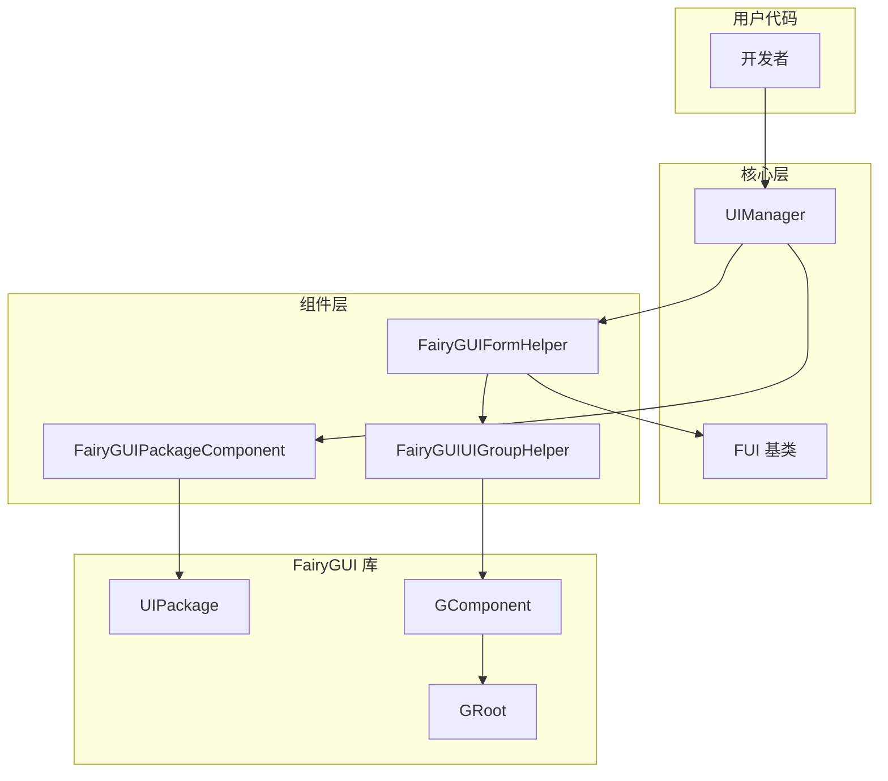

# よくある問題解答

このドキュメント收集了使用 GameFrameX Unity UI FairyGUI プラグイン过程中常见的問題及其解決策。

## 概要

GameFrameX Unity UI FairyGUI プラグイン为 Unity 游戏提供します FairyGUI UI コンポーネント的集成カプセル化。在使用过程中，開発者〜の可能性があります会遇到界面ロード失敗、コンポーネント未找到、リソースパスエラー等問題。このドキュメント旨在帮助開発者快速定位和解决这些常见問題。

## インストール与設定問題

### Q1: 如何正确インストール FairyGUI プラグイン？

**問題説明**：在 Unity プロジェクト中インストールプラグイン后，出现コンパイルエラー或機能例外。

**解決策**：
1. 確認してください已インストール所有依赖项：
   - `com.gameframex.unity` (1.1.1+)
   - `com.gameframex.unity.ui` (1.0.0+)
   - `com.gameframex.unity.asset` (1.0.6+)
   - `com.gameframex.unity.event` (1.0.0+)

2. インストール方法（任选其一）：
   - 在 `manifest.json` 中追加：
     ```json
     {"com.gameframex.unity.ui.fairygui": "https://github.com/GameFrameX/com.gameframex.unity.ui.fairygui.git"}
     ```
   - 在 Unity 的 Package Manager 中使用 Git URL 追加：`https://github.com/gameframex/com.gameframex.unity.ui.fairygui.git`
   - 直接下载リポジトリ放置到 Unity プロジェクト的 `Packages` ディレクトリ下

3. Unity バージョン要求：2019.4 或更高バージョン

> 詳細情報请参照 [インストール方法](./2-installation.1-install-methods)

---

### Q2: FairyGUIPackageComponent コンポーネント未找到？

**問題説明**：ランタイムヒント `FairyGuiPackage is invalid` 或类似エラー。

**解決策**：
1. 確認してくださいシーン中存在 FairyGUIPackageComponent コンポーネント
2. 该コンポーネント〜しなければなりません挂载在 GameObject 上
3. 確認コンポーネント是否正确初期化

> 詳細情報请参照 [パッケージマネージャー](./4-core-concepts.3-package-manager)

---

## 界面ロード問題

### Q3: 界面打开失敗，ヒント "Load UI form failure"？

**問題説明**：呼び出し界面打开メソッド时失敗，エラー情報パッケージ含 "Load UI form failure"。

**考えられる原因**：
1. リソースパス不正确
2. FairyGUI パッケージ未正确ロード
3. リソースファイル不存在

**解決策**：
1. 確認リソースパスフォーマット正确
2. 確認してください FairyGUI パッケージ（.bin ファイル）已放置在正确ディレクトリ
3. 確認 UI リソース是否已打パッケージ

> 詳細情報请参照 [打开和閉じる界面](./3-getting-started.2-open-close-ui)

---

### Q4: UI パッケージロード失敗？

**問題説明**：ヒント UI パッケージロード失敗或パッケージ名为空。

**考えられる原因**：
1. パッケージ路径フォーマット不正确
2. パッケージ名与リソース名不一致

**解決策**：
1. リソースパスフォーマット：`{包名}/{资源名}` 或 `{包名}`
2. 確認してくださいパッケージ名与 FairyGUI エディタ中リリース的パッケージ名一致
3. 確認リソース是否在正确的ディレクトリ下（Resources 或 Bundles）

---

### Q5: 非同期ロード界面时界面空白？

**問題説明**：使用异步方法打开界面，界面显示但内容为空。

**考えられる原因**：
1. パッケージロード时机过早
2. リソース尚未完全ロード完成

**解決策**：
1. 確認してください使用 `await` 等待パッケージロード完成
2. 確認 `isLoadAsset` パラメータ是否正确設定

```csharp
// 正确示例
var package = await FairyGuiPackage.AddPackageAsync("uipackage");
var ui = UIPackage.CreateObject("uipackage", "MainForm");
```

> 詳細情報请参照 [FairyGUIPackageComponent](./5-api-reference.2-package-component)

---

## 界面コンポーネント問題

### Q6: ヒント "UI form instance is invalid"？

**問題説明**：界面インスタンス化失敗，ヒント "UI form instance is invalid"。

**考えられる原因**：
1. 界面タイプ未継承 FUI 基底クラス
2. FairyGUIFormHelper 未正确設定

**解決策**：
1. 確認してください界面类継承自 FUI：
   ```csharp
   public class MainForm : FUI
   {
       // 界面逻辑
   }
   ```
2. 確認してください FairyGUIFormHelper 已追加到シーン

> 詳細情報请参照 [FUI 界面基底クラス](./4-core-concepts.1-fui-base-class)

---

### Q7: ヒント "UI group is invalid"？

**問題説明**：界面无法追加到界面组，ヒント "UI group is invalid"。

**考えられる原因**：
1. 界面组未正确作成
2. 界面组名称不匹配

**解決策**：
1. 在 UI 設定中正确設定界面组
2. 使用 `[OptionUIGroup]` プロパティ指定界面组：
   ```csharp
   [OptionUIGroup("MainUI")]
   public class MainForm : FUI
   {
   }
   ```

> 詳細情報请参照 [界面组設定](./6-configuration.2-ui-group-config)

---

### Q8: ヒント "Display object info is invalid"？

**問題説明**：界面显示对象情報无效。

**考えられる原因**：
1. 界面组辅助器未正确初期化
2. GComponent 未正确追加到 GRoot

**解決策**：
1. 確認してください FairyGUIUIGroupHelper 正确作成
2. 確認 GRoot 是否已初期化

> 詳細情報请参照 [界面组辅助器](./4-core-concepts.5-ui-group-helper)

---

## リソースロード問題

### Q9: リソースロード失敗，ヒント "Unknown file type"？

**問題説明**：ロードリソース时ヒント未知ファイルタイプ。

**考えられる原因**：
1. リソースタイプ不在サポート列表中
2. ファイル拡張名不正确

**解決策**：
FairyGUIPackageComponent サポート以下リソースタイプ：
- `.bytes` - 二进制リソース
- `.atlas` - 图集リソース
- `.png` / `.jpg` - 图片リソース
- Spine 动画リソース
- DragonBones 动画リソース

请確認してくださいリソースファイル拡張名正确，且已追加到 FairyGUI パッケージ中。

> 詳細情報请参照 [FairyGUIPackageComponent](./5-api-reference.2-package-component)

---

### Q10: YooAsset リソースアンロード失敗？

**問題説明**：界面閉じる后リソース未正确解放。

**考えられる原因**：
1. EnableAutoReleaseUIForm 未启用
2. リソース句柄未正确传递

**解決策**：
1. 確認してください UIComponent 的 EnableAutoReleaseUIForm 設定为 true
2. 確認リソースパス是否パッケージ含 "Bundles" ディレクトリ标识

```csharp
// 资源路径格式示例
string uiFormAssetPath = "Bundles/UI/MainForm";  // YooAsset 资源
// 或
string uiFormAssetPath = "Resources/UI/MainForm";  // Resources 资源
```

---

## 路径查找問題

### Q11: ヒント "Invalid UI path"？

**問題説明**：使用路径查找界面コンポーネント时失敗。

**考えられる原因**：
1. 路径フォーマット不正确
2. コンポーネント名称不存在
3. 索引超出范围

**解決策**：
1. 使用正确的路径フォーマット：`"父组件/子组件"` 或 `"组件名[index]"`
2. 確認してくださいコンポーネント名称存在
3. 確認索引值是否在有效范围内

```csharp
// 正确示例
var button = UIForm.GObject.GetChild("Btn_Confirm");
var dialog = UIForm.GObject.asCom.GetChildAt(0);

// 路径查找
var deepChild = FairyGUIPathFinderHelper.GetChild(UIForm.GObject, "Panel/Content/Button");
```

> 詳細情報请参照 [GObjectHelper 工具类](./5-api-reference.4-gobject-helper)

---

## コンポーネント初期化問題

### Q12: Asset Component 或 UI Component 未找到？

**問題説明**：ランタイムヒント "Asset component is invalid" 或 "UI component is invalid"。

**解決策**：
1. 確認してください GameEntry 已正确初期化
2. 確認してください以下コンポーネント已追加到 GameEntry：
   - AssetComponent
   - UIComponent
   - FairyGUIPackageComponent

> 詳細情報请参照 [エディタ設定](./6-configuration.1-editor-config)

---

## アーキテクチャ图



## 常见エラー码表

| エラー情報 | 〜の可能性があります原因 | 解決策 |
|---------|---------|---------|
| UI form instance is invalid | 界面タイプ未継承 FUI | 確認してください界面类継承自 FUI |
| UI group is invalid | 界面组未設定 | 設定界面组或使用プロパティ |
| Display object info is invalid | 界面组辅助器未初期化 | 確認 FairyGUIUIGroupHelper |
| Asset component is invalid | AssetComponent 未登録 | 確認してください GameEntry 初期化 |
| UI component is invalid | UIComponent 未登録 | 確認してください GameEntry 初期化 |
| Load UI form failure | リソースパスエラー | 確認リソースパス和パッケージ名 |
| Invalid UI path | 路径フォーマットエラー | 使用正确的路径フォーマット |

## 関連リンク

- [プラグイン介绍](./1-overview.1-introduction)
- [機能特性](./1-overview.2-features)
- [系统要求](./1-overview.3-requirements)
- [インストール方法](./2-installation.1-install-methods)
- [依赖設定](./2-installation.2-dependencies)
- [作成第1个界面](./3-getting-started.1-first-ui-form)
- [打开和閉じる界面](./3-getting-started.2-open-close-ui)
- [FUI 界面基底クラス](./4-core-concepts.1-fui-base-class)
- [界面マネージャー](./4-core-concepts.2-ui-manager)
- [パッケージマネージャー](./4-core-concepts.3-package-manager)
- [界面辅助器](./4-core-concepts.4-form-helper)
- [界面组辅助器](./4-core-concepts.5-ui-group-helper)
- [FUI 类 API](./5-api-reference.1-fui-class)
- [FairyGUIPackageComponent API](./5-api-reference.2-package-component)
- [FairyGUIFormHelper API](./5-api-reference.3-form-helper)
- [GObjectHelper API](./5-api-reference.4-gobject-helper)
- [エディタ設定](./6-configuration.1-editor-config)
- [界面组設定](./6-configuration.2-ui-group-config)
