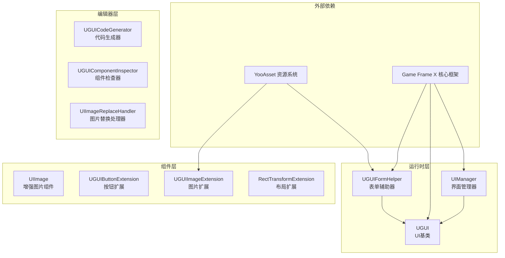
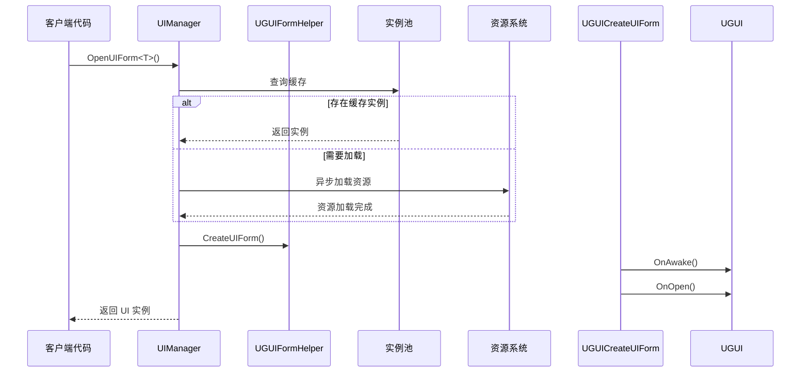

# プラグイン介绍

Game Frame X UGUI コンポーネント是 Unity UI 機能パッケージ，提供 UGUI コンポーネント的カプセル化，使 UGUI コンポーネント的使用更加シンプル効率的。该プラグイン是 Game Frame X 游戏开发フレームワーク的コア组成部分，专门针对 Unity 的 UGUI 系统进行了深度最適化和機能拡張。

## 概要

Game Frame X UGUI プラグイン旨在为 Unity 游戏開発者提供一套完全な、効率的、可拡張的 UI 解決策。该プラグイン通过カプセル化 Unity 原生的 UGUI 系统，提供します更加便捷的 API 呼び出し方法，同時に内置了強力的コード生成器，〜できます显著提升 UI 开发效率。

作为 Game Frame X フレームワーク的一部分，本プラグイン依赖于コアフレームワーク（`com.gameframex.unity`）、UI 基本パッケージ（`com.gameframex.unity.ui`）、リソース管理パッケージ（`com.gameframex.unity.asset`）和イベント系统（`com.gameframex.unity.event`）。通过モジュール化的設計，開発者〜できます根据〜する必要があります选择性使用プラグイン的各个機能モジュール。

本プラグインサポート Unity 2019.4 及以上バージョン，采用 MIT 许可证与 Apache License 2.0 双许可证分发。

## コアアーキテクチャ



### アーキテクチャ层次説明

**ランタイム层**パッケージ含プラグイン的コア业务逻辑：

- **UIManager**：负责 UI 界面的打开、閉じる和ライフサイクル管理，サポート界面インスタンス池和自动回收机制
- **UGUI**：抽象 UI 基底クラス，提供 UI 显示ステータス控制、界面显示/隐藏动画サポート
- **UGUIFormHelper**：UI 表单辅助器，処理 UI インスタンス化和作成，サポート通过特性設定 UI 分组和动画

**コンポーネント層**提供拡張機能：

- **UIImage**：継承自 Unity 的 Image コンポーネント，サポート通过リソースパス非同期ロード图标
- **拡張メソッド**：含みますボタン拡張、图片拡張和 RectTransform 拡張，簡素化常见操作

**エディタ层**提供开发效率工具：

- **UGUICodeGenerator**：根据 UGUI 预制体自动生成コード
- **UGUIComponentInspector**：在エディタ中可视化確認コンポーネントプロパティ
- **UIImageReplaceHandler**：批量処理图片リソース置換

## 主な特性

### UGUI コンポーネントカプセル化

プラグイン对 Unity 原生 UGUI コンポーネント进行了高级カプセル化，提供します更加面向对象的インターフェース設計。開発者无需直接操作 Unity 的 GameObject 和 Component，而是通过継承 `UGUI` 基底クラス来作成自己的 UI 界面，享受統一された的ライフサイクル管理和イベントコールバック机制。

```csharp
using GameFrameX.UI.UGUI.Runtime;
using UnityEngine;

public class MainMenuUI : UGUI
{
    protected override void OnInit(object userData)
    {
        base.OnInit(userData);
        // 初始化 UI 逻辑
    }
    
    protected override void OnOpen(object userData)
    {
        base.OnOpen(userData);
        // UI 打开时的逻辑
    }
    
    protected override void OnClose(bool isShutdown, object userData)
    {
        base.OnClose(isShutdown, userData);
        // UI 关闭时的逻辑
    }
}
```
> Source: [README.md](https://github.com/GameFrameX/com.gameframex.unity.ui.ugui/blob/main/README.md#L78-L101)

### UI マネージャー

`UIManager` 是整个プラグイン的コアマネージャー，负责処理 UI 界面的完全なライフサイクル。它継承自 `BaseUIManager`，提供します界面ロード、缓存、回收等完全な機能。通过インスタンス池技术，〜できます有效减少界面频繁作成破棄带来的性能开销。



### コード生成器

エディタ工具 `UGUICodeGenerator` 〜できます大幅提升 UI 开发效率。開発者只需在 Unity エディタ中作成一个 UGUI 预制体，选中后右键选择 `GameObject/UI/Generate UGUI Code(生成UGUI代码)` メニュー项，つまり可自动生成对应的 C# コードファイル。

生成的コードパッケージ含：
- 所有子コンポーネント的シリアライズフィールド参照
- ボタン点击イベント绑定メソッド
- コンポーネント取得完成的コールバックメソッド

### 拡張メソッド

プラグイン提供します丰富的拡張メソッド，簡素化日常 UI 开发工作：

**ボタン拡張** - 簡素化イベント绑定：
```csharp
startButton.onClick.Add(OnStartButtonClick);
startButton.onClick.Clear();
startButton.onClick.Set(OnClickHandler);
```
> Source: [UGUIButtonExtension.cs](https://github.com/GameFrameX/com.gameframex.unity.ui.ugui/blob/main/Runtime/UGUIButtonExtension.cs#L52-L101)

**图片拡張** - 异步图标ロード：
```csharp
iconImage.SetIconAsync("UI/Icons/StartIcon");
```
> Source: [UGUIImageExtension.cs](https://github.com/GameFrameX/com.gameframex.unity.ui.ugui/blob/main/Runtime/UGUIImageExtension.cs#L56-L74)

**布局拡張** - 全屏設定：
```csharp
panel.MakeFullScreen();
```
> Source: [RectTransformExtension.cs](https://github.com/GameFrameX/com.gameframex.unity.ui.ugui/blob/main/Runtime/RectTransformExtension.cs#L56-L62)

## 依赖关系

本プラグイン依赖以下 Game Frame X コンポーネント：

| 依赖パッケージ | 最低バージョン | 説明 |
|--------|----------|------|
| com.gameframex.unity | 1.1.1 | コアフレームワーク，提供基本服务 |
| com.gameframex.unity.ui | 1.0.0 | UI 基本パッケージ，定義 UIForm インターフェース |
| com.gameframex.unity.asset | 1.0.6 | リソース管理系统 |
| com.gameframex.unity.event | 1.0.0 | イベント系统 |

## クイックスタート

### 基本使用フロー

1. **作成 UI 界面类**：継承 `UGUI` 基底クラス，実装ライフサイクルメソッド
2. **設定 UI 预制体**：在预制体上追加継承自 `UGUI` 的コンポーネント
3. **通过マネージャー打开界面**：使用 `UIManager` 打开/閉じる界面

```csharp
// 打开界面
var mainMenu = await UIManager.Instance.OpenUIForm<MainMenuUI>("UI/");

// 关闭界面
UIManager.Instance.CloseUIForm(mainMenu);
```

### 使用 UIImage コンポーネント

`UIImage` コンポーネントサポート通过設定 `icon` プロパティ非同期ロード图片リソース：

```csharp
public class IconDisplay : MonoBehaviour
{
    [SerializeField] private UIImage iconImage;
    
    void Start()
    {
        // 设置图标，支持异步加载
        iconImage.icon = "UI/Icons/PlayerAvatar";
    }
}
```
> Source: [README.md](https://github.com/GameFrameX/com.gameframex.unity.ui.ugui/blob/main/README.md#L143-L156)

## 関連リンク

- [機能特性](./1-overview.features) - 詳細機能列表
- [依赖要求](./2-installation.dependencies) - 依赖项详情
- [インストール方法](./2-installation.methods) - インストール設定ガイド
- [作成UI界面](./3-getting-started.create-ui) - UI 作成教程
- [コード生成器](./3-getting-started.code-generator) - コード生成器使用
- [UGUI基底クラス](./4-core-concepts.ugui-base) - UGUI 基底クラス详解
- [UIマネージャー](./4-core-concepts.ui-manager) - マネージャー API リファレンス
- [表单辅助器](./4-core-concepts.form-helper) - 辅助器详解
- [UIImageコンポーネント](./5-components.uiimage) - 增强图片コンポーネント
- [拡張メソッド](./5-components.extensions) - 拡張メソッド API
- [コード生成器工具](./6-editor-tools.code-generator) - エディタ工具
- [コンポーネント確認器](./6-editor-tools.inspector) - 確認器説明
- [图片置換処理器](./6-editor-tools.image-replace) - リソース処理工具
- [設定説明](./7-configuration) - フレームワーク設定
- [常见問題](./8-troubleshooting) - FAQ 疑难解答
- [官方ドキュメント](https://gameframex.doc.alianblank.com)
- [GitHub リポジトリ](https://github.com/GameFrameX/com.gameframex.unity.ui.ugui)
