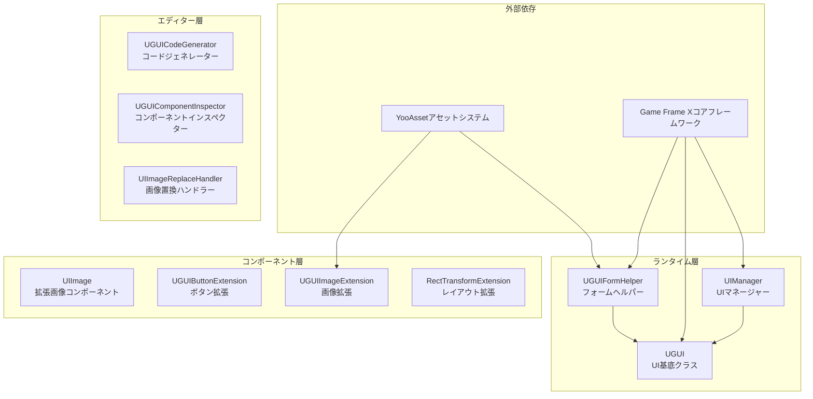
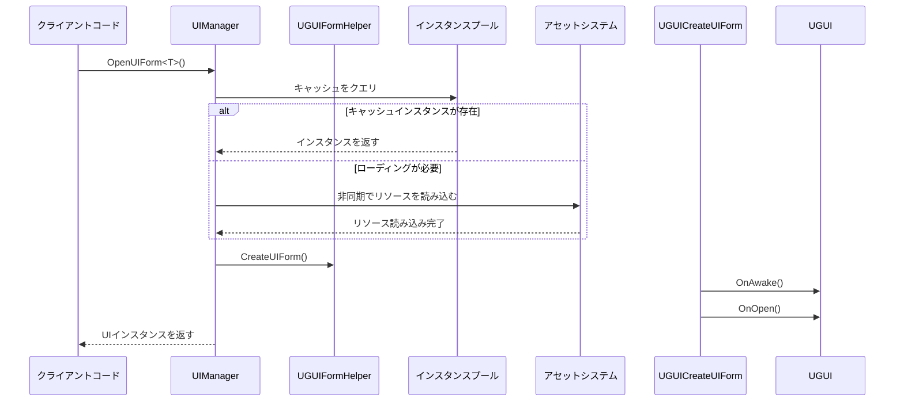

# はじめに

Game Frame X UGUIコンポーネントは、Unity UI機能パッケージであり、UGUIコンポーネントのラッパー機能を提供します。このプラグインはGame Frame Xゲーム開発フレームワークのコアコンポーネントであり、UnityのUGUIシステムに対して深い最適化と機能拡張を行っています。

## 概要

Game Frame X UGUIプラグインは、Unityゲーム開発者向けに完全で効率的かつ拡張可能なUIソリューションを提供します。このプラグインはUnityのネイティブUGUIシステムをラップし、より便捷なAPI呼び出し方法を提供すると同時に、強力なコードジェネレーターを内蔵しており、UI開発効率を大幅に向上させます。

Game Frame Xフレームワークの一部として、このプラグインはコアフレームワーク（`com.gameframex.unity`）、UIベースパッケージ（`com.gameframex.unity.ui`）、アセット管理パッケージ（`com.gameframex.unity.asset`）、イベントシステム（`com.gameframex.unity.event`）に依存しています。モジュラーデザインにより、開発者は必要に応じてプラグインの各機能モジュールを選択的に使用できます。

このプラグインはUnity 2019.4以上をサポートし、MITライセンスとApache License 2.0の二重ライセンスで配布されています。

## コアアーキテクチャ



### アーキテクチャ層の説明

**ランタイム層**にはプラグインのコアビジネスロジックが含まれます：

- **UIManager**：UI画面を開く、閉じる、ライフサイクル管理を担当し、画面インスタンスプールと自動回収メカニズムをサポート
- **UGUI**：抽象的なUI基底クラスで、UI表示状態制御、画面表示/非表示アニメーションサポートを提供
- **UGUIFormHelper**：UIフォームヘルパーで、UIインスタンス化と作成を担当し、属性設定でUIグループとアニメーションを設定可能

**コンポーネント層**は拡張機能を提供します：

- **UIImage**：UnityのImageコンポーネントを継承し、アセットパスから非同期でアイコンを読み込む機能をサポート
- **拡張メソッド**：ボタン拡張、画像拡張、RectTransform拡張を含み、一般的な操作を簡素化

**エディター層**は開発効率ツールを提供します：

- **UGUICodeGenerator**：UGUIプレハブに基づいてコードを自動生成
- **UGUIComponentInspector**：エディターでコンポーネントプロパティを可視的に検査
- **UIImageReplaceHandler**：画像リソースの一括置換を処理

## 主な機能

### UGUIコンポーネントラッパー

プラグインはUnityのネイティブUGUIコンポーネントに対して高度なラッパーを提供し、よりオブジェクト指向的なインターフェース設計を提供します。開発者はUnityのGameObjectとComponentを直接操作する必要がなく、`UGUI`基底クラスを継承して独自のUI画面を作成し、統一されたライフサイクル管理与、イベントコールバックメカニズムを利用できます。

```csharp
using GameFrameX.UI.UGUI.Runtime;
using UnityEngine;

public class MainMenuUI : UGUI
{
    protected override void OnInit(object userData)
    {
        base.OnInit(userData);
        // UIロジックを初期化
    }

    protected override void OnOpen(object userData)
    {
        base.OnOpen(userData);
        // UIが開いた時のロジック
    }

    protected override void OnClose(bool isShutdown, object userData)
    {
        base.OnClose(isShutdown, userData);
        // UIが閉じた時のロジック
    }
}
```
> Source: [README.md](https://github.com/GameFrameX/com.gameframex.unity.ui.ugui/blob/main/README.md#L78-L101)

### UIマネージャー

`UIManager`はプラグイン全体のコアマネージャーであり、UI画面の完全なライフサイクルを処理します。`BaseUIManager`を継承し、画面読み込み、キャッシュ、回収などの完全な機能を提供します。インスタンスプール技術を通じて、画面の作成と破棄によるパフォーマンスオーバーヘッドを効果的に削減できます。



### コードジェネレーター

エディター機能の`UGUICodeGenerator`はUI開発効率を大幅に向上させます。開発者はUnityエディターでUGUIプレハブを作成するだけでよく、選択後に右クリックで`GameObject/UI/Generate UGUI Code(UGUIコードを生成)`メニュー項目を選択すると、対応するC#コードファイルが自動的に生成されます。

生成されるコードには以下が含まれます：
- すべての子コンポーネントのシリアライズフィールド参照
- ボタンクリックイベントバインディングメソッド
- コンポーネント取得完了のコールバックメソッド

### 拡張メソッド

プラグインは日常的なUI開発作業を簡素化する豊富な拡張メソッドを提供します：

**ボタン拡張** - イベントバインディングを簡素化：
```csharp
startButton.onClick.Add(OnStartButtonClick);
startButton.onClick.Clear();
startButton.onClick.Set(OnClickHandler);
```
> Source: [UGUIButtonExtension.cs](https://github.com/GameFrameX/com.gameframex.unity.ui.ugui/blob/main/Runtime/UGUIButtonExtension.cs#L52-L101)

**画像拡張** - 非同期アイコン読み込み：
```csharp
iconImage.SetIconAsync("UI/Icons/StartIcon");
```
> Source: [UGUIImageExtension.cs](https://github.com/GameFrameX/com.gameframex.unity.ui.ugui/blob/main/Runtime/UGUIImageExtension.cs#L56-L74)

**レイアウト拡張** - フルスクリーン設定：
```csharp
panel.MakeFullScreen();
```
> Source: [RectTransformExtension.cs](https://github.com/GameFrameX/com.gameframex.unity.ui.ugui/blob/main/Runtime/RectTransformExtension.cs#L56-L62)

## 依存関係

このプラグインは次のGame Frame Xコンポーネントに依存します：

| 依存パッケージ | 最小バージョン | 説明 |
|--------|----------|------|
| com.gameframex.unity | 1.1.1 | コアフレームワーク、基本サービスを提供 |
| com.gameframex.unity.ui | 1.0.0 | UIベースパッケージ、UIFormインターフェースを定義 |
| com.gameframex.unity.asset | 1.0.6 | アセット管理系统 |
| com.gameframex.unity.event | 1.0.0 | イベントシステム |

## クイックスタート

### 基本的な使用フロー

1. **UI画面クラスを作成**：`UGUI`基底クラスを継承し、ライフサイクルメソッドを実装
2. **UIプレハブを設定**：プレハブに`UGUI`を継承するコンポーネントを追加
3. **マネージャーを通じて画面を開く**：マネージャーを使って画面を開く/閉じる

```csharp
// 画面を開く
var mainMenu = await UIManager.Instance.OpenUIForm<MainMenuUI>("UI/");

// 画面を閉じる
UIManager.Instance.CloseUIForm(mainMenu);
```

### UIImageコンポーネントの使用

`UIImage`コンポーネントは`icon`プロパティを設定することで、非同期で画像リソースを読み込むことをサポートしています：

```csharp
public class IconDisplay : MonoBehaviour
{
    [SerializeField] private UIImage iconImage;

    void Start()
    {
        // アイコンを設定、非同期読み込みをサポート
        iconImage.icon = "UI/Icons/PlayerAvatar";
    }
}
```
> Source: [README.md](https://github.com/GameFrameX/com.gameframex.unity.ui.ugui/blob/main/README.md#L143-L156)

## 関連リンク

- [機能一覧](./1-overview.features) - 詳細機能一覧
- [依存要件](./2-installation.dependencies) - 依存項目の詳細
- [インストール方法](./2-installation.methods) - インストール設定ガイド
- [UI画面作成](./3-getting-started.create-ui) - UI作成チュートリアル
- [コードジェネレーター](./3-getting-started.code-generator) - コードジェネレーターの使用
- [UGUI基底クラス](./4-core-concepts.ugui-base) - UGUI基底クラスの詳細
- [UIマネージャー](./4-core-concepts.ui-manager) - マネージャーAPIリファレンス
- [フォームヘルパー](./4-core-concepts.form-helper) - ヘルパーの詳細
- [UIImageコンポーネント](./5-components.uiimage) - 拡張画像コンポーネント
- [拡張メソッド](./5-components.extensions) - 拡張メソッドAPI
- [コードジェネレーター機能](./6-editor-tools.code-generator) - エディター機能
- [コンポーネントインスペクター](./6-editor-tools.inspector) - インスペクターの説明
- [画像置換ハンドラー](./6-editor-tools.image-replace) - リソース処理機能
- [設定説明](./7-configuration) - フレームワーク設定
- [FAQ](./8-troubleshooting) - よくある質問
- [公式ドキュメント](https://gameframex.doc.alianblank.com)
- [GitHubリポジトリ](https://github.com/GameFrameX/com.gameframex.unity.ui.ugui)