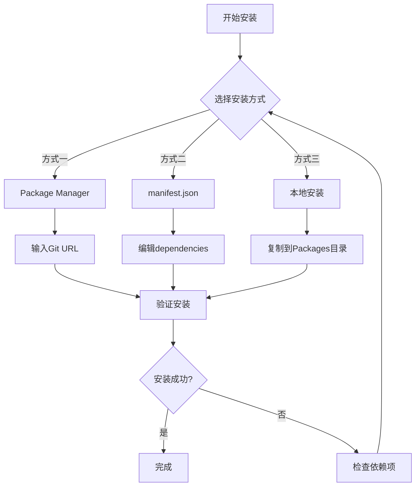
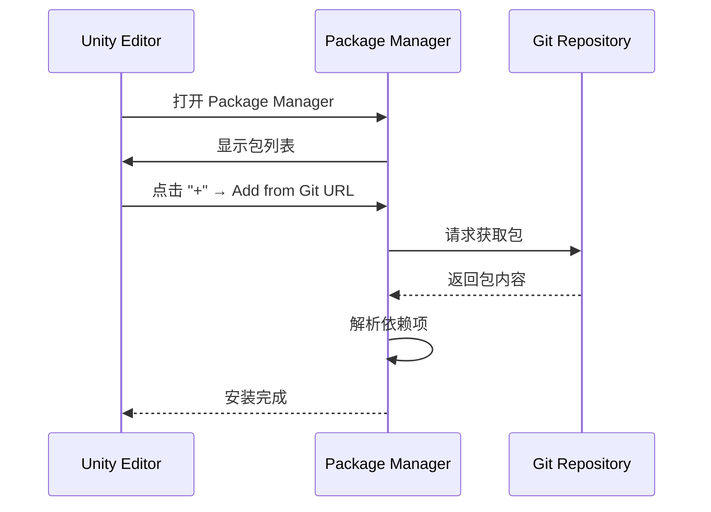

# インストールメソッド

このドキュメント介绍 Game Frame X UI UGUI パッケージ的多种インストールメソッド，帮助開発者根据プロジェクト需求选择最适合的インストール方法。

## 概要

Game Frame X UI UGUI 是 Unity UGUI 的增强コンポーネント库，提供します UI マネージャー、コード生成器、拡張メソッド等機能モジュール。该パッケージ遵循 Unity Package Manager (UPM) 標準，サポート多种インストール方法。

**パッケージ基本情報：**
- パッケージ名：`com.gameframex.unity.ui.ugui`
- 当前バージョン：2.3.6
- Unity バージョン要求：2019.4+
- Git リポジトリ：https://github.com/GameFrameX/com.gameframex.unity.ui.ugui.git

## インストールフロー概览



## 前置依赖项

在インストール本パッケージ之前，〜する必要があります確認してください以下依赖パッケージ已正确インストール：

| 依赖パッケージ | バージョン要求 | 説明 |
|--------|----------|------|
| com.gameframex.unity | 1.1.1 | コアフレームワーク |
| com.gameframex.unity.ui | 1.0.0 | UI基本パッケージ |
| com.gameframex.unity.asset | 1.0.6 | リソース管理 |
| com.gameframex.unity.event | 1.0.0 | イベント系统 |

> **注意**：上述依赖パッケージ会在インストール本パッケージ时自动尝试解析，もし依赖项インストール失敗，请リファレンス [依赖要求](./2-installation.dependencies) ドキュメント进行手动処理。

## インストールメソッド

### 方法一：Package Manager（推奨）

使用 Unity 的 Package Manager 通过 Git URL インストール是官方推奨的方法，具有以下优点：
- 自动バージョン管理
- 依赖自动解析
- 便于アップデート到最新バージョン

**操作ステップ：**

1. 打开 Unity エディタ
2. ナビゲーション到 `Window` → `Package Manager`（ウィンドウ → パッケージマネージャー）
3. 在パッケージマネージャー左上角点击 **+** ボタン
4. 选择 **Add package from git URL**（从 Git URL 追加パッケージ）
5. 在输入框中粘贴以下地址：
   ```
   https://github.com/GameFrameX/com.gameframex.unity.ui.ugui.git
   ```
6. 点击 **Add**（追加）ボタン等待インストール完成



### 方法二：直接编辑 manifest.json

这种方法适合〜する必要があります锁定特定バージョン或在没有网络環境的情况下进行开发。

**操作ステップ：**

1. 找到プロジェクト中的 `Packages/manifest.json` ファイル
2. 使用文本エディタ打开该ファイル
3. 在 `dependencies` 节点下追加以下内容：

```json
{
  "dependencies": {
    "com.gameframex.unity.ui.ugui": "https://github.com/GameFrameX/com.gameframex.unity.ui.ugui.git",
    "com.gameframex.unity": "1.1.1",
    "com.gameframex.unity.ui": "1.0.0",
    "com.gameframex.unity.asset": "1.0.6",
    "com.gameframex.unity.event": "1.0.0"
  }
}
```

> Source: [README.md](https://github.com/GameFrameX/com.gameframex.unity.ui.ugui/blob/main/README.md#L66-L69)

4. 保存ファイル并返す Unity エディタ
5. 等待 Unity 自动重新导入パッケージ

**バージョン锁定方法：**

もし〜する必要がありますインストール特定バージョン，〜できます使用 Git 的バージョン标签：

```json
{
  "dependencies": {
    "com.gameframex.unity.ui.ugui": "https://github.com/GameFrameX/com.gameframex.unity.ui.ugui.git#2.3.6"
  }
}
```

### 方法三：本地インストール

適しています无法访问外网或〜する必要があります离线开发的シーン。

**操作ステップ：**

1. 克隆或下载 Git リポジトリ：
   ```
   https://github.com/GameFrameX/com.gameframex.unity.ui.ugui.git
   ```
2. 将リポジトリファイル夹复制到 Unity プロジェクト的 `Packages` ディレクトリ下
3. Unity 会自动识别并ロード该パッケージ

> Source: [README.md](https://github.com/GameFrameX/com.gameframex.unity.ui.ugui/blob/main/README.md#L71-L72)

**ディレクトリ结构要求：**

```
YourUnityProject/
└── Packages/
    └── com.gameframex.unity.ui.ugui/    ← 包根目录
        ├── package.json                  ← 必须
        ├── Runtime/                      ← 运行时程序集
        │   └── GameFrameX.UI.UGUI.Runtime.asmdef
        ├── Editor/                       ← 编辑器程序集
        │   └── GameFrameX.UI.UGUI.Editor.asmdef
        └── ...
```

## インストールの確認

インストール完成后，〜できます通过以下方法検証是否成功：

### メソッド一：確認 Package Manager

在 Package Manager ウィンドウ中検索 `Game Frame X UI UGUI`，確認パッケージ已显示在列表中。

### メソッド二：確認アセンブリ

在 Unity プロジェクト中確認以下アセンブリ已正确ロード：
- `GameFrameX.UI.UGUI.Runtime`
- `GameFrameX.UI.UGUI.Editor`

### メソッド三：作成テスト脚本

作成一个シンプル的テスト脚本検証名前空間可用：

```csharp
using GameFrameX.UI.UGUI.Runtime;

public class InstallationTest : MonoBehaviour
{
    void Start()
    {
        Debug.Log("Game Frame X UI UGUI 安装成功！");
    }
}
```

> Source: [README.md](https://github.com/GameFrameX/com.gameframex.unity.ui.ugui/blob/main/README.md#L78-L102)

## よくある問題

### Q1: インストール后出现依赖项エラー

**原因**：依赖的パッケージバージョン不兼容或未インストール

**解決策**：
1. 打开 `Window` → `Package Manager`
2. 確認所有依赖パッケージ是否已正确インストール
3. リファレンス [依赖要求](./2-installation.dependencies) 手动インストール缺失的依赖

### Q2: 无法从 Git URL インストール

**原因**：网络問題或 Git 凭证設定不正确

**解決策**：
1. 確認网络〜できます访问 GitHub
2. 尝试使用本地インストール方法
3. 設定 Git 凭证マネージャー

### Q3: バージョン号后缀 ".git" 是什么意味

这是 Git リポジトリ的 URL 后缀，表示从远程リポジトリ拉取コード。使用此フォーマット时，Unity 会自动拉取最新バージョン。もし〜する必要があります特定バージョン，请使用 `#version` フォーマット指定バージョン标签。

## 関連リンク

- [依赖要求](./2-installation.dependencies) - 詳細的依赖项説明
- [官方ドキュメント](https://gameframex.doc.alianblank.com)
- [GitHub リポジトリ](https://github.com/GameFrameX/com.gameframex.unity.ui.ugui)
- [快速开始](../3-getting-started.create-ui)
- [コアコンセプト](../4-core-concepts.ugui-base)
