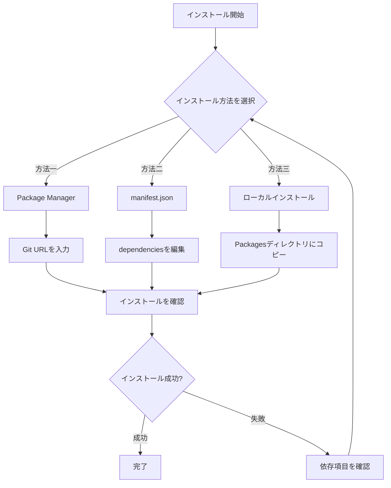
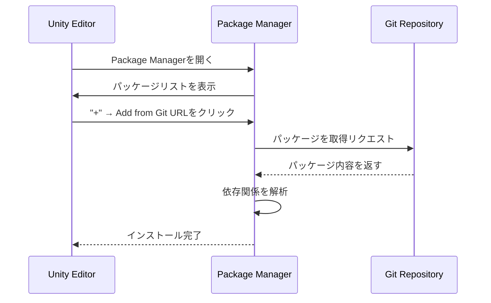

# インストール方法

本文書はGame Frame X UI UGUIパッケージの複数のインストール方法を介紹し、開発者がプロジェクトニーズに基づいて最も適したインストール方法を選択できるようにします。

## 概要

Game Frame X UI UGUIは、Unity UGUIの拡張コンポーネントライブラリであり、UIマネージャー、コードジェネレーター、拡張メソッドなどの機能モジュールを提供します。このパッケージはUnity Package Manager (UPM)標準に従い、複数のインストール方法をサポートしています。

**パッケージ基本情報：**
- パッケージ名：`com.gameframex.unity.ui.ugui`
- 現在のバージョン：2.3.6
- Unityバージョン要件：2019.4以上
- Gitリポジトリ：https://github.com/GameFrameX/com.gameframex.unity.ui.ugui.git

## インストールフロー概要



## 事前依存項目

このパッケージをインストールする前に、以下の依存パッケージが正しくインストールされていることを確認してください：

| 依存パッケージ | バージョン要件 | 説明 |
|--------|----------|------|
| com.gameframex.unity | 1.1.1 | コアフレームワーク |
| com.gameframex.unity.ui | 1.0.0 | UIベースパッケージ |
| com.gameframex.unity.asset | 1.0.6 | アセット管理 |
| com.gameframex.unity.event | 1.0.0 | イベントシステム |

> **注意**：上記の依存パッケージは、このパッケージのインストール時に自動解決を試みます。依存項目のインストールに失敗した場合は、[依存要件](./2-installation.dependencies)文書を参照して手動で処理してください。

## インストール方法

### 方法一：Package Manager（推奨）

UnityのPackage Managerを使用してGit URLからインストールすることは、公式推奨の方法であり、以下の利点があります：
- 自動バージョン管理
- 依存関係の自動解決
- 最新バージョンへの更新が容易

**操作手順：**

1. Unityエディターを開く
2. `Window` → `Package Manager`（ウィンドウ → パッケージマネージャー）に移動
3. パッケージマネージャーの左上にある **+** ボタンをクリック
4. **Add package from git URL**（Git URLからパッケージを追加）を選択
5. 入力欄に以下のアドレスを貼り付け：
   ```
   https://github.com/GameFrameX/com.gameframex.unity.ui.ugui.git
   ```
6. **Add**（追加）ボタンをクリックしてインストールが完了するまで待つ



### 方法二：直接manifest.jsonを編集

この方法は、特定バージョンを固定したり、ネットワーク環境がない状況で開発する場合に適しています。

**操作手順：**

1. プロジェクトの`Packages/manifest.json`ファイルを見つける
2. テキストエディターでそのファイルを開く
3. `dependencies`ノードに以下の内容を追加：

```json
{
  "dependencies": {
    "com.gameframex.unity.ui.ugui": "https://github.com/GameFrameX/com.gameframex.unity.ui.ugui.git",
    "com.gameframex.unity": "1.1.1",
    "com.gameframex.unity.ui": "1.0.0",
    "com.gameframex.unity.asset": "1.0.6",
    "com.gameframex.unity.event": "1.0.0"
  }
}
```

> Source: [README.md](https://github.com/GameFrameX/com.gameframex.unity.ui.ugui/blob/main/README.md#L66-L69)

4. ファイルを保存してUnityエディターに戻る
5. Unityがパッケージを自動再インポートするのを待つ

**バージョン固定方法：**

特定バージョンをインストールする必要がある場合は、Gitのバージョンタグを使用できます：

```json
{
  "dependencies": {
    "com.gameframex.unity.ui.ugui": "https://github.com/GameFrameX/com.gameframex.unity.ui.ugui.git#2.3.6"
  }
}
```

### 方法三：ローカルインストール

外部ネットワークにアクセスできない、またはオフライン開発が必要なシーンに適しています。

**操作手順：**

1. Gitリポジトリをクローンまたはダウンロード：
   ```
   https://github.com/GameFrameX/com.gameframex.unity.ui.ugui.git
   ```
2. リポジトリフォルダをUnityプロジェクトの`Packages`ディレクトリ下にコピー
3. Unityが自動的にパッケージを認識してロード

> Source: [README.md](https://github.com/GameFrameX/com.gameframex.unity.ui.ugui/blob/main/README.md#L71-L72)

**ディレクトリ構造の要件：**

```
YourUnityProject/
└── Packages/
    └── com.gameframex.unity.ui.ugui/    ← パッケージルートディレクトリ
        ├── package.json                  ← 必須
        ├── Runtime/                      ← ランタイムアセンブリ
        │   └── GameFrameX.UI.UGUI.Runtime.asmdef
        ├── Editor/                       ← エディターアセンブリ
        │   └── GameFrameX.UI.UGUI.Editor.asmdef
        └── ...
```

## インストール確認

インストール完了後、以下の方法で成功したか確認できます：

### 方法一：Package Managerを確認

Package Managerウィンドウで`Game Frame X UI UGUI`を検索し、パッケージがリストに表示されていることを確認します。

### 方法二：アセンブリを確認

Unityプロジェクトで以下のアセンブリが正しくロードされていることを確認：
- `GameFrameX.UI.UGUI.Runtime`
- `GameFrameX.UI.UGUI.Editor`

### 方法三：テストスクリプトを作成

シンプルなテストスクリプトを作成して、名前空間が使用可能か確認：

```csharp
using GameFrameX.UI.UGUI.Runtime;

public class InstallationTest : MonoBehaviour
{
    void Start()
    {
        Debug.Log("Game Frame X UI UGUI インストール成功！");
    }
}
```

> Source: [README.md](https://github.com/GameFrameX/com.gameframex.unity.ui.ugui/blob/main/README.md#L78-L102)

## よくある質問

### Q1: インストール後に依存関係エラーが発生する

**原因**：依存パッケージのバージョンが互換性がないか、インストールされていない

**解決策**：
1. `Window` → `Package Manager`を開く
2. すべての依存パッケージが正しくインストールされているか確認
3. [依存要件](./2-installation.dependencies)を参照して、不足している依存を手動でインストール

### Q2: Git URLからインストールできない

**原因**：ネットワーク問題またはGit認証情報設定が正しくない

**解決策**：
1. ネットワークがGitHubにアクセスできるか確認
2. ローカルインストール方法を試す
3. Git認証マネージャーを設定

### Q3: バージョン番号の接尾辞 ".git" の意味

これはGitリポジトリのURL接尾辞であり、リモートリポジトリからコードを取得することを意味します。この形式を使用すると、Unityは最新バージョンを自動的に取得します。特定バージョンが必要な場合は、`#version`形式を使用してバージョンタグを指定してください。

## 関連リンク

- [依存要件](./2-installation.dependencies) - 詳細な依存項目の説明
- [公式ドキュメント](https://gameframex.doc.alianblank.com)
- [GitHubリポジトリ](https://github.com/GameFrameX/com.gameframex.unity.ui.ugui)
- [クイックスタート](../3-getting-started.create-ui)
- [コア概念](../4-core-concepts.ugui-base)