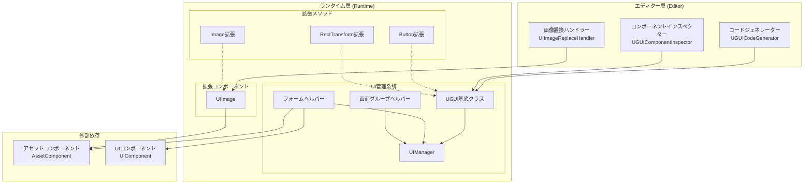
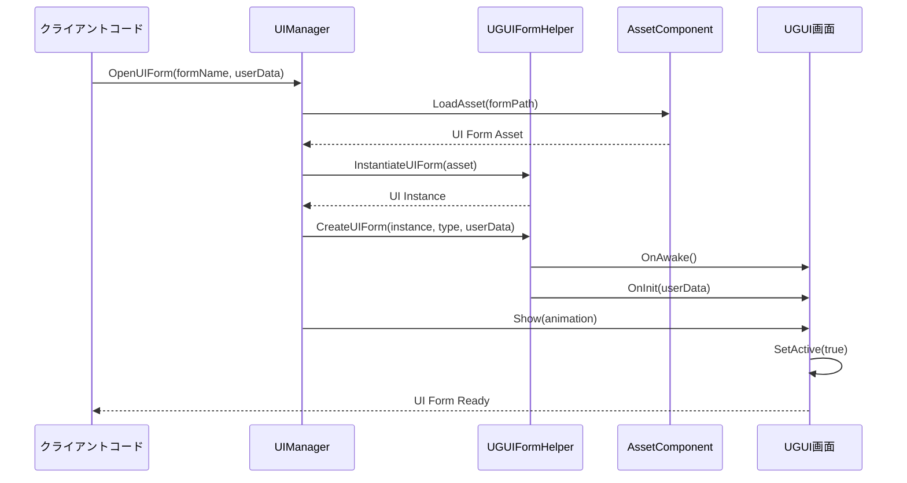
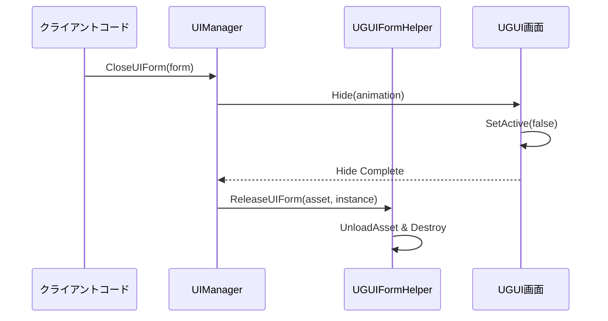

# 機能一覧

GameFrameX UGUIコンポーネントはUnity UI機能パッケージであり、Unity UGUIコンポーネントの高度なラッパーを提供します。このプラグインはGame Frame Xフレームワークとシームレスに統合され、完全なUI画面管理、コード生成、拡張メソッド機能を提供します。

## 概要

本プラグインはUnityゲーム開発向けに完全なUGUIソリューションを提供し、主に以下のコア機能モジュールを含みます：

- **UGUIコンポーネントラッパー**：Unity UGUIコンポーネントの高度なラッパーを提供し、UI開発フローを簡素化
- **UIマネージャー**：完全なUI画面管理系统で、画面を開く、閉じる、ライフサイクル管理を処理
- **コードジェネレーター**：UIプレハブからコードを自動生成し、開発効率を大幅に向上
- **拡張メソッド**：一般的なUGUIコンポーネントに豊富なチェーン式拡張メソッドを提供
- **フォームヘルパー**：UIフォーム作成と管理の補助ツール

これらの機能モジュールは相互に協力し、完全なUGUI開発ソリューションを構築します。プラグインはGame Frame Xフレームワークのアーキテクチャ仕様に準拠しており、フレームワークの他のコンポーネント（アセット管理、イベントシステムなど）とシームレスに統合できます。

## アーキテクチャ

プラグインは階層化アーキテクチャ設計を採用しており、主にランタイム層とエディター層に分かれています。ランタイム層にはUI管理のコアロジックと拡張機能が含まれ、エディター層には可視化開発ツールが提供されます。



### アーキテクチャ説明

**エディター層**は3つの主な開発ツールを提供します：コードジェネレーターはUIコードを自動生成し、コンポーネントインスペクターはInspectorパネルでUIコンポーネントを可视的に操作し、画像置換ハンドラーは標準のImageコンポーネントを拡張のUIImageコンポーネントに置換します。

**ランタイム層**はプラグインのコアであり、3つの主要な部分が含まれます：UI管理系统は画面のライフサイクル管理を担当し、拡張コンポーネントは機能拡張されたUI要素を提供し、拡張メソッドは一般的なUGUIコンポーネントに便捷な操作メソッドを追加します。

**外部依存**部分は、プラグインとGame Frame Xフレームワークの他のコンポーネントとの統合関係を示し、アセットコンポーネントとUIコンポーネントを含みます。

## コア機能の詳細

### UI管理系统

UI管理系统はプラグインのコアであり、ゲーム内のすべてのUI画面のライフサイクルを管理します。このシステムは4つの主要なクラスで構成されています：UGUIはすべてのUI画面の基底クラス、UIManagerは画面マネージャー、UGUIFormHelperはフォームヘルパー、UGUIUIGroupHelperは画面グループヘルパーです。

**UGUI基底クラス**はUIFormを継承し、UGUI固有の画面機能実装を提供します。画面の表示と非表示操作を処理し、オプションのアニメーション効果でユーザー体験を向上させ、 visibilité制御機能を提供します。

```csharp
public class MainMenuUI : UGUI
{
    protected override void OnInit(object userData)
    {
        base.OnInit(userData);
        // UIロジックを初期化
    }

    protected override void OnOpen(object userData)
    {
        base.OnOpen(userData);
        // UIが開いた時のロジック
    }

    protected override void OnClose(bool isShutdown, object userData)
    {
        base.OnClose(isShutdown, userData);
        // UIが閉じた時のロジック
    }
}
```
> Source: [README.md](https://github.com/GameFrameX/com.gameframex.unity.ui.ugui/blob/main/README.md#L78-L102)

**UIManager**は画面マネージャーの具体的な実装であり、BaseUIManagerを継承し、UIフォームの読み込み、キャッシュ、ライフサイクル管理を処理します。フレームワークのUIコンポーネントと緊密に統合され、统一された画面アクセスインターフェースを提供します。

**UGUIFormHelper**はデフォルトの画面ヘルパーであり、UIFormHelperBaseインターフェースを実装します。UIフォームのインスタンス化、作成、解放を処理します。画面を作成する際、自動的に画面グループ割り当て、アニメーション設定などの詳細を処理します。

**UGUIUIGroupHelper**は画面グループヘルパーであり、UIグループのレイヤーと階層構造を管理します。深度設定機能を提供し、異なる画面グループ間の正しいオーバーラップ関係を確保します。

### 拡張コンポーネント

**UIImage**はUnity標準Imageコンポーネントの拡張であり、アセットパスからの非同期アイコン読み込み機能を追加します。iconプロパティを設定すると、自動的にアセットシステムからテクスチャを読み込み、Spriteを作成します。

```csharp
[DisallowMultipleComponent]
public class UIImage : UnityEngine.UI.Image
{
    public string icon
    {
        get { return m_icon; }
        set
        {
            if (m_icon != value)
            {
                m_icon = value;
                _ = this.SetIconAsync(m_icon);
            }
        }
    }
}
```
> Source: [Runtime/UIImage.cs](https://github.com/GameFrameX/com.gameframex.unity.ui.ugui/blob/main/Runtime/UIImage.cs#L40-L72)

UIImageコンポーネントを使用すると、アイコン読み込みのコードを簡素化できます：

```csharp
public class IconDisplay : MonoBehaviour
{
    [SerializeField] private UIImage iconImage;

    void Start()
    {
        // アイコンを設定、非同期読み込みをサポート
        iconImage.icon = "UI/Icons/PlayerAvatar";
    }
}
```
> Source: [README.md](https://github.com/GameFrameX/com.gameframex.unity.ui.ugui/blob/main/README.md#L143-L156)

### 拡張メソッド

プラグインは、Button、Image、RectTransformコンポーネント向けに3つの主要な拡張メソッドクラスを提供します。

**UGUIButtonExtension**は、ボタンのクリックイベントに便捷な拡張メソッドを提供し、追加、削除、クリア、クリックイベント設定を含みます。

```csharp
public static class UGUIBOttonExtension
{
    // ボタンクリックイベントを追加
    public static void Add(this Button.ButtonClickedEvent self, UnityAction action);

    // ボタンクリックイベントを削除
    public static void Remove(this Button.ButtonClickedEvent self, UnityAction action);

    // ボタンクリックイベントをクリア
    public static void Clear(this Button.ButtonClickedEvent self);

    // ボタンクリックイベントを設定（既存のイベントを置換）
    public static void Set(this Button.ButtonClickedEvent self, UnityAction action);
}
```
> Source: [Runtime/UGUIButtonExtension.cs](https://github.com/GameFrameX/com.gameframex.unity.ui.ugui/blob/main/Runtime/UGUIButtonExtension.cs#L42-L101)

拡張メソッドの使用例：

```csharp
startButton.onClick.Add(OnStartButtonClick);
```
> Source: [README.md](https://github.com/GameFrameX/com.gameframex.unity.ui.ugui/blob/main/README.md#L119-L119)

**UGUIImageExtension**は非同期アイコン設定機能を提供し、アセットシステムを通じてテクスチャを読み込み、Spriteを作成します。

```csharp
public static class UGUIImageExtension
{
    public static async Task SetIconAsync(this UnityEngine.UI.Image self, string icon)
    {
        var assetComponent = GameEntry.GetComponent<AssetComponent>();
        using (var valueHandle = await assetComponent.LoadAssetAsync<Texture2D>(icon))
        {
            if (valueHandle.IsDone && valueHandle.Status == EOperationStatus.Succeed)
            {
                var texture2D = valueHandle.GetAssetObject<Texture2D>();
                self.sprite = Sprite.Create(texture2D, new Rect(0, 0, texture2D.width, texture2D.height), new Vector2(0.5f, 0.5f));
            }
        }
    }
}
```
> Source: [Runtime/UGUIImageExtension.cs](https://github.com/GameFrameX/com.gameframex.unity.ui.ugui/blob/main/Runtime/UGUIImageExtension.cs#L44-L74)

**RectTransformExtension**はMakeFullScreenメソッドを提供し、RectTransformをフルスクリーンに設定できます。

```csharp
public static class RectTransformExtension
{
    public static void MakeFullScreen(this RectTransform rectTransform)
    {
        rectTransform.anchorMin = Vector2.zero;
        rectTransform.anchorMax = Vector2.one;
        rectTransform.anchoredPosition = Vector2.zero;
        rectTransform.sizeDelta = Vector2.zero;
    }
}
```
> Source: [Runtime/RectTransformExtension.cs](https://github.com/GameFrameX/com.gameframex.unity.ui.ugui/blob/main/Runtime/RectTransformExtension.cs#L56-L62)

### エディター機能

プラグインは3つのエディター機能を提供し、開発効率を向上させます。

**UGUICodeGenerator**はUGUIコードジェネレーターであり、UIプレハブからコードを自動生成できます。メニュー項目の`GameObject/UI/Generate UGUI Code(UGUIコードを生成)`を通じてアクセスし、プレハブ内のすべてのUIコンポーネントを自動スキャンして対応するコードを生成します。

```csharp
[MenuItem("GameObject/UI/Generate UGUI Code(UGUIコードを生成)", false, 1)]
static void Code()
{
    // コード生成ロジック
}
```
> Source: [Editor/UGUICodeGenerator.cs](https://github.com/GameFrameX/com.gameframex.unity.ui.ugui/blob/main/Editor/UGUICodeGenerator.cs#L56-L73)

生成されるコードには以下の特性があります：

- すべてのUI子ノードを自動識別してプロパティ宣言を生成
- 各コントロールのpathsに`UGUIElementPropertyAttribute`を使用
- `InitView()`メソッドを生成して初期化バインディングを実行
- カスタム型変換プロセッサーをサポート

**UGUIComponentInspector**はUGUIコンポーネントのカスタムインスペクターであり、2つの主要な機能ボタンを提供します：「コード再生成」と「リスト再バインディング」。

```csharp
[CustomEditor(typeof(Runtime.UGUI), true)]
internal sealed class UGUIComponentInspector : GameFrameworkInspector
{
    public override void OnInspectorGUI()
    {
        //「コード再生成」と「リスト再バインディング」機能を提供
    }
}
```
> Source: [Editor/UGUIComponentInspector.cs](https://github.com/GameFrameX/com.gameframex.unity.ui.ugui/blob/main/Editor/UGUIComponentInspector.cs#L43-L153)

**UIImageReplaceHandler**は、標準ImageコンポーネントをUIImageコンポーネントに置換する機能を提供し、メニュー項目の`CONTEXT/Image/Replace To UIImage(UIImageに置換)`を通じてアクセスします。

```csharp
[MenuItem("CONTEXT/Image/Replace To UIImage(UIImageに置換)", false, 10)]
static void Run()
{
    // 置換ロジック、元のImageのすべてのプロパティを保持
}
```
> Source: [Editor/UIImageReplaceHandler.cs](https://github.com/GameFrameX/com.gameframex.unity.ui.ugui/blob/main/Editor/UIImageReplaceHandler.cs#L42-L76)

### プロパティ属性

**UGUIElementPropertyAttribute**は、プレハブ内のUIコントロールpathsをマークするために使用され、コードジェネレーターと組み合わせて使用します。

```csharp
public sealed class UGUIElementPropertyAttribute : Attribute
{
    public string Path { get; }

    public UGUIElementPropertyAttribute(string path)
    {
        Path = path;
    }
}
```
> Source: [Runtime/UGUIElementPropertyAttribute.cs](https://github.com/GameFrameX/com.gameframex.unity.ui.ugui/blob/main/Runtime/UGUIElementPropertyAttribute.cs#L40-L64)

## 画面を開く・閉じるフロー

UI画面はゲームで開くと閉じる特定のフローに従い、複数のコンポーネントの協力が関わります。



画面を閉じる必要がある場合、フローは以下の通りです：



## 使用例

### カスタムUI画面を作成

UGUI基底クラスを継承してカスタム画面を作成し、ライフサイクルメソッドをオーバーライドしてビジネスロジックを処理：

```csharp
using GameFrameX.UI.UGUI.Runtime;
using UnityEngine;

public class MainMenuUI : UGUI
{
    protected override void OnInit(object userData)
    {
        base.OnInit(userData);
        // UIロジックを初期化
    }

    protected override void OnOpen(object userData)
    {
        base.OnOpen(userData);
        // UIが開いた時のロジック
    }

    protected override void OnClose(bool isShutdown, object userData)
    {
        base.OnClose(isShutdown, userData);
        // UIが閉じた時のロジック
    }
}
```
> Source: [README.md](https://github.com/GameFrameX/com.gameframex.unity.ui.ugui/blob/main/README.md#L78-L102)

### 拡張メソッドを使用

MonoBehaviourで拡張メソッドを使用してUI操作を簡素化：

```csharp
using GameFrameX.UI.UGUI.Runtime;
using UnityEngine.UI;

public class UIController : MonoBehaviour
{
    [SerializeField] private Button startButton;
    [SerializeField] private Image iconImage;
    [SerializeField] private RectTransform panel;

    void Start()
    {
        // ボタン拡張メソッド
        startButton.onClick.Add(OnStartButtonClick);

        // 画像拡張メソッド
        iconImage.SetIcon("UI/Icons/StartIcon");

        // RectTransform拡張メソッド
        panel.MakeFullScreen();
    }

    private void OnStartButtonClick()
    {
        Debug.Log("Start button clicked!");
    }
}
```
> Source: [README.md](https://github.com/GameFrameX/com.gameframex.unity.ui.ugui/blob/main/README.md#L106-L133)

### コードジェネレーターを使用

1. HierarchyでUGUIプレハブを選択
2. 右クリックで`GameObject/UI/Generate UGUI Code(UGUIコードを生成)`を選択
3. コードは自動的に`Assets/Hotfix/UI/UGUI/`ディレクトリ下に生成

生成されるコード構造は以下の通りです：

```csharp
[DisallowMultipleComponent]
[OptionUIConfig(null, "Assets/Prefabs/UI")]
public sealed partial class MainMenuUI : UGUI
{
    public GameObject self { get; private set; }

    [SerializeField] [UGUIElementProperty("Background")]
    private UnityEngine.UI.Image m_Background;

    [SerializeField] [UGUIElementProperty("StartButton")]
    private UnityEngine.UI.Button m_StartButton;

    protected override void InitView()
    {
        if (_isInitView) return;
        _isInitView = true;
        this.self = this.gameObject;
        m_Background = gameObject.transform.FindChildName("Background").GetComponent<UnityEngine.UI.Image>();
        m_StartButton = gameObject.transform.FindChildName("StartButton").GetComponent<UnityEngine.UI.Button>();
    }
}
```
> Source: [Editor/UGUICodeGenerator.cs](https://github.com/GameFrameX/com.gameframex.unity.ui.ugui/blob/main/Editor/UGUICodeGenerator.cs#L199-L230)

## 関連リンク

- [プラグイン紹介](./1-overview.introduction) - プラグインの概要と設計理念を學習
- [インストール方法](./2-installation.methods) - プラグインのインストール手順を取得
- [UGUI基底クラス](./4-core-concepts.ugui-base) - UGUI基底クラスの詳細文書
- [UIマネージャー](./4-core-concepts.ui-manager) - UIマネージャーの詳細文書
- [フォームヘルパー](./4-core-concepts.form-helper) - フォームヘルパーの詳細文書
- [UIImageコンポーネント](./5-components.uiimage) - UIImageコンポーネントの詳細文書
- [拡張メソッド](./5-components.extensions) - 拡張メソッドの詳細文書
- [コードジェネレーター](./6-editor-tools.code-generator) - コードジェネレーターの詳細文書
- [コンポーネントインスペクター](./6-editor-tools.inspector) - コンポーネントインスペクターの詳細文書
- [画像置換ハンドラー](./6-editor-tools.image-replace) - 画像置換ハンドラーの詳細文書