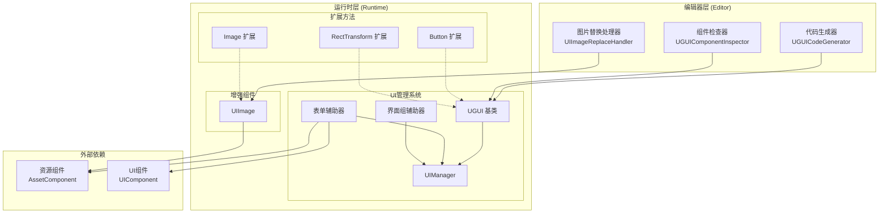
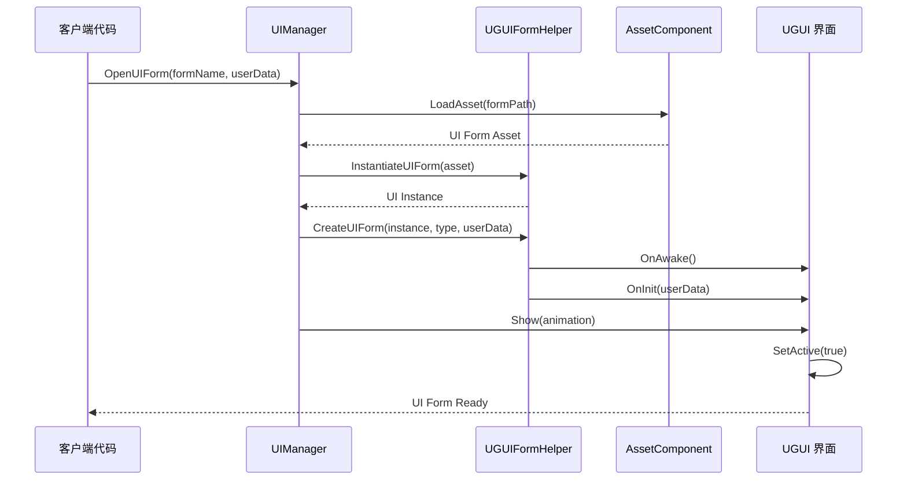
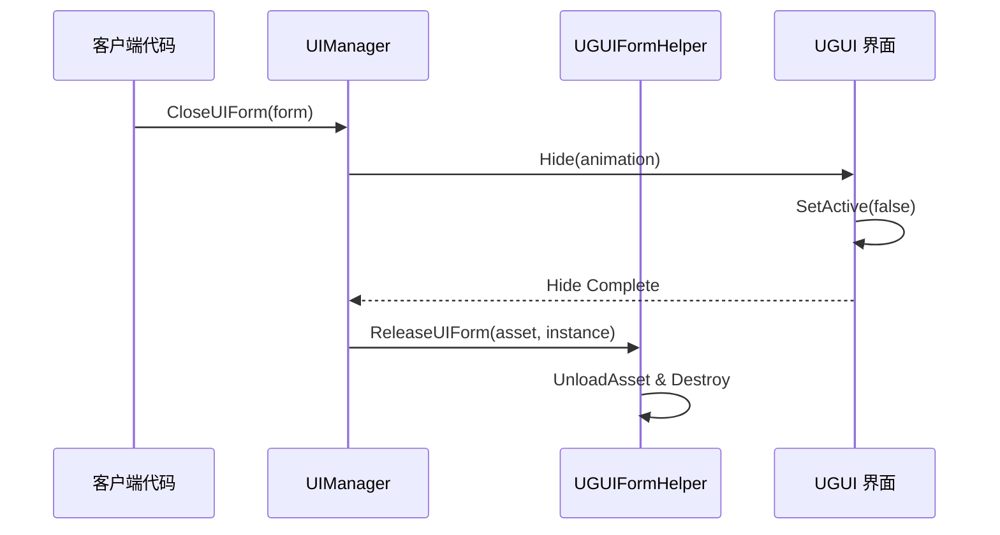

# 機能特性

GameFrameX UGUI コンポーネント是 Unity UI 機能パッケージ，提供对 Unity UGUI コンポーネント的高级カプセル化，使 UGUI コンポーネント的使用更加シンプル効率的。该プラグイン与 Game Frame X フレームワーク无缝集成，提供完全な的 UI 界面管理、コード生成和拡張メソッド機能。

## 概要

本プラグイン为 Unity 游戏开发提供します一套完全な的 UGUI 解決策，主な含みます以下几个コア機能モジュール：

- **UGUIコンポーネントカプセル化**：提供对 Unity UGUI コンポーネント的高级カプセル化，簡素化 UI 开发フロー
- **UIマネージャー**：完全な的 UI 界面管理系统，処理界面的打开、閉じる和ライフサイクル管理
- **コード生成器**：自动从 UI 预制体生成コード，大幅提高开发效率
- **拡張メソッド**：为常用 UGUI コンポーネント提供丰富的链式拡張メソッド
- **表单辅助器**：UI 表单作成和管理的辅助工具

这些機能モジュール相互协作，共同构成了一个完全な的 UGUI 开发解決策。プラグイン設計遵循 Game Frame X フレームワーク的アーキテクチャ规范，〜できます与フレームワーク的其他コンポーネント（如リソース管理、イベント系统）无缝集成。

## アーキテクチャ

プラグイン采用分层アーキテクチャ設計，主な分为ランタイム层和エディタ层。ランタイム层パッケージ含 UI 管理的コア逻辑和拡張機能，エディタ层提供可视化的开发工具。



### アーキテクチャ説明

**エディタ层** 提供します三个主な的开发工具：コード生成器用于自动生成 UI コード、コンポーネント確認器用于在 Inspector パネル中可视化操作 UI コンポーネント、图片置換処理器用于将標準 Image コンポーネント置換为增强的 UIImage コンポーネント。

**ランタイム层** 是プラグイン的コア，パッケージ含三个主な部分：UI 管理系统负责界面的ライフサイクル管理，增强コンポーネント提供します機能拡張的 UI 元素，拡張メソッド为常用的 UGUI コンポーネント追加了便捷的操作メソッド。

**外部依赖** 部分表示了プラグイン与 Game Frame X フレームワーク其他コンポーネント的集成关系，含みますリソースコンポーネント和 UI コンポーネント。

## コア機能详解

### UI 管理系统

UI 管理系统是プラグイン的コア，负责管理游戏中所有 UI 界面的ライフサイクル。该系统由四个主な类组成：UGUI 作为所有 UI 界面的基底クラス、UIManager 作为界面マネージャー、UGUIFormHelper 作为表单辅助器、UGUIUIGroupHelper 作为界面组辅助器。

**UGUI 基底クラス** 継承自 UIForm，提供します UGUI 特定的界面機能実装。它负责処理界面的显示和隐藏操作，通过可选的动画效果增强ユーザー体验，同時に提供可见性控制機能。

```csharp
public class MainMenuUI : UGUI
{
    protected override void OnInit(object userData)
    {
        base.OnInit(userData);
        // 初始化UI逻辑
    }
    
    protected override void OnOpen(object userData)
    {
        base.OnOpen(userData);
        // UI打开时的逻辑
    }
    
    protected override void OnClose(bool isShutdown, object userData)
    {
        base.OnClose(isShutdown, userData);
        // UI关闭时的逻辑
    }
}
```
> Source: [README.md](https://github.com/GameFrameX/com.gameframex.unity.ui.ugui/blob/main/README.md#L78-L102)

**UIManager** 是界面マネージャー的具体実装，継承自 BaseUIManager，负责処理 UI 表单的ロード、缓存和ライフサイクル管理。它与フレームワーク的 UI コンポーネント紧密集成，提供統一された的界面访问インターフェース。

**UGUIFormHelper** 是デフォルト的界面辅助器，実装了 UIFormHelperBase インターフェース。它负责処理 UI 表单的インスタンス化、作成和解放。在作成界面时，它会自动処理界面组分配、动画設定等细节。

**UGUIUIGroupHelper** 是界面组辅助器，管理 UI 组的层级和层次结构。它提供深度設定機能，確認してください不同界面组之间的正确遮挡关系。

### 增强コンポーネント

**UIImage** 是对 Unity 標準 Image コンポーネント的拡張，增加了通过リソースパス非同期ロード图标的機能。当設定 icon プロパティ时，它会自动从リソースシステムロード纹理并作成 Sprite。

```csharp
[DisallowMultipleComponent]
public class UIImage : UnityEngine.UI.Image
{
    public string icon
    {
        get { return m_icon; }
        set
        {
            if (m_icon != value)
            {
                m_icon = value;
                _ = this.SetIconAsync(m_icon);
            }
        }
    }
}
```
> Source: [Runtime/UIImage.cs](https://github.com/GameFrameX/com.gameframex.unity.ui.ugui/blob/main/Runtime/UIImage.cs#L40-L72)

使用 UIImage コンポーネント〜できます簡素化图标ロード的コード：

```csharp
public class IconDisplay : MonoBehaviour
{
    [SerializeField] private UIImage iconImage;
    
    void Start()
    {
        // 设置图标，支持异步加载
        iconImage.icon = "UI/Icons/PlayerAvatar";
    }
}
```
> Source: [README.md](https://github.com/GameFrameX/com.gameframex.unity.ui.ugui/blob/main/README.md#L143-L156)

### 拡張メソッド

プラグイン提供します三个主な的拡張メソッド类，分别针对 Button、Image 和 RectTransform コンポーネント。

**UGUIButtonExtension** 为ボタン的点击イベント提供します便捷的拡張メソッド，含みます追加、移除、清除和設定点击イベント。

```csharp
public static class UGUIBOttonExtension
{
    // 添加按钮点击事件
    public static void Add(this Button.ButtonClickedEvent self, UnityAction action);
    
    // 移除按钮点击事件
    public static void Remove(this Button.ButtonClickedEvent self, UnityAction action);
    
    // 清除按钮点击事件
    public static void Clear(this Button.ButtonClickedEvent self);
    
    // 设置按钮点击事件（替换现有事件）
    public static void Set(this Button.ButtonClickedEvent self, UnityAction action);
}
```
> Source: [Runtime/UGUIButtonExtension.cs](https://github.com/GameFrameX/com.gameframex.unity.ui.ugui/blob/main/Runtime/UGUIButtonExtension.cs#L42-L101)

使用拡張メソッド的例：

```csharp
startButton.onClick.Add(OnStartButtonClick);
```
> Source: [README.md](https://github.com/GameFrameX/com.gameframex.unity.ui.ugui/blob/main/README.md#L119-L119)

**UGUIImageExtension** 提供します异步設定图标的機能，它通过リソースシステムロード纹理并作成 Sprite。

```csharp
public static class UGUIImageExtension
{
    public static async Task SetIconAsync(this UnityEngine.UI.Image self, string icon)
    {
        var assetComponent = GameEntry.GetComponent<AssetComponent>();
        using (var valueHandle = await assetComponent.LoadAssetAsync<Texture2D>(icon))
        {
            if (valueHandle.IsDone && valueHandle.Status == EOperationStatus.Succeed)
            {
                var texture2D = valueHandle.GetAssetObject<Texture2D>();
                self.sprite = Sprite.Create(texture2D, new Rect(0, 0, texture2D.width, texture2D.height), new Vector2(0.5f, 0.5f));
            }
        }
    }
}
```
> Source: [Runtime/UGUIImageExtension.cs](https://github.com/GameFrameX/com.gameframex.unity.ui.ugui/blob/main/Runtime/UGUIImageExtension.cs#L44-L74)

**RectTransformExtension** 提供します MakeFullScreen メソッド，〜できます将 RectTransform 設定为全屏。

```csharp
public static class RectTransformExtension
{
    public static void MakeFullScreen(this RectTransform rectTransform)
    {
        rectTransform.anchorMin = Vector2.zero;
        rectTransform.anchorMax = Vector2.one;
        rectTransform.anchoredPosition = Vector2.zero;
        rectTransform.sizeDelta = Vector2.zero;
    }
}
```
> Source: [Runtime/RectTransformExtension.cs](https://github.com/GameFrameX/com.gameframex.unity.ui.ugui/blob/main/Runtime/RectTransformExtension.cs#L56-L62)

### エディタ工具

プラグイン提供します三个エディタ工具来提高开发效率。

**UGUICodeGenerator** 是 UGUI コード生成器，〜できます从 UI 预制体自动生成コード。它通过メニュー项 `GameObject/UI/Generate UGUI Code(生成UGUI代码)` 访问，自动扫描预制体中的所有 UI コンポーネント并生成对应的コード。

```csharp
[MenuItem("GameObject/UI/Generate UGUI Code(生成UGUI代码)", false, 1)]
static void Code()
{
    // 代码生成逻辑
}
```
> Source: [Editor/UGUICodeGenerator.cs](https://github.com/GameFrameX/com.gameframex.unity.ui.ugui/blob/main/Editor/UGUICodeGenerator.cs#L56-L73)

生成的コードパッケージ含以下特性：

- 自动识别所有 UI 子节点并生成プロパティ声明
- 使用 `UGUIElementPropertyAttribute` 标记每个控件的路径
- 生成 `InitView()` メソッド进行初期化绑定
- サポート自定義タイプ转换処理器

**UGUIComponentInspector** 是 UGUI コンポーネント的自定義確認器，提供します两个主な機能ボタン："重新生成コード"和"重新绑定列表"。

```csharp
[CustomEditor(typeof(Runtime.UGUI), true)]
internal sealed class UGUIComponentInspector : GameFrameworkInspector
{
    public override void OnInspectorGUI()
    {
        // 提供"重新生成代码"和"重新绑定列表"功能
    }
}
```
> Source: [Editor/UGUIComponentInspector.cs](https://github.com/GameFrameX/com.gameframex.unity.ui.ugui/blob/main/Editor/UGUIComponentInspector.cs#L43-L153)

**UIImageReplaceHandler** 提供します将標準 Image コンポーネント置換为 UIImage コンポーネント的機能，通过メニュー项 `CONTEXT/Image/Replace To UIImage(替换为UIImage)` 访问。

```csharp
[MenuItem("CONTEXT/Image/Replace To UIImage(替换为UIImage)", false, 10)]
static void Run()
{
    // 替换逻辑，保留原Image的所有属性
}
```
> Source: [Editor/UIImageReplaceHandler.cs](https://github.com/GameFrameX/com.gameframex.unity.ui.ugui/blob/main/Editor/UIImageReplaceHandler.cs#L42-L76)

### プロパティ特性

**UGUIElementPropertyAttribute** 用于标记 UI 控件在预制体中的路径，配合コード生成器使用。

```csharp
public sealed class UGUIElementPropertyAttribute : Attribute
{
    public string Path { get; }
    
    public UGUIElementPropertyAttribute(string path)
    {
        Path = path;
    }
}
```
> Source: [Runtime/UGUIElementPropertyAttribute.cs](https://github.com/GameFrameX/com.gameframex.unity.ui.ugui/blob/main/Runtime/UGUIElementPropertyAttribute.cs#L40-L64)

## 界面打开与閉じるフロー

UI 界面在游戏中的打开和閉じる遵循特定的フロー，涉及到多个コンポーネント的协作。



当〜する必要があります閉じる界面时，フロー如下：



## 使用例

### 作成自定義 UI 界面

継承 UGUI 基底クラス作成自定義界面，オーバーライドライフサイクルメソッド処理业务逻辑：

```csharp
using GameFrameX.UI.UGUI.Runtime;
using UnityEngine;

public class MainMenuUI : UGUI
{
    protected override void OnInit(object userData)
    {
        base.OnInit(userData);
        // 初始化UI逻辑
    }
    
    protected override void OnOpen(object userData)
    {
        base.OnOpen(userData);
        // UI打开时的逻辑
    }
    
    protected override void OnClose(bool isShutdown, object userData)
    {
        base.OnClose(isShutdown, userData);
        // UI关闭时的逻辑
    }
}
```
> Source: [README.md](https://github.com/GameFrameX/com.gameframex.unity.ui.ugui/blob/main/README.md#L78-L102)

### 使用拡張メソッド

在 MonoBehaviour 中使用拡張メソッド簡素化 UI 操作：

```csharp
using GameFrameX.UI.UGUI.Runtime;
using UnityEngine.UI;

public class UIController : MonoBehaviour
{
    [SerializeField] private Button startButton;
    [SerializeField] private Image iconImage;
    [SerializeField] private RectTransform panel;
    
    void Start()
    {
        // 按钮扩展方法
        startButton.onClick.Add(OnStartButtonClick);
        
        // 图片扩展方法
        iconImage.SetIcon("UI/Icons/StartIcon");
        
        // RectTransform扩展方法
        panel.MakeFullScreen();
    }
    
    private void OnStartButtonClick()
    {
        Debug.Log("Start button clicked!");
    }
}
```
> Source: [README.md](https://github.com/GameFrameX/com.gameframex.unity.ui.ugui/blob/main/README.md#L106-L133)

### 使用コード生成器

1. 在 Hierarchy 中选择一个 UGUI 预制体
2. 右键选择 `GameObject/UI/Generate UGUI Code(生成UGUI代码)`
3. コード将自动生成到 `Assets/Hotfix/UI/UGUI/` ディレクトリ下

生成的コード结构如下：

```csharp
[DisallowMultipleComponent]
[OptionUIConfig(null, "Assets/Prefabs/UI")]
public sealed partial class MainMenuUI : UGUI
{
    public GameObject self { get; private set; }

    [SerializeField] [UGUIElementProperty("Background")]
    private UnityEngine.UI.Image m_Background;

    [SerializeField] [UGUIElementProperty("StartButton")]
    private UnityEngine.UI.Button m_StartButton;

    protected override void InitView()
    {
        if (_isInitView) return;
        _isInitView = true;
        this.self = this.gameObject;
        m_Background = gameObject.transform.FindChildName("Background").GetComponent<UnityEngine.UI.Image>();
        m_StartButton = gameObject.transform.FindChildName("StartButton").GetComponent<UnityEngine.UI.Button>();
    }
}
```
> Source: [Editor/UGUICodeGenerator.cs](https://github.com/GameFrameX/com.gameframex.unity.ui.ugui/blob/main/Editor/UGUICodeGenerator.cs#L199-L230)

## 関連リンク

- [プラグイン介绍](./1-overview.introduction) - 理解するプラグイン的概要和設計理念
- [インストール方法](./2-installation.methods) - 取得プラグイン的インストールステップ
- [UGUI基底クラス](./4-core-concepts.ugui-base) - UGUI 基底クラス的詳細ドキュメント
- [UIマネージャー](./4-core-concepts.ui-manager) - UI マネージャー的詳細ドキュメント
- [表单辅助器](./4-core-concepts.form-helper) - 表单辅助器的詳細ドキュメント
- [UIImageコンポーネント](./5-components.uiimage) - UIImage コンポーネント的詳細ドキュメント
- [拡張メソッド](./5-components.extensions) - 拡張メソッド的詳細ドキュメント
- [コード生成器](./6-editor-tools.code-generator) - コード生成器的詳細ドキュメント
- [コンポーネント確認器](./6-editor-tools.inspector) - コンポーネント確認器的詳細ドキュメント
- [图片置換処理器](./6-editor-tools.image-replace) - 图片置換処理器的詳細ドキュメント
