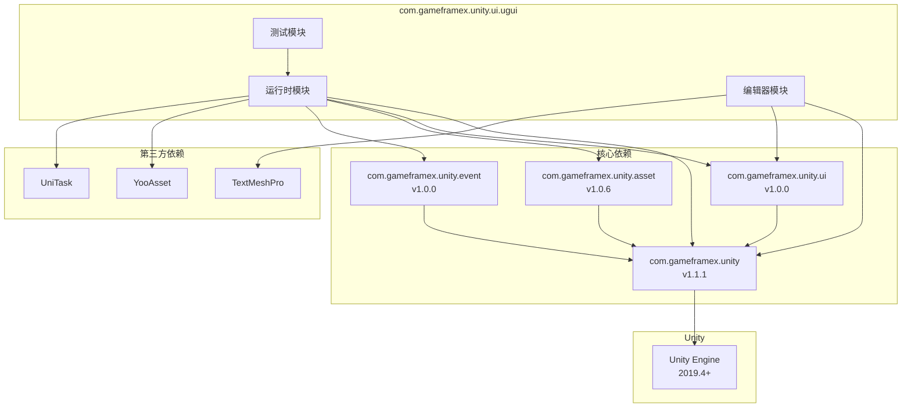

# 依存要件

このドキュメント詳細介绍 Game Frame X UGUI コンポーネントパッケージ的所有依赖要求，含みます Unity バージョン要求、程序パッケージ依赖和アセンブリ参照。

## 概要

Game Frame X UGUI コンポーネントパッケージは基于 Unity UGUI 的高级 UI フレームワーク，〜する必要があります依赖 Game Frame X コアフレームワーク和其他相关コンポーネントパッケージ。理解する这些依赖要求是正确インストール和使用的第1步。

## Unity バージョン要求

| プロジェクト | 要求 |
|------|------|
| 最低 Unity バージョン | 2019.4 |
| 推奨 Unity バージョン | 2020.3 LTS 或更高 |

> Source: [package.json](https://github.com/GameFrameX/com.gameframex.unity.ui.ugui/blob/main/package.json#L7)

## 程序パッケージ依赖

在インストール UGUI コンポーネントパッケージ之前，〜する必要があります確認してください以下依赖パッケージ已正确インストール。这些依赖パッケージ通过 Unity Package Manager 进行管理。

### コア依赖

| パッケージ名 | 最低バージョン | 説明 |
|------|---------|------|
| com.gameframex.unity | 1.1.1 | Game Frame X コアフレームワーク，提供基本アーキテクチャ和汎用機能 |
| com.gameframex.unity.ui | 1.0.0 | Game Frame X UI 基本パッケージ，提供 UI 抽象層和基本インターフェース |
| com.gameframex.unity.asset | 1.0.6 | Game Frame X リソース管理パッケージ，提供リソースロード和管理機能 |
| com.gameframex.unity.event | 1.0.0 | Game Frame X イベント系统パッケージ，提供イベント分发和监听機能 |

> Source: [package.json](https://github.com/GameFrameX/com.gameframex.unity.ui.ugui/blob/main/package.json#L21-L26)

### 依存関係のインストール

在 Unity プロジェクト的 `manifest.json` ファイル中追加以下依赖：

```json
{
  "dependencies": {
    "com.gameframex.unity": "1.1.1",
    "com.gameframex.unity.ui": "1.0.0",
    "com.gameframex.unity.asset": "1.0.6",
    "com.gameframex.unity.event": "1.0.0",
    "com.gameframex.unity.ui.ugui": "2.3.6"
  }
}
```

## アセンブリ参照

### ランタイムアセンブリ (Runtime)

UGUI ランタイムアセンブリ〜する必要があります参照以下アセンブリ：

| アセンブリ | 説明 |
|--------|------|
| GameFrameX.Runtime | コアランタイム |
| GameFrameX.Asset.Runtime | リソース管理ランタイム |
| GameFrameX.Event.Runtime | イベント系统ランタイム |
| GameFrameX.UI.Runtime | UI 基本ランタイム |
| YooAsset.Runtime | YooAsset リソース引擎ランタイム |
| YooAsset | YooAsset 主アセンブリ |
| UniTask.Runtime | UniTask 异步ランタイム |

> Source: [Runtime/GameFrameX.UI.UGUI.Runtime.asmdef](https://github.com/GameFrameX/com.gameframex.unity.ui.ugui/blob/main/Runtime/GameFrameX.UI.UGUI.Runtime.asmdef#L4-L11)

### エディタアセンブリ (Editor)

UGUI エディタアセンブリ〜する必要があります参照以下アセンブリ：

| アセンブリ | 説明 |
|--------|------|
| GameFrameX.Editor | コアエディタ |
| GameFrameX.Runtime | コアランタイム |
| GameFrameX.UI.Runtime | UI 基本ランタイム |
| GameFrameX.UI.UGUI.Runtime | UGUI ランタイム |
| Unity.TextMeshPro | TextMeshPro（条件依赖） |

> Source: [Editor/GameFrameX.UI.UGUI.Editor.asmdef](https://github.com/GameFrameX/com.gameframex.unity.ui.ugui/blob/main/Editor/GameFrameX.UI.UGUI.Editor.asmdef#L4-L9)

#### TextMeshPro 条件参照

エディタアセンブリ使用バージョン定義来条件参照 TextMeshPro：

```json
{
  "name": "com.unity.textmeshpro",
  "expression": "",
  "define": "ENABLE_UI_TEXT_MESH_PRO"
}
```

这意味着 TextMeshPro 是可选依赖，当プロジェクト中有 TextMeshPro 时会自动启用相关機能。

> Source: [Editor/GameFrameX.UI.UGUI.Editor.asmdef](https://github.com/GameFrameX/com.gameframex.unity.ui.ugui/blob/main/Editor/GameFrameX.UI.UGUI.Editor.asmdef#L20-L26)

## 依赖关系图



## インストール顺序

为確認してください依赖正确解析，请按照以下顺序インストール：

1. **第1步：インストールコア依赖**
   - com.gameframex.unity (1.1.1)
   - com.gameframex.unity.ui (1.0.0)
   - com.gameframex.unity.asset (1.0.6)
   - com.gameframex.unity.event (1.0.0)

2. **第2步：インストール第3方依赖**
   - YooAsset（通过 Asset 或 UI パッケージ自动引入）
   - UniTask（如未自动引入需手动インストール）

3. **第3步：インストール UGUI コンポーネント**
   - com.gameframex.unity.ui.ugui (2.3.6)

4. **第4步（可选）：インストールエディタ增强**
   - TextMeshPro（如需使用增强的文本機能）

## バージョン互換性

| UGUI バージョン | Unity バージョン | コアフレームワークバージョン | パッケージステータス |
|-----------|-----------|-------------|--------|
| 2.3.6 | 2019.4+ | 1.1.1 | 当前稳定版 |
| 2.0.0 | 2019.4+ | 1.0.0 | 历史バージョン |

## よくある問題

### Q1: インストール时ヒント缺少依赖怎么办？

请確認してください按照上述インストール顺序依次インストール所有依赖パッケージ。もし使用 Git URL インストール方法，依赖パッケージ通常会自动下载。

### Q2: YooAsset 和 UniTask 从哪里取得？

这两个パッケージ通常是作为 Game Frame X 生态的一部分自动引入。もし未自动引入：
- YooAsset：可从 GitHub リポジトリ `YooAsset` 取得
- UniTask：可从 Unity Package Manager 取得 `com.cysharp.unitask`

### Q3: TextMeshPro 是必需的吗？

不是。TextMeshPro 是可选依赖，不影响コア機能使用。但推奨インストール以获得完全な的文本処理能力。

## 関連リンク

- [インストール方法](./2-installation.methods) - 詳細インストールステップ
- [プラグイン介绍](./1-overview.introduction) - プラグイン機能概要
- [機能特性](./1-overview.features) - 完全な機能列表
- [Game Frame X 官方ドキュメント](https://gameframex.doc.alianblank.com)
- [GitHub リポジトリ](https://github.com/gameframex/com.gameframex.unity.ui.ugui.git)
