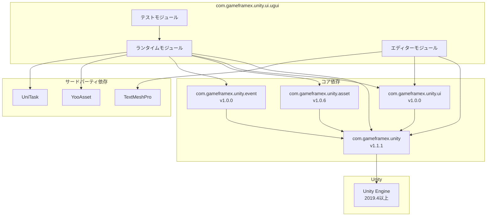

# 依存要件

本文書はGame Frame X UGUIコンポーネントパッケージのすべての依存要件を詳しく紹介し、Unityバージョン要件、パッケージ依存、アセンブリ参照を含みます。

## 概要

Game Frame X UGUIコンポーネントパッケージはUnity UGUIに基づく高度なUIフレームワークであり、Game Frame Xコアフレームワークとその他の関連コンポーネントパッケージに依存しています。これらの依存要件を理解することが、正しいインストールと使用の第一歩です。

## Unityバージョン要件

| プロジェクト | 要件 |
|------|------|
| 最小Unityバージョン | 2019.4 |
| 推奨Unityバージョン | 2020.3 LTS以降 |

> Source: [package.json](https://github.com/GameFrameX/com.gameframex.unity.ui.ugui/blob/main/package.json#L7)

## パッケージ依存

UGUIコンポーネントパッケージをインストールする前に、以下の依存パッケージが正しくインストールされていることを確認する必要があります。これらの依存パッケージはUnity Package Managerを通じて管理されます。

### コア依存

| パッケージ名 | 最小バージョン | 説明 |
|------|---------|------|
| com.gameframex.unity | 1.1.1 | Game Frame Xコアフレームワーク、基本アーキテクチャと共通機能を提供 |
| com.gameframex.unity.ui | 1.0.0 | Game Frame X UIベースパッケージ、UI抽象レイヤーと基本インターフェースを提供 |
| com.gameframex.unity.asset | 1.0.6 | Game Frame Xアセット管理パッケージ、アセット読み込み与管理機能を提供 |
| com.gameframex.unity.event | 1.0.0 | Game Frame Xイベント系统パッケージ、イベント配信とリスン機能を提供 |

> Source: [package.json](https://github.com/GameFrameX/com.gameframex.unity.ui.ugui/blob/main/package.json#L21-L26)

### 依存関係をインストール

Unityプロジェクトの`manifest.json`ファイルに以下の依存を追加：

```json
{
  "dependencies": {
    "com.gameframex.unity": "1.1.1",
    "com.gameframex.unity.ui": "1.0.0",
    "com.gameframex.unity.asset": "1.0.6",
    "com.gameframex.unity.event": "1.0.0",
    "com.gameframex.unity.ui.ugui": "2.3.6"
  }
}
```

## アセンブリ参照

### ランタイムアセンブリ (Runtime)

UGUIランタイムアセンブリは以下のアセンブリを参照する必要があります：

| アセンブリ | 説明 |
|--------|------|
| GameFrameX.Runtime | コアランタイム |
| GameFrameX.Asset.Runtime | アセット管理ランタイム |
| GameFrameX.Event.Runtime | イベントシステムランタイム |
| GameFrameX.UI.Runtime | UIベースランタイム |
| YooAsset.Runtime | YooAssetアセットエンジンランタイム |
| YooAsset | YooAssetメインアセンブリ |
| UniTask.Runtime | UniTask非同期ランタイム |

> Source: [Runtime/GameFrameX.UI.UGUI.Runtime.asmdef](https://github.com/GameFrameX/com.gameframex.unity.ui.ugui/blob/main/Runtime/GameFrameX.UI.UGUI.Runtime.asmdef#L4-L11)

### エディターアセンブリ (Editor)

UGUIエディターアセンブリは以下のアセンブリを参照する必要があります：

| アセンブリ | 説明 |
|--------|------|
| GameFrameX.Editor | コアエディター |
| GameFrameX.Runtime | コアランタイム |
| GameFrameX.UI.Runtime | UIベースランタイム |
| GameFrameX.UI.UGUI.Runtime | UGUIランタイム |
| Unity.TextMeshPro | TextMeshPro（条件依存） |

> Source: [Editor/GameFrameX.UI.UGUI.Editor.asmdef](https://github.com/GameFrameX/com.gameframex.unity.ui.ugui/blob/main/Editor/GameFrameX.UI.UGUI.Editor.asmdef#L4-L9)

#### TextMeshPro条件参照

エディターアセンブリはバージョン定義を使用してTextMeshProを条件参照します：

```json
{
  "name": "com.unity.textmeshpro",
  "expression": "",
  "define": "ENABLE_UI_TEXT_MESH_PRO"
}
```

これはTextMeshProがオプショナル依存であることを意味し、プロジェクトにTextMeshProがある場合、自動的に関連する機能が有効になります。

> Source: [Editor/GameFrameX.UI.UGUI.Editor.asmdef](https://github.com/GameFrameX/com.gameframex.unity.ui.ugui/blob/main/Editor/GameFrameX.UI.UGUI.Editor.asmdef#L20-L26)

## 依存関係図



## インストール順序

依存関係が正しく解決されるように、以下の順序でインストールしてください：

1. **第一步：コア依存をインストール**
   - com.gameframex.unity (1.1.1)
   - com.gameframex.unity.ui (1.0.0)
   - com.gameframex.unity.asset (1.0.6)
   - com.gameframex.unity.event (1.0.0)

2. **第二步：サードパーティ依存をインストール**
   - YooAsset（AssetまたはUIパッケージを通じて自動導入）
   - UniTask（自動導入されない場合は手動でインストール）

3. **第三歩：UGUIコンポーネントをインストール**
   - com.gameframex.unity.ui.ugui (2.3.6)

4. **第四歩（オプション）：エディター拡張をインストール**
   - TextMeshPro（拡張テキスト機能を使用する必要がある場合）

## バージョンの互換性

| UGUIバージョン | Unityバージョン | コアフレームワークバージョン | パッケージ状態 |
|-----------|-----------|-------------|--------|
| 2.3.6 | 2019.4以上 | 1.1.1 | 現在の安定版 |
| 2.0.0 | 2019.4以上 | 1.0.0 | 履歴バージョン |

## よくある質問

### Q1: インストール時に依存が見つからないと表示される場合は？

必ず上記のインストール順序に従って、すべての依存パッケージを順番にインストールしてください。Git URLインストール方法を使用する場合、依存パッケージは通常自動的にダウンロードされます。

### Q2: YooAssetとUniTaskはどこで取得しますか？

这两つのパッケージは通常、Game Frame Xエコシステムの一部として自動導入されます。自動導入されない場合：
- YooAsset：GitHubリポジトリ`YooAsset`から取得可能
- UniTask：Unity Package Managerから`com.cysharp.unitask`を取得可能

### Q3: TextMeshProは必須ですか？

いいえ。TextMeshProはオプショナル依存であり、コア機能の使用には影響しません。ただし、完全なテキスト処理機能を得るためにインストールすることをお勧めします。

## 関連リンク

- [インストール方法](./2-installation.methods) - 詳細なインストール手順
- [プラグイン紹介](./1-overview.introduction) - プラグイン機能概要
- [機能一覧](./1-overview.features) - 完全な機能一覧
- [Game Frame X公式ドキュメント](https://gameframex.doc.alianblank.com)
- [GitHubリポジトリ](https://github.com/gameframex/com.gameframex.unity.ui.ugui.git)