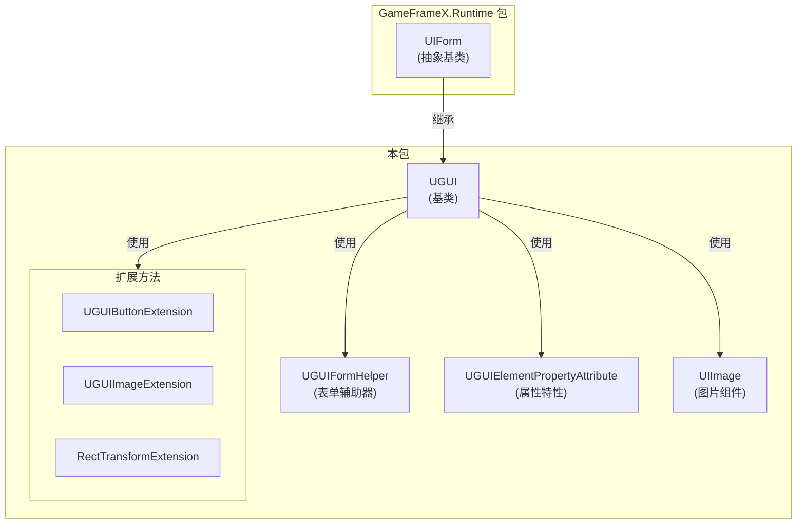
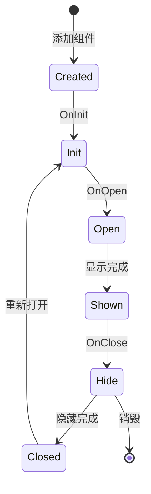

# UGUI基底クラス

UGUI基底クラス是GameFrameX UGUIモジュール的コア类，提供UGUI特定的界面機能実装。所有UGUI界面都〜する必要があります継承此类来获得完全な的UIライフサイクル管理和显示控制能力。

## 概要

`UGUI` 类是Unity UGUI界面的基底クラス，継承自 `UIForm`。它カプセル化了Unity UGUI的特定実装，提供します界面显示/隐藏、可见性控制、全屏布局等コア機能。通过継承此基底クラス，開発者〜できます快速作成、管理和操作UGUI界面，同時に与GameFrameX的UI管理系统无缝集成。

このクラス使用 `[DisallowMultipleComponent]` 特性確認してください每个GameObject只能追加一个UGUIコンポーネント，防止重复追加导致的逻辑エラー。

## コア機能

### 界面显示与隐藏

UGUI基底クラスオーバーライド了父类的显示和隐藏メソッド，サポート带动画的界面切换效果：

- **Showメソッド**: 显示界面，サポート通过 `IUIFormShowHandler` 処理显示动画
- **Hideメソッド**: 隐藏界面，サポート通过 `IUIFormHideHandler` 処理隐藏动画

### 可见性管理

提供します两种控制界面可见性的方法：

1. **受保护的InternalSetVisibleメソッド**: 設定UI的显示ステータス，不发出任何イベント，適しています内部ステータス同步
2. **公共Visibleプロパティ**: 取得或設定界面的可见性，会トリガーGameObject的激活/停用ステータス

### 全屏布局

`MakeFullScreen` メソッド〜できます将UI元素設定为全屏モード，自动設定锚点、位置和尺寸：
- 锚点設定为 (0,0) 到 (1,1)
- 锚点位置設定为 (0,0)
- 尺寸增量設定为 Vector2.zero

## アーキテクチャ設計



### 类关系説明

| コンポーネント | 角色 | 説明 |
|------|------|------|
| UIForm | 父类抽象基 | 提供UI界面的抽象インターフェース和ライフサイクル管理 |
| UGUI | コア类 | UGUI特定的界面実装，処理Unity UGUI细节 |
| UGUIFormHelper | 辅助器 | 処理UI表单的インスタンス化、作成和解放 |
| UGUIElementPropertyAttribute | 特性 | 标记UI控件在预制体中的路径 |
| UIImage | コンポーネント | 拡張的图片コンポーネント，サポート异步图标ロード |
| 拡張メソッド | 工具集 | 提供便捷的コンポーネント操作メソッド |

## 界面ライフサイクル



## 使用例

### 作成自定義UGUI界面

```csharp
using GameFrameX.UI.UGUI.Runtime;
using UnityEngine;

public class MainMenuUI : UGUI
{
    protected override void OnInit(object userData)
    {
        base.OnInit(userData);
        // 初始化UI逻辑
    }
    
    protected override void OnOpen(object userData)
    {
        base.OnOpen(userData);
        // UI打开时的逻辑
    }
    
    protected override void OnClose(bool isShutdown, object userData)
    {
        base.OnClose(isShutdown, userData);
        // UI关闭时的逻辑
    }
}
```
> Source: [UGUI.cs](https://github.com/GameFrameX/com.gameframex.unity.ui.ugui/blob/main/Runtime/UGUI.cs#L46-L179)

### 使用UGUIElementPropertyAttribute绑定控件

```csharp
using GameFrameX.UI.UGUI.Runtime;
using UnityEngine;
using UnityEngine.UI;

public class GameStartUI : UGUI
{
    // 使用特性标记控件路径
    [SerializeField]
    [UGUIElementProperty("StartButton")]
    private Button m_StartButton;

    [SerializeField]
    [UGUIElementProperty("Title/Text")]
    private Text m_TitleText;

    public Button StartButton => m_StartButton;
    public Text TitleText => m_TitleText;

    protected override void OnInit(object userData)
    {
        base.OnInit(userData);
        // 绑定按钮事件
        m_StartButton.onClick.AddListener(OnStartClick);
    }

    private void OnStartClick()
    {
        Debug.Log("开始游戏按钮被点击");
    }
}
```
> Source: [UGUIElementPropertyAttribute.cs](https://github.com/GameFrameX/com.gameframex.unity.ui.ugui/blob/main/Runtime/UGUIElementPropertyAttribute.cs#L40-L64)

### 設定全屏UI

```csharp
using GameFrameX.UI.UGUI.Runtime;
using UnityEngine;

public class FullScreenPanel : MonoBehaviour
{
    private void Start()
    {
        // 获取或添加RectTransform并设置为全屏
        gameObject.GetOrAddComponent<RectTransform>().MakeFullScreen();
    }
}
```
> Source: [RectTransformExtension.cs](https://github.com/GameFrameX/com.gameframex.unity.ui.ugui/blob/main/Runtime/RectTransformExtension.cs#L56-L62)

## コード生成器集成

UGUI基底クラス与コード生成器紧密集成。コード生成器会自动为UGUI预制体生成継承自UGUI的コード类：

```csharp
// 代码生成器生成的代码结构示例
namespace Hotfix.UI
{
    /// <summary>
    /// 代码生成的UI代码MainMenu
    /// </summary>
    [DisallowMultipleComponent]
    [OptionUIConfig(null, "Assets/Prefabs/UI/MainMenu")]
    public sealed partial class MainMenu : UGUI
    {
        public GameObject self { get; private set; }

        [SerializeField]
        [UGUIElementProperty("Panel/StartButton")]
        private Button m_StartButton;

        public Button m_StartButton => m_StartButton;

        private bool _isInitView = false;

        protected override void InitView()
        {
            if (_isInitView)
            {
                return;
            }

            _isInitView = true;
            this.self = this.gameObject;
            m_StartButton = gameObject.transform.FindChildName("Panel/StartButton").GetComponent<Button>();
        }
    }
}
```
> Source: [UGUICodeGenerator.cs](https://github.com/GameFrameX/com.gameframex.unity.ui.ugui/blob/main/Editor/UGUICodeGenerator.cs#L195-L230)

## 関連リンク

- [UIマネージャー](./4-core-concepts.ui-manager) - 理解するUI界面的整体管理系统
- [表单辅助器](./4-core-concepts.form-helper) - 理解するUI表单作成和管理辅助工具
- [UIImageコンポーネント](./5-components.uiimage) - 理解する拡張的图片コンポーネント
- [拡張メソッド](./5-components.extensions) - 理解するボタン、图片、RectTransform的拡張メソッド
- [コード生成器](./6-editor-tools.code-generator) - 理解する如何自动生成UGUIコード
- [官方ドキュメント](https://gameframex.doc.alianblank.com) - 取得更多詳細情報
