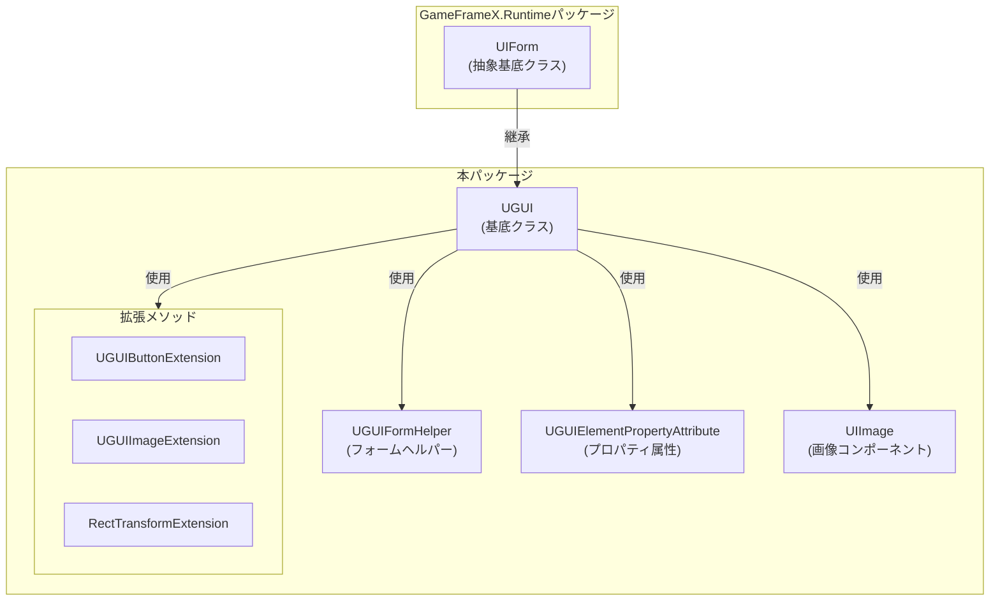
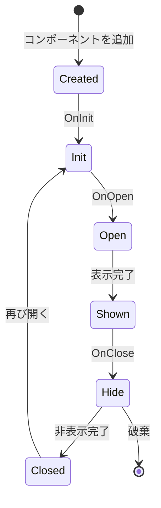

# UGUI基底クラス

UGUI基底クラスはGameFrameX UGUIモジュールのコアクラスであり、UGUI固有の画面機能実装を提供します。すべてのUGUI画面は、このクラスを継承して完全なUIライフサイクル管理与と表示制御能力を取得する必要があります。

## 概要

`UGUI`クラスはUnity UGUI画面の基底クラスであり、`UIForm`を継承します。Unity UGUIの特定の実装をラップし、画面表示/非表示、可視性制御、フルスクリーUILayoutなどのコア機能を提供します。この基底クラスを継承することで、開発者はUGUI画面を迅速に作成、管理、操作でき、GameFrameXのUI管理システムとシームレスに統合できます。

このクラスは`[DisallowMultipleComponent]`属性を使用して、各GameObjectにUGUIコンポーネントを1つだけ追加できるようにし、重复追加によるロジックエラーを防止します。

## コア機能

### 画面表示と非表示

UGUI基底クラスは親クラスの表示と非表示メソッドをオーバーライドし、アニメーション付きの画面切り替え効果をサポート：

- **Showメソッド**：画面を表示し、`IUIFormShowHandler`を通じて表示アニメーションを処理
- **Hideメソッド**：画面を非表示にし、`IUIFormHideHandler`を通じて非表示アニメーションを処理

### 可視性管理

画面の可視性を制御する2つの方法を提供します：

1. **保護されたInternalSetVisibleメソッド**：UIの表示状態を設定し、いかなるイベントも发出せず、内部状態同期に使用
2. **公共Visibleプロパティ**：画面の可視性を取得または設定し、GameObjectのアクティブ/非アクティブ状態をトリガー

### フルスクリーUILayout

`MakeFullScreen`メソッドはUI要素をフルスクリーンモードに設定でき、锚点、位置、サイズを自動設定：
- 锚点を(0,0)から(1,1)に設定
- 锚点位置を(0,0)に設定
- サイズ增量をVector2.zeroに設定

## アーキテクチャ設計



### クラスの関係説明

| コンポーネント | 役割 | 説明 |
|------|------|------|
| UIForm | 親クラス抽象基底 | UI画面の抽象インターフェースとライフサイクル管理を提供 |
| UGUI | コアクラス | UGUI固有の画面実装、Unity UGUIの詳細を処理 |
| UGUIFormHelper | ヘルパー | UIフォームのインスタンス化、作成、解放を処理 |
| UGUIElementPropertyAttribute | 属性 | プレハブ内のUIコントロールpathsをマーク |
| UIImage | コンポーネント | 拡張画像コンポーネント、非同期アイコン読み込みをサポート |
| 拡張メソッド | ツールセット | 便捷なコンポーネント操作メソッドを提供 |

## 画面のライフサイクル



## 使用例

### カスタムUGUI画面を作成

```csharp
using GameFrameX.UI.UGUI.Runtime;
using UnityEngine;

public class MainMenuUI : UGUI
{
    protected override void OnInit(object userData)
    {
        base.OnInit(userData);
        // UIロジックを初期化
    }

    protected override void OnOpen(object userData)
    {
        base.OnOpen(userData);
        // UIが開いた時のロジック
    }

    protected override void OnClose(bool isShutdown, object userData)
    {
        base.OnClose(isShutdown, userData);
        // UIが閉じた時のロジック
    }
}
```
> Source: [UGUI.cs](https://github.com/GameFrameX/com.gameframex.unity.ui.ugui/blob/main/Runtime/UGUI.cs#L46-L179)

### UGUIElementPropertyAttributeを使用してコントロールをバインディング

```csharp
using GameFrameX.UI.UGUI.Runtime;
using UnityEngine;
using UnityEngine.UI;

public class GameStartUI : UGUI
{
    // 属性を使用してコントロールpathをマーク
    [SerializeField]
    [UGUIElementProperty("StartButton")]
    private Button m_StartButton;

    [SerializeField]
    [UGUIElementProperty("Title/Text")]
    private Text m_TitleText;

    public Button StartButton => m_StartButton;
    public Text TitleText => m_TitleText;

    protected override void OnInit(object userData)
    {
        base.OnInit(userData);
        // ボタンイベントをバインディング
        m_StartButton.onClick.AddListener(OnStartClick);
    }

    private void OnStartClick()
    {
        Debug.Log("ゲーム開始ボタンがクリックされました");
    }
}
```
> Source: [UGUIElementPropertyAttribute.cs](https://github.com/GameFrameX/com.gameframex.unity.ui.ugui/blob/main/Runtime/UGUIElementPropertyAttribute.cs#L40-L64)

### フルスクリーンUIを設定

```csharp
using GameFrameX.UI.UGUI.Runtime;
using UnityEngine;

public class FullScreenPanel : MonoBehaviour
{
    private void Start()
    {
        // RectTransformを取得または追加してフルスクリーンに設定
        gameObject.GetOrAddComponent<RectTransform>().MakeFullScreen();
    }
}
```
> Source: [RectTransformExtension.cs](https://github.com/GameFrameX/com.gameframex.unity.ui.ugui/blob/main/Runtime/RectTransformExtension.cs#L56-L62)

## コードジェネレーターとの統合

UGUI基底クラスはコードジェネレーターと緊密に統合されています。コードジェネレーターはUGUIプレハブに対してUGUIを継承するコードクラスを自動生成：

```csharp
// コードジェネレーターが生成したコード構造の例
namespace Hotfix.UI
{
    /// <summary>
    /// コード生成されたUIコード MainMenu
    /// </summary>
    [DisallowMultipleComponent]
    [OptionUIConfig(null, "Assets/Prefabs/UI/MainMenu")]
    public sealed partial class MainMenu : UGUI
    {
        public GameObject self { get; private set; }

        [SerializeField]
        [UGUIElementProperty("Panel/StartButton")]
        private Button m_StartButton;

        public Button m_StartButton => m_StartButton;

        private bool _isInitView = false;

        protected override void InitView()
        {
            if (_isInitView)
            {
                return;
            }

            _isInitView = true;
            this.self = this.gameObject;
            m_StartButton = gameObject.transform.FindChildName("Panel/StartButton").GetComponent<Button>();
        }
    }
}
```
> Source: [UGUICodeGenerator.cs](https://github.com/GameFrameX/com.gameframex.unity.ui.ugui/blob/main/Editor/UGUICodeGenerator.cs#L195-L230)

## 関連リンク

- [UIマネージャー](./4-core-concepts.ui-manager) - UI画面の全体管理系统を學習
- [フォームヘルパー](./4-core-concepts.form-helper) - UIフォーム作成と管理の補助ツールを學習
- [UIImageコンポーネント](./5-components.uiimage) - 拡張画像コンポーネントを學習
- [拡張メソッド](./5-components.extensions) - Button、画像、RectTransformの拡張メソッドを學習
- [コードジェネレーター](./6-editor-tools.code-generator) - UGUIコードを自動生成する方法を學習
- [公式ドキュメント](https://gameframex.doc.alianblank.com) - 詳細情報を取得