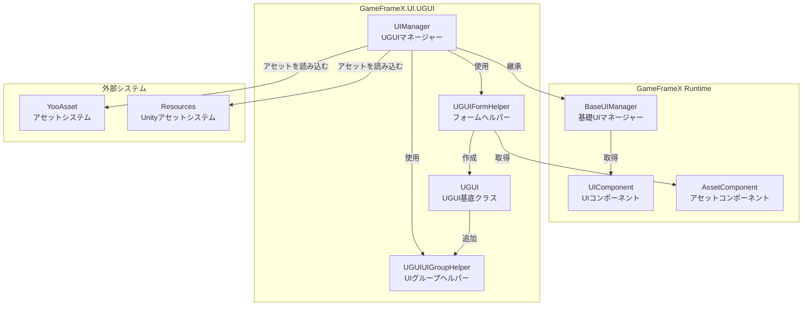
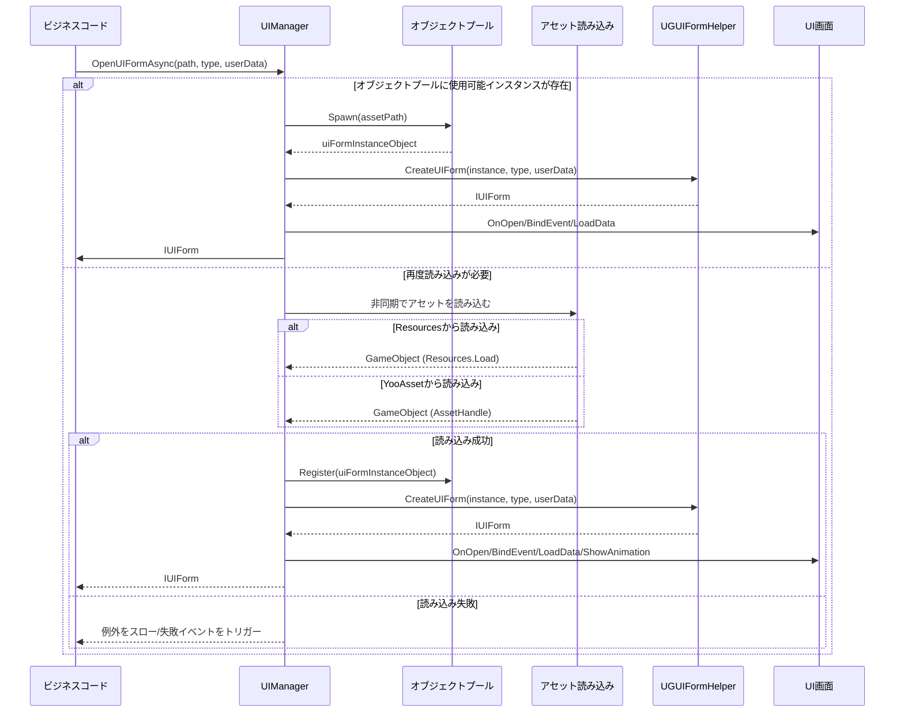
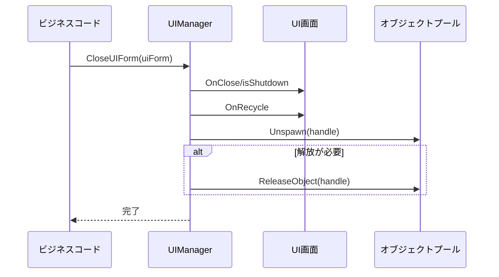

# UIマネージャー

UIマネージャー（UIManager）はGameFrameX UGUIプラグインのコアコンポーネントであり、画面開く閉じるなどのUI画面全体のライフサイクルを管理します。

## 概要

UIManagerはUIシステム全体のコア компонентであり、`BaseUIManager`を継承し、完全なUI画面管理機能を提供します。このマネージャーはResourcesアセットディレクトリまたはYooAssetアセットパッケージからUI画面を非同期で読み込むことをサポートし、オブジェクトプールメカニズムを実装してメモリ使用を最適化します。

### コア責務

- **画面ライフサイクル管理**：UI画面の開く、閉じる、表示、非表示などのライフサイクル操作を担当
- **アセット読み込み**：ResourcesとYooAssetアセットパッケージからUI画面を非同期で読み込むことをサポート
- **オブジェクトプール管理**：オブジェクトプールを使用して閉じたUI画面インスタンスをキャッシュし、アセット読み込みオーバーヘッドを削減
- **イベントコールバック**：完全なイベントコールバックメカニズムを提供し、画面開く/閉じるの成功または失敗状態を通知
- **UIグループ管理**：複数のUIグループのレイヤーと表示順序を管理

### 設計意図

UIManagerは非同期読み込みモードを採用し、メインスレッドのブロックを避け、ユーザー体験を向上させます。オブジェクトプールメカニズムは、UI画面インスタンスの頻繁な作成と破棄によるメモリーチャタリングとパフォーマンスオーバーヘッドを効果的に削減できます。イベント駆動の設計パターンは、UIロジックとビジネスロジックの分離を実現し、メンテナンスと拡張を容易にします。

## アーキテクチャ



### コンポーネント説明

| コンポーネント | 名前空間 | 説明 |
|------|----------|------|
| UIManager | GameFrameX.UI.UGUI.Runtime | UGUI画面マネージャー、画面ライフサイクル管理を担当 |
| UGUIFormHelper | GameFrameX.UI.UGUI.Runtime | フォームヘルパー、UI画面インスタンス化と作成を処理 |
| UGUIUIGroupHelper | GameFrameX.UI.UGUI.Runtime | UIグループヘルパー、UIグループの深度とレイヤーを管理 |
| UGUI | GameFrameX.UI.UGUI.Runtime | UGUI画面基底クラス、UIFormを継承 |

## 画面を開くフロー

UIManagerのコア機能の一つは、UI画面を非同期で開くことです。以下は画面を開く完全なフローです：



### 詳細なフロー説明

1. **オブジェクトプールを確認**：まずオブジェクトプールに再利用可能ないUIインスタンスが存在するか確認
2. **アセット読み込み**：オブジェクトプールに使用可能インスタンスがない場合、アセットを非同期で読み込む
3. **アセットソース判断**：pathに基づいてResourcesからかYooAssetパッケージから読み込むかを判断
4. **UIフォームを作成**：UGUIFormHelperを使用してUI画面インスタンスを作成
5. **UIを初期化**：画面のOnOpen、BindEvent、LoadDataなどのメソッドを呼び出す
6. **アニメーションを再生**：表示アニメーションが有効な場合、アニメーションを再生
7. **イベントコールバック**：開く成功イベントをトリガー

> Source: [UIManager.Open.cs](https://github.com/GameFrameX/com.gameframex.unity.ui.ugui/blob/main/Runtime/UIManager.Open.cs#L78-L115)

## 画面を閉じる・回收

UI画面を閉じる際、UIManagerは設定に基づいてインスタンスを回收するか、直接破棄するかを判断します：



> Source: [UIManager.Close.cs](https://github.com/GameFrameX/com.gameframex.unity.ui.ugui/blob/main/Runtime/UIManager.Close.cs#L50-L67)

## コアメソッド

### InnerOpenUIFormAsync

UI画面を非同期で開くコアメソッド。

```csharp
protected override async Task<IUIForm> InnerOpenUIFormAsync(
    string uiFormAssetPath,  // UIアセットpath
    Type uiFormType,         // UI画面タイプ
    bool pauseCoveredUIForm,// 被っている画面を一時停止するか
    object userData,         // ユーザー定義データ
    bool isFullScreen = false // フルスクリーン表示か
)
```

> Source: [UIManager.Open.cs](https://github.com/GameFrameX/com.gameframex.unity.ui.ugui/blob/main/Runtime/UIManager.Open.cs#L78-L115)

**実装ロジック**：

1. オブジェクトプールに既に使用可能インスタンスがあるか確認、あれば直接使用
2. なければ`InnerLoadUIFormAsync`を呼び出してアセットを非同期で読み込む
3. アセットpathに基づいてResourcesからかYooAssetパッケージから読み込むかを判断
4. 読み込み成功後、UIフォームを作成して初期化
5. 開く成功イベントコールバックをトリガー

### InnerLoadUIFormAsync

UI画面アセットを非同期で読み込む。

```csharp
private async Task<IUIForm> InnerLoadUIFormAsync(
    string uiFormAssetPath,
    Type uiFormType,
    bool pauseCoveredUIForm,
    object userData,
    bool isFullScreen,
    string uiFormAssetName,
    string assetPath
)
```

> Source: [UIManager.Open.cs](https://github.com/GameFrameX/com.gameframex.unity.ui.ugui/blob/main/Runtime/UIManager.Open.cs#L131-L163)

**アセット読み込みロジック**：

```csharp
// アセットpathに"Bundles"ディレクトリが含まれているか判断
if (uiFormAssetPath.IndexOf(Utility.Asset.Path.BundlesDirectoryName, StringComparison.OrdinalIgnoreCase) < 0)
{
    // Resourcesから読み込み
    var original = (GameObject)Resources.Load(assetPath);
    var gameObject = UnityEngine.Object.Instantiate(original);
}
else
{
    // YooAssetパッケージから読み込み
    var assetHandle = await m_AssetManager.LoadAssetAsync<UnityEngine.Object>(assetPath);
    var gameObject = assetHandle.InstantiateSync();
}
```

> Source: [UIManager.Open.cs](https://github.com/GameFrameX/com.gameframex.unity.ui.ugui/blob/main/Runtime/UIManager.Open.cs#L137-L162)

### RecycleUIForm

UI画面インスタンスオブジェクトを回收。

```csharp
protected override void RecycleUIForm(IUIForm uiForm, bool isDispose = false)
{
    uiForm.OnRecycle();
    var formHandle = uiForm.Handle as GameObject;

    m_InstancePool.Unspawn(uiForm.Handle);

    if (isDispose)
    {
        m_InstancePool.ReleaseObject(uiForm.Handle);
    }
}
```

> Source: [UIManager.Close.cs](https://github.com/GameFrameX/com.gameframex.unity.ui.ugui/blob/main/Runtime/UIManager.Close.cs#L52-L67)

## フォームヘルパー

UGUIFormHelperはUI画面のインスタンス化、作成、解放を担当します。

### UI画面を作成

```csharp
public override IUIForm CreateUIForm(object uiFormInstance, Type uiFormType, object userData)
{
    var uiGameObject = uiFormInstance as GameObject;

    // UI画面スクリプトコンポーネントを追加
    var componentType = uiGameObject.GetOrAddComponent(uiFormType);

    // OnAwake初期化を呼び出す
    if (uiForm.IsAwake == false)
    {
        uiForm.OnAwake();
    }

    // 属性に基づいてUIグループを取得
    var attribute = uiFormType.GetCustomAttribute(typeof(OptionUIGroupAttribute));
    if (attribute is OptionUIGroupAttribute optionUIGroup)
    {
        uiGroup = m_UIComponent.GetUIGroup(optionUIGroup.GroupName);
    }

    // 親オブジェクトを設定
    uiTransform.SetParent(helper.transform);
    uiTransform.localScale = Vector3.one;

    return uiForm;
}
```

> Source: [UGUIFormHelper.cs](https://github.com/GameFrameX/com.gameframex.unity.ui.ugui/blob/main/Runtime/UGUIFormHelper.cs#L92-L164)

### UI画面を解放

```csharp
public override void ReleaseUIForm(
    object uiFormAsset,
    object uiFormInstance,
    object assetHandle,
    string uiFormAssetPath,
    string uiFormAssetName)
{
    if (!m_UIComponent.EnableAutoReleaseUIForm)
    {
        return;
    }

    // pathに基づいてアセットタイプを判断して解放
    if (uiFormAssetPath.IndexOf(Utility.Asset.Path.BundlesDirectoryName, StringComparison.OrdinalIgnoreCase) >= 0)
    {
        m_AssetComponent.UnloadAsset(uiFormAssetPath);
    }
    else
    {
        UnityEngine.Resources.UnloadAsset((Object)uiFormInstance);
    }

    Destroy((Object)uiFormInstance);
}
```

> Source: [UGUIFormHelper.cs](https://github.com/GameFrameX/com.gameframex.unity.ui.ugui/blob/main/Runtime/UGUIFormHelper.cs#L177-L195)

## UIグループヘルパー

UGUIUIGroupHelperはUIグループのレイヤーと深度を管理します。

```csharp
public override void SetDepth(int depth)
{
    Depth = depth;
    // Z軸位置を調整して深度制御を実装
    transform.localPosition = new Vector3(0, 0, depth * 1000);
}

public override IUIGroupHelper Handler(
    Transform root,
    string groupName,
    string uiGroupHelperTypeName,
    IUIGroupHelper customUIGroupHelper,
    int depth = 0)
{
    SetDepth(depth);

    // UIグループコンテナを作成
    GameObject component = new GameObject();
    component.name = groupName;
    component.transform.SetParent(root, false);

    // UIレイヤーを設定
    var uiLayer = LayerMask.NameToLayer("UI");
    component.SetLayerRecursively(uiLayer);

    // フルスクリーンRectTransformを作成
    RectTransform rectTransform = component.GetOrAddComponent<RectTransform>();
    rectTransform.MakeFullScreen();

    return uiGroupHelper;
}
```

> Source: [UGUIUIGroupHelper.cs](https://github.com/GameFrameX/com.gameframex.unity.ui.ugui/blob/main/Runtime/UGUIUIGroupHelper.cs#L64-L105)

## 使用例

### UI画面を開く

```csharp
// UIコンポーネントを取得
var uiComponent = GameEntry.GetComponent<UIComponent>();

// UI画面を非同期で開く
var uiForm = await uiComponent.OpenUIFormAsync("UI/MainMenu", typeof(MainMenuUI), false, null);
```

### UI画面を閉じる

```csharp
// 指定したUI画面を閉じる
uiComponent.CloseUIForm(uiForm);
```

### UIグループ属性を使用

```csharp
// UI画面にUIグループを指定
[OptionUIGroup("DialogGroup")]
public class DialogUI : UGUI
{
    // UI画面ロジック
}
```

> Source: [UGUIFormHelper.cs](https://github.com/GameFrameX/com.gameframex.unity.ui.ugui/blob/main/Runtime/UGUIFormHelper.cs#L117-L124)

### 表示アニメーション属性を使用

```csharp
// UI画面に表示アニメーションを指定
[OptionUIShowAnimation(true, "FadeIn")]
[OptionUIHideAnimation(true, "FadeOut")]
public class MainMenuUI : UGUI
{
    // UI画面ロジック
}
```

> Source: [UGUIFormHelper.cs](https://github.com/GameFrameX/com.gameframex.unity.ui.ugui/blob/main/Runtime/UGUIFormHelper.cs#L126-L146)

## 関連リンク

- [UGUI基底クラス](./4-core-concepts.ugui-base) - UGUI画面基底クラスの詳細文書
- [フォームヘルパー](./4-core-concepts.form-helper) - フォームヘルパーの詳細文書
- [UIImageコンポーネント](./5-components.uiimage) - 拡張画像コンポーネント
- [拡張メソッド](./5-components.extensions) - UGUIコンポーネント拡張メソッド
- [公式ドキュメント](https://gameframex.doc.alianblank.com)
- [GitHubリポジトリ](https://github.com/GameFrameX/com.gameframex.unity.ui.ugui)