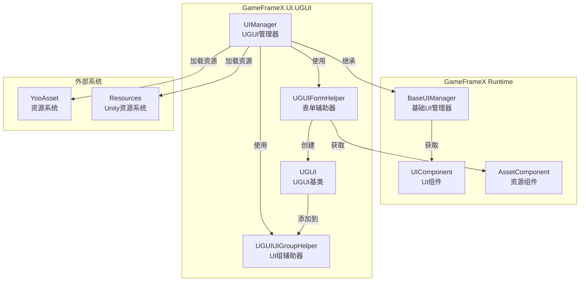
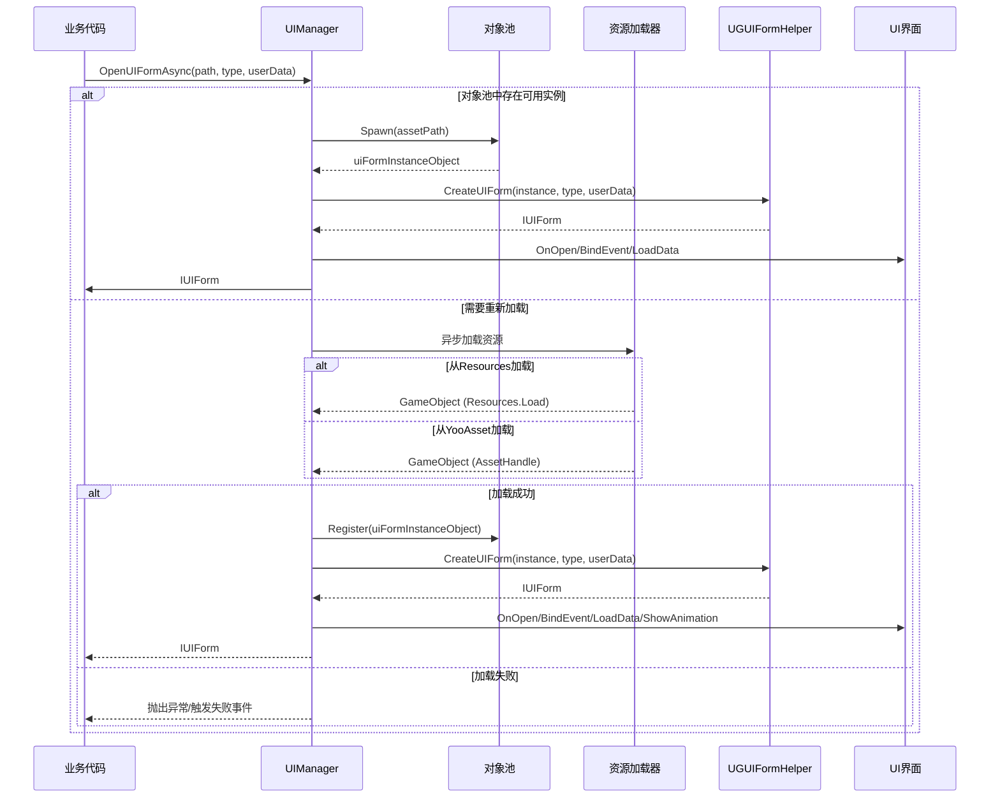
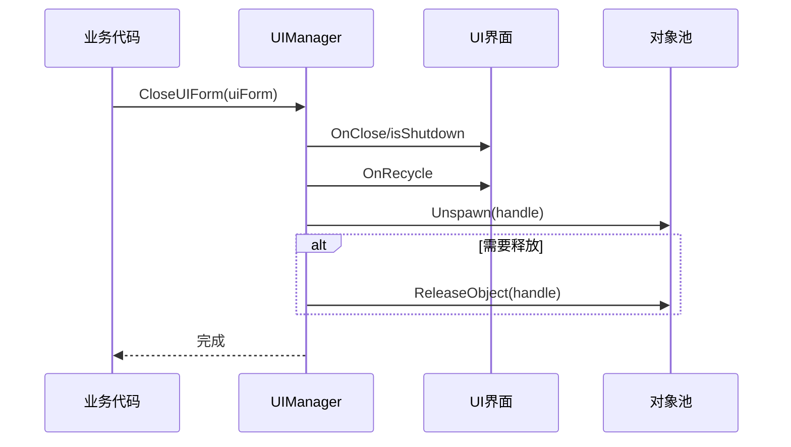

# UIマネージャー

UIマネージャー（UIManager）是GameFrameX UGUIプラグイン的コアコンポーネント，负责管理UI界面的完全なライフサイクル，含みます界面的ロード、显示、隐藏、閉じる和回收等操作。

## 概要

UIManager是整个UI系统的中枢コンポーネント，它継承自`BaseUIManager`，提供します完全な的UI界面管理機能。该マネージャーサポート从Resourcesリソースディレクトリ或YooAssetリソースパッケージ非同期ロードUI界面，并実装了对象池机制来最適化内存使用。

### コア职责

- **界面ライフサイクル管理**：负责UI界面的打开、閉じる、显示、隐藏等ライフサイクル操作
- **リソースロード**：サポート从Resources和YooAssetリソースパッケージ非同期ロードUI界面
- **对象池管理**：使用对象池缓存已閉じる的UI界面インスタンス，减少リソースロード开销
- **イベントコールバック**：提供完全な的イベントコールバック机制，用于通知界面打开/閉じる的成功或失敗ステータス
- **UI组管理**：管理多个UI组的层级和显示顺序

### 設計意图

UIManager采用非同期ロードモード，避免阻塞主线程，提升ユーザー体验。对象池机制〜できます有效减少频繁インスタンス化UI界面带来的内存抖动和性能开销。イベント驱动的設計モード使得UI逻辑与业务逻辑解耦，便于维护和拡張。

## アーキテクチャ



### コンポーネント説明

| コンポーネント | 名前空間 | 説明 |
|------|----------|------|
| UIManager | GameFrameX.UI.UGUI.Runtime | UGUI界面マネージャー，负责界面ライフサイクル管理 |
| UGUIFormHelper | GameFrameX.UI.UGUI.Runtime | 表单辅助器，処理UI界面インスタンス化和作成 |
| UGUIUIGroupHelper | GameFrameX.UI.UGUI.Runtime | UI组辅助器，管理UI组的深度和层级 |
| UGUI | GameFrameX.UI.UGUI.Runtime | UGUI界面基底クラス，継承自UIForm |

## 界面打开フロー

UIManager的コア機能之一是异步打开UI界面。以下是打开界面的完全なフロー：



### 詳細フロー説明

1. **確認对象池**：まず確認对象池中是否存在可复用的UIインスタンス
2. **リソースロード**：もし对象池中没有可用インスタンス，则非同期ロードリソース
3. **リソース来源判断**：根据路径判断从Resources还是YooAssetパッケージロード
4. **作成UI表单**：使用UGUIFormHelper作成UI界面インスタンス
5. **初期化UI**：呼び出し界面的OnOpen、BindEvent、LoadData等メソッド
6. **再生动画**：もし启用显示动画，则再生动画
7. **イベントコールバック**：トリガー打开成功イベント

> Source: [UIManager.Open.cs](https://github.com/GameFrameX/com.gameframex.unity.ui.ugui/blob/main/Runtime/UIManager.Open.cs#L78-L115)

## 界面閉じる与回收

閉じるUI界面时，UIManager会根据設定决定是回收インスタンス还是直接破棄：



> Source: [UIManager.Close.cs](https://github.com/GameFrameX/com.gameframex.unity.ui.ugui/blob/main/Runtime/UIManager.Close.cs#L50-L67)

## コアメソッド

### InnerOpenUIFormAsync

异步打开UI界面的コアメソッド。

```csharp
protected override async Task<IUIForm> InnerOpenUIFormAsync(
    string uiFormAssetPath,  // UI资源路径
    Type uiFormType,         // UI界面类型
    bool pauseCoveredUIForm,// 是否暂停被覆盖的界面
    object userData,         // 用户自定义数据
    bool isFullScreen = false // 是否全屏显示
)
```

> Source: [UIManager.Open.cs](https://github.com/GameFrameX/com.gameframex.unity.ui.ugui/blob/main/Runtime/UIManager.Open.cs#L78-L115)

**実装逻辑**：

1. 確認对象池是否已有可用インスタンス，如有则直接使用
2. 否则呼び出し`InnerLoadUIFormAsync`非同期ロードリソース
3. 根据リソースパス判断从Resources还是YooAssetパッケージロード
4. ロード成功后作成UI表单并初期化
5. トリガー打开成功イベントコールバック

### InnerLoadUIFormAsync

非同期ロードUI界面リソース。

```csharp
private async Task<IUIForm> InnerLoadUIFormAsync(
    string uiFormAssetPath,
    Type uiFormType,
    bool pauseCoveredUIForm,
    object userData,
    bool isFullScreen,
    string uiFormAssetName,
    string assetPath
)
```

> Source: [UIManager.Open.cs](https://github.com/GameFrameX/com.gameframex.unity.ui.ugui/blob/main/Runtime/UIManager.Open.cs#L131-L163)

**リソースロード逻辑**：

```csharp
// 判断资源路径是否包含"Bundles"目录
if (uiFormAssetPath.IndexOf(Utility.Asset.Path.BundlesDirectoryName, StringComparison.OrdinalIgnoreCase) < 0)
{
    // 从Resources中加载
    var original = (GameObject)Resources.Load(assetPath);
    var gameObject = UnityEngine.Object.Instantiate(original);
}
else
{
    // 从YooAsset包中加载
    var assetHandle = await m_AssetManager.LoadAssetAsync<UnityEngine.Object>(assetPath);
    var gameObject = assetHandle.InstantiateSync();
}
```

> Source: [UIManager.Open.cs](https://github.com/GameFrameX/com.gameframex.unity.ui.ugui/blob/main/Runtime/UIManager.Open.cs#L137-L162)

### RecycleUIForm

回收UI界面インスタンス对象。

```csharp
protected override void RecycleUIForm(IUIForm uiForm, bool isDispose = false)
{
    uiForm.OnRecycle();
    var formHandle = uiForm.Handle as GameObject;
    
    m_InstancePool.Unspawn(uiForm.Handle);
    
    if (isDispose)
    {
        m_InstancePool.ReleaseObject(uiForm.Handle);
    }
}
```

> Source: [UIManager.Close.cs](https://github.com/GameFrameX/com.gameframex.unity.ui.ugui/blob/main/Runtime/UIManager.Close.cs#L52-L67)

## 表单辅助器

UGUIFormHelper负责UI界面的インスタンス化、作成和解放。

### 作成UI界面

```csharp
public override IUIForm CreateUIForm(object uiFormInstance, Type uiFormType, object userData)
{
    var uiGameObject = uiFormInstance as GameObject;
    
    // 添加UI界面脚本组件
    var componentType = uiGameObject.GetOrAddComponent(uiFormType);
    
    // 调用OnAwake初始化
    if (uiForm.IsAwake == false)
    {
        uiForm.OnAwake();
    }
    
    // 根据特性获取UI组
    var attribute = uiFormType.GetCustomAttribute(typeof(OptionUIGroupAttribute));
    if (attribute is OptionUIGroupAttribute optionUIGroup)
    {
        uiGroup = m_UIComponent.GetUIGroup(optionUIGroup.GroupName);
    }
    
    // 设置父对象
    uiTransform.SetParent(helper.transform);
    uiTransform.localScale = Vector3.one;
    
    return uiForm;
}
```

> Source: [UGUIFormHelper.cs](https://github.com/GameFrameX/com.gameframex.unity.ui.ugui/blob/main/Runtime/UGUIFormHelper.cs#L92-L164)

### 解放UI界面

```csharp
public override void ReleaseUIForm(
    object uiFormAsset,
    object uiFormInstance,
    object assetHandle,
    string uiFormAssetPath,
    string uiFormAssetName)
{
    if (!m_UIComponent.EnableAutoReleaseUIForm)
    {
        return;
    }
    
    // 根据路径判断资源类型并卸载
    if (uiFormAssetPath.IndexOf(Utility.Asset.Path.BundlesDirectoryName, StringComparison.OrdinalIgnoreCase) >= 0)
    {
        m_AssetComponent.UnloadAsset(uiFormAssetPath);
    }
    else
    {
        UnityEngine.Resources.UnloadAsset((Object)uiFormInstance);
    }
    
    Destroy((Object)uiFormInstance);
}
```

> Source: [UGUIFormHelper.cs](https://github.com/GameFrameX/com.gameframex.unity.ui.ugui/blob/main/Runtime/UGUIFormHelper.cs#L177-L195)

## UI组辅助器

UGUIUIGroupHelper负责管理UI组的层级和深度。

```csharp
public override void SetDepth(int depth)
{
    Depth = depth;
    // 通过调整Z轴位置来实现深度控制
    transform.localPosition = new Vector3(0, 0, depth * 1000);
}

public override IUIGroupHelper Handler(
    Transform root,
    string groupName,
    string uiGroupHelperTypeName,
    IUIGroupHelper customUIGroupHelper,
    int depth = 0)
{
    SetDepth(depth);
    
    // 创建UI组容器
    GameObject component = new GameObject();
    component.name = groupName;
    component.transform.SetParent(root, false);
    
    // 设置UI层
    var uiLayer = LayerMask.NameToLayer("UI");
    component.SetLayerRecursively(uiLayer);
    
    // 创建全屏RectTransform
    RectTransform rectTransform = component.GetOrAddComponent<RectTransform>();
    rectTransform.MakeFullScreen();
    
    return uiGroupHelper;
}
```

> Source: [UGUIUIGroupHelper.cs](https://github.com/GameFrameX/com.gameframex.unity.ui.ugui/blob/main/Runtime/UGUIUIGroupHelper.cs#L64-L105)

## 使用例

### 打开UI界面

```csharp
// 获取UI组件
var uiComponent = GameEntry.GetComponent<UIComponent>();

// 异步打开UI界面
var uiForm = await uiComponent.OpenUIFormAsync("UI/MainMenu", typeof(MainMenuUI), false, null);
```

### 閉じるUI界面

```csharp
// 关闭指定的UI界面
uiComponent.CloseUIForm(uiForm);
```

### 使用UI组特性

```csharp
// 为UI界面指定UI组
[OptionUIGroup("DialogGroup")]
public class DialogUI : UGUI
{
    // UI界面逻辑
}
```

> Source: [UGUIFormHelper.cs](https://github.com/GameFrameX/com.gameframex.unity.ui.ugui/blob/main/Runtime/UGUIFormHelper.cs#L117-L124)

### 使用显示动画特性

```csharp
// 为UI界面指定显示动画
[OptionUIShowAnimation(true, "FadeIn")]
[OptionUIHideAnimation(true, "FadeOut")]
public class MainMenuUI : UGUI
{
    // UI界面逻辑
}
```

> Source: [UGUIFormHelper.cs](https://github.com/GameFrameX/com.gameframex.unity.ui.ugui/blob/main/Runtime/UGUIFormHelper.cs#L126-L146)

## 関連リンク

- [UGUI基底クラス](./4-core-concepts.ugui-base) - UGUI界面基底クラス的詳細ドキュメント
- [表单辅助器](./4-core-concepts.form-helper) - 表单辅助器的詳細ドキュメント
- [UIImageコンポーネント](./5-components.uiimage) - 增强的图片コンポーネント
- [拡張メソッド](./5-components.extensions) - UGUIコンポーネント拡張メソッド
- [官方ドキュメント](https://gameframex.doc.alianblank.com)
- [GitHubリポジトリ](https://github.com/GameFrameX/com.gameframex.unity.ui.ugui)
