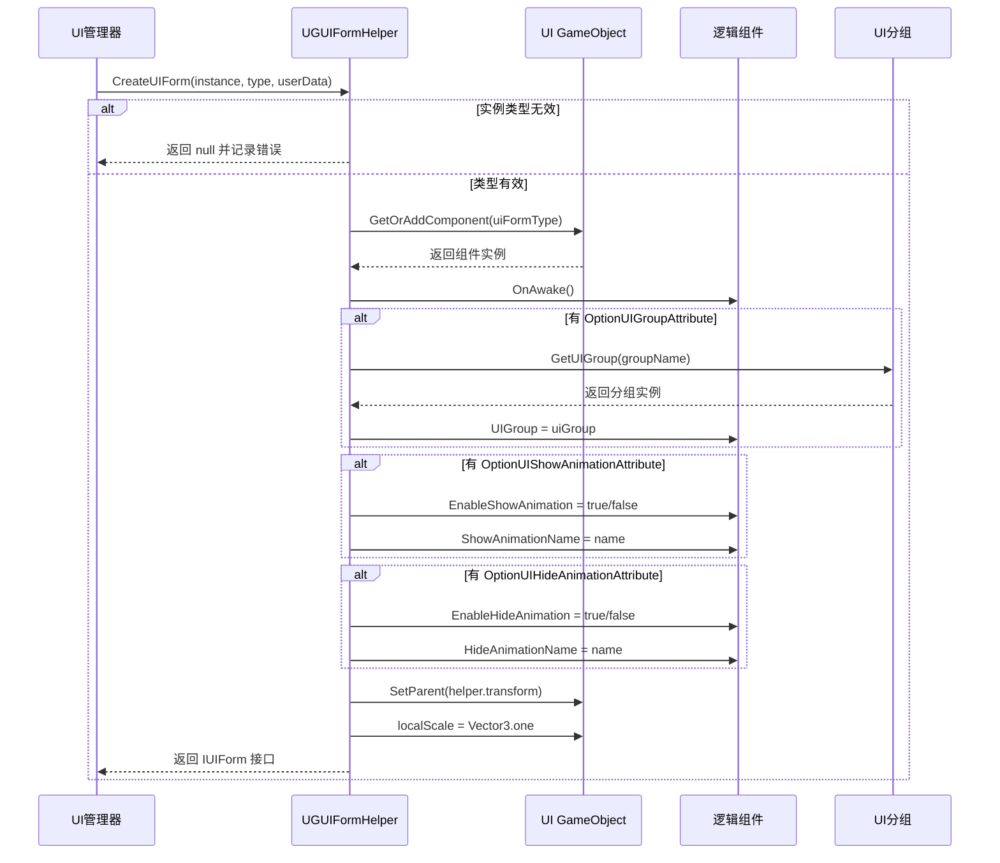

# 表单辅助器

表单辅助器（Form Helper）是 GameFrameX UGUI 系统中负责 UI 表单インスタンス化、作成和解放的コアコンポーネント。它作为 UI マネージャー与实际 UI リソース之间的桥梁，カプセル化了界面作成的所有底层逻辑。

## 概要

`UGUIFormHelper` 是 UGUI 界面的デフォルト表单辅助器，継承自 `UIFormHelperBase` 抽象类。它承担了三个コア职责：

1. **インスタンス化界面**：将 UI リソースロード为可用的 GameObject インスタンス
2. **作成界面**：为インスタンス追加逻辑コンポーネント、設定分组、設定动画等
3. **解放界面**：アンロードリソース并破棄インスタンス

通过使用表单辅助器，UI 管理系统〜できます将界面リソース的ロード方法与业务逻辑解耦，使得系统能够サポート不同的リソースロード方法（如 AssetBundle、Resources 等）。

> 注意：`UIFormHelperBase` 抽象类定義在 `GameFrameX.UI.Runtime` パッケージ中，属于フレームワーク的基本 UI コンポーネント。このドキュメント主な介绍 `UGUIFormHelper` 的具体実装。

## Architecture


**アーキテクチャ説明：**
- `UGUIFormHelper` 依赖于 `UIComponent` 和 `AssetComponent`，通过 `GameEntry` 取得コンポーネントインスタンス
- 三个設定プロパティ用于在コード层面指定界面的分组和动画行为
- コアフロー按照インスタンス化 → 作成 → 解放的顺序执行

## コア機能

### インスタンス化界面

```csharp
public override object InstantiateUIForm(object uiFormAsset)
{
    return (Object)uiFormAsset;
}
```

> Source: [UGUIFormHelper.cs](https://github.com/GameFrameX/com.gameframex.unity.ui.ugui/blob/main/Runtime/UGUIFormHelper.cs#L77-L80)

インスタンス化过程相对シンプル，直接将ロード的リソース对象返す。在 UGUI 系统中，ロード的リソース本身就是可用的 Unity Object。

### 作成界面

作成界面是表单辅助器的コア機能，它完成了以下工作：

1. **タイプ検証**：確認してください传入的インスタンス是有效的 GameObject
2. **コンポーネント追加**：为 GameObject 追加界面逻辑コンポーネント
3. **初期化呼び出し**：呼び出し界面的 `OnAwake` メソッド
4. **分组設定**：根据 `OptionUIGroupAttribute` 取得并設定 UI 分组
5. **动画設定**：根据 `OptionUIShowAnimationAttribute` 和 `OptionUIHideAnimationAttribute` 設定显示/隐藏动画
6. **层级設定**：将界面設定为正确的父子关系和缩放

```csharp
public override IUIForm CreateUIForm(object uiFormInstance, Type uiFormType, object userData)
{
    var uiGameObject = uiFormInstance as GameObject;
    if (uiGameObject == null)
    {
        Log.Error($"UI form instance type {uiFormType} is invalid.");
        return null;
    }

    var componentType = uiGameObject.GetOrAddComponent(uiFormType);
    if (!(componentType is IUIForm uiForm))
    {
        Log.Error($"UI form instance type {uiFormType} is invalid.");
        return null;
    }

    if (uiForm.IsAwake == false)
    {
        uiForm.OnAwake();
    }
    // ... 分组和动画配置
}
```

> Source: [UGUIFormHelper.cs](https://github.com/GameFrameX/com.gameframex.unity.ui.ugui/blob/main/Runtime/UGUIFormHelper.cs#L93-L164)

### 解放界面

解放界面时，辅助器会根据設定决定是否自动解放リソース：

```csharp
public override void ReleaseUIForm(object uiFormAsset, object uiFormInstance, object assetHandle, string uiFormAssetPath, string uiFormAssetName)
{
    if (!m_UIComponent.EnableAutoReleaseUIForm)
    {
        return;
    }

    if (uiFormAssetPath.IndexOf(Utility.Asset.Path.BundlesDirectoryName, StringComparison.OrdinalIgnoreCase) >= 0)
    {
        m_AssetComponent.UnloadAsset(uiFormAssetPath);
    }
    else
    {
        UnityEngine.Resources.UnloadAsset((Object)uiFormInstance);
    }

    Destroy((Object)uiFormInstance);
}
```

> Source: [UGUIFormHelper.cs](https://github.com/GameFrameX/com.gameframex.unity.ui.ugui/blob/main/Runtime/UGUIFormHelper.cs#L178-L195)

**解放策略：**
- もし `EnableAutoReleaseUIForm` 为 false，则不执行解放
- もしリソースパスパッケージ含 bundles ディレクトリ，则使用 AssetComponent アンロード
- 否则使用 Resources.UnloadAsset アンロード
- 最後に破棄 GameObject インスタンス

## 界面作成フロー



## 使用設定プロパティ

### OptionUIGroupAttribute

用于指定界面所属的 UI 分组：

```csharp
[OptionUIGroup("MainPanel")]
public class MainMenuUI : UGUI
{
    // ...
}
```

### OptionUIShowAnimationAttribute

用于設定界面显示动画：

```csharp
[OptionUIShowAnimation(true, "FadeIn")]
public class MainMenuUI : UGUI
{
    // ...
}
```

### OptionUIHideAnimationAttribute

用于設定界面隐藏动画：

```csharp
[OptionUIHideAnimation(true, "FadeOut")]
public class MainMenuUI : UGUI
{
    // ...
}
```

## 設定オプション

| 設定项 | タイプ | デフォルト值 | 説明 |
|--------|------|--------|------|
| EnableAutoReleaseUIForm | bool | true | 是否在界面閉じる时自动解放リソース |

> 注意：UIComponent 的設定项在 `GameFrameX.UI.Runtime` パッケージ中定義，详情请参照 [UIマネージャー](./4-core-concepts.ui-manager) ドキュメント。

## API リファレンス

### `InstantiateUIForm(uiFormAsset: object): object`

インスタンス化 UI 界面リソース。

**パラメータ：**
- `uiFormAsset` (object): 要インスタンス化的界面リソース

**返す：** インスタンス化后的 Unity Object

---

### `CreateUIForm(uiFormInstance: object, uiFormType: Type, userData: object): IUIForm`

作成 UI 界面，完成コンポーネント追加和初期化。

**パラメータ：**
- `uiFormInstance` (object): 界面インスタンス（GameObject）
- `uiFormType` (Type): 界面逻辑类タイプ
- `userData` (object): ユーザー自定義数据

**返す：** IUIForm インターフェースインスタンス

**〜の可能性があります返す null 的情况：**
- uiFormInstance 不是有效的 GameObject
- 追加的コンポーネント不実装 IUIForm インターフェース
- UI 分组无效

---

### `ReleaseUIForm(uiFormAsset: object, uiFormInstance: object, assetHandle: object, uiFormAssetPath: string, uiFormAssetName: string): void`

解放 UI 界面リソース。

**パラメータ：**
- `uiFormAsset` (object): 界面リソース
- `uiFormInstance` (object): 界面インスタンス
- `assetHandle` (object): リソース句柄
- `uiFormAssetPath` (string): 界面リソースパス
- `uiFormAssetName` (string): 界面リソース名称

---

## 関連リンク

- [UGUI 基底クラス](./4-core-concepts.ugui-base) - UGUI 界面的基底クラス実装
- [UI マネージャー](./4-core-concepts.ui-manager) - UI マネージャー的完全な機能
- [コード生成器](./6-editor-tools.code-generator) - 自动生成 UI コード
- [官方ドキュメント](https://gameframex.doc.alianblank.com)
