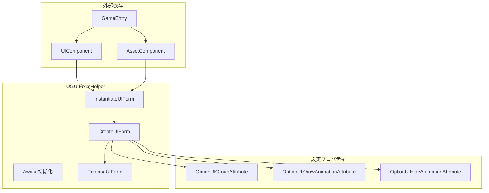
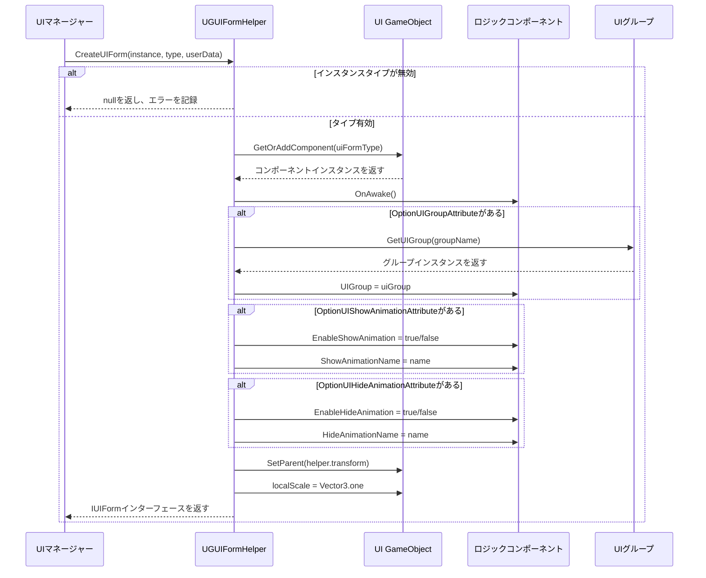

# フォームヘルパー

フォームヘルパー（Form Helper）はGameFrameX UGUIシステムにおいて、UIフォームのインスタンス化、作成、解放を担当するコアコンポーネントです。UIマネージャーと実際のUIアセット間のブリッジとして、画面作成のすべての低レベルロジックをラップします。

## 概要

`UGUIFormHelper`はUGUI画面のデフォルトのフォームヘルパーであり、`UIFormHelperBase`抽象クラスを継承します。3つのコア責務を担っています：

1. **画面をインスタンス化**：UIアセットを読み込んで使用可能なGameObjectインスタンスにする
2. **画面を作成**：インスタンスにロジックコンポーネントを追加、グループを設定、アニメーションを構成など
3. **画面を解放**：アセットをアンロードしてインスタンスを破棄

フォームヘルパーを使用することで、UI管理システムは画面アセットの読み込み方法をビジネスロジックから分離でき、システムがさまざまなアセット読み込み方法（AssetBundle、Resourcesなど）をサポートできるようになります。

> 注意：`UIFormHelperBase`抽象クラスは`GameFrameX.UI.Runtime`パッケージに定義されており、フレームワークの基本UIコンポーネントに属します。本文書では主に`UGUIFormHelper`の具体的な実装を紹介します。

## Architecture



**アーキテクチャ説明：**
- `UGUIFormHelper`は`UIComponent`と`AssetComponent`に依存し、`GameEntry`を通じてコンポーネントインスタンスを取得
- 3つの設定属性はコードレベルで画面のグループとアニメーション動作を指定するために使用
- コアフローはインスタンス化 → 作成 → 解放の順序で実行

## コア機能

### 画面をインスタンス化

```csharp
public override object InstantiateUIForm(object uiFormAsset)
{
    return (Object)uiFormAsset;
}
```

> Source: [UGUIFormHelper.cs](https://github.com/GameFrameX/com.gameframex.unity.ui.ugui/blob/main/Runtime/UGUIFormHelper.cs#L77-L80)

インスタンス化プロセスは比較的シンプルで、読み込まれたアセットオブジェクトを直接返します。UGUIシステムでは、読み込まれたアセット自体が使用可能なUnity Objectです。

### 画面を作成

画面を作成することはフォームヘルパーのコア機能であり、以下の作業を行います：

1. **タイプ検証**：渡されたインスタンスが有効なGameObjectであることを確認
2. **コンポーネントを追加**：GameObjectに画面ロジックコンポーネントを追加
3. **初期化を呼び出す**：画面の`OnAwake`メソッドを呼び出す
4. **グループを設定**：`OptionUIGroupAttribute`に基づいてUIグループを取得して設定
5. **アニメーションを構成**：`OptionUIShowAnimationAttribute`と`OptionUIHideAnimationAttribute`に基づいて表示/非表示アニメーションを構成
6. **レイヤーを設定**：画面を正しい親子関係とスケールに設定

```csharp
public override IUIForm CreateUIForm(object uiFormInstance, Type uiFormType, object userData)
{
    var uiGameObject = uiFormInstance as GameObject;
    if (uiGameObject == null)
    {
        Log.Error($"UI form instance type {uiFormType} is invalid.");
        return null;
    }

    var componentType = uiGameObject.GetOrAddComponent(uiFormType);
    if (!(componentType is IUIForm uiForm))
    {
        Log.Error($"UI form instance type {uiFormType} is invalid.");
        return null;
    }

    if (uiForm.IsAwake == false)
    {
        uiForm.OnAwake();
    }
    // ... グループとアニメーションの設定
}
```

> Source: [UGUIFormHelper.cs](https://github.com/GameFrameX/com.gameframex.unity.ui.ugui/blob/main/Runtime/UGUIFormHelper.cs#L93-L164)

### 画面を解放

画面を解放する際ヘルパーは設定に基づいて自動解放するかを判断：

```csharp
public override void ReleaseUIForm(object uiFormAsset, object uiFormInstance, object assetHandle, string uiFormAssetPath, string uiFormAssetName)
{
    if (!m_UIComponent.EnableAutoReleaseUIForm)
    {
        return;
    }

    if (uiFormAssetPath.IndexOf(Utility.Asset.Path.BundlesDirectoryName, StringComparison.OrdinalIgnoreCase) >= 0)
    {
        m_AssetComponent.UnloadAsset(uiFormAssetPath);
    }
    else
    {
        UnityEngine.Resources.UnloadAsset((Object)uiFormInstance);
    }

    Destroy((Object)uiFormInstance);
}
```

> Source: [UGUIFormHelper.cs](https://github.com/GameFrameX/com.gameframex.unity.ui.ugui/blob/main/Runtime/UGUIFormHelper.cs#L178-L195)

**解放戦略：**
- `EnableAutoReleaseUIForm`がfalseの場合、解放を実行しない
- アセットpathにbundlesディレクトリが含まれている場合、AssetComponentを使用してアンロード
- それ以外の場合はResources.UnloadAssetを使用してアンロード
- 最後にGameObjectインスタンスを破棄

## 画面作成フロー



## 属性設定を使用

### OptionUIGroupAttribute

画面が属するUIグループを指定するために使用：

```csharp
[OptionUIGroup("MainPanel")]
public class MainMenuUI : UGUI
{
    // ...
}
```

### OptionUIShowAnimationAttribute

画面表示アニメーションを構成するために使用：

```csharp
[OptionUIShowAnimation(true, "FadeIn")]
public class MainMenuUI : UGUI
{
    // ...
}
```

### OptionUIHideAnimationAttribute

画面非表示アニメーションを構成するために使用：

```csharp
[OptionUIHideAnimation(true, "FadeOut")]
public class MainMenuUI : UGUI
{
    // ...
}
```

## 設定オプション

| 設定項目 | タイプ | デフォルト値 | 説明 |
|--------|------|--------|------|
| EnableAutoReleaseUIForm | bool | true | 画面を閉じる時にアセットを自動解放するか |

> 注意：UIComponentの設定項目は`GameFrameX.UI.Runtime`パッケージに定義されており、詳細については[UIマネージャー](./4-core-concepts.ui-manager)文書を参照してください。

## APIリファレンス

### `InstantiateUIForm(uiFormAsset: object): object`

UI画面アセットをインスタンス化。

**パラメータ：**
- `uiFormAsset` (object): インスタンス化する画面アセット

**返値：** インスタンス化後のUnity Object

---

### `CreateUIForm(uiFormInstance: object, uiFormType: Type, userData: object): IUIForm`

UI画面を作成、コンポーネント追加と初期化を完了。

**パラメータ：**
- `uiFormInstance` (object): 画面インスタンス（GameObject）
- `uiFormType` (Type): 画面ロジッククラスタイプ
- `userData` (object): ユーザー定義データ

**返値：** IUIFormインターフェースインスタンス

**nullを返す可能性がある場合：**
- uiFormInstanceが有効なGameObjectでない
- 追加されたコンポーネントがIUIFormインターフェースを実装していない
- UIグループが無効

---

### `ReleaseUIForm(uiFormAsset: object, uiFormInstance: object, assetHandle: object, uiFormAssetPath: string, uiFormAssetName: string): void`

UI画面アセットを解放。

**パラメータ：**
- `uiFormAsset` (object): 画面アセット
- `uiFormInstance` (object): 画面インスタンス
- `assetHandle` (object): アセットハンドル
- `uiFormAssetPath` (string): 画面アセットpath
- `uiFormAssetName` (string): 画面アセット名

---

## 関連リンク

- [UGUI基底クラス](./4-core-concepts.ugui-base) - UGUI画面の基底クラス実装
- [UIマネージャー](./4-core-concepts.ui-manager) - UIマネージャーの完全な機能
- [コードジェネレーター](./6-editor-tools.code-generator) - UIコードを自動生成
- [公式ドキュメント](https://gameframex.doc.alianblank.com)