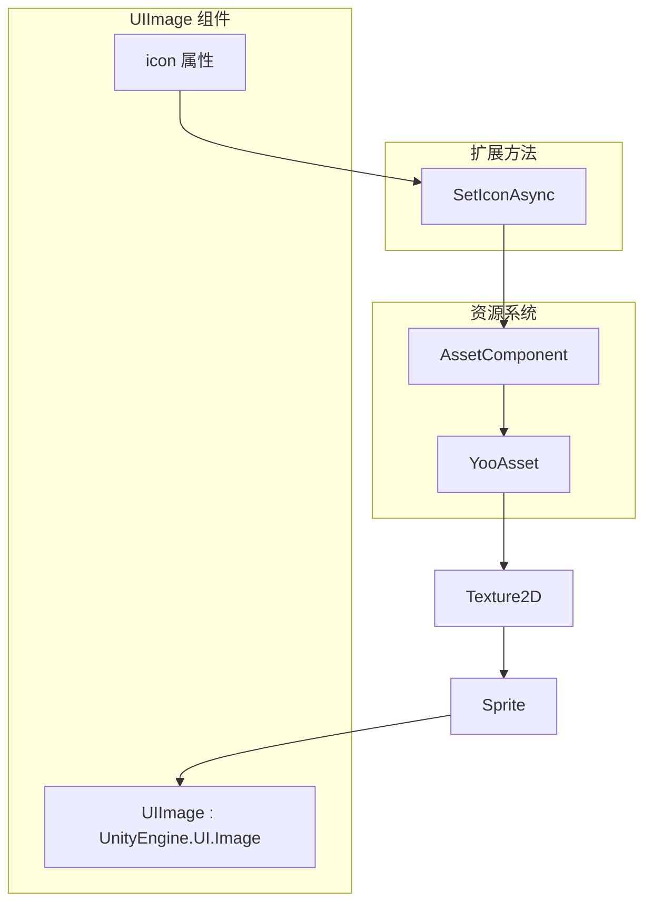
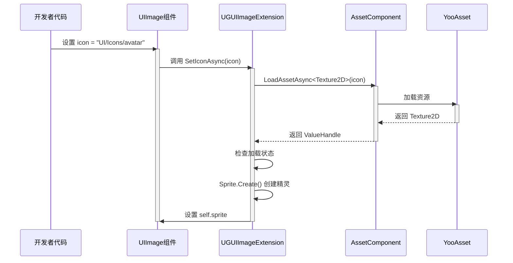

# UIImageコンポーネント

UIImage コンポーネント是 GameFrameX UGUI 系统中的增强型图片コンポーネント，継承自 Unity 原生的 `UnityEngine.UI.Image`，并追加了异步图标ロード機能。通过リソースパスつまり可自动ロード并显示图片，极大簡素化了 UI 图片的管理工作。

## 概要

UIImage コンポーネント旨在解决 Unity UGUI 中图片管理的常见痛点。在传统做法中，開発者〜する必要があります手动処理 Sprite 的ロード、内存管理および非同期ロード的协程コード。UIImage コンポーネント通过整合リソースシステム，提供します一个シンプル的 API，只需設定リソースパスつまり可自动完成图片的非同期ロード和显示。

该コンポーネント継承自 Unity 的 `Image` 类，因此完全兼容现有的 UGUI 系统，含みます Image 的所有プロパティ（如 Type、FillAmount、Color 等）和機能。開発者〜できます像使用普通 Image コンポーネント一样使用 UIImage，同時に获得非同期ロード的额外能力。

### コア機能

UIImage コンポーネント的コア機能围绕异步图标ロード展开。当設定 `icon` プロパティ时，コンポーネント会自动从リソースシステム中ロード对应的 Texture2D，并将其转换为 Sprite 显示在 Image 上。整个过程是异步进行的，不会阻塞主线程，这对于〜する必要がありますロード大量图片的 UI 界面尤为重要な。

コンポーネント内部使用了 GameFrameX 的リソース管理系统（AssetComponent）来ロードリソース，確認してください了リソースロード的統一された性和可追踪性。ロード失敗时会记录エラーログ，但不会抛出例外，这种温和的エラー処理方法适合 UI シーン，保证界面的稳定性。

## アーキテクチャ設計



### コンポーネント層次结构

UIImage コンポーネント在 UGUI 系统中的定位如上图所示。它位于 UI 表现层，直接継承自 Unity 的 Image コンポーネント。在コンポーネント内部，当設定 icon プロパティ时，会呼び出し拡張メソッド SetIconAsync 与リソースシステム进行交互。リソースシステム底层使用 YooAsset 进行实际的リソースロード，这种分层設計使得各部分职责清晰，便于维护和拡張。

拡張メソッド UGUIImageExtension 充当了 UIImage 与リソースシステム之间的桥梁，它负责将リソースパス转换为 Texture2D，再将 Texture2D 转换为 Sprite 設定到 Image 上。这个转换过程是异步的，使用了 async/await モード，確認してください了 UI 的流畅性。

## コアフロー

### 图标ロードフロー

当開発者設定 UIImage 的 icon プロパティ时，会トリガー以下非同期ロードフロー：



从序列图中〜できます看出，整个ロードフロー是异步的，不会阻塞呼び出し线程。開発者設定プロパティ后〜できます立つまり返す继续其他操作，图片ロード完成会自动显示。もしロード失敗，会通过ログ系统记录エラー，但不会中断程序执行。

### エディタ置換フロー

UIImageReplaceHandler 提供します将標準 Image 转换为 UIImage 的エディタ機能：

```mermaid
flowchart TD
    A[开发者右键点击Image] --> B[选择菜单项<br/>"Replace To UIImage"]
    B --> C[获取原Image所有属性]
    C --> D[销毁原Image组件]
    D --> E[添加UIImage组件]
    E --> F[恢复所有属性]
    F --> G[完成转换]
```

这个转换过程保留了原始 Image 的所有設定，含みますタイプ、材质、Sprite、颜色、射线cast設定等，確認してください转换是无损的。

## 使用例

### 基本用法

在 Unity シーン中作成一个 UIImage コンポーネント并設定图标リソースパス：

```csharp
using GameFrameX.UI.UGUI.Runtime;
using UnityEngine;

public class IconDisplayExample : MonoBehaviour
{
    [SerializeField]
    private UIImage iconImage;

    void Start()
    {
        // 设置图标，只需传入资源路径
        iconImage.icon = "UI/Icons/PlayerAvatar";
    }
}
```
> Source: [UIImage.cs](https://github.com/GameFrameX/com.gameframex.unity.ui.ugui/blob/main/Runtime/UIImage.cs#L58-L71)

### 拡張メソッド直接使用

除了通过 UIImage コンポーネント使用，也〜できます直接对普通 Image 呼び出し拡張メソッド：

```csharp
using GameFrameX.UI.UGUI.Runtime;
using UnityEngine.UI;

public class ImageExtensionExample : MonoBehaviour
{
    [SerializeField]
    private Image normalImage;

    async void Start()
    {
        // 使用扩展方法异步加载图标
        await normalImage.SetIconAsync("UI/Icons/StartButton");
    }
}
```
> Source: [UGUIImageExtension.cs](https://github.com/GameFrameX/com.gameframex.unity.ui.ugui/blob/main/Runtime/UGUIImageExtension.cs#L56-L74)

### エディタ中置換

在 Unity エディタ中，〜できます通过上下文メニュー将现有的 Image コンポーネント置換为 UIImage：

1. 在 Hierarchy 中选择带有 Image コンポーネント的游戏对象
2. 右键点击该对象
3. 选择 "CONTEXT/Image/Replace To UIImage(置換为UIImage)"

此操作会将 Image コンポーネント的所有プロパティ（タイプ、材质、Sprite、颜色等）完全な迁移到 UIImage。
> Source: [UIImageReplaceHandler.cs](https://github.com/GameFrameX/com.gameframex.unity.ui.ugui/blob/main/Editor/UIImageReplaceHandler.cs#L42-L76)

## API リファレンス

### UIImage 类

継承自 `UnityEngine.UI.Image`，追加了 icon プロパティ用于异步图标ロード。

```csharp
[DisallowMultipleComponent]
public class UIImage : UnityEngine.UI.Image
```

#### プロパティ

**icon** (string)

取得或設定图标リソースパス。当設定此プロパティ时，会自动从リソースシステムロード对应的图片并显示。

```csharp
public string icon
{
    get { return m_icon; }
    set
    {
        if (m_icon != value)
        {
            m_icon = value;
            _ = this.SetIconAsync(m_icon);
        }
    }
}
```

**パラメータ説明：**

| パラメータ | タイプ | 説明 |
|------|------|------|
| value | string | 图标リソースパス，相对于リソース根ディレクトリ |

**設計意图：** 使用プロパティ而不是メソッド的好处是〜できます在 Unity エディタ中直接拖拽或输入リソースパス，同時にサポート数据绑定シーン。当值发生变化时才トリガーロード，避免重复ロード相同的リソース。

### UGUIImageExtension 拡張メソッド类

提供对 UnityEngine.UI.Image 的拡張メソッド。

```csharp
public static class UGUIImageExtension
```

#### SetIconAsync

异步設定图标，通过リソースシステムロード纹理并作成 Sprite。

```csharp
public static async Task SetIconAsync(this UnityEngine.UI.Image self, string icon)
```

**パラメータ：**

- `self` (UnityEngine.UI.Image): 目标图片コンポーネント
- `icon` (string): 图标リソース地址

**戻り値：** Task 异步任务

**実装逻辑：**

1. 取得 AssetComponent インスタンス
2. 非同期ロード Texture2D リソース
3. 確認ロードステータス是否成功
4. 使用 Sprite.Create 作成精灵并設定到 Image

**エラー処理：** ロード失敗时会捕获例外并输出エラーログ，不会抛出例外。

```csharp
public static async Task SetIconAsync(this UnityEngine.UI.Image self, string icon)
{
    try
    {
        var assetComponent = GameEntry.GetComponent<AssetComponent>();
        using (var valueHandle = await assetComponent.LoadAssetAsync<Texture2D>(icon))
        {
            if (valueHandle.IsDone && valueHandle.Status == EOperationStatus.Succeed)
            {
                var texture2D = valueHandle.GetAssetObject<Texture2D>();
                self.sprite = Sprite.Create(
                    texture2D, 
                    new Rect(0, 0, texture2D.width, texture2D.height), 
                    new Vector2(0.5f, 0.5f)
                );
            }
        }
    }
    catch (System.Exception e)
    {
        Log.Error($"Failed to load icon '{icon}': {e.Message}");
    }
}
```
> Source: [UGUIImageExtension.cs](https://github.com/GameFrameX/com.gameframex.unity.ui.ugui/blob/main/Runtime/UGUIImageExtension.cs#L56-L74)

### UIImageReplaceHandler エディタ类

提供エディタ中的 Image 到 UIImage 转换機能。

```csharp
[CustomEditor(typeof(UnityEngine.UI.Image))]
public class UIImageReplaceHandler : UnityEditor.Editor
```

#### メニュー项

**CONTEXT/Image/Replace To UIImage(置換为UIImage)**

将选中的 Image コンポーネント置換为 UIImage，保留所有原有プロパティ設定。

> Source: [UIImageReplaceHandler.cs](https://github.com/GameFrameX/com.gameframex.unity.ui.ugui/blob/main/Editor/UIImageReplaceHandler.cs#L42-L76)

## 関連リンク

- [拡張メソッド](./5-components.extensions) - 確認更多 UGUI 拡張メソッド
- [UGUI基底クラス](./4-core-concepts.ugui-base) - 理解する UGUI 界面基底クラス
- [UIマネージャー](./4-core-concepts.ui-manager) - 理解する UI 管理系统
- [コード生成器](./6-editor-tools.code-generator) - 理解する自动コード生成工具
- [コンポーネント確認器](./6-editor-tools.inspector) - 理解するエディタ確認器工具
