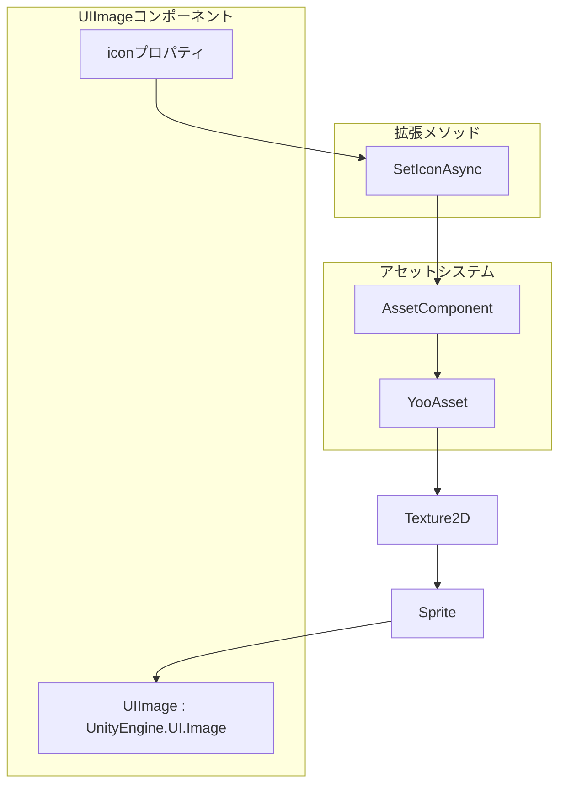
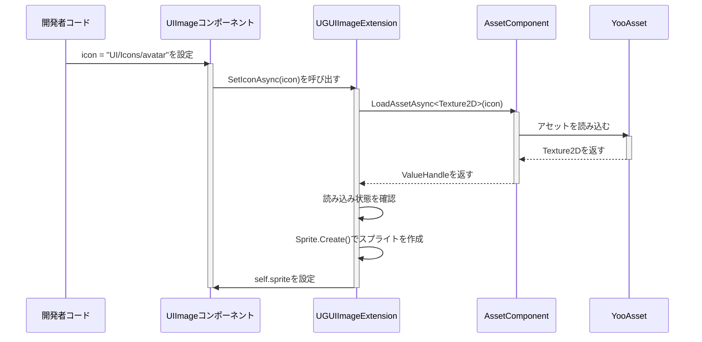

# UIImageコンポーネント

UIImageコンポーネントはGameFrameX UGUIシステムにおける拡張画像コンポーネントであり、Unityネイティブの`UnityEngine.UI.Image`を継承し、非同期アイコン読み込み機能を追加しています。アセットpathを設定するだけで画像を自動読み込みして表示でき、UI画像の管理作業を 크게簡素化します。

## 概要

UIImageコンポーネントはUnity UGUIにおける画像管理の一般的な問題点を解決します。従来の做法では、開発者はSpriteの読み込み、メモリ管理、非同期読み込みのコルーチンコードを自分で処理する必要があります。UIImageコンポーネントはアセットシステムを統合し、简洁なAPIを提供し、アセットpathを設定するだけで画像の非同期読み込みと表示を自動的に完了します。

このコンポーネントはUnityの`Image`クラスを継承しているため、既存のUGUIシステムと完全互換であり、Imageのすべてのプロパティ（Type、FillAmount、Colorなど）と機能が含まれます。開発者は通常のImageコンポーネントと同じようにUIImageを使用でき、同時に非同期読み込みの追加機能を得られます。

### コア機能

UIImageコンポーネントのコア機能は非同期アイコン読み込みを中心に展開しています。`icon`プロパティを設定すると、コンポーネントは自動的にアセットシステムから対応するTexture2Dを読み込み、Imageに表示するSpriteに変換します。 전체プロセスは非同期で実行され、メインスレッドをブロックしないため、大量の画像を読み込む必要があるUI画面で特に重要です。

コンポーネント内部ではGameFrameXのアセット管理システム（AssetComponent）を使用してアセットを読み込み、アセット読み込みの統一性と追跡可能性を确保しています。読み込み失敗時はエラーログを記録しますが、例外をスローせず、この温和なエラー処理方法はUIシーンに適しており、画面の安定性を保证します。

## アーキテクチャ設計



### コンポーネント階層構造

UIImageコンポーネントはUGUIシステムにおいて上の図に示す位置にあります。UI表示レイヤーに位置し、UnityのImageコンポーネントを直接継承します。コンポーネント内部では、iconプロパティを設定すると、拡張メソッドSetIconAsyncを呼び出してアセットシステムと対話します。アセットシステムの下部ではYooAssetを使用して実際のアセット読み込みを実行し、この階層化設計により各部の职责が明確になり、メンテナンスと拡張が容易になります。

拡張メソッドUGUIImageExtensionはUIImageとアセットシステムの間のブリッジとなり、アセットpathをTexture2Dに変換し、Texture2DをSpriteに変換してImageに設定します。この変換プロセスは非同期であり、async/awaitパターンを使用し、UIの流畅性を確保します。

## コアフロー

### アイコン読み込みフロー

開発者がUIImageのiconプロパティを設定すると、以下の非同期読み込みフローがトリガーされます：



シーケンス図から読み取れるように、整个読み込みフローは非同期であり、呼び出しスレッドをブロックしません。開発者はプロパティを設定した後、立即に他の操作に戻って継続でき、画像が読み込まれると自動的に表示されます。読み込みに失敗した場合は、ロギングシステムを通じてエラーを記録しますが、プログラム実行は中断されません。

### エディター置換フロー

UIImageReplaceHandlerは標準のImageをUIImageに変換するエディター機能を提供します：

```mermaid
flowchart TD
    A[開発者がImageを右クリック] --> B[メニュー項目を選択<br/>"Replace To UIImage"]
    B --> C[元のImageのすべてのプロパティを取得]
    C --> D[元のImageコンポーネントを破棄]
    D --> E[UIImageコンポーネントを追加]
    E --> F[すべてのプロパティを恢复]
    F --> G[変換完了]
```

この変換プロセスは元のImageのすべての設定を維持し、タイプ、材质、Sprite、色、レイキャスト設定などを含み、変換が无损であることを確保します。

## 使用例

### 基本的な使用

UnityシーンでUIImageコンポーネントを作成し、アイコンアセットpathを設定：

```csharp
using GameFrameX.UI.UGUI.Runtime;
using UnityEngine;

public class IconDisplayExample : MonoBehaviour
{
    [SerializeField]
    private UIImage iconImage;

    void Start()
    {
        // アイコンを設定、アセットpathを入力するだけ
        iconImage.icon = "UI/Icons/PlayerAvatar";
    }
}
```
> Source: [UIImage.cs](https://github.com/GameFrameX/com.gameframex.unity.ui.ugui/blob/main/Runtime/UIImage.cs#L58-L71)

### 拡張メソッドを直接使用

UIImageコンポーネントを使用する他に、通常のImageに対して拡張メソッドを直接呼び出すこともできます：

```csharp
using GameFrameX.UI.UGUI.Runtime;
using UnityEngine.UI;

public class ImageExtensionExample : MonoBehaviour
{
    [SerializeField]
    private Image normalImage;

    async void Start()
    {
        // 拡張メソッドを使用して非同期でアイコンを読み込む
        await normalImage.SetIconAsync("UI/Icons/StartButton");
    }
}
```
> Source: [UGUIImageExtension.cs](https://github.com/GameFrameX/com.gameframex.unity.ui.ugui/blob/main/Runtime/UGUIImageExtension.cs#L56-L74)

### エディターで置換

Unityエディターでは、コンテキストメニューを通じて既存のImageコンポーネントをUIImageに置換できます：

1. HierarchyでImageコンポーネントを持つゲームオブジェクトを選択
2. そのオブジェクトを右クリック
3. "CONTEXT/Image/Replace To UIImage(UIImageに置換)"を選択

この操作はImageコンポーネントのすべてのプロパティ（タイプ、材质、Sprite、色など）をUIImageに完全に移行します。
> Source: [UIImageReplaceHandler.cs](https://github.com/GameFrameX/com.gameframex.unity.ui.ugui/blob/main/Editor/UIImageReplaceHandler.cs#L42-L76)

## APIリファレンス

### UIImageクラス

`UnityEngine.UI.Image`を継承し、iconプロパティを追加して非同期アイコン読み込みに使用。

```csharp
[DisallowMultipleComponent]
public class UIImage : UnityEngine.UI.Image
```

#### プロパティ

**icon** (string)

アイコンアセットpathを取得または設定。このプロパティを設定すると、自動的にアセットシステムから対応する画像を読み込んで表示します。

```csharp
public string icon
{
    get { return m_icon; }
    set
    {
        if (m_icon != value)
        {
            m_icon = value;
            _ = this.SetIconAsync(m_icon);
        }
    }
}
```

**パラメータ説明：**

| パラメータ | タイプ | 説明 |
|------|------|------|
| value | string | アイコンアセットpath、アセットルートディレクトリからの相対path |

**設計意図：** プロパティ而不是メソッドを使用する利点は、Unityエディターで直接ドラッグ或は入力できることであり、同時にデータバインディングシーンもサポートします。値が変化した場合のみ読み込みをトリガーし、同一アセットの重複読み込みを回避します。

### UGUIImageExtension拡張メソッドクラス

UnityEngine.UI.Imageの拡張メソッドを提供します。

```csharp
public static class UGUIImageExtension
```

#### SetIconAsync

アイコンを非同期で設定、アセットシステムを通じてテクスチャを読み込み、Spriteを作成。

```csharp
public static async Task SetIconAsync(this UnityEngine.UI.Image self, string icon)
```

**パラメータ：**

- `self` (UnityEngine.UI.Image): 対象画像コンポーネント
- `icon` (string): アイコンアセットアドレス

**返値：** Task非同期タスク

**実装ロジック：**

1. AssetComponentインスタンスを取得
2. Texture2Dアセットを非同期で読み込む
3. 読み込み状態が成功かを確認
4. Sprite.Createを使用してスプライトを作成しImageに設定

**エラー処理：** 読み込み失敗時は例外を捕获してエラーログを出力し、例外をスローしません。

```csharp
public static async Task SetIconAsync(this UnityEngine.UI.Image self, string icon)
{
    try
    {
        var assetComponent = GameEntry.GetComponent<AssetComponent>();
        using (var valueHandle = await assetComponent.LoadAssetAsync<Texture2D>(icon))
        {
            if (valueHandle.IsDone && valueHandle.Status == EOperationStatus.Succeed)
            {
                var texture2D = valueHandle.GetAssetObject<Texture2D>();
                self.sprite = Sprite.Create(
                    texture2D,
                    new Rect(0, 0, texture2D.width, texture2D.height),
                    new Vector2(0.5f, 0.5f)
                );
            }
        }
    }
    catch (System.Exception e)
    {
        Log.Error($"Failed to load icon '{icon}': {e.Message}");
    }
}
```
> Source: [UGUIImageExtension.cs](https://github.com/GameFrameX/com.gameframex.unity.ui.ugui/blob/main/Runtime/UGUIImageExtension.cs#L56-L74)

### UIImageReplaceHandlerエディタークラス

エディターでのImageからUIImageへの変換機能を提供。

```csharp
[CustomEditor(typeof(UnityEngine.UI.Image))]
public class UIImageReplaceHandler : UnityEditor.Editor
```

#### メニュー項目

**CONTEXT/Image/Replace To UIImage(UIImageに置換)**

選択したImageコンポーネントをUIImageに置換、すべての元のプロパティ設定を保持。

> Source: [UIImageReplaceHandler.cs](https://github.com/GameFrameX/com.gameframex.unity.ui.ugui/blob/main/Editor/UIImageReplaceHandler.cs#L42-L76)

## 関連リンク

- [拡張メソッド](./5-components.extensions) - 他のUGUI拡張メソッドを表示
- [UGUI基底クラス](./4-core-concepts.ugui-base) - UGUI画面基底クラスを學習
- [UIマネージャー](./4-core-concepts.ui-manager) - UI管理システムを學習
- [コードジェネレーター](./6-editor-tools.code-generator) - 自動コード生成ツールを學習
- [コンポーネントインスペクター](./6-editor-tools.inspector) - エディターinspectorツールを學習