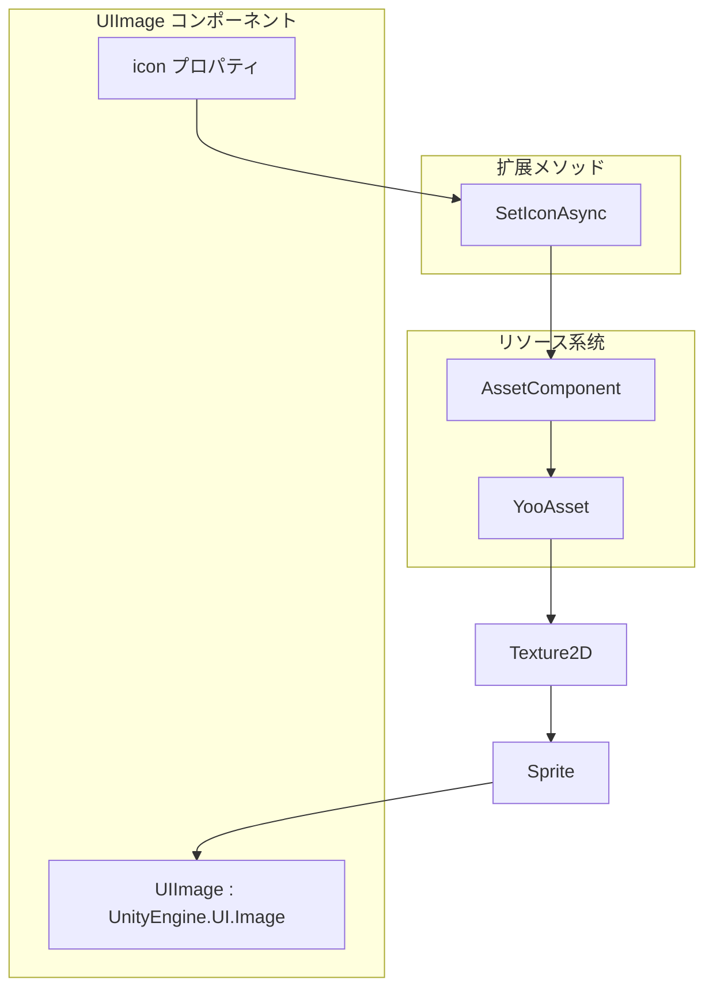
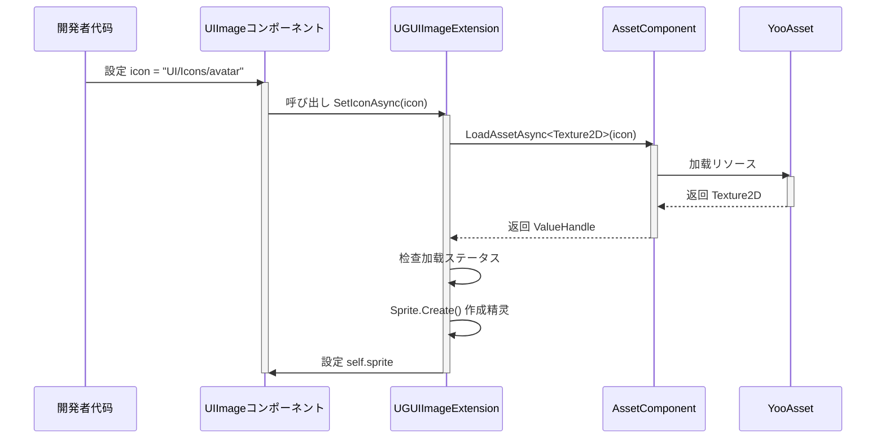

# UIImageコンポーネント

UIImage コンポーネント是 GameFrameX UGUI 系统中的增强型图片コンポーネント，を継承 Unity 原生的 `UnityEngine.UI.Image`，并添加了异步图标加载機能。を通じてリソース路径即可自动加载并显示图片，极大简化了 UI 图片的管理工作。

## 概要

UIImage コンポーネント旨在解决 Unity UGUI 中图片管理的常见痛点。在传统做法中，開発者必要手动处理 Sprite 的加载、内存管理以及异步加载的コルーチン代码。UIImage コンポーネントを通じて整合リソース系统，提供します一个简洁的 API，只需設定リソース路径即可自动完成图片的异步加载和显示。

该コンポーネントを継承 Unity 的 `Image` クラス，因此完全兼容现有的 UGUI 系统，包括 Image 的所有プロパティ（如 Type、FillAmount、Color 等）和機能。開発者可能像使用普通 Image コンポーネント一样使用 UIImage，同时获得异步加载的额外能力。

### コア機能

UIImage コンポーネント的コア機能围绕异步图标加载展开。当設定 `icon` プロパティ时，コンポーネント会自动从リソース系统中加载对应的 Texture2D，并将其转换为 Sprite 显示在 Image 上。整个过程是异步进行的，不会阻塞主线程，这对于必要加载大量图片的 UI 界面尤为重要。

コンポーネント内部使用了 GameFrameX 的リソース管理系统（AssetComponent）来加载リソース，确保了リソース加载的统一性和可追踪性。加载失败时会记录错误日志，但不会抛出異常，这种温和的错误处理方法适合 UI シーン，保证界面的稳定性。

## アーキテクチャ設計



### コンポーネント层次结构

UIImage コンポーネント在 UGUI 系统中的定位如上图所示。它位于 UI 表现层，直接を継承 Unity 的 Image コンポーネント。在コンポーネント内部，当設定 icon プロパティ时，会呼び出し扩展メソッド SetIconAsync 与リソース系统进行交互。リソース系统底层使用 YooAsset 进行实际的リソース加载，这种分层设计使得各部分职责清晰，メンテナンスと拡張が容易。

扩展メソッド UGUIImageExtension 充当了 UIImage 与リソース系统之间的桥梁，它负责将リソース路径转换为 Texture2D，再将 Texture2D 转换为 Sprite 設定到 Image 上。这个转换过程是异步的，使用了 async/await 模式，确保了 UI 的流畅性。

## コアフロー

### 图标加载フロー

当開発者設定 UIImage 的 icon プロパティ时，会触发以下异步加载フロー：



从序列图中可能看出，整个加载フロー是异步的，不会阻塞呼び出し线程。開発者設定プロパティ后可能立即返回继续其他操作，图片加载完成会自动显示。如果加载失败，会を通じて日志系统记录错误，但不会中断程序执行。

### 编辑器替换フロー

UIImageReplaceHandler 提供します将标准 Image 转换为 UIImage 的编辑器機能：

```mermaid
flowchart TD
    A[開発者右键点击Image] --> B[选择菜单项<br/>"Replace To UIImage"]
    B --> C[取得原Image所有プロパティ]
    C --> D[销毁原Imageコンポーネント]
    D --> E[添加UIImageコンポーネント]
    E --> F[恢复所有プロパティ]
    F --> G[完成转换]
```

这个转换过程保留了原始 Image 的所有設定，包括クラス型、材质、Sprite、颜色、射线cast設定等，确保转换是无损的。

## 使用例

### 基本用法

在 Unity シーン中作成一个 UIImage コンポーネント并設定图标リソース路径：

```csharp
using GameFrameX.UI.UGUI.Runtime;
using UnityEngine;

public class IconDisplayExample : MonoBehaviour
{
    [SerializeField]
    private UIImage iconImage;

    void Start()
    {
        // 設定图标，只需传入リソース路径
        iconImage.icon = "UI/Icons/PlayerAvatar";
    }
}
```
> Source: [UIImage.cs](https://github.com/GameFrameX/com.gameframex.unity.ui.ugui/blob/main/Runtime/UIImage.cs#L58-L71)

### 扩展メソッド直接使用

除了を通じて UIImage コンポーネント使用，也可能直接对普通 Image 呼び出し扩展メソッド：

```csharp
using GameFrameX.UI.UGUI.Runtime;
using UnityEngine.UI;

public class ImageExtensionExample : MonoBehaviour
{
    [SerializeField]
    private Image normalImage;

    async void Start()
    {
        // 使用扩展メソッド异步加载图标
        await normalImage.SetIconAsync("UI/Icons/StartButton");
    }
}
```
> Source: [UGUIImageExtension.cs](https://github.com/GameFrameX/com.gameframex.unity.ui.ugui/blob/main/Runtime/UGUIImageExtension.cs#L56-L74)

### 编辑器中替换

在 Unity 编辑器中，可能を通じて上下文菜单将现有的 Image コンポーネント替换为 UIImage：

1. 在 Hierarchy 中选择带有 Image コンポーネント的ゲーム对象
2. 右键点击该对象
3. 选择 "CONTEXT/Image/Replace To UIImage(替换为UIImage)"

此操作会将 Image コンポーネント的所有プロパティ（クラス型、材质、Sprite、颜色等）完整迁移到 UIImage。
> Source: [UIImageReplaceHandler.cs](https://github.com/GameFrameX/com.gameframex.unity.ui.ugui/blob/main/Editor/UIImageReplaceHandler.cs#L42-L76)

## API 参考

### UIImage クラス

を継承 `UnityEngine.UI.Image`，添加了 icon プロパティに使用异步图标加载。

```csharp
[DisallowMultipleComponent]
public class UIImage : UnityEngine.UI.Image
```

#### プロパティ

**icon** (string)

取得或設定图标リソース路径。当設定此プロパティ时，会自动从リソース系统加载对应的图片并显示。

```csharp
public string icon
{
    get { return m_icon; }
    set
    {
        if (m_icon != value)
        {
            m_icon = value;
            _ = this.SetIconAsync(m_icon);
        }
    }
}
```

**参数説明：**

| 参数 | クラス型 | 説明 |
|------|------|------|
| value | string | 图标リソース路径，相对于リソース根ディレクトリ |

**设计意图：** 使用プロパティ而不是メソッド的好处是可能在 Unity 编辑器中直接拖拽或输入リソース路径，同时サポート数据绑定シーン。当值发生变化时才触发加载，避免重复加载相同的リソース。

### UGUIImageExtension 扩展メソッドクラス

提供对 UnityEngine.UI.Image 的扩展メソッド。

```csharp
public static class UGUIImageExtension
```

#### SetIconAsync

异步設定图标，を通じてリソース系统加载纹理并作成 Sprite。

```csharp
public static async Task SetIconAsync(this UnityEngine.UI.Image self, string icon)
```

**参数：**

- `self` (UnityEngine.UI.Image): 目标图片コンポーネント
- `icon` (string): 图标リソース地址

**返回值：** Task 异步任务

**実装逻辑：**

1. 取得 AssetComponent インスタンス
2. 异步加载 Texture2D リソース
3. 检查加载ステータス是否成功
4. 使用 Sprite.Create 作成精灵并設定到 Image

**错误处理：** 加载失败时会捕获異常并输出错误日志，不会抛出異常。

```csharp
public static async Task SetIconAsync(this UnityEngine.UI.Image self, string icon)
{
    try
    {
        var assetComponent = GameEntry.GetComponent<AssetComponent>();
        using (var valueHandle = await assetComponent.LoadAssetAsync<Texture2D>(icon))
        {
            if (valueHandle.IsDone && valueHandle.Status == EOperationStatus.Succeed)
            {
                var texture2D = valueHandle.GetAssetObject<Texture2D>();
                self.sprite = Sprite.Create(
                    texture2D, 
                    new Rect(0, 0, texture2D.width, texture2D.height), 
                    new Vector2(0.5f, 0.5f)
                );
            }
        }
    }
    catch (System.Exception e)
    {
        Log.Error($"Failed to load icon '{icon}': {e.Message}");
    }
}
```
> Source: [UGUIImageExtension.cs](https://github.com/GameFrameX/com.gameframex.unity.ui.ugui/blob/main/Runtime/UGUIImageExtension.cs#L56-L74)

### UIImageReplaceHandler 编辑器クラス

提供编辑器中的 Image 到 UIImage 转换機能。

```csharp
[CustomEditor(typeof(UnityEngine.UI.Image))]
public class UIImageReplaceHandler : UnityEditor.Editor
```

#### 菜单项

**CONTEXT/Image/Replace To UIImage(替换为UIImage)**

将選択的 Image コンポーネント替换为 UIImage，保留所有原有プロパティ設定。

> Source: [UIImageReplaceHandler.cs](https://github.com/GameFrameX/com.gameframex.unity.ui.ugui/blob/main/Editor/UIImageReplaceHandler.cs#L42-L76)

## 関連リンク

- [扩展メソッド](./5-components.extensions) - 查看更多 UGUI 扩展メソッド
- [UGUI基クラス](./4-core-concepts.ugui-base) - 了解 UGUI 界面基クラス
- [UI管理器](./4-core-concepts.ui-manager) - 了解 UI 管理系统
- [代码生成器](./6-editor-tools.code-generator) - 了解自动代码生成工具
- [コンポーネント检查器](./6-editor-tools.inspector) - 了解编辑器检查器工具
