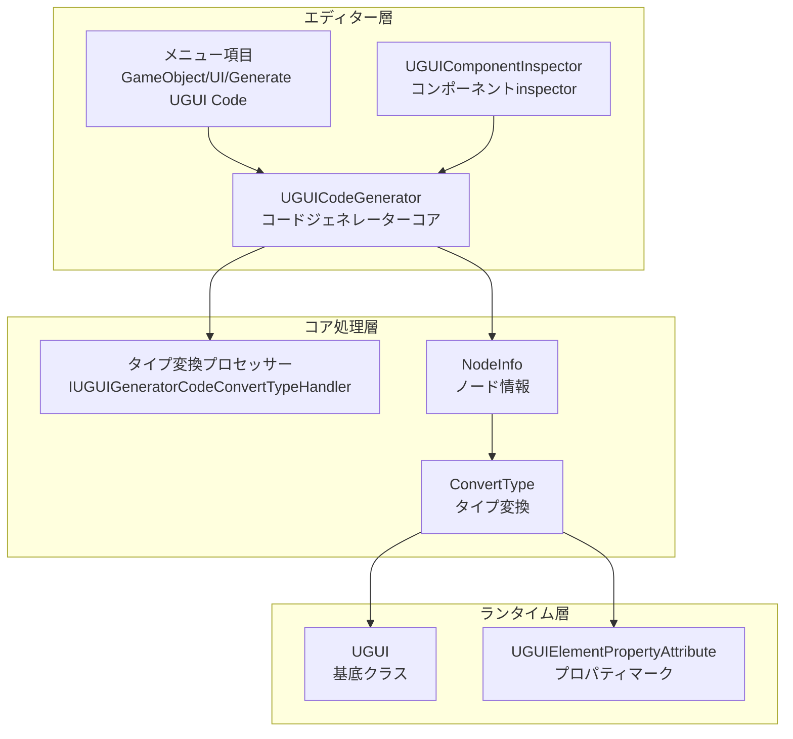
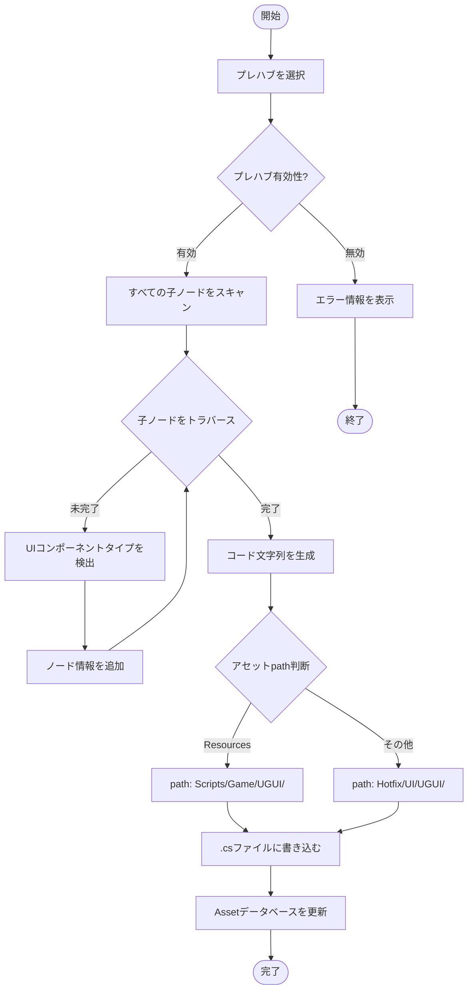

# コードジェネレーター

コードジェネレーターはGameFrameX UGUIプラグインのコアエディター機能であり、Unity UGUIプレハブから対応するC#コードを自動生成し、UI開発効率を大幅に向上させます。

## 概要

コードジェネレーター（UGUICodeGenerator）はUnityエディター機能であり、UGUIプレハブを使用可能なC#コードに自動変換します。それは以下のことができます：

- **UI階層を自動トラバース**：プレハブ内のすべての子オブジェクトを再帰的にスキャン
- **インテリジェントタイプ認識**：Button、Text、Image、ToggleなどのUIコンポーネントタイプを自動識別
- **拡張可能な変換メカニズム**：インターフェースを通じてカスタムUIコンポーネントタイプ認識をサポート
- **ワンプッシュコード生成**：メニューまたはinspectorからコード生成をトリガー

### 使用シーン

新しいUI画面を作成する必要がある時、大量の重复的なUI参照コードを自分で記述する必要はありません，只需：
1. UnityエディターでUGUIプレハブを作成或は選択
2. 右クリックしてコード生成メニューを選択
3. システムが開かれて自動的にすべてのUI参照を含むコードファイルを生成

## アーキテクチャ

コードジェネレーターはモジュラーデザインを採用しており、主に以下のコンポーネントを含みます：



### コンポーネント説明

| コンポーネント | ファイルpath | 責務 |
|------|----------|------|
| UGUICodeGenerator | `Editor/UGUICodeGenerator.cs` | メインコードジェネレーター、プレハブトラバーサルとコード生成を処理 |
| IUGUIGeneratorCodeConvertTypeHandler | `Editor/IUGUIGeneratorCodeConvertTypeHandler.cs` | タイプ変換プロセッサーインターフェース、拡張をサポート |
| UGUIComponentInspector | `Editor/UGUIComponentInspector.cs` | Unity inspector、コード再生成とバインディング機能を提供 |
| UGUIElementPropertyAttribute | `Runtime/UGUIElementPropertyAttribute.cs` | プロパティマーク、UI要素pathsを識別 |

## コア機能

### メニューによるトリガー方法

コードジェネレーターはUnityメニュー項目を通じて2つのトリガー方法を提供します：

```csharp
/// <summary>
/// UIコードを生成するメニュー項目
/// </summary>
[MenuItem("GameObject/UI/Generate UGUI Code(UGUIコードを生成)", false, 1)]
static void Code()
```

> Source: [UGUICodeGenerator.cs](https://github.com/GameFrameX/com.gameframex.unity.ui.ugui/blob/main/Editor/UGUICodeGenerator.cs#L56-L73)

### コード生成フロー



### UIコンポーネントタイプ認識

コードジェネレーターは優先順位に従って以下のUIコンポーネントタイプを順番に検出：

```csharp
// 各種UIコンポーネントが含まれているか順番に確認
UIBehaviour component = transform.GetComponent<Button>();
if (component != null) { return typeof(Button).FullName; }

component = transform.GetComponent<Text>();
if (component != null) { return typeof(Text).FullName; }

component = transform.GetComponent<Toggle>();
if (component != null) { return typeof(Toggle).FullName; }

// ... より多くのコンポーネントタイプ
```

> Source: [UGUICodeGenerator.cs](https://github.com/GameFrameX/com.gameframex.unity.ui.ugui/blob/main/Editor/UGUICodeGenerator.cs#L400-L497)

**サポートするUIコンポーネントタイプには以下が含まれます：**

- UnityEngine.UI.Button
- UnityEngine.UI.Text
- UnityEngine.UI.Image
- UnityEngine.UI.RawImage
- UnityEngine.UI.Toggle
- UnityEngine.UI.ToggleGroup
- UnityEngine.UI.InputField
- UnityEngine.UI.ScrollRect
- UnityEngine.UI.Dropdown
- UnityEngine.UI.Scrollbar
- UnityEngine.UI.Slider
- UnityEngine.UI.RectTransform
- UnityEngine.Transform
- GameFrameX.UI.UGUI.Runtime.UIImage（拡張コンポーネント）
- TMPro.TextMeshProUGUI（条件付きコンパイル）

### タイプ変換プロセッサー拡張

`IUGUIGeneratorCodeConvertTypeHandler`インターフェースを実装することで、カスタムのUIコンポーネントタイプ認識ロジックを追加できます：

```csharp
/// <summary>
/// UIコントロールタイプ変換インターフェース
/// </summary>
public interface IUGUIGeneratorCodeConvertTypeHandler
{
    /// <summary>
    /// プロセッサー優先順位、数値が小さいほど優先度が高い
    /// </summary>
    int Priority { get; }

    /// <summary>
    /// タイプ変換を実行
    /// </summary>
    /// <param name="transform">変換するTransform</param>
    /// <returns>変換後のタイプ名</returns>
    string Run(Transform transform);
}
```

> Source: [IUGUIGeneratorCodeConvertTypeHandler.cs](https://github.com/GameFrameX/com.gameframex.unity.ui.ugui/blob/main/Editor/IUGUIGeneratorCodeConvertTypeHandler.cs#L39-L52)

プロセッサーは優先順位でソートされた後順番に実行され、あるプロセッサーが非空タイプを返すと、そのタイプを採用：

```csharp
// 最初にカスタムプロセッサーで処理
if (_handler != null)
{
    foreach (var handler in _handler)
    {
        var type = handler.Run(transform);
        if (type != null)
        {
            return type;
        }
    }
}
```

> Source: [UGUICodeGenerator.cs](https://github.com/GameFrameX/com.gameframex.unity.ui.ugui/blob/main/Editor/UGUICodeGenerator.cs#L387-L398)

## 使用例

### 基本的な使用フロー

1. **UGUIプレハブを選択**：UnityエディターのHierarchy 또는 Projectウィンドウでコード生成が必要なUGUIプレハブを選択

2. **コード生成をトリガー**：
   - 方法一：プレハブを右クリック → `GameObject/UI/Generate UGUI Code(UGUIコードを生成)`
   - 方法二：プレハブのinspectorで「コード再生成」ボタンをクリック

3. **生成されたコードを表示**：コードは自動的に指定ディレクトリに生成

### 生成されるコード例

生成されるコード構造は以下の通りです：

```csharp
/** This is an automatically generated class by UGUI. Please do not modify it. **/

#if ENABLE_UI_UGUI
using Cysharp.Threading.Tasks;
using GameFrameX.Entity.Runtime;
using GameFrameX.UI.Runtime;
using GameFrameX.Runtime;
using GameFrameX.UI.UGUI.Runtime;
using UnityEngine;

namespace Hotfix.UI
{
    /// <summary>
    /// コード生成されたUIコード MainMenu
    /// </summary>
    [DisallowMultipleComponent]
    [OptionUIConfig(null, "UI/Forms/MainMenu")]
    public sealed partial class MainMenu : UGUI
    {
        public GameObject self { get; private set; }

        #region Properties

        [SerializeField] [UGUIElementProperty("Background")]
        private UnityEngine.UI.Image m_Background;

        public UnityEngine.UI.Image m_Background
        {
            get { return m_Background;}
        }

        [SerializeField] [UGUIElementProperty("Title")]
        private UnityEngine.UI.Text m_Title;

        public UnityEngine.UI.Text m_Title
        {
            get { return m_Title;}
        }

        [SerializeField] [UGUIElementProperty("StartButton")]
        private UnityEngine.UI.Button m_StartButton;

        public UnityEngine.UI.Button m_StartButton
        {
            get { return m_StartButton;}
        }

        #endregion

        private bool _isInitView = false;

        protected override void InitView()
        {
            if (_isInitView)
            {
                return;
            }

            _isInitView = true;
            this.self = this.gameObject;
            m_Background = gameObject.transform.FindChildName("Background").GetComponent<UnityEngine.UI.Image>();
            m_Title = gameObject.transform.FindChildName("Title").GetComponent<UnityEngine.UI.Text>();
            m_StartButton = gameObject.transform.FindChildName("StartButton").GetComponent<UnityEngine.UI.Button>();
        }
    }
}
#endif
```

> Source: [UGUICodeGenerator.cs](https://github.com/GameFrameX/com.gameframex.unity.ui.ugui/blob/main/Editor/UGUICodeGenerator.cs#L147-L230)

### バインディング再設定機能

プレハブのinspectorパネルで、「バインディング再設定」ボタンをクリックしてすべてのUI参照を再バインディングできます：

```csharp
bool buttonClicked = EditorGUILayout.DropdownButton(_reBind, FocusType.Passive, CustomButtonStyle);
if (buttonClicked && !EditorApplication.isPlaying)
{
    // バインディングを再設定
    Dictionary<string, string> fieldMap = new Dictionary<string, string>();
    foreach (var fieldInfo in fieldInfos)
    {
        var serializeFieldAttributes = fieldInfo.GetCustomAttribute(typeof(SerializeField));
        if (serializeFieldAttributes == null) { continue; }

        var uguiElementPropertyAttribute = fieldInfo.GetCustomAttribute(typeof(UGUIElementPropertyAttribute));
        if (uguiElementPropertyAttribute == null) { continue; }

        var elementPropertyAttribute = (UGUIElementPropertyAttribute)uguiElementPropertyAttribute;
        fieldMap[fieldInfo.Name] = elementPropertyAttribute.Path;
    }
    // ... バインディングロジック
}
```

> Source: [UGUIComponentInspector.cs](https://github.com/GameFrameX/com.gameframex.unity.ui.ugui/blob/main/Editor/UGUIComponentInspector.cs#L96-L132)

## 設定説明

### コード生成path規則

コードジェネレーターはプレハブの位置に基づいて自動的に生成pathを選択：

| プレハブ位置 | 生成path |
|------------|----------|
| "Resources"ディレクトリを含む | `Assets/Scripts/Game/UGUI/{プレハブ名}/` |
| その他位置 | `Assets/Hotfix/UI/UGUI/{プレハブ名}/` |

```csharp
if (assetPath.Contains(nameof(Resources)))
{
    savePath = System.IO.Path.Combine(Application.dataPath, "Scripts", "Game", "UGUI", className);
}
else
{
    savePath = System.IO.Path.Combine(Application.dataPath, "Hotfix", "UI", "UGUI", className);
}
```

> Source: [UGUICodeGenerator.cs](https://github.com/GameFrameX/com.gameframex.unity.ui.ugui/blob/main/Editor/UGUICodeGenerator.cs#L117-L127)

### 名前空間規則

生成されるコードはpathに基づいて自動的に名前空間を設定：

- Resourcesディレクトリ下のプレハブ：`namespace Unity.Startup`
- その他位置：`namespace Hotfix.UI`

> Source: [UGUICodeGenerator.cs](https://github.com/GameFrameX/com.gameframex.unity.ui.ugui/blob/main/Editor/UGUICodeGenerator.cs#L169-L177)

## 拡張開発

### カスタムタイプ変換プロセッサーを作成

`IUGUIGeneratorCodeConvertTypeHandler`インターフェースを実装することで、カスタムのUIコンポーネント認識ロジックを追加できます：

```csharp
using UnityEngine;
using GameFrameX.UI.UGUI.Editor;

public class CustomTypeHandler : IUGUIGeneratorCodeConvertTypeHandler
{
    public int Priority => 0; // 優先順位、数値が小さいほど先に実行

    public string Run(Transform transform)
    {
        // カスタムタイプ検出ロジック
        var customComponent = transform.GetComponent<CustomUIComponent>();
        if (customComponent != null)
        {
            return typeof(CustomUIComponent).FullName;
        }
        return null; // nullを返す場合は処理せず、他のプロセッサーを使用
    }
}
```

このプロセッサーは組み込みタイプ検出の前に実行され、以下の用途に使用できます：
- サードパーティUIコンポーネントライブラリのサポート
- カスタムコンポーネントタイプマッピング
- 特殊命名規則の自動認識

## 関連リンク

- [UGUI基底クラス](./4-core-concepts.ugui-base)
- [UIマネージャー](./4-core-concepts.ui-manager)
- [UIImageコンポーネント](./5-components.uiimage)
- [コンポーネントinspector](./6-editor-tools.inspector)
- [画像置換ハンドラー](./6-editor-tools.image-replace)
- [公式ドキュメント](https://gameframex.doc.alianblank.com)