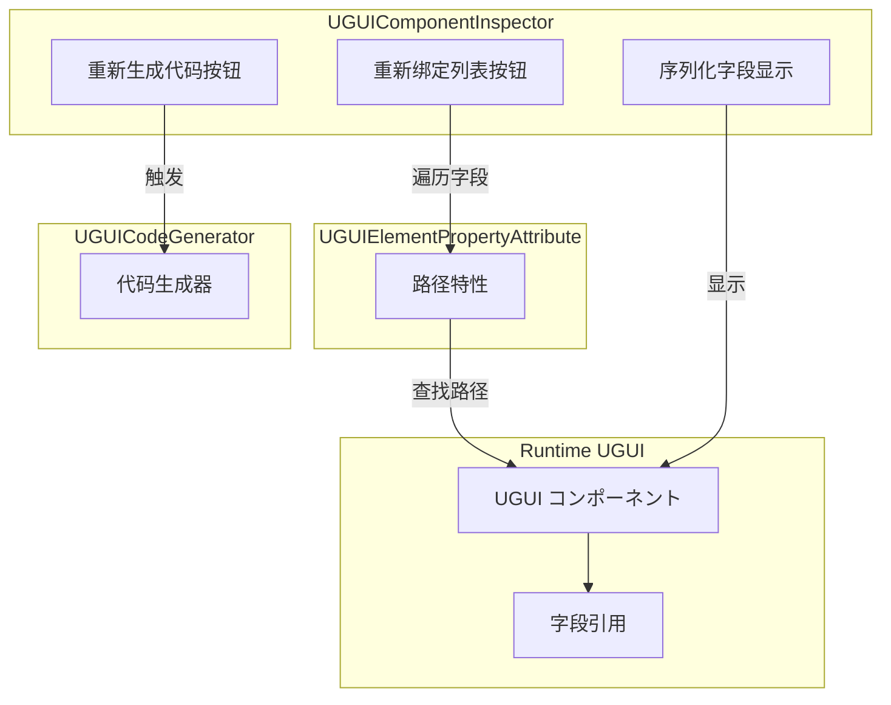
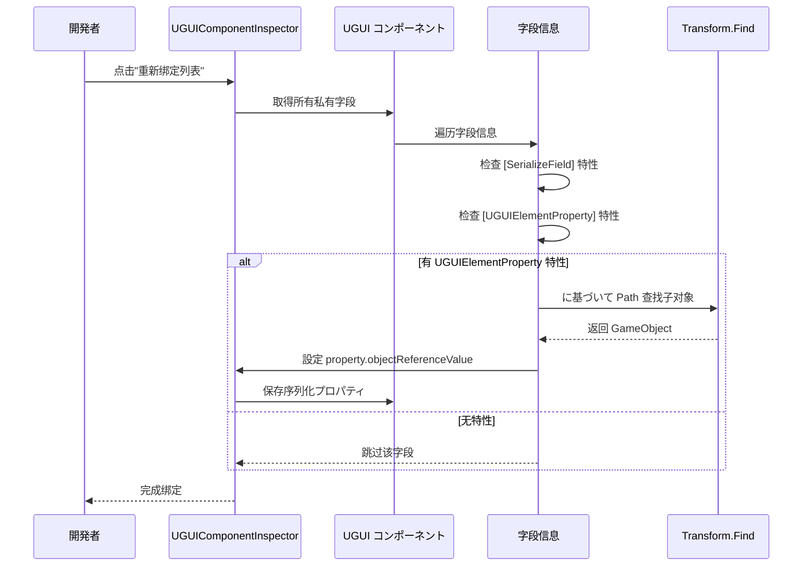

# コンポーネント检查器

コンポーネント检查器是 UGUI 插件的コア编辑器工具之一，に使用在 Unity Editor 中自定义 UGUI コンポーネント的インスペクターパネル。该检查器为開発者提供します便捷的代码生成和引用绑定機能，大大提升了 UI 开发效率。

## 概要

コンポーネント检查器（`UGUIComponentInspector`）是专门为 `UGUI` 基クラスコンポーネント定制的 Unity Editor 自定义インスペクターパネル。它を継承 `GameFrameworkInspector` 基クラス，提供します两个コア機能按钮，に使用自动化 UI 开发フロー中的重复性工作。

### 设计目的

在传统的 UGUI 开发模式中，開発者必要手动作成 UI 预制体、编写代码来引用各个 UI 元素，并在 Inspector 中逐个拖拽绑定引用。这种方法不仅效率低下，而且当 UI 结构发生变化时，必要手动更新大量引用。

コンポーネント检查器を通じて以下设计来解决这些问题：

1. **代码自动生成**：を通じて代码生成器自动遍历 UI 预制体结构，生成带有 `[UGUIElementProperty]` 特性的プロパティ代码
2. **引用自动绑定**：を通じて检查器按钮一键重新绑定所有 UI 元素引用，无需手动拖拽

### コア機能

- **重新生成代码**：基づく当前预制体结构重新生成 UI 代码ファイル
- **重新绑定列表**：に基づいて特性中的路径信息，自动查找并绑定 UI 元素引用

> Source: [UGUIComponentInspector.cs](https://github.com/GameFrameX/com.gameframex.unity.ui.ugui/blob/main/Editor/UGUIComponentInspector.cs#L44-L153)

## アーキテクチャ設計

コンポーネント检查器的アーキテクチャ設計遵循了 Unity Editor 扩展的开发模式，を通じて自定义 Inspector 来增强 Editor 的機能。



### コンポーネント説明

| コンポーネント | ファイル位置 | 职责 |
|------|----------|------|
| UGUIComponentInspector | Editor/UGUIComponentInspector.cs | 自定义インスペクターパネル，提供按钮交互 |
| UGUIElementPropertyAttribute | Runtime/UGUIElementPropertyAttribute.cs | 特性クラス，标记 UI 元素路径 |
| UGUICodeGenerator | Editor/UGUICodeGenerator.cs | 代码生成器，生成 UI 代码 |
| UGUI | Runtime/UGUI.cs | UGUI 基クラス，被检查器扩展 |

> Source: [UGUIElementPropertyAttribute.cs](https://github.com/GameFrameX/com.gameframex.unity.ui.ugui/blob/main/Runtime/UGUIElementPropertyAttribute.cs#L40-L64)

## コア実装

### 检查器クラス定义

检查器使用 `[CustomEditor]` 特性来声明自定义编辑器，を継承 `GameFrameworkInspector` 基クラス：

```csharp
[CustomEditor(typeof(Runtime.UGUI), true)]
internal sealed class UGUIComponentInspector : GameFrameworkInspector
{
    private GUIStyle _customButtonStyle;

    private readonly GUIContent _reBind = new GUIContent("重新绑定列表");
    private readonly GUIContent _reGenerate = new GUIContent("重新生成代码");

    public override void OnInspectorGUI()
    {
        // 检查器 GUI 実装
    }
}
```

> Source: [UGUIComponentInspector.cs](https://github.com/GameFrameX/com.gameframex.unity.ui.ugui/blob/main/Editor/UGUIComponentInspector.cs#L43-L80)

### 自定义按钮样式

检查器提供します自定义的按钮样式，采用大号字体和彩色文字设计，方便開発者识别操作按钮：

```csharp
private GUIStyle CustomButtonStyle
{
    get
    {
        if (_customButtonStyle == null)
        {
            _customButtonStyle = new GUIStyle(GUI.skin.button)
            {
                fontSize = 32,
                normal = { textColor = Color.green },
                hover = { textColor = Color.yellow },
                active = { textColor = Color.green },
                alignment = TextAnchor.MiddleCenter,
            };
        }
        return _customButtonStyle;
    }
}
```

> Source: [UGUIComponentInspector.cs](https://github.com/github.com/GameFrameX/com.gameframex.unity.ui.ugui/blob/main/Editor/UGUIComponentInspector.cs#L48-L75)

## コアフロー

### 重新绑定フロー

当開発者点击"重新绑定列表"按钮时，检查器会执行以下フロー：



### 重新绑定実装代码

```csharp
bool buttonClicked = EditorGUILayout.DropdownButton(_reBind, FocusType.Passive, CustomButtonStyle);
if (buttonClicked && !EditorApplication.isPlaying)
{
    // 重新绑定
    Dictionary<string, string> fieldMap = new Dictionary<string, string>();
    foreach (var fieldInfo in fieldInfos)
    {
        var serializeFieldAttributes = fieldInfo.GetCustomAttribute(typeof(SerializeField));
        if (serializeFieldAttributes == null)
        {
            continue;
        }

        var uguiElementPropertyAttribute = fieldInfo.GetCustomAttribute(typeof(UGUIElementPropertyAttribute));
        if (uguiElementPropertyAttribute == null)
        {
            continue;
        }

        var elementPropertyAttribute = (UGUIElementPropertyAttribute)uguiElementPropertyAttribute;
        fieldMap[fieldInfo.Name] = elementPropertyAttribute.Path;
    }

    foreach (var kv in fieldMap)
    {
        var property = serializedObject.FindProperty(kv.Key);
        if (property != null)
        {
            var targetFind = targetGameObject.transform.Find(kv.Value);
            if (targetFind != null)
            {
                property.objectReferenceValue = targetFind.gameObject;
            }
        }
    }
}
```

> Source: [UGUIComponentInspector.cs](https://github.com/GameFrameX/com.gameframex.unity.ui.ugui/blob/main/Editor/UGUIComponentInspector.cs#L96-L131)

### 字段显示（只读模式）

检查器还会显示所有序列化字段，但設定为只读模式，防止在 Editor 中意外修改：

```csharp
// 编辑器下不允许修改
GUI.enabled = false;
foreach (var fieldInfo in fieldInfos)
{
    var attributes = fieldInfo.GetCustomAttributes(typeof(SerializeField));
    if (!attributes.Any())
    {
        continue;
    }

    EditorGUILayout.ObjectField(fieldInfo.Name, fieldInfo.GetValue(targetUGUI) as Object, fieldInfo.FieldType, true);
}

GUI.enabled = true;
```

> Source: [UGUIComponentInspector.cs](https://github.com/GameFrameX/com.gameframex.unity.ui.ugui/blob/main/Editor/UGUIComponentInspector.cs#L134-L147)

## UGUIElementProperty 特性

`UGUIElementPropertyAttribute` 是コンポーネント检查器工作的コア特性，に使用标记 UI 控件在预制体中的路径。

### 特性定义

```csharp
/// <summary>
/// UGUI控件プロパティ特性，に使用标记UI控件在预制体中的路径。
/// </summary>
public sealed class UGUIElementPropertyAttribute : Attribute
{
    /// <summary>
    /// 取得控件路径。
    /// </summary>
    [UnityEngine.Scripting.Preserve]
    public string Path { get; }

    /// <summary>
    /// 初期化 <see cref="UGUIElementPropertyAttribute"/> クラス的新インスタンス。
    /// </summary>
    /// <param name="path">控件路径</param>
    [UnityEngine.Scripting.Preserve]
    public UGUIElementPropertyAttribute(string path)
    {
        Path = path;
    }
}
```

> Source: [UGUIElementPropertyAttribute.cs](https://github.com/GameFrameX/com.gameframex.unity.ui.ugui/blob/main/Runtime/UGUIElementPropertyAttribute.cs#L34-L64)

### 使用例

代码生成器会自动生成带有此特性的プロパティ代码：

```csharp
[SerializeField]
[UGUIElementProperty("Panel/Button_Start")]
private Button m_Button_Start;

public Button m_Button_Start
{
    get { return m_Button_Start; }
}
```

> Source: [UGUICodeGenerator.cs](https://github.com/GameFrameX/com.gameframex.unity.ui.ugui/blob/main/Editor/UGUICodeGenerator.cs#L259-L269)

## 使用シーン

### シーン一：UI 结构变更后的重新绑定

当 UI 预制体结构发生变化（如重命名、调整层级）后，原有的引用会失效。此时只需：

1. 重新生成代码（或手动更新路径）
2. 点击"重新绑定列表"按钮
3. 检查器会自动に基づいて新的路径查找并绑定 UI 元素

### シーン二：代码重构后的引用更新

在代码重构过程中，可能会修改字段名称或调整预制体结构。重新绑定機能可能快速恢复所有引用，而无需手动逐个拖拽。

### シーン三：多平台リソース路径调整

当必要调整 UI リソース的组织结构时，を通じて重新生成代码和重新绑定，可能快速适应新的リソース组织方法。

## 関連リンク

- [代码生成器](./6-editor-tools.code-generator) - 了解代码自动生成機能
- [UGUI 基クラス](./4-core-concepts.ugui-base) - 了解 UGUI 基クラス実装
- [图片替换处理器](./6-editor-tools.image-replace) - 了解 UI 图片替换機能
- [快速开始 - 使用代码生成器](./3-getting-started.code-generator) - 快速上手指南
