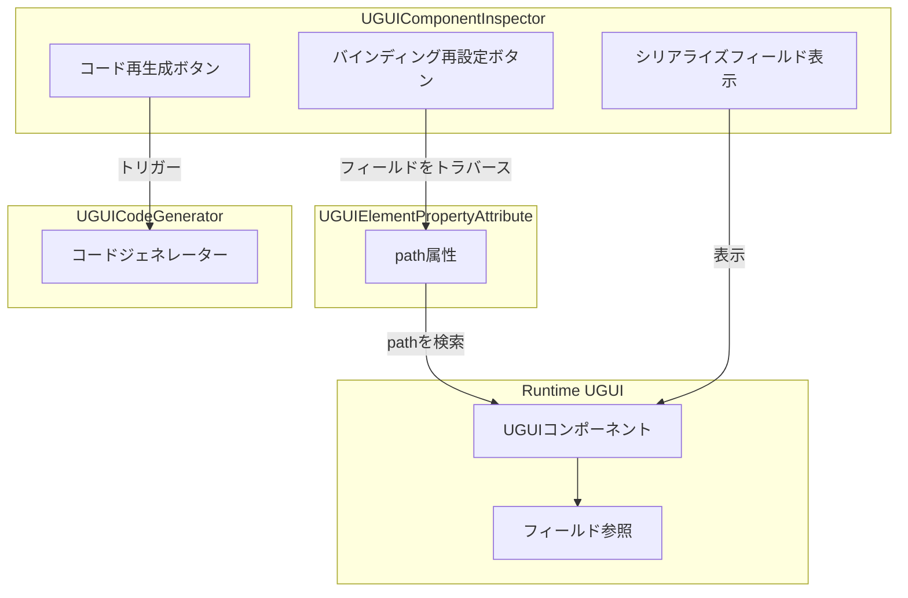
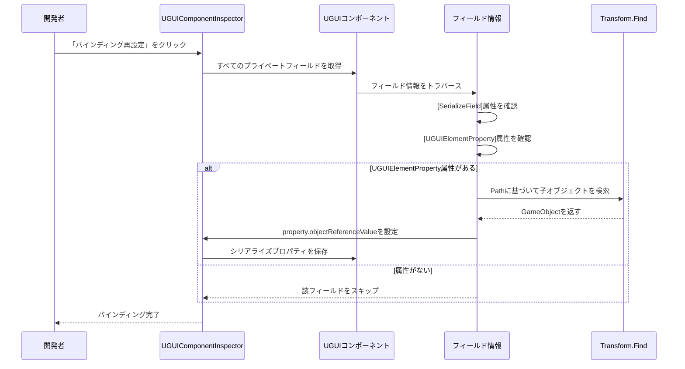

# コンポーネントinspector

コンポーネントinspectorはUGUIプラグインのコアエディター機能の一つであり、Unity EditorでUGUIコンポーネントのinspectorパネルをカスタマイズするために使用されます。このinspectorは開発者に便捷なコード生成と参照バインディング機能を提供し、UI開発効率を大幅に向上させます。

## 概要

コンポーネントinspector（`UGUIComponentInspector`）は`UGUI`基底クラスコンポーネント専用のUnity Editorカスタムinspectorパネルです。`GameFrameworkInspector`基底クラスを継承し、2つのコア機能ボタンを提供して、UI開発フローにおける繰り返し作業を自動化します。

### 設計目的

従来のUGUI開発モードでは、開発者はUIプレハブを作成したり、コードを作成して各UI要素を参照したり、inspectorで1つずつドラッグして参照をバインディングする必要があります。この方法は効率が低いだけでなく、UI構造が変化した時、大量の参照を手動で更新する必要があります。

コンポーネントinspectorは以下の設計を通じて这些问题を解決します：

1. **コードの自動生成**：コードジェネレーターを通じてUIプレハブ構造を自動トラバースし、`[UGUIElementProperty]`属性を持つプロパティコードを生成
2. **参照の自動バインディング**：inspectorボタンをワンプッシュで、すべてのUI要素参照を再バインディング、手動ドラッグ不要

### コア機能

- **コード再生成**：現在のプレハブ構造に基づいてUIコードファイルを再生成
- **バインディング再設定**：属性のpath情報に基づいて、UI要素参照を自動検索してバインディング

> Source: [UGUIComponentInspector.cs](https://github.com/GameFrameX/com.gameframex.unity.ui.ugui/blob/main/Editor/UGUIComponentInspector.cs#L44-L153)

## アーキテクチャ設計

コンポーネントinspectorのアーキテクチャ設計はUnity Editor拡張の開発モードに従い、カスタムInspectorを通じてEditorの機能を強化します。



### コンポーネント説明

| コンポーネント | ファイル位置 | 責務 |
|------|----------|------|
| UGUIComponentInspector | Editor/UGUIComponentInspector.cs | カスタムinspectorパネル、ボタンインタラクションを提供 |
| UGUIElementPropertyAttribute | Runtime/UGUIElementPropertyAttribute.cs | 属性クラス、UI要素pathsをマーク |
| UGUICodeGenerator | Editor/UGUICodeGenerator.cs | コードジェネレーター、UIコードを生成 |
| UGUI | Runtime/UGUI.cs | UGUI基底クラス、inspectorによって拡張 |

> Source: [UGUIElementPropertyAttribute.cs](https://github.com/GameFrameX/com.gameframex.unity.ui.ugui/blob/main/Runtime/UGUIElementPropertyAttribute.cs#L40-L64)

## コア実装

### inspectorクラス定義

inspectorは`[CustomEditor]`属性を使用してカスタムエディターを宣言し、`GameFrameworkInspector`基底クラスを継承：

```csharp
[CustomEditor(typeof(Runtime.UGUI), true)]
internal sealed class UGUIComponentInspector : GameFrameworkInspector
{
    private GUIStyle _customButtonStyle;

    private readonly GUIContent _reBind = new GUIContent("バインディング再設定");
    private readonly GUIContent _reGenerate = new GUIContent("コード再生成");

    public override void OnInspectorGUI()
    {
        // inspector GUI実装
    }
}
```

> Source: [UGUIComponentInspector.cs](https://github.com/GameFrameX/com.gameframex.unity.ui.ugui/blob/main/Editor/UGUIComponentInspector.cs#L43-L80)

### カスタムボタン样式

inspectorはカスタムボタン样式を提供し、大きなフォントサイズと彩色テキストを採用하여、開発者が操作ボタンを識別しやすくします：

```csharp
private GUIStyle CustomButtonStyle
{
    get
    {
        if (_customButtonStyle == null)
        {
            _customButtonStyle = new GUIStyle(GUI.skin.button)
            {
                fontSize = 32,
                normal = { textColor = Color.green },
                hover = { textColor = Color.yellow },
                active = { textColor = Color.green },
                alignment = TextAnchor.MiddleCenter,
            };
        }
        return _customButtonStyle;
    }
}
```

> Source: [UGUIComponentInspector.cs](https://github.com/GameFrameX/com.gameframex.unity.ui.ugui/blob/main/Editor/UGUIComponentInspector.cs#L48-L75)

## コアフロー

### バインディング再設定フロー

開発者が「バインディング再設定」ボタンをクリックすると、inspectorは以下のフローを実行：



### バインディング再設定実装コード

```csharp
bool buttonClicked = EditorGUILayout.DropdownButton(_reBind, FocusType.Passive, CustomButtonStyle);
if (buttonClicked && !EditorApplication.isPlaying)
{
    // バインディングを再設定
    Dictionary<string, string> fieldMap = new Dictionary<string, string>();
    foreach (var fieldInfo in fieldInfos)
    {
        var serializeFieldAttributes = fieldInfo.GetCustomAttribute(typeof(SerializeField));
        if (serializeFieldAttributes == null)
        {
            continue;
        }

        var uguiElementPropertyAttribute = fieldInfo.GetCustomAttribute(typeof(UGUIElementPropertyAttribute));
        if (uguiElementPropertyAttribute == null)
        {
            continue;
        }

        var elementPropertyAttribute = (UGUIElementPropertyAttribute)uguiElementPropertyAttribute;
        fieldMap[fieldInfo.Name] = elementPropertyAttribute.Path;
    }

    foreach (var kv in fieldMap)
    {
        var property = serializedObject.FindProperty(kv.Key);
        if (property != null)
        {
            var targetFind = targetGameObject.transform.Find(kv.Value);
            if (targetFind != null)
            {
                property.objectReferenceValue = targetFind.gameObject;
            }
        }
    }
}
```

> Source: [UGUIComponentInspector.cs](https://github.com/GameFrameX/com.gameframex.unity.ui.ugui/blob/main/Editor/UGUIComponentInspector.cs#L96-L131)

### フィールド表示（読み取り専用モード）

inspectorはまたすべてのシリアライズフィールドを表示しますが、読み取り専用モードに設定して、Editorでの偶発的な変更を防ぎます：

```csharp
// エディター下では変更不可
GUI.enabled = false;
foreach (var fieldInfo in fieldInfos)
{
    var attributes = fieldInfo.GetCustomAttributes(typeof(SerializeField));
    if (!attributes.Any())
    {
        continue;
    }

    EditorGUILayout.ObjectField(fieldInfo.Name, fieldInfo.GetValue(targetUGUI) as Object, fieldInfo.FieldType, true);
}

GUI.enabled = true;
```

> Source: [UGUIComponentInspector.cs](https://github.com/GameFrameX/com.gameframex.unity.ui.ugui/blob/main/Editor/UGUIComponentInspector.cs#L134-L147)

## UGUIElementProperty属性

`UGUIElementPropertyAttribute`はコンポーネントinspectorが動作するコア属性であり、プレハブ内のUIコントロールpathsをマークするために使用されます。

### 属性定義

```csharp
/// <summary>
/// UGUIコントロールプロパティ属性、UIコントロールのプレハブ内pathsをマークするために使用。
/// </summary>
public sealed class UGUIElementPropertyAttribute : Attribute
{
    /// <summary>
    /// コントロールpathを取得。
    /// </summary>
    [UnityEngine.Scripting.Preserve]
    public string Path { get; }

    /// <summary>
    /// <see cref="UGUIElementPropertyAttribute"/>クラスの新しいインスタンスを初期化。
    /// </summary>
    /// <param name="path">コントロールpath</param>
    [UnityEngine.Scripting.Preserve]
    public UGUIElementPropertyAttribute(string path)
    {
        Path = path;
    }
}
```

> Source: [UGUIElementPropertyAttribute.cs](https://github.com/GameFrameX/com.gameframex.unity.ui.ugui/blob/main/Runtime/UGUIElementPropertyAttribute.cs#L34-L64)

### 使用例

コードジェネレーターは自動的にこの属性を持つプロパティコードを生成：

```csharp
[SerializeField]
[UGUIElementProperty("Panel/Button_Start")]
private Button m_Button_Start;

public Button m_Button_Start
{
    get { return m_Button_Start; }
}
```

> Source: [UGUICodeGenerator.cs](https://github.com/GameFrameX/com.gameframex.unity.ui.ugui/blob/main/Editor/UGUICodeGenerator.cs#L259-L269)

## 使用シーン

### シーン一：UI構造変更後のバインディング再設定

UIプレハブ構造が変化した（名前の変更、レイヤー調整など）後、元の参照が無効になります。此时只需：

1. コードを再生成（或は手動でpathを更新）
2. 「バインディング再設定」ボタンをクリック
3. inspectorは自動的に新しいpathに基づいてUI要素を検索してバインディング

### シーン二：コードリファクタリング後の参照更新

コードリファクタリング的过程中、フィールド名を変更或はプレハブ構造を調整する可能性があります。バインディング再設定機能により、すべての参照を迅速に恢复でき、手動で1つずつドラッグする必要がありません。

### シーン三：マルチプラットフォームアセットpath調整

UIアセットの組織構造を調整する必要がある場合、コードを再生成とバインディング再設定を通じて、迅速に新しいアセット組織方法に適応できます。

## 関連リンク

- [コードジェネレーター](./6-editor-tools.code-generator) - コードの自動生成機能を學習
- [UGUI基底クラス](./4-core-concepts.ugui-base) - UGUI基底クラスの実装を學習
- [画像置換ハンドラー](./6-editor-tools.image-replace) - UI画像置換機能を學習
- [クイックスタート - コードジェネレーターを使用](./3-getting-started.code-generator) - クイックスタートガイド