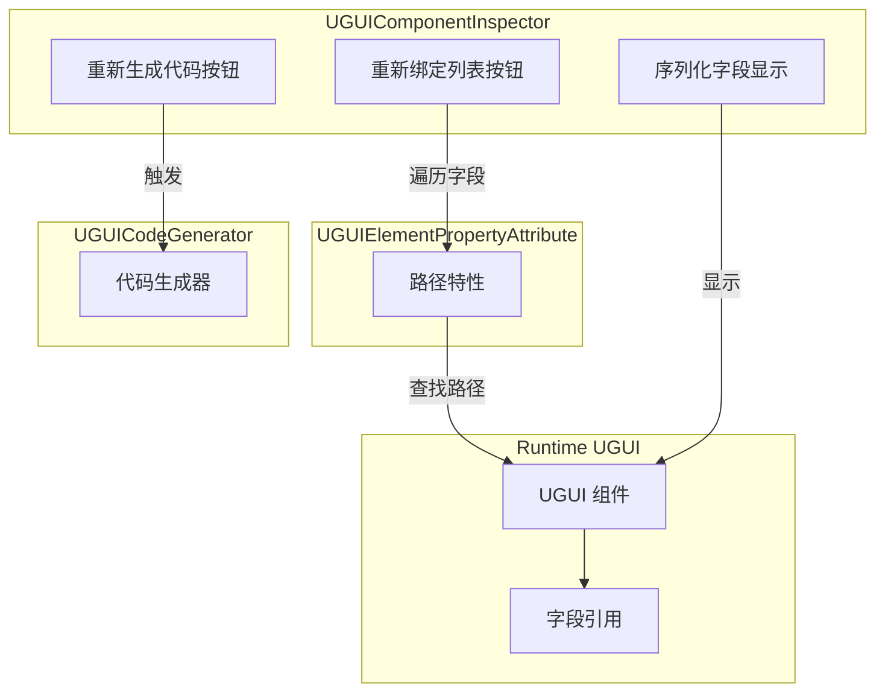
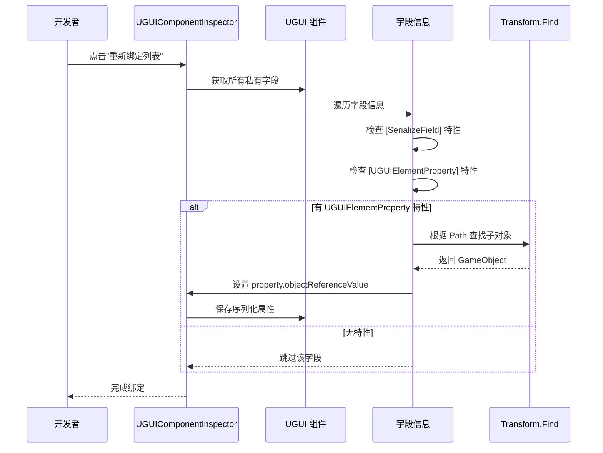

# コンポーネント確認器

コンポーネント確認器是 UGUI プラグイン的コアエディタ工具之一，用于在 Unity Editor 中自定義 UGUI コンポーネント的检视パネル。该確認器为開発者提供します便捷的コード生成和参照绑定機能，大大提升了 UI 开发效率。

## 概要

コンポーネント確認器（`UGUIComponentInspector`）是专门为 `UGUI` 基底クラスコンポーネント定制的 Unity Editor 自定義检视パネル。它継承自 `GameFrameworkInspector` 基底クラス，提供します两个コア機能ボタン，用于自动化 UI 开发フロー中的重复性工作。

### 設計目的

在传统的 UGUI 开发モード中，開発者〜する必要があります手动作成 UI 预制体、编写コード来参照各个 UI 元素，并在 Inspector 中逐个拖拽绑定参照。这种方法不仅效率低下，而且当 UI 结构发生变化时，〜する必要があります手动アップデート大量参照。

コンポーネント確認器通过以下設計来解决这些問題：

1. **コード自动生成**：通过コード生成器自动遍历 UI 预制体结构，生成带有 `[UGUIElementProperty]` 特性的プロパティコード
2. **参照自动绑定**：通过確認器ボタン一键重新绑定所有 UI 元素参照，无需手动拖拽

### コア機能

- **重新生成コード**：基于当前预制体结构重新生成 UI コードファイル
- **重新绑定列表**：根据特性中的路径情報，自动查找并绑定 UI 元素参照

> Source: [UGUIComponentInspector.cs](https://github.com/GameFrameX/com.gameframex.unity.ui.ugui/blob/main/Editor/UGUIComponentInspector.cs#L44-L153)

## アーキテクチャ設計

コンポーネント確認器的アーキテクチャ設計遵循了 Unity Editor 拡張的开发モード，通过自定義 Inspector 来增强 Editor 的機能。



### コンポーネント説明

| コンポーネント | ファイル位置 | 职责 |
|------|----------|------|
| UGUIComponentInspector | Editor/UGUIComponentInspector.cs | 自定義检视パネル，提供ボタン交互 |
| UGUIElementPropertyAttribute | Runtime/UGUIElementPropertyAttribute.cs | 特性类，标记 UI 元素路径 |
| UGUICodeGenerator | Editor/UGUICodeGenerator.cs | コード生成器，生成 UI コード |
| UGUI | Runtime/UGUI.cs | UGUI 基底クラス，被確認器拡張 |

> Source: [UGUIElementPropertyAttribute.cs](https://github.com/GameFrameX/com.gameframex.unity.ui.ugui/blob/main/Runtime/UGUIElementPropertyAttribute.cs#L40-L64)

## コア実装

### 確認器类定義

確認器使用 `[CustomEditor]` 特性来声明自定義エディタ，継承自 `GameFrameworkInspector` 基底クラス：

```csharp
[CustomEditor(typeof(Runtime.UGUI), true)]
internal sealed class UGUIComponentInspector : GameFrameworkInspector
{
    private GUIStyle _customButtonStyle;

    private readonly GUIContent _reBind = new GUIContent("重新绑定列表");
    private readonly GUIContent _reGenerate = new GUIContent("重新生成代码");

    public override void OnInspectorGUI()
    {
        // 检查器 GUI 实现
    }
}
```

> Source: [UGUIComponentInspector.cs](https://github.com/GameFrameX/com.gameframex.unity.ui.ugui/blob/main/Editor/UGUIComponentInspector.cs#L43-L80)

### 自定義ボタン样式

確認器提供します自定義的ボタン样式，采用大号字体和彩色文字設計，方便開発者识别操作ボタン：

```csharp
private GUIStyle CustomButtonStyle
{
    get
    {
        if (_customButtonStyle == null)
        {
            _customButtonStyle = new GUIStyle(GUI.skin.button)
            {
                fontSize = 32,
                normal = { textColor = Color.green },
                hover = { textColor = Color.yellow },
                active = { textColor = Color.green },
                alignment = TextAnchor.MiddleCenter,
            };
        }
        return _customButtonStyle;
    }
}
```

> Source: [UGUIComponentInspector.cs](https://github.com/github.com/GameFrameX/com.gameframex.unity.ui.ugui/blob/main/Editor/UGUIComponentInspector.cs#L48-L75)

## コアフロー

### 重新绑定フロー

当開発者点击"重新绑定列表"ボタン时，確認器会执行以下フロー：



### 重新绑定実装コード

```csharp
bool buttonClicked = EditorGUILayout.DropdownButton(_reBind, FocusType.Passive, CustomButtonStyle);
if (buttonClicked && !EditorApplication.isPlaying)
{
    // 重新绑定
    Dictionary<string, string> fieldMap = new Dictionary<string, string>();
    foreach (var fieldInfo in fieldInfos)
    {
        var serializeFieldAttributes = fieldInfo.GetCustomAttribute(typeof(SerializeField));
        if (serializeFieldAttributes == null)
        {
            continue;
        }

        var uguiElementPropertyAttribute = fieldInfo.GetCustomAttribute(typeof(UGUIElementPropertyAttribute));
        if (uguiElementPropertyAttribute == null)
        {
            continue;
        }

        var elementPropertyAttribute = (UGUIElementPropertyAttribute)uguiElementPropertyAttribute;
        fieldMap[fieldInfo.Name] = elementPropertyAttribute.Path;
    }

    foreach (var kv in fieldMap)
    {
        var property = serializedObject.FindProperty(kv.Key);
        if (property != null)
        {
            var targetFind = targetGameObject.transform.Find(kv.Value);
            if (targetFind != null)
            {
                property.objectReferenceValue = targetFind.gameObject;
            }
        }
    }
}
```

> Source: [UGUIComponentInspector.cs](https://github.com/GameFrameX/com.gameframex.unity.ui.ugui/blob/main/Editor/UGUIComponentInspector.cs#L96-L131)

### フィールド显示（只读モード）

確認器还会显示所有シリアライズフィールド，但設定为只读モード，防止在 Editor 中意外変更：

```csharp
// 编辑器下不允许修改
GUI.enabled = false;
foreach (var fieldInfo in fieldInfos)
{
    var attributes = fieldInfo.GetCustomAttributes(typeof(SerializeField));
    if (!attributes.Any())
    {
        continue;
    }

    EditorGUILayout.ObjectField(fieldInfo.Name, fieldInfo.GetValue(targetUGUI) as Object, fieldInfo.FieldType, true);
}

GUI.enabled = true;
```

> Source: [UGUIComponentInspector.cs](https://github.com/GameFrameX/com.gameframex.unity.ui.ugui/blob/main/Editor/UGUIComponentInspector.cs#L134-L147)

## UGUIElementProperty 特性

`UGUIElementPropertyAttribute` 是コンポーネント確認器工作的コア特性，用于标记 UI 控件在预制体中的路径。

### 特性定義

```csharp
/// <summary>
/// UGUI控件属性特性，用于标记UI控件在预制体中的路径。
/// </summary>
public sealed class UGUIElementPropertyAttribute : Attribute
{
    /// <summary>
    /// 获取控件路径。
    /// </summary>
    [UnityEngine.Scripting.Preserve]
    public string Path { get; }

    /// <summary>
    /// 初始化 <see cref="UGUIElementPropertyAttribute"/> 类的新实例。
    /// </summary>
    /// <param name="path">控件路径</param>
    [UnityEngine.Scripting.Preserve]
    public UGUIElementPropertyAttribute(string path)
    {
        Path = path;
    }
}
```

> Source: [UGUIElementPropertyAttribute.cs](https://github.com/GameFrameX/com.gameframex.unity.ui.ugui/blob/main/Runtime/UGUIElementPropertyAttribute.cs#L34-L64)

### 使用例

コード生成器会自动生成带有此特性的プロパティコード：

```csharp
[SerializeField]
[UGUIElementProperty("Panel/Button_Start")]
private Button m_Button_Start;

public Button m_Button_Start
{
    get { return m_Button_Start; }
}
```

> Source: [UGUICodeGenerator.cs](https://github.com/GameFrameX/com.gameframex.unity.ui.ugui/blob/main/Editor/UGUICodeGenerator.cs#L259-L269)

## 使用シーン

### シーン一：UI 结构变更后的重新绑定

当 UI 预制体结构发生变化（如重命名、调整层级）后，原有的参照会失效。此时只需：

1. 重新生成コード（或手动アップデート路径）
2. 点击"重新绑定列表"ボタン
3. 確認器会自动根据新的路径查找并绑定 UI 元素

### シーン二：コード重构后的参照アップデート

在コード重构过程中，〜の可能性があります会変更フィールド名称或调整预制体结构。重新绑定機能〜できます快速恢复所有参照，而无需手动逐个拖拽。

### シーン三：多プラットフォームリソースパス调整

当〜する必要があります调整 UI リソース的组织结构时，通过重新生成コード和重新绑定，〜できます快速适应新的リソース组织方法。

## 関連リンク

- [コード生成器](./6-editor-tools.code-generator) - 理解するコード自动生成機能
- [UGUI 基底クラス](./4-core-concepts.ugui-base) - 理解する UGUI 基底クラス実装
- [图片置換処理器](./6-editor-tools.image-replace) - 理解する UI 图片置換機能
- [快速开始 - 使用コード生成器](./3-getting-started.code-generator) - 快速上手ガイド
