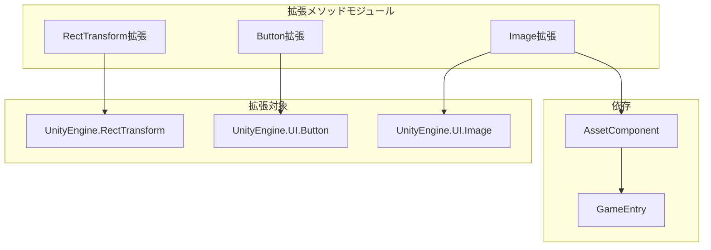

# 拡張メソッド

便捷な拡張メソッドを提供し、UGUIコンポーネントの機能を強化し、一般的なUI操作のコード記述を簡素化します。

## 概要

拡張メソッドはGameFrameX UGUIプラグインが提供する一组静的拡張メソッドであり、C#拡張メソッド構文を通じてUnity組み込みのUGUIコンポーネントに便捷な機能を追加します。これらの拡張メソッドはUIレイアウト、ボタンイベント処理、画像の非同期読み込みなどの一般的なシーンを涵盖し、ボイラープレートコードを显著に削減し、開発効率を向上させます。

すべての拡張メソッドは`GameFrameX.UI.UGUI.Runtime`名前空間下にあり、`[Preserve]`属性でマークされ、IL2CPPなどのコードトリミング環境で失われないことを確保します。

## アーキテクチャ

拡張メソッドは対象コンポーネントによって分類され、主に3つのクラスに分かれます：



### 拡張メソッド分類

| 拡張クラス | 対象コンポーネント | 主な機能 |
|--------|----------|----------|
| `RectTransformExtension` | `RectTransform` | クイックフルスクリーンレイアウト設定 |
| `UGUIButtonExtension` | `Button.ButtonClickedEvent` | ボタンイベントバインディングの簡素化 |
| `UGUIImageExtension` | `UnityEngine.UI.Image` | アセットpathからの非同期アイコン読み込み |

## RectTransform拡張

`RectTransformExtension`クラスは`RectTransform`コンポーネントにレイアウト関連の拡張メソッドを提供します。

### MakeFullScreen

現在のUIオブジェクトをフルスクリーン表示に設定します。

```csharp
public static void MakeFullScreen(this RectTransform rectTransform)
```

**実装原理：**

このメソッドはRectTransformの4つの关键プロパティを設定してフルスクリーン 효과를実現합니다：

1. `anchorMin = Vector2.zero` - 锚点の最小値を(0,0)を設定、父コンテナの左下角
2. `anchorMax = Vector2.one` - 锚点の最大値を(1,1)を設定、父コンテナの右上角
3. `anchoredPosition = Vector2.zero` - 锚点位置をゼロにリセット
4. `sizeDelta = Vector2.zero` - サイズ增量设置为零、要素が父コンテナを完全に填充

> Source: [RectTransformExtension.cs](https://github.com/GameFrameX/com.gameframex.unity.ui.ugui/blob/main/Runtime/RectTransformExtension.cs#L56-L62)

**使用例：**

```csharp
using GameFrameX.UI.UGUI.Runtime;

// RectTransform参照があると仮定
RectTransform fullScreenPanel = someUIObject.GetComponent<RectTransform>();

// 1行でフルスクリーンに設定
fullScreenPanel.MakeFullScreen();
```

## Button拡張

`UGUIButtonExtension`クラスは`Button.ButtonClickedEvent`にイベント処理関連の拡張メソッドを提供し、ボタンクリックイベントのバインディング与管理を簡素化します。

### メソッド一覧

| メソッド | 機能説明 |
|------|----------|
| `Add` | ボタンクリックイベントリスナーを追加 |
| `Remove` | ボタンクリックイベントリスナーを移除 |
| `Clear` | すべてのボタンクリックイベントリスナーをクリア |
| `Set` | ボタンクリックイベントを設定（既存のイベントを置換） |
| `Set(action, userData)` | ユーザーデータ付きのクリックイベントを設定 |

### Add

ボタンクリックイベントリスナーを追加します。

```csharp
public static void Add(this Button.ButtonClickedEvent self, UnityAction action)
```

**パラメータ：**
- `self`: ボタンのクリックイベントコレクション
- `action`: クリック時に実行するコールバック

> Source: [UGUIButtonExtension.cs](https://github.com/GameFrameX/com.gameframex.unity.ui.ugui/blob/main/Runtime/UGUIButtonExtension.cs#L52-L57)

### Remove

指定したボタンクリックイベントリスナーを移除します。

```csharp
public static void Remove(this Button.ButtonClickedEvent self, UnityAction action)
```

> Source: [UGUIButtonExtension.cs](https://github.com/GameFrameX/com.gameframex.unity.ui.ugui/blob/main/Runtime/UGUIButtonExtension.cs#L67-L72)

### Clear

すべてのボタンクリックイベントリスナーをクリアします。

```csharp
public static void Clear(this Button.ButtonClickedEvent self)
```

> Source: [UGUIButtonExtension.cs](https://github.com/GameFrameX/com.gameframex.unity.ui.ugui/blob/main/Runtime/UGUIButtonExtension.cs#L81-L85)

### Set

ボタンクリックイベントを設定し、既存のイベントをすべて新イベントに置換します。

```csharp
public static void Set(this Button.ButtonClickedEvent self, UnityAction action)
```

> Source: [UGUIButtonExtension.cs](https://github.com/GameFrameX/com.gameframex.unity.ui.ugui/blob/main/Runtime/UGUIButtonExtension.cs#L95-L101)

### Set (ユーザーデータ付き)

ユーザーデータ付きのボタンクリックイベントを設定します。

```csharp
public static void Set(this Button.ButtonClickedEvent self, UnityAction<object> action, object userData)
```

**パラメータ：**
- `self`: ボタンのクリックイベントコレクション
- `action`: ユーザーデータパラメータ付きのコールバック関数
- `userData`: コールバックに渡すユーザー定義データ

> Source: [UGUIButtonExtension.cs](https://github.com/GameFrameX/com.gameframex.unity.ui.ugui/blob/main/Runtime/UGUIButtonExtension.cs#L112-L124)

**使用例：**

```csharp
using GameFrameX.UI.UGUI.Runtime;
using UnityEngine.UI;
using UnityEngine;

// Buttonコンポーネントを取得
Button button = GetComponent<Button>();

// クリックイベントを追加
button.onClick.Add(() => {
    Debug.Log("ボタンがクリックされました");
});

// パラメータ付きイベントを使用
button.onClick.Set((userData) => {
    Debug.Log($"ボタンがクリックされました、ユーザーデータ: {userData}");
}, "カスタムデータ");

// すべてのイベントをクリア
button.onClick.Clear();
```

## Image拡張

`UGUIImageExtension`クラスは`UnityEngine.UI.Image`に非同期アイコン読み込み機能を提供します。

### SetIconAsync

画像を非同期で設定します。

```csharp
public static async Task SetIconAsync(this UnityEngine.UI.Image self, string icon)
```

**パラメータ：**
- `self`: 対象画像コンポーネント
- `icon`: アイコンアセットpath（アセットディレクトリからの相対path）

**返値：**
- `Task`非同期タスク

**実装原理：**

1. `GameEntry.GetComponent<AssetComponent>()`を通じてアセットコンポーネントを取得
2. `LoadAssetAsync<Texture2D>`を使用してテクスチャアセットを非同期で読み込む
3. 読み込んだ`Texture2D`を`Sprite`オブジェクトに変換
4. 生成したSpriteをImageコンポーネントのspriteプロパティに割り当て

> Source: [UGUIImageExtension.cs](https://github.com/GameFrameX/com.gameframex.unity.ui.ugui/blob/main/Runtime/UGUIImageExtension.cs#L55-L74)

**例外処理：**

このメソッドはtry-catch例外処理メカニズムを内蔵し、読み込み失敗時はエラーログを出力しますが、例外をスローせず、UIがアセット読み込み失敗でクラッシュしないことを確保します。

**使用例：**

```csharp
using GameFrameX.UI.UGUI.Runtime;
using UnityEngine.UI;

// Imageコンポーネントを取得
Image iconImage = GetComponent<Image>();

// 非同期でアイコンを読み込んで設定
await iconImage.SetIconAsync("icons/player_avatar");

// UIFormHelperと組み合わせて使用可能
await iconImage.SetIconAsync(formHelper.GetIconPath("item_001"));
```

## 一般的な使用シーン

### シーン一：フルスクリーンポップアップを作成

```csharp
// フルスクリーン半透明背景を作成
GameObject bgObj = new GameObject("PopupBackground");
bgObj.transform.SetParent(canvas.transform);
RectTransform bgRT = bgObj.AddComponent<RectTransform>();
Image bgImage = bgObj.AddComponent<Image>();
bgImage.color = new Color(0, 0, 0, 0.5f);

// フルスクリーンに設定
bgRT.MakeFullScreen();
```

### シーン二：ボタンイベントを一括設定

```csharp
// ボタンイベントを一括バインディング
Button[] buttons = GetComponentsInChildren<Button>();
foreach (var btn in buttons)
{
    btn.onClick.Set(() => OnButtonClick(btn.name));
}
```

### シーン三：アイテムアイコンを非同期で読み込む

```csharp
// UIFormの読み込みフローで非同期でアイコンを設定
public async void LoadItemIcon(Image iconImage, string itemId)
{
    await iconImage.SetIconAsync($"icons/items/{itemId}");
}
```

## 関連リンク

- [UIImageコンポーネント](./5-components.uiimage) - UIImageコンポーネント文書
- [UGUI基底クラス](./4-core-concepts.ugui-base) - UGUI基底クラス紹介
- [UIマネージャー](./4-core-concepts.ui-manager) - UIマネージャードキュメント
- [フォームヘルパー](./4-core-concepts.form-helper) - フォームヘルパードキュメント