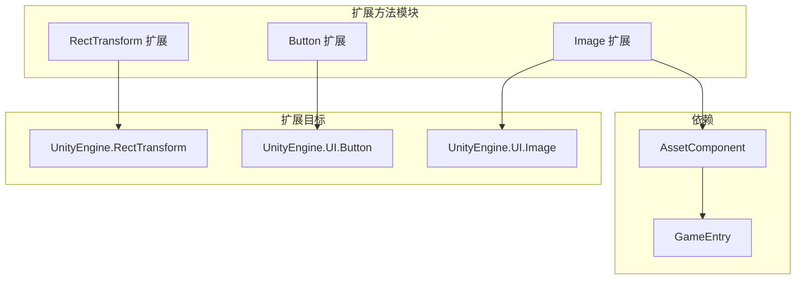

# 拡張メソッド

提供便捷的拡張メソッド，增强 UGUI コンポーネント的機能，簡素化常见 UI 操作的コード编写。

## 概要

拡張メソッド是 GameFrameX UGUI プラグイン提供的一组静态拡張メソッド，通过 C# 拡張メソッド语法为 Unity 内置的 UGUI コンポーネント追加便捷機能。这些拡張メソッド涵盖了 UI 布局、ボタンイベント処理和图片非同期ロード等常见シーン，能够显著减少样板コード，提升开发效率。

所有拡張メソッド都位于 `GameFrameX.UI.UGUI.Runtime` 名前空間下，使用 `[Preserve]` プロパティ标记以確認してください在 IL2CPP 等コード裁剪環境中不会丢失。

## アーキテクチャ

拡張メソッド按照目标コンポーネント进行分类，主な分为三类：



### 拡張メソッド分类

| 拡張类 | 目标コンポーネント | 主な機能 |
|--------|----------|----------|
| `RectTransformExtension` | `RectTransform` | 快速設定全屏布局 |
| `UGUIButtonExtension` | `Button.ButtonClickedEvent` | 簡素化ボタンイベント绑定 |
| `UGUIImageExtension` | `UnityEngine.UI.Image` | 非同期ロード图标リソース |

## RectTransform 拡張

`RectTransformExtension` 类为 `RectTransform` コンポーネント提供布局相关的拡張メソッド。

### MakeFullScreen

将当前 UI 对象設定为全屏显示。

```csharp
public static void MakeFullScreen(this RectTransform rectTransform)
```

**実装原理：**

该メソッド通过設定 RectTransform 的四个关键プロパティ来実装全屏效果：

1. `anchorMin = Vector2.zero` - 設定锚点最小值为 (0,0)，つまり父容器左下角
2. `anchorMax = Vector2.one` - 設定锚点最大值为 (1,1)，つまり父容器右上角
3. `anchoredPosition = Vector2.zero` - 重置锚点位置为零
4. `sizeDelta = Vector2.zero` - 設定尺寸增量为零，使元素完全填满父容器

> Source: [RectTransformExtension.cs](https://github.com/GameFrameX/com.gameframex.unity.ui.ugui/blob/main/Runtime/RectTransformExtension.cs#L56-L62)

**使用例：**

```csharp
using GameFrameX.UI.UGUI.Runtime;

// 假设有一个 RectTransform 引用
RectTransform fullScreenPanel = someUIObject.GetComponent<RectTransform>();

// 一行代码设置为全屏
fullScreenPanel.MakeFullScreen();
```

## Button 拡張

`UGUIButtonExtension` 类为 `Button.ButtonClickedEvent` 提供イベント処理相关的拡張メソッド，簡素化ボタン点击イベント的绑定和管理。

### メソッド列表

| メソッド | 機能説明 |
|------|----------|
| `Add` | 追加ボタン点击イベント监听器 |
| `Remove` | 移除ボタン点击イベント监听器 |
| `Clear` | 清除所有ボタン点击イベント监听器 |
| `Set` | 設定ボタン点击イベント（置換现有イベント） |
| `Set(action, userData)` | 設定带ユーザー数据的点击イベント |

### Add

追加ボタン点击イベント监听器。

```csharp
public static void Add(this Button.ButtonClickedEvent self, UnityAction action)
```

**パラメータ：**
- `self`: ボタン的点击イベント集合
- `action`: 点击时要执行的コールバック

> Source: [UGUIButtonExtension.cs](https://github.com/GameFrameX/com.gameframex.unity.ui.ugui/blob/main/Runtime/UGUIButtonExtension.cs#L52-L57)

### Remove

移除指定的ボタン点击イベント监听器。

```csharp
public static void Remove(this Button.ButtonClickedEvent self, UnityAction action)
```

> Source: [UGUIButtonExtension.cs](https://github.com/GameFrameX/com.gameframex.unity.ui.ugui/blob/main/Runtime/UGUIButtonExtension.cs#L67-L72)

### Clear

清除所有ボタン点击イベント监听器。

```csharp
public static void Clear(this Button.ButtonClickedEvent self)
```

> Source: [UGUIButtonExtension.cs](https://github.com/GameFrameX/com.gameframex.unity.ui.ugui/blob/main/Runtime/UGUIButtonExtension.cs#L81-L85)

### Set

設定ボタン点击イベント，将原有イベント全部置換为新イベント。

```csharp
public static void Set(this Button.ButtonClickedEvent self, UnityAction action)
```

> Source: [UGUIButtonExtension.cs](https://github.com/GameFrameX/com.gameframex.unity.ui.ugui/blob/main/Runtime/UGUIButtonExtension.cs#L95-L101)

### Set (带ユーザー数据)

設定带ユーザー数据的ボタン点击イベント。

```csharp
public static void Set(this Button.ButtonClickedEvent self, UnityAction<object> action, object userData)
```

**パラメータ：**
- `self`: ボタン的点击イベント集合
- `action`: 带ユーザー数据パラメータ的コールバック函数
- `userData`: 传递给コールバック的ユーザー自定義数据

> Source: [UGUIButtonExtension.cs](https://github.com/GameFrameX/com.gameframex.unity.ui.ugui/blob/main/Runtime/UGUIButtonExtension.cs#L112-L124)

**使用例：**

```csharp
using GameFrameX.UI.UGUI.Runtime;
using UnityEngine.UI;
using UnityEngine;

// 获取按钮组件
Button button = GetComponent<Button>();

// 添加点击事件
button.onClick.Add(() => {
    Debug.Log("按钮被点击");
});

// 使用带参数的事件
button.onClick.Set((userData) => {
    Debug.Log($"按钮被点击，用户数据: {userData}");
}, "自定义数据");

// 清除所有事件
button.onClick.Clear();
```

## Image 拡張

`UGUIImageExtension` 类为 `UnityEngine.UI.Image` 提供非同期ロード图标的機能。

### SetIconAsync

异步設定图片图标。

```csharp
public static async Task SetIconAsync(this UnityEngine.UI.Image self, string icon)
```

**パラメータ：**
- `self`: 目标图片コンポーネント
- `icon`: 图标リソースパス（相对于リソースディレクトリ）

**戻り値：**
- 返す `Task` 异步任务

**実装原理：**

1. 通过 `GameEntry.GetComponent<AssetComponent>()` 取得リソースコンポーネント
2. 使用 `LoadAssetAsync<Texture2D>` 非同期ロード纹理リソース
3. 将ロード的 `Texture2D` 转换为 `Sprite` 对象
4. 将生成的 Sprite 赋值给 Image コンポーネント的 sprite プロパティ

> Source: [UGUIImageExtension.cs](https://github.com/GameFrameX/com.gameframex.unity.ui.ugui/blob/main/Runtime/UGUIImageExtension.cs#L55-L74)

**例外処理：**

该メソッド内置了 try-catch 例外処理机制，ロード失敗时会输出エラーログ但不会抛出例外，確認してください UI 不会因リソースロード失敗而崩溃。

**使用例：**

```csharp
using GameFrameX.UI.UGUI.Runtime;
using UnityEngine.UI;

// 获取 Image 组件
Image iconImage = GetComponent<Image>();

// 异步加载并设置图标
await iconImage.SetIconAsync("icons/player_avatar");

// 可以配合 UIFormHelper 使用
await iconImage.SetIconAsync(formHelper.GetIconPath("item_001"));
```

## 常见使用シーン

### シーン一：作成全屏弹窗

```csharp
// 创建全屏半透明背景
GameObject bgObj = new GameObject("PopupBackground");
bgObj.transform.SetParent(canvas.transform);
RectTransform bgRT = bgObj.AddComponent<RectTransform>();
Image bgImage = bgObj.AddComponent<Image>();
bgImage.color = new Color(0, 0, 0, 0.5f);

// 设置为全屏
bgRT.MakeFullScreen();
```

### シーン二：批量設定ボタンイベント

```csharp
// 批量绑定按钮事件
Button[] buttons = GetComponentsInChildren<Button>();
foreach (var btn in buttons)
{
    btn.onClick.Set(() => OnButtonClick(btn.name));
}
```

### シーン三：非同期ロード物品图标

```csharp
// 在 UIForm 的加载流程中异步设置图标
public async void LoadItemIcon(Image iconImage, string itemId)
{
    await iconImage.SetIconAsync($"icons/items/{itemId}");
}
```

## 関連リンク

- [UIImage コンポーネント](./5-components.uiimage) - UIImage コンポーネントドキュメント
- [UGUI 基底クラス](./4-core-concepts.ugui-base) - UGUI 基底クラス介绍
- [UI マネージャー](./4-core-concepts.ui-manager) - UI マネージャードキュメント
- [表单辅助器](./4-core-concepts.form-helper) - 表单辅助器ドキュメント
