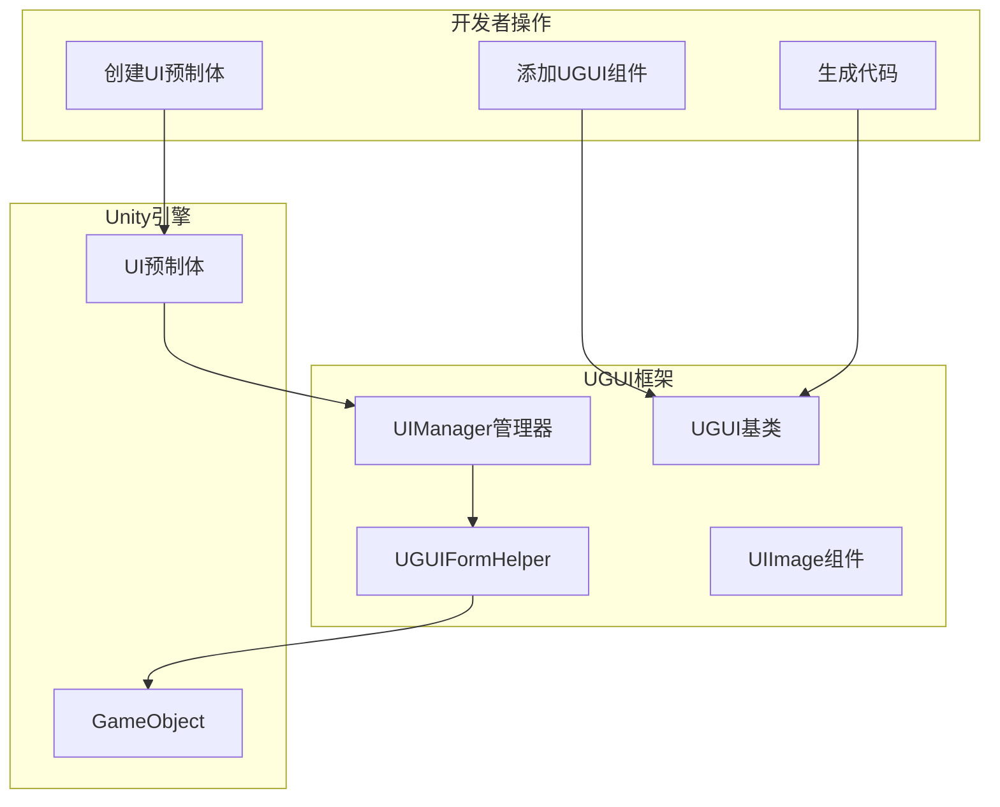
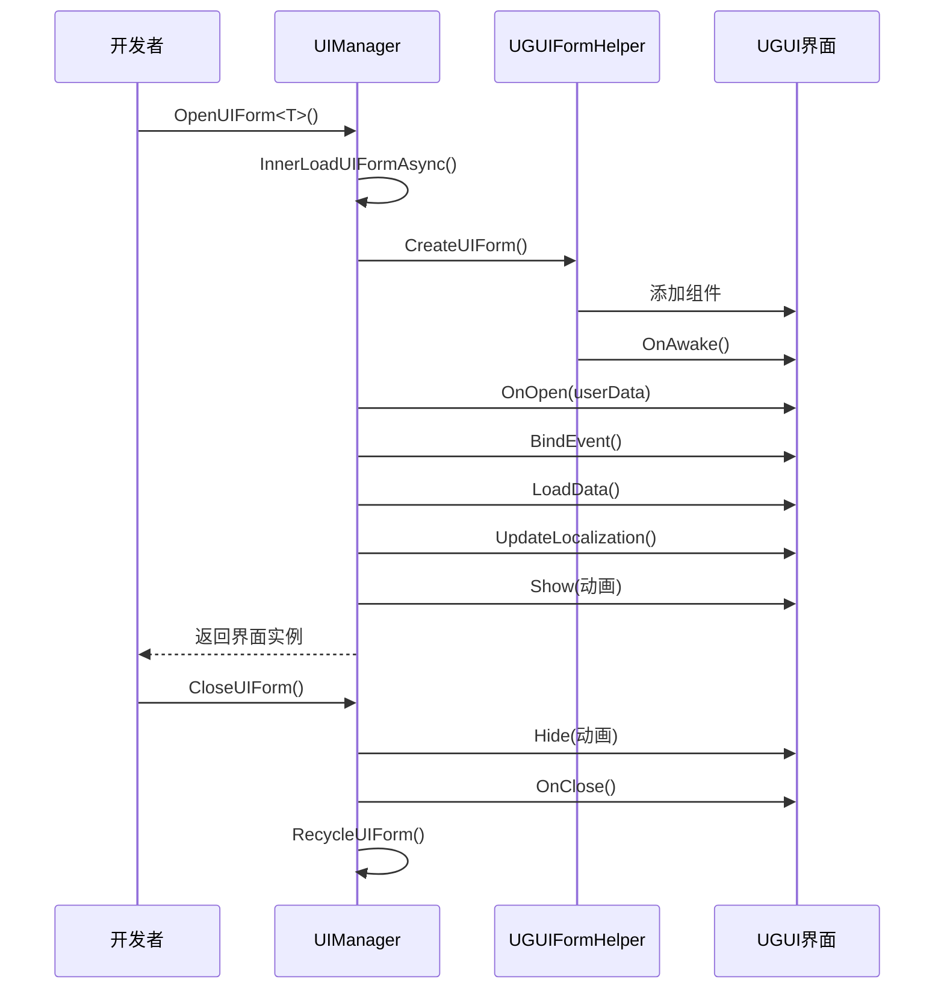

# 作成UI界面

このドキュメント介绍如何在 GameFrameX UGUI プラグイン中作成和管理 UI 界面。

## 概要

GameFrameX UGUI プラグイン提供します一套完全な的 UI 界面作成和管理体系。通过継承 `UGUI` 基底クラス，開発者〜できます快速作成 UI 界面，并利用コード生成器自动生成界面コンポーネント的参照コード。UI 界面由 `UIManager` 統一された管理，サポート非同期ロード、对象池缓存、显示/隐藏动画等機能。

> 理解する更多コアコンセプト： [UGUI基底クラス](./4-core-concepts.ugui-base)、[UIマネージャー](./4-core-concepts.ui-manager)、[表单辅助器](./4-core-concepts.form-helper)

## コアアーキテクチャ

UI 界面的作成和管理涉及以下コアコンポーネント：



## 作成フロー

### ステップ一：作成UI预制体

在 Unity プロジェクト中作成 UI 界面预制体（Prefab），通常パッケージ含以下结构：

```
Canvas (画布)
├── UGUI (根节点，添加UGUI组件)
│   ├── Panel_xxx (背景面板)
│   │   ├── Image_xxx (图片)
│   │   ├── Text_xxx (文本)
│   │   └── Button_xxx (按钮)
│   └── ...
```

> Source: [Runtime/UGUI.cs](https://github.com/GameFrameX/com.gameframex.unity.ui.ugui/blob/main/Runtime/UGUI.cs#L44-L50)

### ステップ二：追加UGUIコンポーネント

在预制体的根 GameObject 上追加 `UGUI` コンポーネント：

1. 选中预制体的根节点
2. 在 Inspector パネル中点击 "Add Component"
3. 検索并追加 `GameFrameX.UI.UGUI.Runtime.UGUI`

`UGUI` コンポーネント継承自 `UIForm`，提供します以下機能：
- 界面的显示和隐藏（サポート动画）
- 可见性ステータス管理
- 全屏モード設定

```csharp
// UGUI 基类定义
namespace GameFrameX.UI.UGUI.Runtime
{
    [Preserve]
    [DisallowMultipleComponent]
    public class UGUI : UIForm
    {
        // 显示界面
        public override void Show(IUIFormShowHandler handler, Action complete)

        // 隐藏界面
        public override void Hide(IUIFormHideHandler handler, Action complete)

        // 设置可见性
        protected override void InternalSetVisible(bool value)

        // 获取/设置可见性
        public override bool Visible { get; protected set; }

        // 设置全屏
        protected override void MakeFullScreen()
    }
}
```

> Source: [Runtime/UGUI.cs](https://github.com/GameFrameX/com.gameframex.unity.ui.ugui/blob/main/Runtime/UGUI.cs#L36-L179)

### ステップ三：生成UIコード

使用コード生成器自动生成 UI コンポーネント参照コード：

1. 在 Unity メニュー中选择 **GameObject → UI → Generate UGUI Code**
2. 选中要生成コード的 UGUI 预制体
3. コード生成器会自动遍历预制体中的所有子节点，生成对应的プロパティコード

生成的コード具有以下结构：

```csharp
#if ENABLE_UI_UGUI
using Cysharp.Threading.Tasks;
using GameFrameX.Entity.Runtime;
using GameFrameX.UI.Runtime;
using GameFrameX.Runtime;
using GameFrameX.UI.UGUI.Runtime;
using UnityEngine;

namespace Hotfix.UI
{
    /// <summary>
    /// 代码生成的UI代码 LoginPanel
    /// </summary>
    [DisallowMultipleComponent]
    [OptionUIConfig(null, "Assets/Prefabs/UI/Login")]
    public sealed partial class LoginPanel : UGUI
    {
        public GameObject self { get; private set; }

        #region Properties

        [SerializeField] [UGUIElementProperty("Panel_Bg/Image_Logo")]
        private UnityEngine.UI.Image m_Image_Logo;

        public UnityEngine.UI.Image m_Image_Logo => m_Image_Logo;

        [SerializeField] [UGUIElementProperty("Panel_Bg/Button_Login")]
        private UnityEngine.UI.Button m_Button_Login;

        public UnityEngine.UI.Button m_Button_Login => m_Button_Login;

        #endregion

        private bool _isInitView = false;

        protected override void InitView()
        {
            if (_isInitView)
            {
                return;
            }

            _isInitView = true;
            this.self = this.gameObject;
            m_Image_Logo = gameObject.transform.FindChildName("Panel_Bg/Image_Logo").GetComponent<UnityEngine.UI.Image>();
            m_Button_Login = gameObject.transform.FindChildName("Panel_Bg/Button_Login").GetComponent<UnityEngine.UI.Button>();
        }
    }
}
#endif
```

> Source: [Editor/UGUICodeGenerator.cs](https://github.com/GameFrameX/com.gameframex.unity.ui.ugui/blob/main/Editor/UGUICodeGenerator.cs#L84-L230)

### ステップ四：挂载生成的コード

生成コード后，〜する必要があります将コード挂载到预制体上：

1. 将生成的 `.UI.cs` ファイル挂载到预制体的根节点
2. 在 Inspector 中点击 **"重新绑定列表"** ボタン，将预制体中的子节点绑定到コードプロパティ上

> 詳細理解するコード生成器： [使用コード生成器](./3-getting-started.code-generator)

## 打开和閉じるUI界面

### 打开UI界面

通过 `UIManager` 异步打开 UI 界面：

```csharp
// 打开UI界面
var uiForm = await GameEntry.UI.OpenUIForm<LoginPanel>();
```

`OpenUIForm` メソッド会：
1. 確認对象池是否有可用インスタンス
2. もし没有，从 Resources 或 AssetBundle 非同期ロード
3. 呼び出し `UGUIFormHelper` 作成界面
4. トリガー `OnOpen` コールバック
5. 执行显示动画（もし启用）

```csharp
// 打开界面的核心流程
protected override async Task<IUIForm> InnerOpenUIFormAsync(
    string uiFormAssetPath, 
    Type uiFormType, 
    bool pauseCoveredUIForm, 
    object userData, 
    bool isFullScreen = false)
{
    // 1. 检查对象池
    var uiFormInstanceObject = m_InstancePool.Spawn(assetPath);
    if (uiFormInstanceObject != null)
    {
        return InternalOpenUIForm(...);
    }

    // 2. 异步加载资源
    var uiForm = InnerLoadUIFormAsync(...);
    return await uiForm;
}
```

> Source: [Runtime/UIManager.Open.cs](https://github.com/GameFrameX/com.gameframex.unity.ui.ugui/blob/main/Runtime/UIManager.Open.cs#L79-L115)

### 閉じるUI界面

```csharp
// 关闭UI界面
GameEntry.UI.CloseUIForm(loginPanel);
```

### UIFormライフサイクル



## UIコンポーネント参照

コード生成器会自动为预制体中的每个 UI 控件生成参照プロパティ。使用 `[UGUIElementProperty]` 特性标记控件路径：

```csharp
[SerializeField] 
[UGUIElementProperty("Panel_Bg/Button_Start")]
private UnityEngine.UI.Button m_Button_Start;

public UnityEngine.UI.Button m_Button_Start => m_Button_Start;
```

> 理解する更多UIコンポーネント： [UIImageコンポーネント](./5-components.uiimage)、[拡張メソッド](./5-components.extensions)

## UI界面設定

〜できます通过特性設定 UI 界面的行为：

### OptionUIConfig 特性

設定界面的リソースロード方法：

```csharp
[OptionUIConfig(true)]  // 从Resources加载
[OptionUIConfig(null, "Assets/Prefabs/UI/Login")]  // 从AssetBundle加载
```

### OptionUIGroupAttribute 特性

設定界面所属的 UI 组：

```csharp
[OptionUIGroup("MainUI")]
```

### OptionUIShowAnimationAttribute 特性

設定显示动画：

```csharp
[OptionUIShowAnimation(true, "FadeIn")]
```

### OptionUIHideAnimationAttribute 特性

設定隐藏动画：

```csharp
[OptionUIHideAnimation(true, "FadeOut")]
```

## 完全な例

以下は完全な的 UI 界面作成例：

```csharp
using GameFrameX.UI.UGUI.Runtime;
using UnityEngine;
using UnityEngine.UI;

namespace Hotfix.UI
{
    /// <summary>
    /// 登录界面
    /// </summary>
    [DisallowMultipleComponent]
    [OptionUIConfig(null, "Assets/Prefabs/UI/Login")]
    public sealed partial class LoginPanel : UGUI
    {
        public GameObject self { get; private set; }

        #region Properties

        [SerializeField] 
        [UGUIElementProperty("Background")]
        private Image m_Background;

        public Image m_Background => m_Background;

        [SerializeField] 
        [UGUIElementProperty("Button_Login")]
        private Button m_Button_Login;

        public Button m_Button_Login => m_Button_Login;

        [SerializeField] 
        [UGUIElementProperty("InputField_Username")]
        private InputField m_InputField_Username;

        public InputField m_InputField_Username => m_InputField_Username;

        #endregion

        private bool _isInitView = false;

        protected override void InitView()
        {
            if (_isInitView)
            {
                return;
            }

            _isInitView = true;
            this.self = this.gameObject;
            
            m_Background = gameObject.transform.FindChildName("Background").GetComponent<Image>();
            m_Button_Login = gameObject.transform.FindChildName("Button_Login").GetComponent<Button>();
            m_InputField_Username = gameObject.transform.FindChildName("InputField_Username").GetComponent<InputField>();

            // 绑定按钮点击事件
            m_Button_Login.onClick.AddListener(OnLoginClick);
        }

        private void OnLoginClick()
        {
            Debug.Log("登录按钮点击，用户名：" + m_InputField_Username.text);
            // 处理登录逻辑
        }

        protected override void OnClose(bool isShutdown, bool pauseCovered)
        {
            base.OnClose(isShutdown, pauseCovered);
            // 清理资源
        }
    }
}
```

## 関連リンク

- [使用コード生成器](./3-getting-started.code-generator) - 詳細理解するコード生成器的使用
- [UGUI基底クラス](./4-core-concepts.ugui-base) - UGUI 基底クラス的詳細説明
- [UIマネージャー](./4-core-concepts.ui-manager) - UI マネージャー的詳細説明
- [表单辅助器](./4-core-concepts.form-helper) - 表单辅助器的詳細説明
- [UIImageコンポーネント](./5-components.uiimage) - UIImage コンポーネント説明
- [拡張メソッド](./5-components.extensions) - UGUI 拡張メソッド
- [コード生成器](./6-editor-tools.code-generator) - エディタコード生成器工具
- [コンポーネント確認器](./6-editor-tools.inspector) - UGUI コンポーネント確認器
