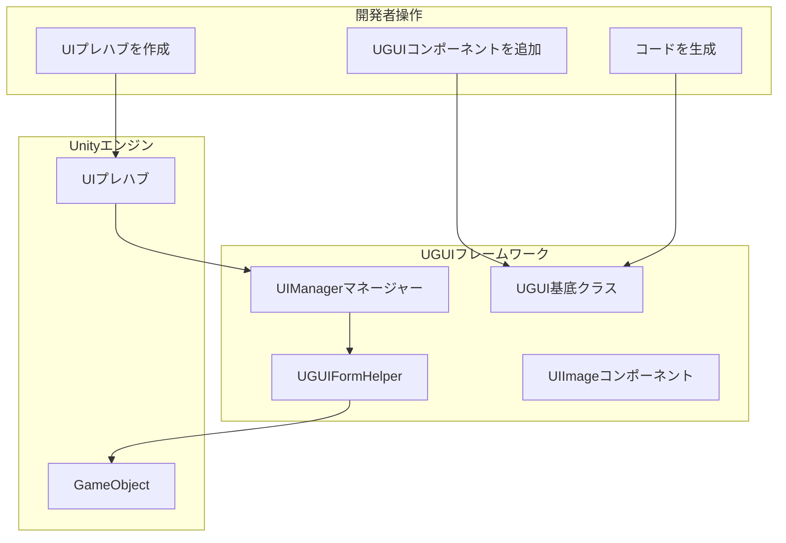
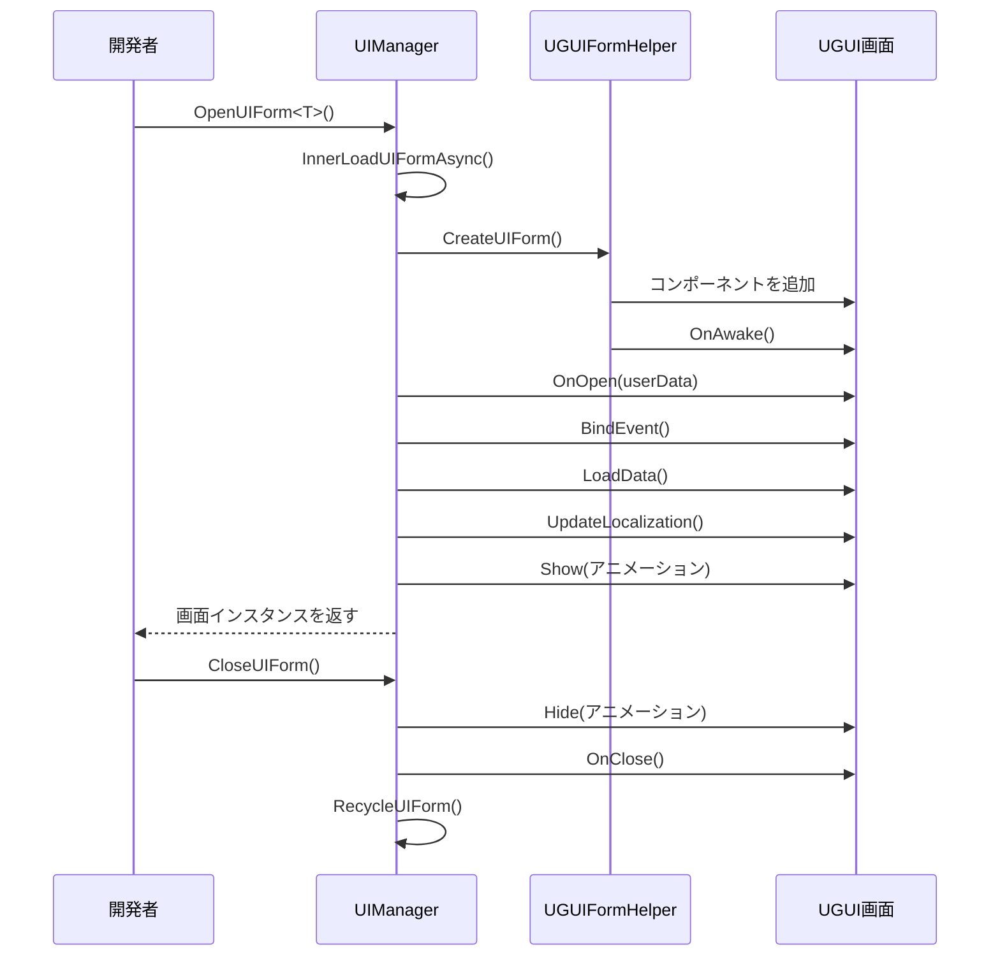

# UI画面を作成

本文書はGameFrameX UGUIプラグインでUI画面を作成・管理する方法を紹介します。

## 概要

GameFrameX UGUIプラグインは完全なUI画面作成与管理体系を提供します。`UGUI`基底クラスを継承することで、開発者は迅速にUI画面を作成でき、コードジェネレーターを使用して画面コンポーネントの参照コードを自動生成できます。UI画面は`UIManager`が统一管理し、非同期読み込み、オブジェクトプールキャッシュ、表示/非表示アニメーションなどの機能をサポートしています。

> コア概念の詳細については：[UGUI基底クラス](./4-core-concepts.ugui-base)、[UIマネージャー](./4-core-concepts.ui-manager)、[フォームヘルパー](./4-core-concepts.form-helper)

## コアアーキテクチャ

UI画面の作成与管理には以下のコアコンポーネントが関わります：



## 作成フロー

### 手順一：UIプレハブを作成

UnityプロジェクトでUI画面プレハブ（Prefab）を作成し 通常以下の構造を含みます：

```
Canvas (キャンバス)
├── UGUI (ルートノード、UGUIコンポーネントを追加)
│   ├── Panel_xxx (背景パネル)
│   │   ├── Image_xxx (画像)
│   │   ├── Text_xxx (テキスト)
│   │   └── Button_xxx (ボタン)
│   └── ...
```

> Source: [Runtime/UGUI.cs](https://github.com/GameFrameX/com.gameframex.unity.ui.ugui/blob/main/Runtime/UGUI.cs#L44-L50)

### 手順二：UGUIコンポーネントを追加

プレハブのルートGameObjectに`UGUI`コンポーネントを追加：

1. プレハブのルートノードを選択
2. Inspectorパネルで"Add Component"をクリック
3. `GameFrameX.UI.UGUI.Runtime.UGUI`を検索して追加

`UGUI`コンポーネントは`UIForm`を継承し、以下の機能を提供します：
- 画面の表示と非表示（アニメーションサポート）
- 可視性状態管理
- フルスクリーンモード設定

```csharp
// UGUI基底クラス定義
namespace GameFrameX.UI.UGUI.Runtime
{
    [Preserve]
    [DisallowMultipleComponent]
    public class UGUI : UIForm
    {
        // 画面を表示
        public override void Show(IUIFormShowHandler handler, Action complete)

        // 画面を非表示
        public override void Hide(IUIFormHideHandler handler, Action complete)

        // 可視性を設定
        protected override void InternalSetVisible(bool value)

        // 可視性を取得/設定
        public override bool Visible { get; protected set; }

        // フルスクリーンを設定
        protected override void MakeFullScreen()
    }
}
```

> Source: [Runtime/UGUI.cs](https://github.com/GameFrameX/com.gameframex.unity.ui.ugui/blob/main/Runtime/UGUI.cs#L36-L179)

### 手順三：UIコードを生成

コードジェネレーターを使用してUIコンポーネント参照コードを自動生成：

1. Unityメニューで**GameObject → UI → Generate UGUI Code**を選択
2. コード生成対象のUGUIプレハブを選択
3. コードジェネレーターがプレハブのすべての子ノードを自動トラ버스して、対応するプロパティコードを生成

生成されるコードは以下の構造を持ちます：

```csharp
#if ENABLE_UI_UGUI
using Cysharp.Threading.Tasks;
using GameFrameX.Entity.Runtime;
using GameFrameX.UI.Runtime;
using GameFrameX.Runtime;
using GameFrameX.UI.UGUI.Runtime;
using UnityEngine;

namespace Hotfix.UI
{
    /// <summary>
    /// コード生成されたUIコード LoginPanel
    /// </summary>
    [DisallowMultipleComponent]
    [OptionUIConfig(null, "Assets/Prefabs/UI/Login")]
    public sealed partial class LoginPanel : UGUI
    {
        public GameObject self { get; private set; }

        #region Properties

        [SerializeField] [UGUIElementProperty("Panel_Bg/Image_Logo")]
        private UnityEngine.UI.Image m_Image_Logo;

        public UnityEngine.UI.Image m_Image_Logo => m_Image_Logo;

        [SerializeField] [UGUIElementProperty("Panel_Bg/Button_Login")]
        private UnityEngine.UI.Button m_Button_Login;

        public UnityEngine.UI.Button m_Button_Login => m_Button_Login;

        #endregion

        private bool _isInitView = false;

        protected override void InitView()
        {
            if (_isInitView)
            {
                return;
            }

            _isInitView = true;
            this.self = this.gameObject;
            m_Image_Logo = gameObject.transform.FindChildName("Panel_Bg/Image_Logo").GetComponent<UnityEngine.UI.Image>();
            m_Button_Login = gameObject.transform.FindChildName("Panel_Bg/Button_Login").GetComponent<UnityEngine.UI.Button>();
        }
    }
}
#endif
```

> Source: [Editor/UGUICodeGenerator.cs](https://github.com/GameFrameX/com.gameframex.unity.ui.ugui/blob/main/Editor/UGUICodeGenerator.cs#L84-L230)

### 手順四：生成コードをプレハブにアタッチ

コードを生成した後、コードをプレハブにアタッチする必要があります：

1. 生成した`.UI.cs`ファイルをプレハブのルートノードにアタッチ
2. Inspectorで**「バインディング再設定」**ボタンをクリックして、プレハブの子ノードをコードプロパティにバインディング

> コードジェネレーターの詳細については：[コードジェネレーターを使用](./3-getting-started.code-generator)

## UI画面を開く・閉じる

### UI画面を開く

`UIManager`を通じてUI画面を非同期で開きます：

```csharp
// UI画面を開く
var uiForm = await GameEntry.UI.OpenUIForm<LoginPanel>();
```

`OpenUIForm`メソッドは以下のことを行います：
1. オブジェクトプールに使用可能インスタンスがあるかを確認
2. なければ、Resources 또는 AssetBundleから非同期で読み込む
3. `UGUIFormHelper`を呼び出して画面を作成
4. `OnOpen`コールバックをトリガー
5. 表示アニメーションを実行（有効な場合）

```csharp
// 画面を開くコアフロー
protected override async Task<IUIForm> InnerOpenUIFormAsync(
    string uiFormAssetPath,
    Type uiFormType,
    bool pauseCoveredUIForm,
    object userData,
    bool isFullScreen = false)
{
    // 1. オブジェクトプールを確認
    var uiFormInstanceObject = m_InstancePool.Spawn(assetPath);
    if (uiFormInstanceObject != null)
    {
        return InternalOpenUIForm(...);
    }

    // 2. アセットを非同期で読み込む
    var uiForm = InnerLoadUIFormAsync(...);
    return await uiForm;
}
```

> Source: [Runtime/UIManager.Open.cs](https://github.com/GameFrameX/com.gameframex.unity.ui.ugui/blob/main/Runtime/UIManager.Open.cs#L79-L115)

### UI画面を閉じる

```csharp
// UI画面を閉じる
GameEntry.UI.CloseUIForm(loginPanel);
```

### UIFormライフサイクル



## UIコンポーネント参照

コードジェネレーターはプレハブの各UIコントロールに対して参照プロパティを自動生成します。`[UGUIElementProperty]`属性を使用してコントロールpathsをマークします：

```csharp
[SerializeField]
[UGUIElementProperty("Panel_Bg/Button_Start")]
private UnityEngine.UI.Button m_Button_Start;

public UnityEngine.UI.Button m_Button_Start => m_Button_Start;
```

> UIコンポーネントの詳細については：[UIImageコンポーネント](./5-components.uiimage)、[拡張メソッド](./5-components.extensions)

## UI画面設定

属性を通じてUI画面の動作を設定できます：

### OptionUIConfig属性

画面のアセット読み込み方法を設定：

```csharp
[OptionUIConfig(true)]  // Resourcesから読み込む
[OptionUIConfig(null, "Assets/Prefabs/UI/Login")]  // AssetBundleから読み込む
```

### OptionUIGroupAttribute属性

画面が属するUIグループを設定：

```csharp
[OptionUIGroup("MainUI")]
```

### OptionUIShowAnimationAttribute属性

表示アニメーションを設定：

```csharp
[OptionUIShowAnimation(true, "FadeIn")]
```

### OptionUIHideAnimationAttribute属性

非表示アニメーションを設定：

```csharp
[OptionUIHideAnimation(true, "FadeOut")]
```

## 完全な例

以下是完全なUI画面作成例です：

```csharp
using GameFrameX.UI.UGUI.Runtime;
using UnityEngine;
using UnityEngine.UI;

namespace Hotfix.UI
{
    /// <summary>
    /// ログイン画面
    /// </summary>
    [DisallowMultipleComponent]
    [OptionUIConfig(null, "Assets/Prefabs/UI/Login")]
    public sealed partial class LoginPanel : UGUI
    {
        public GameObject self { get; private set; }

        #region Properties

        [SerializeField]
        [UGUIElementProperty("Background")]
        private Image m_Background;

        public Image m_Background => m_Background;

        [SerializeField]
        [UGUIElementProperty("Button_Login")]
        private Button m_Button_Login;

        public Button m_Button_Login => m_Button_Login;

        [SerializeField]
        [UGUIElementProperty("InputField_Username")]
        private InputField m_InputField_Username;

        public InputField m_InputField_Username => m_InputField_Username;

        #endregion

        private bool _isInitView = false;

        protected override void InitView()
        {
            if (_isInitView)
            {
                return;
            }

            _isInitView = true;
            this.self = this.gameObject;

            m_Background = gameObject.transform.FindChildName("Background").GetComponent<Image>();
            m_Button_Login = gameObject.transform.FindChildName("Button_Login").GetComponent<Button>();
            m_InputField_Username = gameObject.transform.FindChildName("InputField_Username").GetComponent<InputField>();

            // ボタンクリックイベントをバインディング
            m_Button_Login.onClick.AddListener(OnLoginClick);
        }

        private void OnLoginClick()
        {
            Debug.Log("ログインボタンクリック、用户名：" + m_InputField_Username.text);
            // ログインロジックを処理
        }

        protected override void OnClose(bool isShutdown, bool pauseCovered)
        {
            base.OnClose(isShutdown, pauseCovered);
            // リソースをクリーンアップ
        }
    }
}
```

## 関連リンク

- [コードジェネレーターを使用](./3-getting-started.code-generator) - コードジェネレーターの詳細な使用方法を學習
- [UGUI基底クラス](./4-core-concepts.ugui-base) - UGUI基底クラスの詳細な説明
- [UIマネージャー](./4-core-concepts.ui-manager) - UIマネージャーの詳細な説明
- [フォームヘルパー](./4-core-concepts.form-helper) - フォームヘルパーの詳細な説明
- [UIImageコンポーネント](./5-components.uiimage) - UIImageコンポーネント説明
- [拡張メソッド](./5-components.extensions) - UGUI拡張メソッド
- [コードジェネレーター](./6-editor-tools.code-generator) - エディターコードジェネレーター機能
- [コンポーネントinspector](./6-editor-tools.inspector) - UGUIコンポーネントinspector