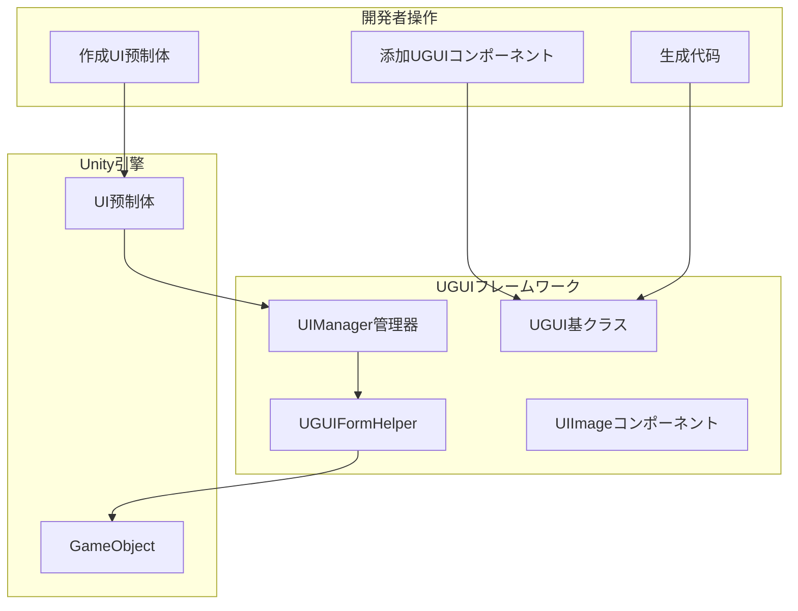
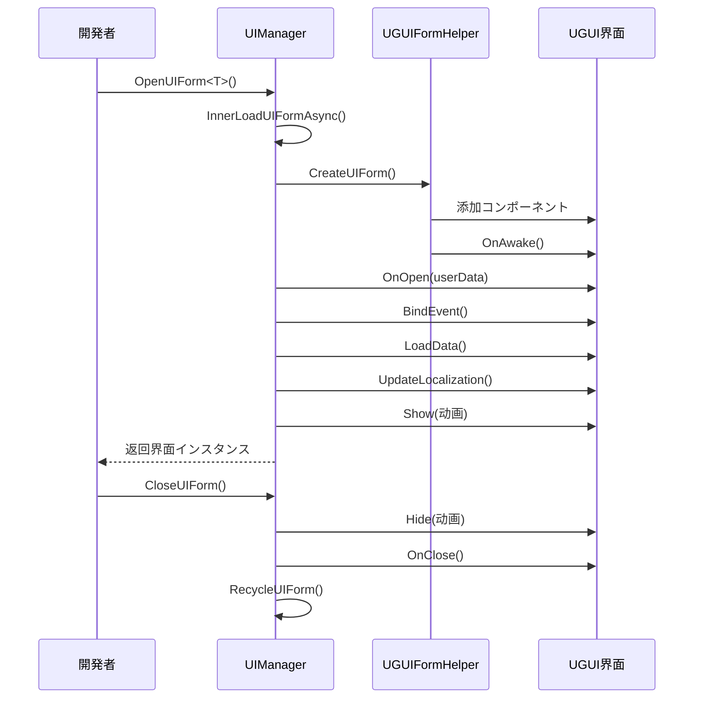

# 作成UI界面

本文档介绍如何在 GameFrameX UGUI 插件中作成和管理 UI 界面。

## 概要

GameFrameX UGUI 插件提供します一套完整的 UI 界面作成和管理体系。を通じて继承 `UGUI` 基クラス，開発者可能快速作成 UI 界面，并利用代码生成器自动生成界面コンポーネント的引用代码。UI 界面由 `UIManager` 统一管理，サポート异步加载、オブジェクトプール缓存、显示/隐藏动画等機能。

> 了解更多コア概念： [UGUI基クラス](./4-core-concepts.ugui-base)、[UI管理器](./4-core-concepts.ui-manager)、[表单辅助器](./4-core-concepts.form-helper)

## コア架构

UI 界面的作成和管理涉及以下コアコンポーネント：



## 作成フロー

### 手順一：作成UI预制体

在 Unity プロジェクト中作成 UI 界面预制体（Prefab），通常包含以下结构：

```
Canvas (画布)
├── UGUI (根节点，添加UGUIコンポーネント)
│   ├── Panel_xxx (背景面板)
│   │   ├── Image_xxx (图片)
│   │   ├── Text_xxx (文本)
│   │   └── Button_xxx (按钮)
│   └── ...
```

> Source: [Runtime/UGUI.cs](https://github.com/GameFrameX/com.gameframex.unity.ui.ugui/blob/main/Runtime/UGUI.cs#L44-L50)

### 手順二：添加UGUIコンポーネント

在预制体的根 GameObject 上添加 `UGUI` コンポーネント：

1. 選択预制体的根节点
2. 在 Inspector 面板中点击 "Add Component"
3. 搜索并添加 `GameFrameX.UI.UGUI.Runtime.UGUI`

`UGUI` コンポーネントを継承 `UIForm`，提供します以下機能：
- 界面的显示和隐藏（サポート动画）
- 可见性ステータス管理
- 全屏模式設定

```csharp
// UGUI 基クラス定义
namespace GameFrameX.UI.UGUI.Runtime
{
    [Preserve]
    [DisallowMultipleComponent]
    public class UGUI : UIForm
    {
        // 显示界面
        public override void Show(IUIFormShowHandler handler, Action complete)

        // 隐藏界面
        public override void Hide(IUIFormHideHandler handler, Action complete)

        // 設定可见性
        protected override void InternalSetVisible(bool value)

        // 取得/設定可见性
        public override bool Visible { get; protected set; }

        // 設定全屏
        protected override void MakeFullScreen()
    }
}
```

> Source: [Runtime/UGUI.cs](https://github.com/GameFrameX/com.gameframex.unity.ui.ugui/blob/main/Runtime/UGUI.cs#L36-L179)

### 手順三：生成UI代码

使用代码生成器自动生成 UI コンポーネント引用代码：

1. 在 Unity 菜单中选择 **GameObject → UI → Generate UGUI Code**
2. 選択要生成代码的 UGUI 预制体
3. 代码生成器会自动遍历预制体中的所有子节点，生成对应的プロパティ代码

生成的代码具有以下结构：

```csharp
#if ENABLE_UI_UGUI
using Cysharp.Threading.Tasks;
using GameFrameX.Entity.Runtime;
using GameFrameX.UI.Runtime;
using GameFrameX.Runtime;
using GameFrameX.UI.UGUI.Runtime;
using UnityEngine;

namespace Hotfix.UI
{
    /// <summary>
    /// 代码生成的UI代码 LoginPanel
    /// </summary>
    [DisallowMultipleComponent]
    [OptionUIConfig(null, "Assets/Prefabs/UI/Login")]
    public sealed partial class LoginPanel : UGUI
    {
        public GameObject self { get; private set; }

        #region Properties

        [SerializeField] [UGUIElementProperty("Panel_Bg/Image_Logo")]
        private UnityEngine.UI.Image m_Image_Logo;

        public UnityEngine.UI.Image m_Image_Logo => m_Image_Logo;

        [SerializeField] [UGUIElementProperty("Panel_Bg/Button_Login")]
        private UnityEngine.UI.Button m_Button_Login;

        public UnityEngine.UI.Button m_Button_Login => m_Button_Login;

        #endregion

        private bool _isInitView = false;

        protected override void InitView()
        {
            if (_isInitView)
            {
                return;
            }

            _isInitView = true;
            this.self = this.gameObject;
            m_Image_Logo = gameObject.transform.FindChildName("Panel_Bg/Image_Logo").GetComponent<UnityEngine.UI.Image>();
            m_Button_Login = gameObject.transform.FindChildName("Panel_Bg/Button_Login").GetComponent<UnityEngine.UI.Button>();
        }
    }
}
#endif
```

> Source: [Editor/UGUICodeGenerator.cs](https://github.com/GameFrameX/com.gameframex.unity.ui.ugui/blob/main/Editor/UGUICodeGenerator.cs#L84-L230)

### 手順四：挂载生成的代码

生成代码后，必要将代码挂载到预制体上：

1. 将生成的 `.UI.cs` ファイル挂载到预制体的根节点
2. 在 Inspector 中点击 **"重新绑定列表"** 按钮，将预制体中的子节点绑定到代码プロパティ上

> 详细了解代码生成器： [使用代码生成器](./3-getting-started.code-generator)

## 打开和关闭UI界面

### 打开UI界面

を通じて `UIManager` 异步打开 UI 界面：

```csharp
// 打开UI界面
var uiForm = await GameEntry.UI.OpenUIForm<LoginPanel>();
```

`OpenUIForm` メソッド会：
1. 检查オブジェクトプール是否有可用インスタンス
2. 如果没有，从 Resources 或 AssetBundle 异步加载
3. 呼び出し `UGUIFormHelper` 作成界面
4. 触发 `OnOpen` 回调
5. 执行显示动画（如果启用）

```csharp
// 打开界面的コアフロー
protected override async Task<IUIForm> InnerOpenUIFormAsync(
    string uiFormAssetPath, 
    Type uiFormType, 
    bool pauseCoveredUIForm, 
    object userData, 
    bool isFullScreen = false)
{
    // 1. 检查オブジェクトプール
    var uiFormInstanceObject = m_InstancePool.Spawn(assetPath);
    if (uiFormInstanceObject != null)
    {
        return InternalOpenUIForm(...);
    }

    // 2. 异步加载リソース
    var uiForm = InnerLoadUIFormAsync(...);
    return await uiForm;
}
```

> Source: [Runtime/UIManager.Open.cs](https://github.com/GameFrameX/com.gameframex.unity.ui.ugui/blob/main/Runtime/UIManager.Open.cs#L79-L115)

### 关闭UI界面

```csharp
// 关闭UI界面
GameEntry.UI.CloseUIForm(loginPanel);
```

### UIForm生命周期



## UIコンポーネント引用

代码生成器会自动为预制体中的每个 UI 控件生成引用プロパティ。使用 `[UGUIElementProperty]` 特性标记控件路径：

```csharp
[SerializeField] 
[UGUIElementProperty("Panel_Bg/Button_Start")]
private UnityEngine.UI.Button m_Button_Start;

public UnityEngine.UI.Button m_Button_Start => m_Button_Start;
```

> 了解更多UIコンポーネント： [UIImageコンポーネント](./5-components.uiimage)、[扩展メソッド](./5-components.extensions)

## UI界面配置

可能を通じて特性配置 UI 界面的行为：

### OptionUIConfig 特性

配置界面的リソース加载方法：

```csharp
[OptionUIConfig(true)]  // 从Resources加载
[OptionUIConfig(null, "Assets/Prefabs/UI/Login")]  // 从AssetBundle加载
```

### OptionUIGroupAttribute 特性

配置界面所属的 UI 组：

```csharp
[OptionUIGroup("MainUI")]
```

### OptionUIShowAnimationAttribute 特性

配置显示动画：

```csharp
[OptionUIShowAnimation(true, "FadeIn")]
```

### OptionUIHideAnimationAttribute 特性

配置隐藏动画：

```csharp
[OptionUIHideAnimation(true, "FadeOut")]
```

## 完整示例

以下は完整的 UI 界面作成示例：

```csharp
using GameFrameX.UI.UGUI.Runtime;
using UnityEngine;
using UnityEngine.UI;

namespace Hotfix.UI
{
    /// <summary>
    /// 登录界面
    /// </summary>
    [DisallowMultipleComponent]
    [OptionUIConfig(null, "Assets/Prefabs/UI/Login")]
    public sealed partial class LoginPanel : UGUI
    {
        public GameObject self { get; private set; }

        #region Properties

        [SerializeField] 
        [UGUIElementProperty("Background")]
        private Image m_Background;

        public Image m_Background => m_Background;

        [SerializeField] 
        [UGUIElementProperty("Button_Login")]
        private Button m_Button_Login;

        public Button m_Button_Login => m_Button_Login;

        [SerializeField] 
        [UGUIElementProperty("InputField_Username")]
        private InputField m_InputField_Username;

        public InputField m_InputField_Username => m_InputField_Username;

        #endregion

        private bool _isInitView = false;

        protected override void InitView()
        {
            if (_isInitView)
            {
                return;
            }

            _isInitView = true;
            this.self = this.gameObject;
            
            m_Background = gameObject.transform.FindChildName("Background").GetComponent<Image>();
            m_Button_Login = gameObject.transform.FindChildName("Button_Login").GetComponent<Button>();
            m_InputField_Username = gameObject.transform.FindChildName("InputField_Username").GetComponent<InputField>();

            // 绑定按钮点击イベント
            m_Button_Login.onClick.AddListener(OnLoginClick);
        }

        private void OnLoginClick()
        {
            Debug.Log("登录按钮点击，用户名：" + m_InputField_Username.text);
            // 处理登录逻辑
        }

        protected override void OnClose(bool isShutdown, bool pauseCovered)
        {
            base.OnClose(isShutdown, pauseCovered);
            // 清理リソース
        }
    }
}
```

## 関連リンク

- [使用代码生成器](./3-getting-started.code-generator) - 详细了解代码生成器的使用
- [UGUI基クラス](./4-core-concepts.ugui-base) - UGUI 基クラス的詳細説明
- [UI管理器](./4-core-concepts.ui-manager) - UI 管理器的詳細説明
- [表单辅助器](./4-core-concepts.form-helper) - 表单辅助器的詳細説明
- [UIImageコンポーネント](./5-components.uiimage) - UIImage コンポーネント説明
- [扩展メソッド](./5-components.extensions) - UGUI 扩展メソッド
- [代码生成器](./6-editor-tools.code-generator) - 编辑器代码生成器工具
- [コンポーネント检查器](./6-editor-tools.inspector) - UGUI コンポーネント检查器
