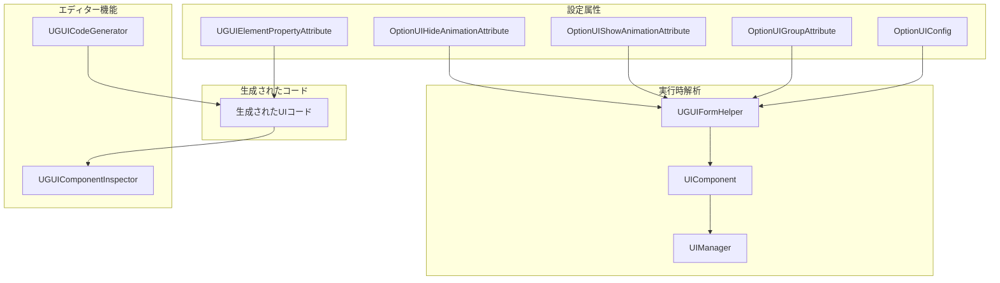
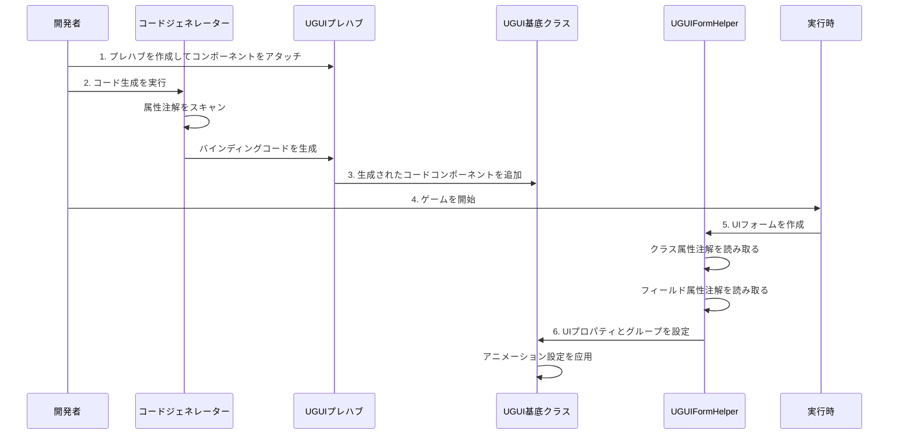

# 設定

本文書はGameFrameX UGUIプラグインの設定システムを詳しく紹介し、属性設定、プロパティバインディング、コードジェネレーター設定などを含みます。

## 概要

GameFrameX UGUIプラグインは**属性駆動（Attribute-Driven）**の設定モードを採用し、C#属性（Attribute）を通じてコード内で宣言的にUI画面の 각종動作とプロパティを定義します。この方法には以下の利点があります：

- **宣言式設定**：属性マークを通じて即可UI動作を設定、面倒な初期化コードを記述不要
- **タイプ安全**：設定はコンパイル時にチェック、実行時エラーを減少
- **コード生成統合**：属性とコードジェネレーターが深く統合され、バインディングコードを自動生成
- **実行時解析**：属性はUI画面作成時に自動的に解析与应用

設定システムは主に以下の次元を含みます：

1. **UIフォーム設定**：画面のアセットpath、所属グループ、アニメーションなどを定義
2. **UI要素バインディング**：プレハブ内のコントロール参照を宣言式でバインディング
3. **コードジェネレーター設定**：コード生成動作と出力pathをカスタマイズ
4. **UIグループ設定**：画面のレイヤーと深度関係を管理

## アーキテクチャ



### 設定フロー



## UIフォーム設定

### OptionUIConfig属性

`OptionUIConfig`属性はUIフォームの基本情報を設定するために使用され、アセット読み込み方法含めます。

```csharp
[OptionUIConfig(null, "Assets/Resources/UI/Prefabs")]
public partial class MainMenuUI : UGUI
{
    // UI画面ロジック
}
```

> Source: [UGUICodeGenerator.cs#L188](https://github.com/GameFrameX/com.gameframex.unity.ui.ugui/blob/main/Editor/UGUICodeGenerator.cs#L188)

**パラメータ説明：**

| パラメータ | タイプ | デフォルト値 | 説明 |
|------|------|--------|------|
| isResources | bool? | null | Resourcesから読み込むか、trueはResourcesから、falseはABパッケージから、nullはデフォルト設定を使用 |
| assetPath | string | null | アセットpath、isResourcesがfalseの場合ABパッケージの相対pathを指定 |

**使用シーン：**

- **Resourcesから読み込む**：`[OptionUIConfig(true)]` - アセットは`Resources`ディレクトリ下に配置必须
- **ABパッケージから読み込む**：`[OptionUIConfig(false, "Assets/UI/Prefabs")]` - アセットはABパッケージで管理
- **デフォルト設定を使用**：`[OptionUIConfig(null, "Assets/UI/Prefabs")]` - UIComponentのデフォルト設定を使用

### OptionUIGroupAttribute属性

`OptionUIGroupAttribute`属性はUI画面が属するUIグループ（UIGroup）を指定するために使用されます。

```csharp
[OptionUIGroup("MainUI")]
public partial class MainMenuUI : UGUI
{
    // UI画面ロジック
}
```

> Source: [UGUIFormHelper.cs#L117-L121](https://github.com/GameFrameX/com.gameframex.unity.ui.ugui/blob/main/Runtime/UGUIFormHelper.cs#L117-L121)

**パラメータ説明：**

| パラメータ | タイプ | 説明 |
|------|------|------|
| GroupName | string | UIグループの名前、画面を特定のグループに分配するために使用 |

**UIグループの作用：**

- 同グループ画面の表示レイヤー（Depth）を管理
- 同グループ画面の表示/非表示策略を制御
- 同グループ画面のアセット解放を統一管理

### OptionUIShowAnimationAttribute属性

`OptionUIShowAnimationAttribute`属性はUI画面を開く時のアニメーション効果を設定するために使用されます。

```csharp
[OptionUIShowAnimation(true, "MainMenuEnter")]
public partial class MainMenuUI : UGUI
{
    // UI画面ロジック
}
```

> Source: [UGUIFormHelper.cs#L126-L131](https://github.com/GameFrameX/com.gameframex.unity.ui.ugui/blob/main/Runtime/UGUIFormHelper.cs#L126-L131)

**パラメータ説明：**

| パラメータ | タイプ | デフォルト値 | 説明 |
|------|--------|------|------|
| Enable | bool | false | 表示アニメーションを有効にするか |
| AnimationName | string | "" | アニメーション名、アニメーションシステム内のアニメーション識別子に対応 |

### OptionUIHideAnimationAttribute属性

`OptionUIHideAnimationAttribute`属性はUI画面を閉じる時のアニメーション効果を設定するために使用されます。

```csharp
[OptionUIHideAnimation(true, "MainMenuExit")]
public partial class MainMenuUI : UGUI
{
    // UI画面ロジック
}
```

> Source: [UGUIFormHelper.cs#L137-L142](https://github.com/GameFrameX/com.gameframex.unity.ui.ugui/blob/main/Runtime/UGUIFormHelper.cs#L137-L142)

**パラメータ説明：**

| パラメータ | タイプ | デフォルト値 | 説明 |
|------|--------|------|------|
| Enable | bool | false | 非表示アニメーションを有効にするか |
| AnimationName | string | "" | アニメーション名、アニメーションシステム内のアニメーション識別子に対応 |

### 組合設定例

複数の属性を同時に使用して組合設定できます：

```csharp
[OptionUIConfig(false, "Assets/UI/Prefabs/MainMenu")]
[OptionUIGroup("MainUI")]
[OptionUIShowAnimation(true, "MainMenuEnter")]
[OptionUIHideAnimation(true, "MainMenuExit")]
public partial class MainMenuUI : UGUI
{
    // 画面ロジック
}
```

## UI要素バインディング

### UGUIElementPropertyAttribute属性

`UGUIElementPropertyAttribute`属性はプレハブ内のUIコントロールpathsをマークするために使用され、コードジェネレーターがプロパティバインディングコードを自動生成できるようにします。

```csharp
public partial class MainMenuUI : UGUI
{
    [SerializeField]
    [UGUIElementProperty("StartButton")]
    private Button m_StartButton;

    [SerializeField]
    [UGUIElementProperty("Panel/Title")]
    private Text m_Title;

    public Button m_StartButton => m_StartButton;
    public Text m_Title => m_Title;
}
```

> Source: [UGUIElementPropertyAttribute.cs#L40-L64](https://github.com/GameFrameX/com.gameframex.unity.ui.ugui/blob/main/Runtime/UGUIElementPropertyAttribute.cs#L40-L64)

**パラメータ説明：**

| パラメータ | タイプ | 説明 |
|------|------|------|
| Path | string | プレハブ内のコントロールpath、`/`でレイヤーを分隔 |

**path規則：**

- 現在のUIプレハブのルートノードに 상대
- `/`を使用して子ノードレイヤーを表示
- 例：`"Panel/Content/Button"`はルートノードから始まり、Panel -> Content -> Buttonと順番に進む

**動作原理：**

1. コードジェネレーターが`[UGUIElementProperty]`属性を持つフィールドをスキャン
2. Path pathに基づいてプレハブで対応するTransformを検索
3. 対応のタイプのコンポーネントを自動取得して割り当て

### 生成されるコード構造

コードジェネレーターは各UIコントロールに対して以下のコード構造を生成します：

```csharp
[SerializeField]
[UGUIElementProperty("StartButton")]
private Button m_StartButton;

public Button m_StartButton => m_StartButton;
```

このパターンの利点：

- `[SerializeField]`はフィールドがエディターでシリアライズできることを確保
- `[UGUIElementProperty]`はpath情報をコードジェネレーターに提供
- プロパティ封装（Property）は読み取り専用アクセスを提供

## コードジェネレーター設定

### コード生成path

コードジェネレーターはプレハブの位置に基づいて自動的に生成pathを選択：

```csharp
if (assetPath.Contains(nameof(Resources)))
{
    // Resourcesディレクトリ下のプレハブ
    savePath = System.IO.Path.Combine(Application.dataPath, "Scripts", "Game", "UGUI", className);
}
else
{
    // その他位置のプレハブ（ホット更新コード）
    savePath = System.IO.Path.Combine(Application.dataPath, "Hotfix", "UI", "UGUI", className);
}
```

> Source: [UGUICodeGenerator.cs#L120-L127](https://github.com/GameFrameX/com.gameframex.unity.ui.ugui/blob/main/Editor/UGUICodeGenerator.cs#L120-L127)

**生成path規則：**

| プレハブ位置 | 生成path |
|------------|----------|
| `Resources/`ディレクトリ | `Assets/Scripts/Game/UGUI/<プレハブ名>/` |
| その他ディレクトリ | `Assets/Hotfix/UI/UGUI/<プレハブ名>/` |

### カスタムタイプ変換プロセッサー

コードジェネレーターは`IUGUIGeneratorCodeConvertTypeHandler`インターフェースを実装することで、サポートするUIコントロールタイプを拡張できます。

```csharp
public interface IUGUIGeneratorCodeConvertTypeHandler
{
    /// <summary>
    /// プロセッサー優先順位、数値が小さいほど優先度が高い
    /// </summary>
    int Priority { get; }

    /// <summary>
    /// タイプ変換を実行
    /// </summary>
    /// <param name="transform">対象のTransform</param>
    /// <returns>変換後のタイプ名、nullを返すと処理しない</returns>
    string Run(Transform transform);
}
```

> Source: [UGUICodeGenerator.cs#L78-L115](https://github.com/GameFrameX/com.gameframex.unity.ui.ugui/blob/main/Editor/UGUICodeGenerator.cs#L78-L115)

コードジェネレーターは自動的にこのインターフェースを実装したすべてのタイプをスキャンし、優先順位顺序で実行します。

### 組み込みタイプサポート

コードジェネレーターは組み込みで以下のUIコントロールタイプをサポート：

| コンポーネントタイプ | 優先順位 | 説明 |
|----------|--------|------|
| Button | 組み込み | ボタンコンポーネント |
| Text | 組み込み | テキストコンポーネント |
| Toggle | 組み込み | スイッチコンポーネント |
| ToggleGroup | 組み込み | スイッチグループコンポーネント |
| InputField | 組み込み | 入力框コンポーネント |
| ScrollRect | 組み込み | スクロールビューコンポーネント |
| Dropdown | 組み込み | ドロップダウンコンポーネント |
| Scrollbar | 組み込み | スクロールバーコンポーネント |
| Slider | 組み込み | スライダーコンポーネント |
| RawImage | 組み込み | 生画像コンポーネント |
| UIImage | 組み込み | 拡張画像コンポーネント |
| Image | 組み込み | 画像コンポーネント |
| RectTransform | 組み込み | 矩形変換コンポーネント |
| TextMeshProUGUI | 条件付きコンパイル | TMPテキストコンポーネント |
| TMP_InputField | 条件付きコンパイル | TMP入力框コンポーネント |
| TMP_Dropdown | 条件付きコンパイル | TMPドロップダウンコンポーネント |

## UIグループ設定

### UGUIUIGroupHelper

`UGUIUIGroupHelper`はUGUIのUIグループヘルパーであり、UIグループの深度とレイヤー関係を管理します。

```csharp
public sealed class UGUIUIGroupHelper : UIGroupHelperBase
{
    /// <summary>
    /// 画面グループ深度を設定
    /// </summary>
    public override void SetDepth(int depth)
    {
        Depth = depth;
        // Z軸位置を調整して深度制御を実装
        transform.localPosition = new Vector3(0, 0, depth * 1000);
    }
}
```

> Source: [UGUIUIGroupHelper.cs#L44-L68](https://github.com/GameFrameX/com.gameframex.unity.ui.ugui/blob/main/Runtime/UGUIUIGroupHelper.cs#L44-L68)

**UIグループ深度メカニズム：**

- 各UIグループには唯一の深度値（Depth）がある
- 深度値はUIのZ軸上の位置を決定：`z = depth * 1000`
- 深度値が大きいほど、UIが前面に表示
- エンジン描画時、後から描画されたUIが先に描画されたUIを覆う

### UIグループを作成

UIグループは`Handler`メソッドを通じて作成：

```csharp
public override IUIGroupHelper Handler(
    Transform root,           // ルートノード
    string groupName,         // グループ名
    string uiGroupHelperTypeName,  // ヘルパークラス型名
    IUIGroupHelper customUIGroupHelper,  // カスタムヘルパー
    int depth = 0             // 深度値
)
```

> Source: [UGUIUIGroupHelper.cs#L84-L105](https://github.com/GameFrameX/com.gameframex.unity.ui.ugui/blob/main/Runtime/UGUIUIGroupHelper.cs#L84-L105)

**作成フロー：**

1. 空のGameObjectを作成し、名前をグループ名にする
2. 親ノードをrootに設定
3. Layerを"UI"に設定
4. RectTransformを追加してフルスクリーンに設定
5. ヘルパーコンポーネントを作成

## エディター設定

### UGUIComponentInspector

`UGUIComponentInspector`はUGUI基底クラスのカスタムinspectorパネルであり、エディター内での設定機能を提供します。

```csharp
[CustomEditor(typeof(Runtime.UGUI), true)]
internal sealed class UGUIComponentInspector : GameFrameworkInspector
{
    // バインディング再設定ボタン
    private readonly GUIContent _reBind = new GUIContent("バインディング再設定");

    // コード再生成ボタン
    private readonly GUIContent _reGenerate = new GUIContent("コード再生成");
}
```

> Source: [UGUIComponentInspector.cs#L43-L78](https://github.com/GameFrameX/com.gameframex.unity.ui.ugui/blob/main/Editor/UGUIComponentInspector.cs#L43-L78)

**機能説明：**

| 機能 | 説明 |
|------|------|
| バインディング再設定 | プレハブを再スキャンして`[UGUIElementProperty]`属性を持つすべてのフィールドをバインディング |
| コード再生成 | UIコードファイルを再生成 |
| バインディングフィールドを表示 | すべてのバインディングされたUI要素を表示（読み取り専用） |

### 画像置換プロセッサー

`UIImageReplaceHandler`は標準ImageコンポーネントをUIImageコンポーネントに置換する機能を提供します。

```csharp
[MenuItem("CONTEXT/Image/Replace To UIImage(UIImageに置換)", false, 10)]
static void Run()
{
    // 元のImageのすべてのプロパティを保持
    var imageType = image.type;
    var material = image.material;
    var sprite = image.sprite;
    // ... その他プロパティ

    // 元のImageコンポーネントを破棄
    DestroyImmediate(image);

    // UIImageコンポーネントを追加してプロパティを恢复
    var uiImage = Selection.activeGameObject.GetOrAddComponent<UIImage>();
    // ... すべてのプロパティを恢复
}
```

> Source: [UIImageReplaceHandler.cs#L42-L76](https://github.com/GameFrameX/com.gameframex.unity.ui.ugui/blob/main/Editor/UIImageReplaceHandler.cs#L42-L76)

## 実行時設定解析

### UGUIFormHelper設定解析

`UGUIFormHelper`はUIフォームを作成する時に属性設定を自動解析します：

```csharp
public override IUIForm CreateUIForm(object uiFormInstance, Type uiFormType, object userData)
{
    // 1. UIグループ設定を解析
    var attribute = uiFormType.GetCustomAttribute(typeof(OptionUIGroupAttribute));
    if (attribute is OptionUIGroupAttribute optionUIGroup)
    {
        uiGroup = m_UIComponent.GetUIGroup(optionUIGroup.GroupName);
    }

    // 2. 表示アニメーション設定を解析
    var showAnimationAttribute = uiFormType.GetCustomAttribute(typeof(OptionUIShowAnimationAttribute));
    if (showAnimationAttribute is OptionUIShowAnimationAttribute optionShowAnimation)
    {
        uiForm.EnableShowAnimation = optionShowAnimation.Enable;
        uiForm.ShowAnimationName = optionShowAnimation.AnimationName;
    }
    else
    {
        // UIComponentのグローバルデフォルト設定を使用
        uiForm.EnableShowAnimation = m_UIComponent.IsEnableUIShowAnimation;
    }

    // 3. 非表示アニメーション設定を解析
    var hideAnimationAttribute = uiFormType.GetCustomAttribute(typeof(OptionUIHideAnimationAttribute));
    if (hideAnimationAttribute is OptionUIHideAnimationAttribute optionHideAnimation)
    {
        uiForm.EnableHideAnimation = optionHideAnimation.Enable;
        uiForm.HideAnimationName = optionHideAnimation.AnimationName;
    }
    else
    {
        // UIComponentのグローバルデフォルト設定を使用
        uiForm.EnableHideAnimation = m_UIComponent.IsEnableUIHideAnimation;
    }
}
```

> Source: [UGUIFormHelper.cs#L93-L164](https://github.com/GameFrameX/com.gameframex.unity.ui.ugui/blob/main/Runtime/UGUIFormHelper.cs#L93-L164)

**解析優先順位：**

1. **クラレベル属性** > **UIComponentグローバル設定**
2. クラス上没有設定属性，则使用UIComponentのグローバルデフォルト値
3. クラス上有設定属性，则使用属性指定的値

## 設定ベストプラクティス

### 1. 合理的なUIグループ区分

機能またはシーンごとにUIグループを区分することをお勧めします：

```csharp
// 主画面グループ
[OptionUIGroup("MainUI")]
public class MainMenuUI : UGUI { }

// ポップアップダイアロググループ
[OptionUIGroup("Dialog")]
public class ConfirmDialogUI : UGUI { }

// HUDグループ（最高優先順位）
[OptionUIGroup("HUD")]
public class ScoreDisplayUI : UGUI { }
```

### 2. アニメーション設定の推奨事項

- 一般的な简单な画面はグローバルデフォルトアニメーション設定を使用可能
- 特殊アニメーション効果が必要な画面は属性で個別に設定
- アニメーション名がプロジェクトのアニメーションシステムと一致することを確認

### 3. コード生成後のメンテナンス

- プレハブ構造を変更した後、コードを再生成することを忘れない
- 手動で追加したバインディングフィールドは`[UGUIElementProperty]`属性を削除しない
- 「バインディング再設定」機能を使用してバインディング関係を急速に更新

## 関連リンク

- [UIマネージャー](./4-core-concepts.ui-manager)
- [UGUI基底クラス](./4-core-concepts.ugui-base)
- [フォームヘルパー](./4-core-concepts.form-helper)
- [コードジェネレーター](./6-editor-tools.code-generator)
- [コンポーネントinspector](./6-editor-tools.inspector)
- [クイックスタート - コードジェネレーターを使用](./3-getting-started.code-generator)