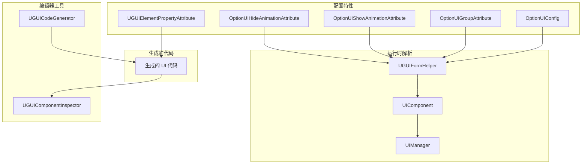
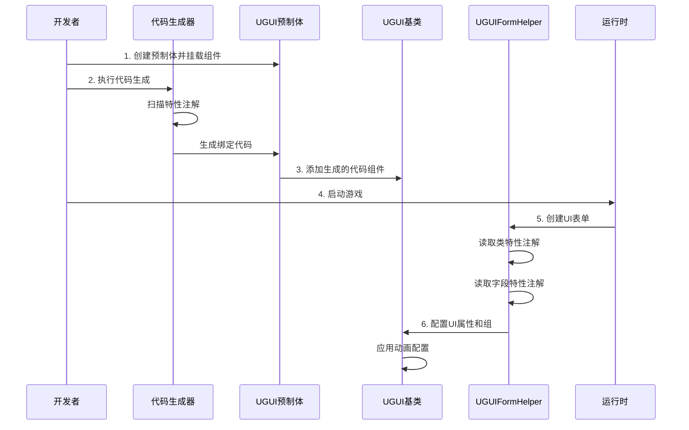

# 設定

このドキュメント詳細介绍 GameFrameX UGUI プラグイン的設定系统，含みます特性設定、プロパティ绑定、コード生成器設定等。

## 概要

GameFrameX UGUI プラグイン采用**特性驱动（Attribute-Driven）**的設定モード，通过 C# 特性（Attribute）在コード中声明式地定義 UI 界面的各种行为和プロパティ。这种方法具有以下优势：

- **声明式設定**：通过特性标记つまり可設定 UI 行为，无需编写繁琐的初期化コード
- **タイプ安全**：設定在コンパイル时进行確認，减少ランタイムエラー
- **コード生成集成**：特性与コード生成器深度集成，自动生成绑定コード
- **ランタイム解析**：特性在 UI 界面作成时自动被解析和应用

設定系统主なパッケージ含以下几个维度：

1. **UI 表单設定**：定義界面的リソースパス、所属组、动画等
2. **UI 元素绑定**：声明式绑定预制体中的控件参照
3. **コード生成器設定**：自定義コード生成行为和输出路径
4. **UI 组設定**：管理界面的层级和深度关系

## アーキテクチャ



### 設定フロー



## UI 表单設定

### OptionUIConfig 特性

`OptionUIConfig` 特性用于設定 UI 表单的基本情報，含みますリソースロード方法和リソースパス。

```csharp
[OptionUIConfig(null, "Assets/Resources/UI/Prefabs")]
public partial class MainMenuUI : UGUI
{
    // UI界面逻辑
}
```

> Source: [UGUICodeGenerator.cs#L188](https://github.com/GameFrameX/com.gameframex.unity.ui.ugui/blob/main/Editor/UGUICodeGenerator.cs#L188)

**パラメータ説明：**

| パラメータ | タイプ | デフォルト值 | 説明 |
|------|------|--------|------|
| isResources | bool? | null | 是否从 Resources ロード，true 表示从 Resources ロード，false 表示从 AB パッケージロード，null 表示使用デフォルト設定 |
| assetPath | string | null | リソースパス，当 isResources 为 false 时指定 AB パッケージ的相对路径 |

**使用シーン：**

- **从 Resources ロード**：`[OptionUIConfig(true)]` - リソース〜しなければなりません放在 `Resources` ディレクトリ下
- **从 AB パッケージロード**：`[OptionUIConfig(false, "Assets/UI/Prefabs")]` - リソース通过 AB パッケージ管理
- **使用デフォルト設定**：`[OptionUIConfig(null, "Assets/UI/Prefabs")]` - 使用 UIComponent 的デフォルト設定

### OptionUIGroupAttribute 特性

`OptionUIGroupAttribute` 特性用于指定 UI 界面所属的 UI 组（UIGroup）。

```csharp
[OptionUIGroup("MainUI")]
public partial class MainMenuUI : UGUI
{
    // UI界面逻辑
}
```

> Source: [UGUIFormHelper.cs#L117-L121](https://github.com/GameFrameX/com.gameframex.unity.ui.ugui/blob/main/Runtime/UGUIFormHelper.cs#L117-L121)

**パラメータ説明：**

| パラメータ | タイプ | 説明 |
|------|------|------|
| GroupName | string | UI 组的名称，用于将界面分配到特定的组 |

**UI 组的作用：**

- 管理同组界面的显示层级（Depth）
- 控制同组界面的显示/隐藏策略
- 統一された管理同组界面的リソース解放

### OptionUIShowAnimationAttribute 特性

`OptionUIShowAnimationAttribute` 特性用于設定 UI 界面打开时的动画效果。

```csharp
[OptionUIShowAnimation(true, "MainMenuEnter")]
public partial class MainMenuUI : UGUI
{
    // UI界面逻辑
}
```

> Source: [UGUIFormHelper.cs#L126-L131](https://github.com/GameFrameX/com.gameframex.unity.ui.ugui/blob/main/Runtime/UGUIFormHelper.cs#L126-L131)

**パラメータ説明：**

| パラメータ | タイプ | デフォルト值 | 説明 |
|------|------|--------|------|
| Enable | bool | false | 是否启用显示动画 |
| AnimationName | string | "" | 动画名称，对应动画系统中的动画标识 |

### OptionUIHideAnimationAttribute 特性

`OptionUIHideAnimationAttribute` 特性用于設定 UI 界面閉じる时的动画效果。

```csharp
[OptionUIHideAnimation(true, "MainMenuExit")]
public partial class MainMenuUI : UGUI
{
    // UI界面逻辑
}
```

> Source: [UGUIFormHelper.cs#L137-L142](https://github.com/GameFrameX/com.gameframex.unity.ui.ugui/blob/main/Runtime/UGUIFormHelper.cs#L137-L142)

**パラメータ説明：**

| パラメータ | タイプ | デフォルト值 | 説明 |
|------|------|--------|------|
| Enable | bool | false | 是否启用隐藏动画 |
| AnimationName | string | "" | 动画名称，对应动画系统中的动画标识 |

### 组合設定例

〜できます同時に使用多个特性进行组合設定：

```csharp
[OptionUIConfig(false, "Assets/UI/Prefabs/MainMenu")]
[OptionUIGroup("MainUI")]
[OptionUIShowAnimation(true, "MainMenuEnter")]
[OptionUIHideAnimation(true, "MainMenuExit")]
public partial class MainMenuUI : UGUI
{
    // 界面逻辑
}
```

## UI 元素绑定

### UGUIElementPropertyAttribute 特性

`UGUIElementPropertyAttribute` 特性用于标记 UI 控件在预制体中的路径，使コード生成器能够自动生成プロパティ绑定コード。

```csharp
public partial class MainMenuUI : UGUI
{
    [SerializeField]
    [UGUIElementProperty("StartButton")]
    private Button m_StartButton;

    [SerializeField]
    [UGUIElementProperty("Panel/Title")]
    private Text m_Title;

    public Button m_StartButton => m_StartButton;
    public Text m_Title => m_Title;
}
```

> Source: [UGUIElementPropertyAttribute.cs#L40-L64](https://github.com/GameFrameX/com.gameframex.unity.ui.ugui/blob/main/Runtime/UGUIElementPropertyAttribute.cs#L40-L64)

**パラメータ説明：**

| パラメータ | タイプ | 説明 |
|------|------|------|
| Path | string | 控件在预制体中的路径，使用 "/" 分隔层级 |

**路径规则：**

- 相对于当前 UI 预制体的根节点
- 使用 "/" 表示子节点层级
- 例えば：`"Panel/Content/Button"` 表示从根节点开始，依次进入 Panel -> Content -> Button

**工作原理：**

1. コード生成器扫描带有 `[UGUIElementProperty]` 特性的フィールド
2. 根据 Path 路径在预制体中查找对应的 Transform
3. 自动取得对应タイプ的コンポーネント并赋值

### 生成的コード结构

コード生成器会为每个 UI 控件生成以下コード结构：

```csharp
[SerializeField]
[UGUIElementProperty("StartButton")]
private Button m_StartButton;

public Button m_StartButton => m_StartButton;
```

这种モード的优势：

- `[SerializeField]` 確認してくださいフィールド可在エディタ中シリアライズ
- `[UGUIElementProperty]` 提供路径情報供コード生成器使用
- プロパティカプセル化（Property）提供只读访问

## コード生成器設定

### コード生成路径

コード生成器根据预制体的位置自动选择生成路径：

```csharp
if (assetPath.Contains(nameof(Resources)))
{
    // Resources 目录下的预制体
    savePath = System.IO.Path.Combine(Application.dataPath, "Scripts", "Game", "UGUI", className);
}
else
{
    // 其他位置的预制体（热更代码）
    savePath = System.IO.Path.Combine(Application.dataPath, "Hotfix", "UI", "UGUI", className);
}
```

> Source: [UGUICodeGenerator.cs#L120-L127](https://github.com/GameFrameX/com.gameframex.unity.ui.ugui/blob/main/Editor/UGUICodeGenerator.cs#L120-L127)

**生成路径规则：**

| 预制体位置 | 生成路径 |
|------------|----------|
| `Resources/` ディレクトリ | `Assets/Scripts/Game/UGUI/<预制体名>/` |
| 其他ディレクトリ | `Assets/Hotfix/UI/UGUI/<预制体名>/` |

### 自定義タイプ转换処理器

コード生成器サポート通过実装 `IUGUIGeneratorCodeConvertTypeHandler` インターフェース来拡張サポート的 UI 控件タイプ。

```csharp
public interface IUGUIGeneratorCodeConvertTypeHandler
{
    /// <summary>
    /// 处理器优先级，数值越小优先级越高
    /// </summary>
    int Priority { get; }

    /// <summary>
    /// 执行类型转换
    /// </summary>
    /// <param name="transform">目标 Transform</param>
    /// <returns>转换后的类型名称，返回 null 表示不处理</returns>
    string Run(Transform transform);
}
```

> Source: [UGUICodeGenerator.cs#L78-L115](https://github.com/GameFrameX/com.gameframex.unity.ui.ugui/blob/main/Editor/UGUICodeGenerator.cs#L78-L115)

コード生成器会自动扫描所有実装了该インターフェース的タイプ，并按优先级顺序执行。

### 内置タイプサポート

コード生成器内置サポート以下 UI 控件タイプ：

| コンポーネントタイプ | 优先级 | 説明 |
|----------|--------|------|
| Button | 内置 | ボタンコンポーネント |
| Text | 内置 | 文本コンポーネント |
| Toggle | 内置 | 开关コンポーネント |
| ToggleGroup | 内置 | 开关组コンポーネント |
| InputField | 内置 | 输入框コンポーネント |
| ScrollRect | 内置 | 滚动视图コンポーネント |
| Dropdown | 内置 | 下拉框コンポーネント |
| Scrollbar | 内置 | 滚动条コンポーネント |
| Slider | 内置 | 滑动条コンポーネント |
| RawImage | 内置 | 原始图片コンポーネント |
| UIImage | 内置 | 拡張图片コンポーネント |
| Image | 内置 | 图片コンポーネント |
| RectTransform | 内置 | 矩形变换コンポーネント |
| TextMeshProUGUI | 条件コンパイル | TMP 文本コンポーネント |
| TMP_InputField | 条件コンパイル | TMP 输入框コンポーネント |
| TMP_Dropdown | 条件コンパイル | TMP 下拉框コンポーネント |

## UI 组設定

### UGUIUIGroupHelper

`UGUIUIGroupHelper` 是 UGUI 的 UI 组辅助器，负责管理 UI 组的深度和层级关系。

```csharp
public sealed class UGUIUIGroupHelper : UIGroupHelperBase
{
    /// <summary>
    /// 设置界面组深度
    /// </summary>
    public override void SetDepth(int depth)
    {
        Depth = depth;
        // 使用 Z 轴位置区分不同深度的 UI 组
        transform.localPosition = new Vector3(0, 0, depth * 1000);
    }
}
```

> Source: [UGUIUIGroupHelper.cs#L44-L68](https://github.com/GameFrameX/com.gameframex.unity.ui.ugui/blob/main/Runtime/UGUIUIGroupHelper.cs#L44-L68)

**UI 组深度机制：**

- 每个 UI 组有唯一的深度值（Depth）
- 深度值决定 UI 在 Z 轴上的位置：`z = depth * 1000`
- 深度值越大，UI 越靠前显示
- 引擎渲染时后绘制的 UI 会覆盖先绘制的 UI

### 作成 UI 组

UI 组通过 `Handler` メソッド作成：

```csharp
public override IUIGroupHelper Handler(
    Transform root,           // 根节点
    string groupName,         // 组名称
    string uiGroupHelperTypeName,  // 辅助器类型名
    IUIGroupHelper customUIGroupHelper,  // 自定义辅助器
    int depth = 0             // 深度值
)
```

> Source: [UGUIUIGroupHelper.cs#L84-L105](https://github.com/GameFrameX/com.gameframex.unity.ui.ugui/blob/main/Runtime/UGUIUIGroupHelper.cs#L84-L105)

**作成フロー：**

1. 作成空 GameObject，名称为组名
2. 設定父节点为 root
3. 設定 Layer 为 "UI"
4. 追加 RectTransform 并设为全屏
5. 作成辅助器コンポーネント

## エディタ設定

### UGUIComponentInspector

`UGUIComponentInspector` 是 UGUI 基底クラス的自定義检视パネル，提供エディタ内的設定機能。

```csharp
[CustomEditor(typeof(Runtime.UGUI), true)]
internal sealed class UGUIComponentInspector : GameFrameworkInspector
{
    // 重新绑定列表按钮
    private readonly GUIContent _reBind = new GUIContent("重新绑定列表");
    
    // 重新生成代码按钮
    private readonly GUIContent _reGenerate = new GUIContent("重新生成代码");
}
```

> Source: [UGUIComponentInspector.cs#L43-L78](https://github.com/GameFrameX/com.gameframex.unity.ui.ugui/blob/main/Editor/UGUIComponentInspector.cs#L43-L78)

**機能説明：**

| 機能 | 説明 |
|------|------|
| 重新绑定列表 | 重新扫描预制体并绑定所有带 `[UGUIElementProperty]` 特性的フィールド |
| 重新生成コード | 重新生成 UI コードファイル |
| 確認绑定フィールド | 显示所有已绑定的 UI 元素（只读） |

### 图片置換処理器

`UIImageReplaceHandler` 提供将標準 Image コンポーネント置換为 UIImage コンポーネント的機能。

```csharp
[MenuItem("CONTEXT/Image/Replace To UIImage(替换为UIImage)", false, 10)]
static void Run()
{
    // 保留原 Image 的所有属性
    var imageType = image.type;
    var material = image.material;
    var sprite = image.sprite;
    // ... 其他属性
    
    // 销毁原 Image 组件
    DestroyImmediate(image);
    
    // 添加 UIImage 组件并恢复属性
    var uiImage = Selection.activeGameObject.GetOrAddComponent<UIImage>();
    // ... 恢复所有属性
}
```

> Source: [UIImageReplaceHandler.cs#L42-L76](https://github.com/GameFrameX/com.gameframex.unity.ui.ugui/blob/main/Editor/UIImageReplaceHandler.cs#L42-L76)

## ランタイム設定解析

### UGUIFormHelper 設定解析

`UGUIFormHelper` 在作成 UI 表单时自动解析特性設定：

```csharp
public override IUIForm CreateUIForm(object uiFormInstance, Type uiFormType, object userData)
{
    // 1. 解析 UI 组配置
    var attribute = uiFormType.GetCustomAttribute(typeof(OptionUIGroupAttribute));
    if (attribute is OptionUIGroupAttribute optionUIGroup)
    {
        uiGroup = m_UIComponent.GetUIGroup(optionUIGroup.GroupName);
    }

    // 2. 解析显示动画配置
    var showAnimationAttribute = uiFormType.GetCustomAttribute(typeof(OptionUIShowAnimationAttribute));
    if (showAnimationAttribute is OptionUIShowAnimationAttribute optionShowAnimation)
    {
        uiForm.EnableShowAnimation = optionShowAnimation.Enable;
        uiForm.ShowAnimationName = optionShowAnimation.AnimationName;
    }
    else
    {
        // 使用 UIComponent 的全局默认设置
        uiForm.EnableShowAnimation = m_UIComponent.IsEnableUIShowAnimation;
    }

    // 3. 解析隐藏动画配置
    var hideAnimationAttribute = uiFormType.GetCustomAttribute(typeof(OptionUIHideAnimationAttribute));
    if (hideAnimationAttribute is OptionUIHideAnimationAttribute optionHideAnimation)
    {
        uiForm.EnableHideAnimation = optionHideAnimation.Enable;
        uiForm.HideAnimationName = optionHideAnimation.AnimationName;
    }
    else
    {
        // 使用 UIComponent 的全局默认设置
        uiForm.EnableHideAnimation = m_UIComponent.IsEnableUIHideAnimation;
    }
}
```

> Source: [UGUIFormHelper.cs#L93-L164](https://github.com/GameFrameX/com.gameframex.unity.ui.ugui/blob/main/Runtime/UGUIFormHelper.cs#L93-L164)

**解析优先级：**

1. **类级别特性** > **UIComponent 全局設定**
2. もし类上没有設定特性，则使用 UIComponent 的全局デフォルト值
3. もし类上有設定特性，则使用特性指定的值

## 設定最佳实践

### 1. 合理的 UI 组划分

お勧め按機能或シーン划分 UI 组：

```csharp
// 主界面组
[OptionUIGroup("MainUI")]
public class MainMenuUI : UGUI { }

// 弹出对话框组
[OptionUIGroup("Dialog")]
public class ConfirmDialogUI : UGUI { }

// HUD 组（最高优先级）
[OptionUIGroup("HUD")]
public class ScoreDisplayUI : UGUI { }
```

### 2. 动画設定お勧め

- 常用的シンプル界面〜できます使用全局デフォルト动画設定
- 〜する必要があります特殊动画效果的界面使用特性单独設定
- 確認してください动画名称与プロジェクト中的动画系統一された致

### 3. コード生成后维护

- 変更预制体结构后记得重新生成コード
- 手动追加的绑定フィールド不要削除 `[UGUIElementProperty]` 特性
- 使用"重新绑定列表"機能快速アップデート绑定关系

## 関連リンク

- [UIマネージャー](./4-core-concepts.ui-manager)
- [UGUI基底クラス](./4-core-concepts.ugui-base)
- [表单辅助器](./4-core-concepts.form-helper)
- [コード生成器](./6-editor-tools.code-generator)
- [コンポーネント確認器](./6-editor-tools.inspector)
- [快速开始 - 使用コード生成器](./3-getting-started.code-generator)
