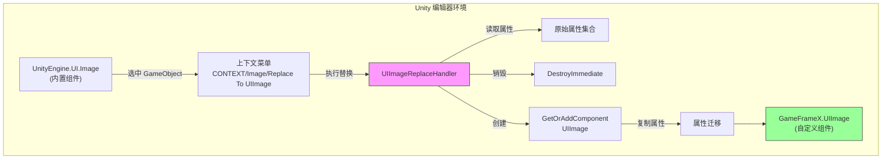
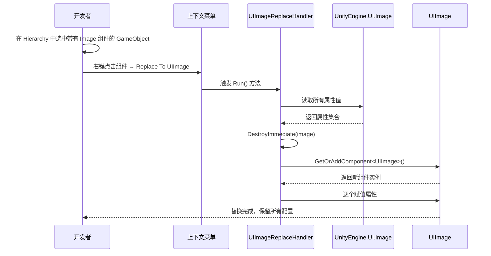

# 图片置換処理器

图片置換処理器是 GameFrameX UGUI エディタ工具集中的コアコンポーネント，用于将 Unity 内置的 `Image` コンポーネント一键置換为自定義的 `UIImage` コンポーネント，同時に保留所有原有プロパティ設定。

## 概要

在开发 Unity UGUI プロジェクト时，我们经常〜する必要があります将现有的 UI 界面迁移到 GameFrameX フレームワーク中。手动置換每个 Image コンポーネント为 UIImage 不仅耗时，还容易遗漏プロパティ設定。图片置換処理器通过上下文メニュー的方法，提供します快速、安全的コンポーネント置換機能。

该工具会在置換过程中自动保存以下プロパティ：
- 图片タイプ（Simple、Sliced、Tiled、Filled）
- 材质（Material）
- 精灵图（Sprite）
- 填充中心（fillCenter）
- 填充メソッド（fillMethod）
- 填充量（fillAmount）
- 透明度阈值（alphaHitTestMinimumThreshold）
- 使用精灵网格（useSpriteMesh）
- 覆盖精灵（overrideSprite）
- 颜色（color）
- 射线检测目标（raycastTarget）
- 可遮罩性（maskable）

## 工作原理

图片置換処理器基于 Unity Editor 的拡張机制実装，通过 `CustomEditor` 和 `MenuItem` プロパティ为内置 Image コンポーネント追加上下文メニュー入口。



### 置換フロー



## 使用メソッド

### トリガー置換

1. 在 Unity エディタ的 Hierarchy パネル中，选中パッケージ含 `Image` コンポーネント的 GameObject
2. 在 Inspector パネル中，右键点击 `Image` コンポーネント标题
3. 在弹出的上下文メニュー中，选择 **Replace To UIImage(置換为UIImage)**

```csharp
// 使用方式：在 Unity 编辑器中通过上下文菜单触发
// 菜单路径：CONTEXT/Image/Replace To UIImage(替换为UIImage)
```
> Source: [UIImageReplaceHandler.cs](https://github.com/GameFrameX/com.gameframex.unity.ui.ugui/blob/main/Editor/UIImageReplaceHandler.cs#L42-L43)

### 执行逻辑

当ユーザー点击メニュー项时，置換処理器执行以下ステップ：

```csharp
[MenuItem("CONTEXT/Image/Replace To UIImage(替换为UIImage)", false, 10)]
static void Run()
{
    // 1. 获取选中的 Image 组件
    var image = Selection.activeGameObject.GetComponent<UnityEngine.UI.Image>();
    
    // 2. 读取所有属性值
    var imageType = image.type;
    var material = image.material;
    var sprite = image.sprite;
    var color = image.color;
    var raycastTarget = image.raycastTarget;
    // ... 其他属性
    
    // 3. 销毁原 Image 组件
    DestroyImmediate(image);
    
    // 4. 添加 UIImage 组件
    var uiImage = Selection.activeGameObject.GetOrAddComponent<UIImage>();
    
    // 5. 复制所有属性到新组件
    uiImage.type = imageType;
    uiImage.material = material;
    uiImage.sprite = sprite;
    uiImage.color = color;
    // ... 赋值所有属性
}
```
> Source: [UIImageReplaceHandler.cs](https://github.com/GameFrameX/com.gameframex.unity.ui.ugui/blob/main/Editor/UIImageReplaceHandler.cs#L43-L76)

## コア実装

### CustomEditor 登録

工具通过 `CustomEditor` 特性登録到 Unity エディタ，使其成为 `UnityEngine.UI.Image` 的自定義確認器：

```csharp
[CustomEditor(typeof(UnityEngine.UI.Image))]
public class UIImageReplaceHandler : UnityEditor.Editor
{
    // ...
}
```
> Source: [UIImageReplaceHandler.cs](https://github.com/GameFrameX/com.gameframex.unity.ui.ugui/blob/main/Editor/UIImageReplaceHandler.cs#L39-L40)

### MenuItem メニュー项

使用 `MenuItem` 特性在 Image コンポーネント的上下文メニュー中追加入口：

```csharp
[MenuItem("CONTEXT/Image/Replace To UIImage(替换为UIImage)", false, 10)]
static void Run()
```
> Source: [UIImageReplaceHandler.cs](https://github.com/GameFrameX/com.gameframex.unity.ui.ugui/blob/main/Editor/UIImageReplaceHandler.cs#L42-L43)

## UIImage コンポーネント説明

置換后生成的 `UIImage` コンポーネント継承自 `UnityEngine.UI.Image`，并额外提供します图标リソースパス設定機能：

```csharp
public class UIImage : UnityEngine.UI.Image
{
    /// <summary>
    /// 获取或设置图标资源路径。
    /// 设置后自动从资源系统加载图标。
    /// </summary>
    public string icon
    {
        get { return m_icon; }
        set
        {
            if (m_icon != value)
            {
                m_icon = value;
                _ = this.SetIconAsync(m_icon);
            }
        }
    }
}
```
> Source: [UIImage.cs](https://github.com/GameFrameX/com.gameframex.unity.ui.ugui/blob/main/Runtime/UIImage.cs#L41-L72)

## 适用シーン

| シーン | 説明 |
|------|------|
| プロジェクト初期化迁移 | 将现有 Unity UGUI プロジェクト迁移到 GameFrameX フレームワーク |
| 批量置換テスト | 先置換单个コンポーネントテスト UIImage 機能，再批量迁移 |
| コンポーネント升级 | 为现有 Image コンポーネント追加图标路径ロード機能 |

## 注意事项

1. **置換不可逆**：执行置換后会立つまり破棄原 Image コンポーネント，お勧め在置換前备份シーン
2. **依赖项保留**：確認してくださいプロジェクト中已正确設定 GameFrameX.Runtime 依赖，因为使用了 `GetOrAddComponent` 拡張メソッド
3. **多コンポーネントシーン**：もし GameObject 上有多个コンポーネント依赖 Image コンポーネント（如其他脚本的参照），置換前请確認してください这些参照已アップデート

## 関連リンク

- [UIImage コンポーネント](./5-components.uiimage)
- [コンポーネント確認器](./6-editor-tools.inspector)
- [コード生成器](./6-editor-tools.code-generator)
- [UGUI 基底クラス](./4-core-concepts.ugui-base)
