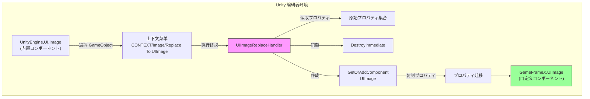
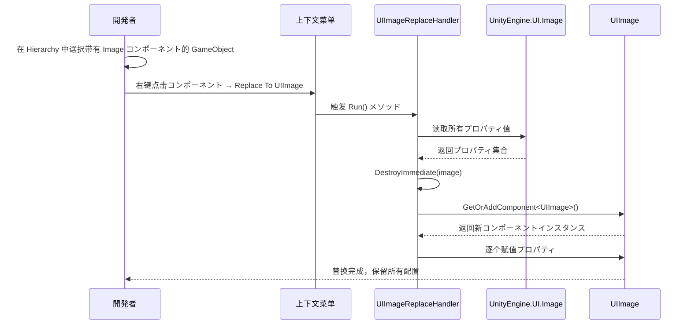

# 图片替换处理器

图片替换处理器是 GameFrameX UGUI 编辑器工具集中的コアコンポーネント，に使用将 Unity 内置的 `Image` コンポーネント一键替换为自定义的 `UIImage` コンポーネント，同时保留所有原有プロパティ配置。

## 概要

在开发 Unity UGUI プロジェクト时，我们经常必要将现有的 UI 界面迁移到 GameFrameX フレームワーク中。手动替换每个 Image コンポーネント为 UIImage 不仅耗时，还容易遗漏プロパティ配置。图片替换处理器を通じて上下文菜单的方法，提供します快速、安全的コンポーネント替换機能。

该工具会在替换过程中自动保存以下プロパティ：
- 图片クラス型（Simple、Sliced、Tiled、Filled）
- 材质（Material）
- 精灵图（Sprite）
- 填充中心（fillCenter）
- 填充メソッド（fillMethod）
- 填充量（fillAmount）
- 透明度阈值（alphaHitTestMinimumThreshold）
- 使用精灵网格（useSpriteMesh）
- 覆盖精灵（overrideSprite）
- 颜色（color）
- 射线检测目标（raycastTarget）
- 可遮罩性（maskable）

## 工作原理

图片替换处理器基づく Unity Editor 的扩展机制実装，を通じて `CustomEditor` 和 `MenuItem` プロパティ为内置 Image コンポーネント添加上下文菜单エントリーポイント。



### 替换フロー



## 使用メソッド

### 触发替换

1. 在 Unity 编辑器的 Hierarchy 面板中，選択包含 `Image` コンポーネント的 GameObject
2. 在 Inspector 面板中，右键点击 `Image` コンポーネント标题
3. 在弹出的上下文菜单中，选择 **Replace To UIImage(替换为UIImage)**

```csharp
// 使用方法：在 Unity 编辑器中を通じて上下文菜单触发
// 菜单路径：CONTEXT/Image/Replace To UIImage(替换为UIImage)
```
> Source: [UIImageReplaceHandler.cs](https://github.com/GameFrameX/com.gameframex.unity.ui.ugui/blob/main/Editor/UIImageReplaceHandler.cs#L42-L43)

### 执行逻辑

当用户点击菜单项时，替换处理器执行以下手順：

```csharp
[MenuItem("CONTEXT/Image/Replace To UIImage(替换为UIImage)", false, 10)]
static void Run()
{
    // 1. 取得選択的 Image コンポーネント
    var image = Selection.activeGameObject.GetComponent<UnityEngine.UI.Image>();
    
    // 2. 读取所有プロパティ值
    var imageType = image.type;
    var material = image.material;
    var sprite = image.sprite;
    var color = image.color;
    var raycastTarget = image.raycastTarget;
    // ... 其他プロパティ
    
    // 3. 销毁原 Image コンポーネント
    DestroyImmediate(image);
    
    // 4. 添加 UIImage コンポーネント
    var uiImage = Selection.activeGameObject.GetOrAddComponent<UIImage>();
    
    // 5. 复制所有プロパティ到新コンポーネント
    uiImage.type = imageType;
    uiImage.material = material;
    uiImage.sprite = sprite;
    uiImage.color = color;
    // ... 赋值所有プロパティ
}
```
> Source: [UIImageReplaceHandler.cs](https://github.com/GameFrameX/com.gameframex.unity.ui.ugui/blob/main/Editor/UIImageReplaceHandler.cs#L43-L76)

## コア実装

### CustomEditor 注册

工具を通じて `CustomEditor` 特性注册到 Unity 编辑器，使其成为 `UnityEngine.UI.Image` 的自定义检查器：

```csharp
[CustomEditor(typeof(UnityEngine.UI.Image))]
public class UIImageReplaceHandler : UnityEditor.Editor
{
    // ...
}
```
> Source: [UIImageReplaceHandler.cs](https://github.com/GameFrameX/com.gameframex.unity.ui.ugui/blob/main/Editor/UIImageReplaceHandler.cs#L39-L40)

### MenuItem 菜单项

使用 `MenuItem` 特性在 Image コンポーネント的上下文菜单中添加エントリーポイント：

```csharp
[MenuItem("CONTEXT/Image/Replace To UIImage(替换为UIImage)", false, 10)]
static void Run()
```
> Source: [UIImageReplaceHandler.cs](https://github.com/GameFrameX/com.gameframex.unity.ui.ugui/blob/main/Editor/UIImageReplaceHandler.cs#L42-L43)

## UIImage コンポーネント説明

替换后生成的 `UIImage` コンポーネントを継承 `UnityEngine.UI.Image`，并额外提供します图标リソース路径設定機能：

```csharp
public class UIImage : UnityEngine.UI.Image
{
    /// <summary>
    /// 取得或設定图标リソース路径。
    /// 設定后自动从リソース系统加载图标。
    /// </summary>
    public string icon
    {
        get { return m_icon; }
        set
        {
            if (m_icon != value)
            {
                m_icon = value;
                _ = this.SetIconAsync(m_icon);
            }
        }
    }
}
```
> Source: [UIImage.cs](https://github.com/GameFrameX/com.gameframex.unity.ui.ugui/blob/main/Runtime/UIImage.cs#L41-L72)

## 适用シーン

| シーン | 説明 |
|------|------|
| プロジェクト初期化迁移 | 将现有 Unity UGUI プロジェクト迁移到 GameFrameX フレームワーク |
| 批量替换测试 | 先替换单个コンポーネント测试 UIImage 機能，再批量迁移 |
| コンポーネント升级 | 为现有 Image コンポーネント添加图标路径加载機能 |

## 注意事项

1. **替换不可逆**：执行替换后会立即销毁原 Image コンポーネント，建议在替换前备份シーン
2. **依赖项保留**：确保プロジェクト中已正确配置 GameFrameX.Runtime 依赖，因为使用了 `GetOrAddComponent` 扩展メソッド
3. **多コンポーネントシーン**：如果 GameObject 上有多个コンポーネント依赖 Image コンポーネント（如其他脚本的引用），替换前必ず这些引用已更新

## 関連リンク

- [UIImage コンポーネント](./5-components.uiimage)
- [コンポーネント检查器](./6-editor-tools.inspector)
- [代码生成器](./6-editor-tools.code-generator)
- [UGUI 基クラス](./4-core-concepts.ugui-base)
