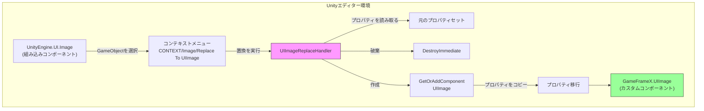
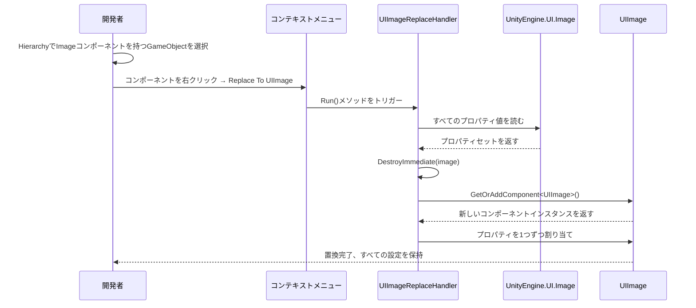

# 画像置換プロセッサー

画像置換プロセッサーはGameFrameX UGUIエディター機能セットのコアコンポーネントであり、Unity組み込みの`Image`コンポーネントを一括でカスタム`UIImage`コンポーネントに置換し、すべての元のプロパティ設定を保持します。

## 概要

Unity UGUIプロジェクトを開発する際、既存のUI画面をGameFrameXフレームワークに移行する必要がある場合がよくあります。各Imageコンポーネントを手動でUIImageに置換すると、時間がかるだけでなく、プロパティ設定を遗漏しやすいです。画像置換プロセッサーはコンテキストメニューの方式を通じて、高速で安全なコンポーネント置換機能を提供します。

このツールは置換過程で以下のプロパティを自動的に保存します：
- 画像タイプ（Simple、Sliced、Tiled、Filled）
- マテリアル（Material）
- スプライト（Sprite）
- フィルセンター（fillCenter）
- フィルメソッド（fillMethod）
- フィル量（fillAmount）
- 透明度閾値（alphaHitTestMinimumThreshold）
- スプライト网格を使用（useSpriteMesh）
- オーバーライドスプライト（overrideSprite）
- 色（color）
- レイキャストターゲット（raycastTarget）
- マスク可能的（maskable）

## 動作原理

画像置換プロセッサーはUnity Editorの拡張メカニズムに基づいて実装され、`CustomEditor`と`MenuItem`属性を通じて組み込みImageコンポーネントにコンテキストメニューエントリーポイントを追加します。



### 置換フロー



## 使用方法

### 置換をトリガー

1. UnityエディターのHierarchyパネルで、`Image`コンポーネントを含むGameObjectを選択
2. Inspectorパネルで、`Image`コンポーネントタイトルを右クリック
3. ポップアップコンテキストメニューで、**Replace To UIImage(UIImageに置換)**を選択

```csharp
// 使用方法：Unityエディターでコンテキストメニューを通じてトリガー
// メニューpath：CONTEXT/Image/Replace To UIImage(UIImageに置換)
```
> Source: [UIImageReplaceHandler.cs](https://github.com/GameFrameX/com.gameframex.unity.ui.ugui/blob/main/Editor/UIImageReplaceHandler.cs#L42-L43)

### 実行ロジック

ユーザーがメニュー項目をクリックした時、置換プロセッサーは以下の手順を実行します：

```csharp
[MenuItem("CONTEXT/Image/Replace To UIImage(UIImageに置換)", false, 10)]
static void Run()
{
    // 1. 選択したImageコンポーネントを取得
    var image = Selection.activeGameObject.GetComponent<UnityEngine.UI.Image>();

    // 2. すべてのプロパティ値を読む
    var imageType = image.type;
    var material = image.material;
    var sprite = image.sprite;
    var color = image.color;
    var raycastTarget = image.raycastTarget;
    // ... その他プロパティ

    // 3. 元のImageコンポーネントを破棄
    DestroyImmediate(image);

    // 4. UIImageコンポーネントを追加
    var uiImage = Selection.activeGameObject.GetOrAddComponent<UIImage>();

    // 5. すべてのプロパティを新しいコンポーネントにコピー
    uiImage.type = imageType;
    uiImage.material = material;
    uiImage.sprite = sprite;
    uiImage.color = color;
    // ... すべてのプロパティを割り当て
}
```
> Source: [UIImageReplaceHandler.cs](https://github.com/GameFrameX/com.gameframex.unity.ui.ugui/blob/main/Editor/UIImageReplaceHandler.cs#L43-L76)

## コア実装

### CustomEditor登録

ツールは`CustomEditor`属性を通じてUnityエディターに登録され、`UnityEngine.UI.Image`のカスタムinspectorになります：

```csharp
[CustomEditor(typeof(UnityEngine.UI.Image))]
public class UIImageReplaceHandler : UnityEditor.Editor
{
    // ...
}
```
> Source: [UIImageReplaceHandler.cs](https://github.com/GameFrameX/com.gameframex.unity.ui.ugui/blob/main/Editor/UIImageReplaceHandler.cs#L39-L40)

### MenuItemメニュー項目

`MenuItem`属性を使用してImageコンポーネントのコンテキストメニューにエントリーポイントを追加します：

```csharp
[MenuItem("CONTEXT/Image/Replace To UIImage(UIImageに置換)", false, 10)]
static void Run()
```
> Source: [UIImageReplaceHandler.cs](https://github.com/GameFrameX/com.gameframex.unity.ui.ugui/blob/main/Editor/UIImageReplaceHandler.cs#L42-L43)

## UIImageコンポーネントの説明

置換後に生成された`UIImage`コンポーネントは`UnityEngine.UI.Image`を継承し、アイコンアセットpath設定機能を追加で 提供します：

```csharp
public class UIImage : UnityEngine.UI.Image
{
    /// <summary>
    /// アイコンアセットpathを取得または設定。
    /// 設定後、自動的にアセットシステムからアイコンを読み込む。
    /// </summary>
    public string icon
    {
        get { return m_icon; }
        set
        {
            if (m_icon != value)
            {
                m_icon = value;
                _ = this.SetIconAsync(m_icon);
            }
        }
    }
}
```
> Source: [UIImage.cs](https://github.com/GameFrameX/com.gameframex.unity.ui.ugui/blob/main/Runtime/UIImage.cs#L41-L72)

## 適用シーン

| シーン | 説明 |
|------|------|
| プロジェクト初期化移行 | 既存のUnity UGUIプロジェクトをGameFrameXフレームワークに移行 |
| 一括置換テスト | 単一コンポーネントを置換してUIImage機能をテストし、その後一括移行 |
| コンポーネントアップグレード | 既存のImageコンポーネントにアイコンpath読み込み機能を追加 |

## 注意事項

1. **置換は不可逆**：置換実行後、直ちに元のImageコンポーネントが破棄されます。置換前にシーンをバックアップすることをお勧めします
2. **依存項目の保持**：プロジェクトにGameFrameX.Runtime依存が正しく設定されていることを確認してください，因為`GetOrAddComponent`拡張メソッドを使用するため
3. **マルチコンポーネントシーン**：GameObjectにImageコンポーネントに依存する他のコンポーネント（他のスクリプトの参照など）がある場合、置換前にこれらの参照が更新されていることを確認してください

## 関連リンク

- [UIImageコンポーネント](./5-components.uiimage)
- [コンポーネントinspector](./6-editor-tools.inspector)
- [コードジェネレーター](./6-editor-tools.code-generator)
- [UGUI基底クラス](./4-core-concepts.ugui-base)