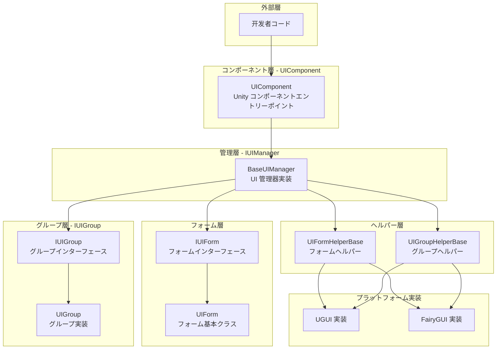
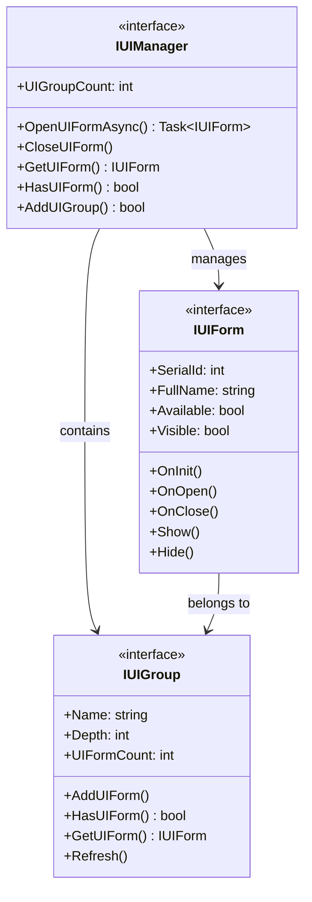
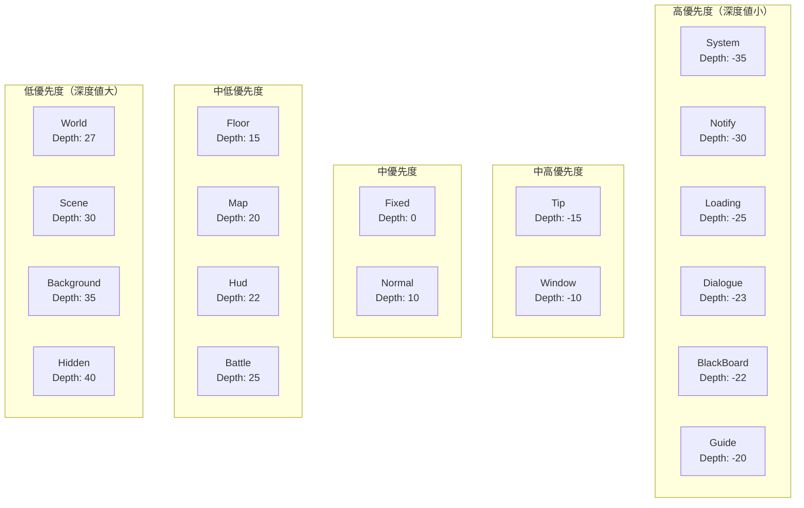
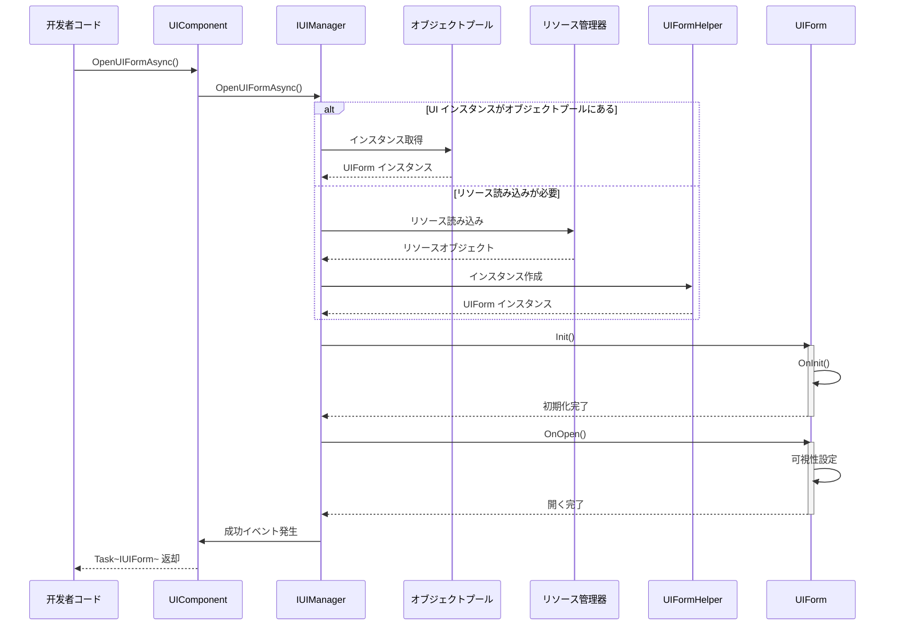
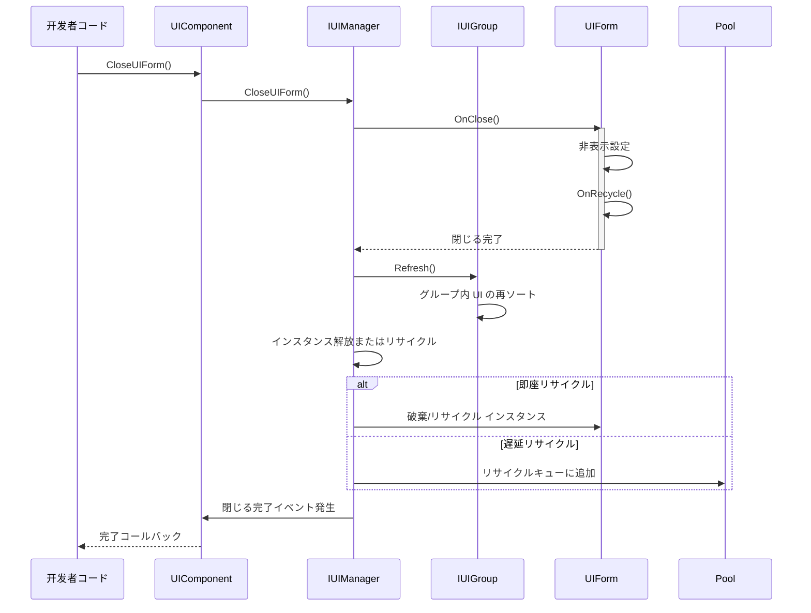

# 概要

Game Frame X UI は、GameFrameX フレームワークの UI コンポーネントであり、Unity 向けの一貫した UI 管理ソリューションを提供します。このシステムは UGUI と FairyGUI の2つの主流 UI システムをサポートし、统一されたインターフェース設計、レイヤ管理、オブジェクトプール再利用、完全なイベント駆動機構を提供します。

## 概要

Game Frame X UI は、GameFrameX ゲームフレームワークのコア UI 管理系统であり、Unity ゲーム開発向けに設計されています。このシステムは近代的なアーキテクチャ設計を採用しており、UGUI と FairyGUI の2つの UI レンダリングシステムをサポートし、开发者はプロジェクト的需求に応じて柔軟に選択できます。UI システムは完全なライフサイクル管理を提供し、画面の読み込み、表示、非表示、閉じる、リサイクルまでの各环节に完善されたイベントコールバック機構があり、开发者は UI の动作を正確に制御できます。

このシステムのコア設計理念は「统一インターフェース、柔軟設定」です。底层でどの UI システムを使用しても、开发者は统一された `IUIManager` インターフェースを通じて UI の開閉、クエリなどの操作を実行できます。同時に、システムは非常に高いカスタマイズ性をサポートし、开发者は異なる UI グループヘルパーと UI フォームヘルパーを設定して特定の機能需求を満たすことができます。この設計は代码の簡潔性を保证するとともに、各种複雑なゲーム UI シーンに対応できる十分な柔軟性も提供します。

Game Frame X UI は、GameFrameX フレームワークの他のコアコンポーネントと深く統合されており、リソース管理システム、オブジェクトプールシステム、、イベントシステムが含まれます。この深い統合により、UI システムは UI リソースの読み込みとリサイクルを効率的に管理でき、同時にイベントシステムを通じてモジュール間の疎結合通信を実現できます。开发者は UI イベントを購読することで跨システムのロジック連動を実現でき、具体的な UI 実装クラスに直接依存する必要はありません。

## アーキテクチャ設計

Game Frame X UI は階層型アーキテクチャ設計を採用しており、底层から顶层に向かって順に：インターフェース層、実装層、コンポーネント層、エディタ層を含みます。各層には明確な責任分担があり、層と層の 间はインターフェースを通じて通信します。この設計により、代码の保守性と拡張性が 크게向上します。



**アーキテクチャ説明：**

- **コンポーネント層（UIComponent）**：Unity ゲームオブジェクトのコンポーネントとして、整个 UI システムのエントリーポイント点であり、IUIManager 実装の初期化と管理を担当します
- **管理層（IUIManager）**：コアインターフェースであり、UI フォームと UI グループのすべての操作を定義し、開閉、クエリなどのメソッドが含まれます
- **フォーム層（IUIForm/UIForm）**：UI フォームのインターフェース定義と基本クラス実装を提供し、完全なライフサイクルメソッドがあります
- **グループ層（IUIGroup）**：UI グループインターフェースであり、同じレイヤーの UI フォームを管理し、表示深度と優先度を制御します
- **ヘルパー層（Helper）**：プラットフォーム固有の実装ヘルパークラスであり、UGUI と FairyGUI の底层差異をそれぞれ処理します
- **プラットフォーム実装層**：具体的な UGUI または FairyGUI 実装であり、各プラットフォームの API 呼び出しをカプセル化します

### コアインターフェース関係

UI システムのコアインターフェースには IUIManager、IUIForm、IUIGroup が含まれ、UI 管理の基本を構成します。IUIManager は全体の UI 管理を担当し、UI フォームの作成と破棄、UI グループ管理、イベント発行などを含みます。IUIForm は単一の UI フォームの動作規範を定義し、初始化、開、閉じる、表示、非表示などのライフサイクルメソッドが含まれます。IUIGroup は関連する一群の UI フォームを管理し 그들의深度と表示順序を制御します。



このインターフェース設計は依存性逆転の原則に従っており、上位モジュールは抽象インターフェースに依存し具象実装には依存しないため、システム良好的なテスト性と交換可能性を持ちます。开发者はカスタムヘルパーを実装することで、デフォルトの UGUI または FairyGUI 実装を置換でき、上位層のビジネスロジックコードを変更する必要はありません。

## コアコンセプト

### UI フォーム（UIForm）

UI フォームは UI システムで最も基本的な操作ユニットであり、每个可见の UI 画面に対応して UIForm インスタンスがあります。UIForm は Unity の MonoBehaviour を継承し、Prefab に直接アタッチして使用できます。基本クラスとして、完全なライフサイクルフックを提供し、developer はこれらのメソッドをオーバーライドして UI の具体的なロジックを処理します。

```csharp
using GameFrameX.UI.Runtime;
using UnityEngine;

public class MainMenuUI : UIForm
{
    protected override void OnInit(object userData)
    {
        base.OnInit(userData);
        // UI エレメント参照の初期化
        // ボタンイベントのバインディングなど
    }

    protected override void OnOpen(object userData)
    {
        base.OnOpen(userData);
        // UI を開いたときのロジック
        // 入場アニメーションの再生
        // 画面データの更新
    }

    protected override void OnClose(bool isShutdown, object userData)
    {
        base.OnClose(isShutdown, userData);
        // UI を閉じたときのクリーンアップ処理
    }
}
```
> Source: [UIForm.cs](https://github.com/GameFrameX/com.gameframex.unity.ui/blob/main/Runtime/UIForm.cs#L39-L100)

UIForm のライフサイクルには以下の主要メソッドが含まれます：OnAwake は UI インスタンス作成直後に呼び出され、イベント購読などの初期化操作に適しています；OnInit は UI の初回初期化時に呼び出され、UI エレメントの設定とイベントハンドラのバインディングに使用します；OnOpen は UI 表示時に呼び出され、渡されたユーザーデータの受信と処理ができます；OnClose は UI 終了時に呼び出され、リソースのクリーンアップと状態の保存に使用します；OnPause と OnResume はそれぞれ UI が覆われたときと回復したときに呼び出されます。

### UI コンポーネント（UIComponent）

UIComponent は Unity ゲームシーンのコアコンポーネントであり、GameFrameworkComponent を継承します。それは developer と UI システム対話の主なエントリーポイントであり、すべての UI 操作の静的メソッドのカプセル化を提供します。実際の使用では、developer は通常 `GameEntry.GetComponent<UIComponent>()` を通じてインスタンスを取得し、そのメソッドを呼び出して UI を管理します。

```csharp
// UI コンポーネントインスタンスの取得
var uiComponent = GameEntry.GetComponent<UIComponent>();

// 同期で UI を開く
uiComponent.OpenUIForm("MainMenuUI", "Normal");

// 非同期で UI を開く
var mainMenu = await uiComponent.OpenUIFormAsync("MainMenuUI", "Normal");

// UI を閉じる
uiComponent.CloseUIForm("MainMenuUI");

// UI が存在するかをクエリ
if (uiComponent.HasUIForm("MainMenuUI"))
{
    // UI が開いている
}
```
> Source: [UIComponent.cs](https://github.com/GameFrameX/com.gameframex.unity.ui/blob/main/Runtime/UIComponent.cs#L48-L114)

UIComponent は IUIManager の全機能をカプセル化し、利便メソッドを追加しています。またオブジェクトプール関連の設定管理も担当し、インスタンス容量、过期時間、自动回收間隔などが含まれます。これらのパラメータを設定することで、developer はメモリ使用とパフォーマンスを最適化できます。

### UI グループシステム

UI グループは UI フォームを組織・管理するためのコンテナであり、各 UI グループには名前と深度値があります。深度値は UI の表示優先度を决定し、深度値が小さいほど UI は上位に表示されます。新しい UI フォームを開くとき、自分が属する UI グループを指定する必要があり、システムはそのグループの深度値とグループ内での順序に基づいて最終的な表示レイヤーを決定します。

```csharp
// カスタム UI グループの追加
uiComponent.AddUIGroup("CustomGroup", -5);

// UI グループの取得
var group = uiComponent.GetUIGroup("Window");
```
> Source: [UIComponent.cs](https://github.com/GameFrameX/com.gameframex.unity.ui/blob/main/Runtime/BaseUIManager.cs#L200-L230)

システムは18個の標準 UI グループを事前定義しており、ゲームの一般的な UI シーンをカバーし、システム公告から戦闘画面まで対応するレイヤーが含まれています。developer はこれらの事前定義グループを直接使用でき、必要に応じてカスタムグループを作成することもできます。

## UI グループレイヤー

Game Frame X UI は18個の UI グループを事前定義しており、各グループには特定の深度値があります。深度値が小さいほど表示レイヤーが高くなります。これは深度値 -35 の System グループが深度値 40 の Hidden グループより上位に表示されることを意味します。



### 事前定義 UI グループ

| グループ名 | 深度値 | 典型的な用途 |
|------|--------|----------|
| System | -35 | システム公告、VIP ヒントなどのトップレベル画面 |
| Notify | -30 | 通知ポップアップ、ティッカー |
| Loading | -25 | ローディング画面 |
| Dialogue | -23 | ダイアログストーリー画面 |
| BlackBoard | -22 | 黒板/スクエストパネル |
| Guide | -20 | 初心者ガイドカバー |
| Tip | -15 | ヒントポップアップ、Toast |
| Window | -10 | ウィンドウタイプ画面 |
| Fixed | 0 | 画面下部に固定の UI |
| Normal | 10 | 通常画面 |
| Floor | 15 | ベースボード UI |
| Map | 20 | マップ画面 |
| Hud | 22 | 头顶情報、BUFF 表示 |
| Battle | 25 | 戦闘関連 UI |
| World | 27 | 世界マップ UI |
| Scene | 30 | シーン切り替え画面 |
| Background | 35 | 背景 UI |
| Hidden | 40 | 非表示 UI（不可視） |

> Source: [UIGroupConstants.cs](https://github.com/GameFrameX/com.gameframex.unity.ui/blob/main/Runtime/UIGroupConstants.cs#L38-L202)

深度値のデザインは以下の原則に従っています：負の深度はゲームシーンより上位に表示される UI（ダイアログ、ヒントなど）に使用します；ゼロと正の深度はゲーム内の HUD エレメントに使用します；较大的な正の深度は背景と低優先度 UI に使用します。この設計により、重要な UI は常に最上位に表示されます。

## コアフロー

### UI 開閉フロー

UI フォームを開くことは UI システムで最も一般的な操作の一つです。全体のフローはリソース読み込み、インスタンス作成、初期化、表示などの複数の手順を含みます。以下は完全な非同期オープフローです：



### UI 閉じるフロー

UI フォームを閉じることも複数の手順を含み、非表示、リサイクル、イベント発生が含まれます。システムは即座リサイクルと遅延リサイクル两种のモードをサポートしています。



## イベントシステム

Game Frame X UI は完全なイベントシステムを提供し、UI 状態の変わった通知に使用されます。developer はこれらのイベントを購読することで UI の各種状態変化に応答し、疎結合のコードアーキテクチャを実現できます。

### イベントクラス型

| イベントクラス | イベント ID | 説明 |
|--------|---------|------|
| OpenUIFormSuccessEventArgs | 画面を開く成功イベント | UI の正常な открыт時に発生 |
| OpenUIFormFailureEventArgs | 画面を開く失敗イベント | UI の открытに失敗した時に発生 |
| CloseUIFormCompleteEventArgs | 画面を閉じる完了イベント | UI の閉じるが完了した時に発生 |
| UIFormVisibleChangedEventArgs | 画面可視性変化イベント | UI 表示状態がが変わった時に発生 |

> Source: [Runtime/EventArgs/](https://github.com/GameFrameX/com.gameframex.unity.ui/blob/main/Runtime/EventArgs/)

### イベント購読示例

```csharp
using GameFrameX.UI.Runtime;
using GameFrameX.Event.Runtime;

// ゲームの初期化時にイベントを購読
var eventComponent = GameEntry.GetComponent<EventComponent>();
eventComponent.Subscribe(OpenUIFormSuccessEventArgs.EventId, OnOpenUIFormSuccess);
eventComponent.Subscribe(OpenUIFormFailureEventArgs.EventId, OnOpenUIFormFailure);
eventComponent.Subscribe(CloseUIFormCompleteEventArgs.EventId, OnCloseUIFormComplete);

private void OnOpenUIFormSuccess(object sender, GameEventArgs e)
{
    var args = (OpenUIFormSuccessEventArgs)e;
    Debug.Log($"UI を開く成功: {args.UIForm.UIFormAssetName}");
}

private void OnOpenUIFormFailure(object sender, GameEventArgs e)
{
    var args = (OpenUIFormFailureEventArgs)e;
    Debug.LogError($"UI を開く失敗: {args.UIFormAssetName}, エラー: {args.ErrorMessage}");
}

private void OnCloseUIFormComplete(object sender, GameEventArgs e)
{
    var args = (CloseUIFormCompleteEventArgs)e;
    Debug.Log($"UI を閉じる完了: {args.UIFormAssetName}");
}
```
> Source: [UIComponent.cs](https://github.com/GameFrameX/com.gameframex.unity.ui/blob/main/Runtime/UIComponent.cs#L436-L465)

## プラットフォーム対応

Game Frame X UI は Unity の UGUI システムと FairyGUI プラグインの両方を同時にサポートしています。このDual-track サポートは條件付きコンパイルとヘルパーモードを通じて実現され、developer はプロジェクト需求に応じて適切なレンダリングバックエンドを選択でき、ビジネスコードの変更は不要です。

### UGUI サポート

UGUI は Unity 内蔵の UI システムであり、互換性がよく、多くの Unity プロジェクトの第一選択です。システムは完全な UGUI 実装を提供し、Canvas 管理、イベント処理、リソース読み込みなどが含まれます。

### FairyGUI サポート

FairyGUI は機能的强大な third-party UI エディタであり、可視化の UI 編集体験と高效のリソース管理を提供します。複雑な UI インタラクションと高效な反復が必要なプロジェクトにとって、FairyGUI は良い選択です。

UI システムの切り替えは非常にシンプルで、Unity の Scripting Define Symbols に 해당하는컴파일シンボル（`ENABLE_UI_UGUI` または `ENABLE_UI_FAIRYGUI`）を追加するだけです。UIComponent は컴파일シンボルに基づいて対応するヘルパー実装を自動的に読み込みます。

## 依存項目

Game Frame X UI は GameFrameX フレームワークの他のコアコンポーネントに依存しています：

| 依存項目 | 最小バージョン | 説明 |
|--------|----------|------|
| com.gameframex.unity | >= 1.1.1 | コアフレームワーク |
| com.gameframex.unity.asset | >= 1.0.6 | リソース管理 |
| com.gameframex.unity.event | >= 1.0.0 | イベントシステム |
| com.gameframex.unity.localization | >= 1.0.0 | ローカライゼーションサポート |

> Source: [package.json](https://github.com/GameFrameX/com.gameframex.unity.ui/blob/main/package.json)

## 関連リンク

- [インストールガイド](./2-installation)
- [クイックスタート](./3-getting-started)
- [UI コンポーネント詳細](./4-core-concepts.ui-component)
- [UI フォーム詳細](./4-core-concepts.ui-form)
- [UI グループシステム](./4-core-concepts.ui-group)
- [オブジェクトプール管理](./4-core-concepts.object-pool)
- [API リファレンス - IUIManager](./5-api-reference.iuimanager)
- [API リファレンス - UIComponent](./5-api-reference.ui-component)
- [API リファレンス - UIForm](./5-api-reference.ui-form)
- [API リファレンス - IUIGroup](./5-api-reference.iuigroup)
- [イベントシステム詳細](./6-event-system)
- [UI グループレイヤー詳細](./7-ui-group-hierarchy)
- [エディタ設定](./8-configuration.editor)
- [UI プロパティ設定](./8-configuration.attributes)
- [プラットフォームサポート](./9-platforms)
- [よくある問題](./10-troubleshooting)
- 公式サイト: https://gameframex.doc.alianblank.com/
- GitHub リポジトリ: https://github.com/GameFrameX/com.gameframex.unity.ui