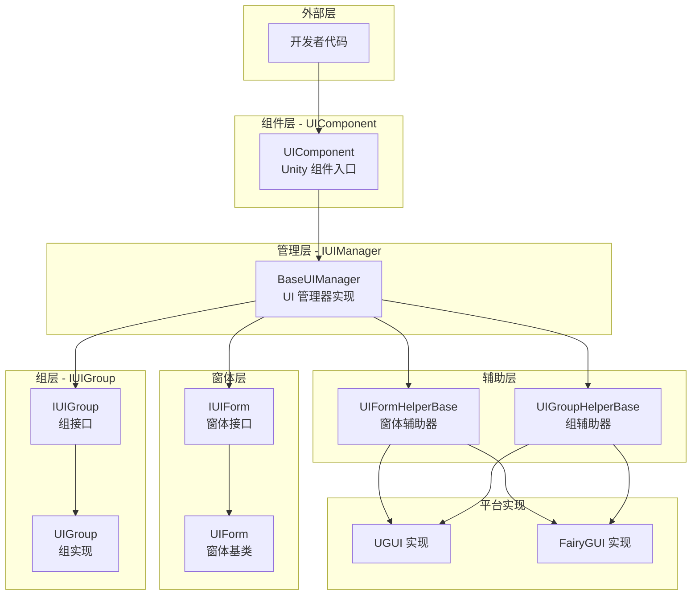
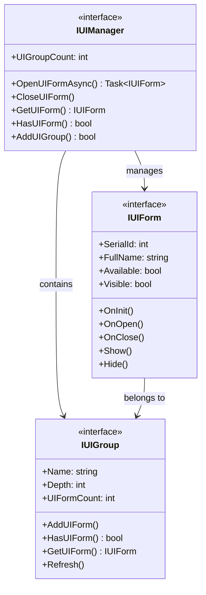
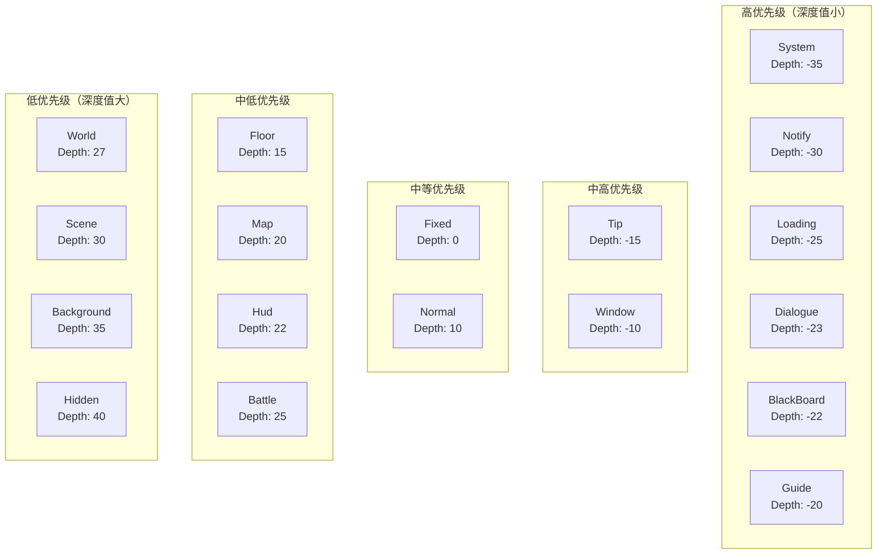
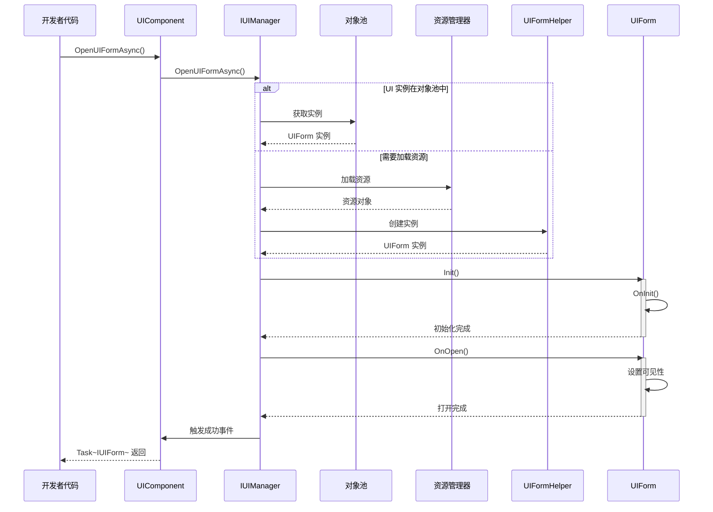
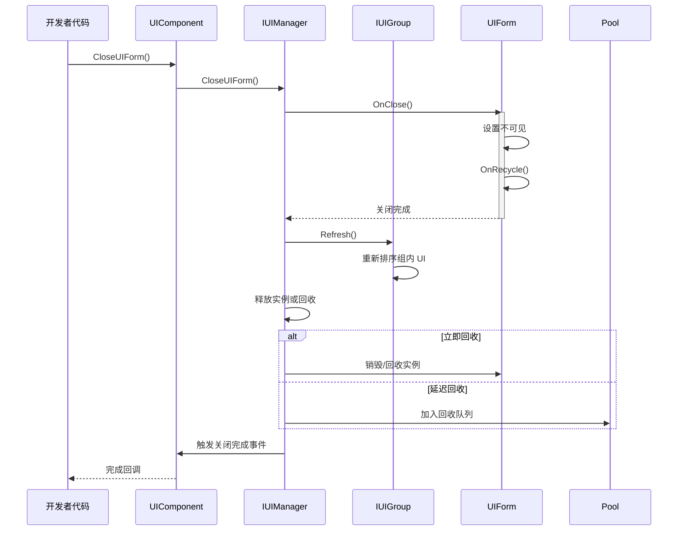

# 概要

Game Frame X UI 是 GameFrameX フレームワーク的 UI コンポーネント，提供します一套完全な的 Unity UI 管理解決策。该系统サポート UGUI 和 FairyGUI 两种主流 UI 系统，提供します統一された的インターフェース設計、分层管理、对象池复用和完全な的イベント驱动机制。

## 概要

Game Frame X UI 是 GameFrameX 游戏フレームワーク的コア UI 管理系统，专为 Unity 游戏开发設計。该系统采用了现代化的アーキテクチャ設計，サポート UGUI 和 FairyGUI 两种 UI 渲染系统，開発者〜できます根据プロジェクト需求柔軟选择。UI 系统提供します完全な的ライフサイクル管理，从界面ロード、显示、隐藏到閉じる回收，每个环节都有完善的イベントコールバック机制，让開発者能够精确控制 UI 的行为。

该系统的コア設計理念是"統一されたインターフェース、柔軟設定"。无论底层使用哪种 UI 系统，開発者都通过統一された的 `IUIManager` インターフェース进行 UI 的打开、閉じる、查询等操作。同時に，系统サポート高度定制化，開発者〜できます設定不同的 UI 组辅助器和 UI 窗体辅助器来実装特定的機能需求。这种設計既保证了コード的シンプル性，又提供します足够的柔軟性来应对各种複雑的游戏 UI シーン。

Game Frame X UI 还深度集成了 GameFrameX フレームワーク的其他コアコンポーネント，含みますリソース管理系统、对象池系统和イベント系统。这种深度集成使得 UI 系统能够効率的地管理 UI リソース的ロード和回收，同時に通过イベント系统実装了モジュール间的松耦合通信。開発者〜できます通过購読 UI イベント来実装跨系统的逻辑联动，而无需直接依赖具体的 UI 実装类。

## アーキテクチャ設計

Game Frame X UI 采用了分层アーキテクチャ設計，从底层到顶层依次含みます：インターフェース層、実装層、コンポーネント層和エディタ层。每一层都有明确的职责划分，层与层之间通过インターフェース进行通信，这种設計极大地提高了コード的可维护性和可拡張性。



**アーキテクチャ説明：**

- **コンポーネント層（UIComponent）**：作为 Unity 游戏对象的コンポーネント，是整个 UI 系统的入口点，负责初期化和管理 IUIManager 実装
- **管理层（IUIManager）**：コアインターフェース，定義了 UI 窗体和 UI 组的所有操作，含みます打开、閉じる、查询等メソッド
- **窗体层（IUIForm/UIForm）**：UI 窗体的インターフェース定義和基底クラス実装，提供します完全な的ライフサイクルメソッド
- **组层（IUIGroup）**：UI 组インターフェース，用于管理同一层级的 UI 窗体，控制显示深度和优先级
- **辅助层（Helper）**：プラットフォーム特定的実装辅助类，分别処理 UGUI 和 FairyGUI 的底层差异
- **プラットフォーム実装層**：具体的 UGUI 或 FairyGUI 実装，カプセル化了各自プラットフォーム的 API 呼び出し

### コアインターフェース关系

UI 系统的コアインターフェース含みます IUIManager、IUIForm 和 IUIGroup，它们共同构成了 UI 管理的基本。IUIManager 负责整体的 UI 管理，含みます作成和破棄 UI 窗体、管理 UI 组、调度イベント等。IUIForm 定義了单个 UI 窗体的行为规范，含みます初期化、打开、閉じる、显示、隐藏等ライフサイクルメソッド。IUIGroup 则负责管理一组相关的 UI 窗体，控制它们的深度和显示顺序。



这种インターフェース設計遵循了依存関係逆転の原則，上层モジュール依赖于抽象インターフェース而不是具体実装，使得系统具有良好的可テスト性和可置換性。開発者〜できます通过実装自定義的辅助器来置換デフォルト的 UGUI 或 FairyGUI 実装，而无需変更上层的业务逻辑コード。

## コアコンセプト

### UI 窗体（UIForm）

UI 窗体是 UI 系统中最基本的操作单元，每个可见的 UI 界面都对应一个 UIForm インスタンス。UIForm 継承自 Unity 的 MonoBehaviour，〜できます直接挂载到 Prefab 上使用。作为基底クラス，它提供します完全な的ライフサイクル钩子，開発者通过オーバーライド这些メソッド来処理 UI 的具体逻辑。

```csharp
using GameFrameX.UI.Runtime;
using UnityEngine;

public class MainMenuUI : UIForm
{
    protected override void OnInit(object userData)
    {
        base.OnInit(userData);
        // 初始化 UI 元素引用
        // 绑定按钮事件等
    }

    protected override void OnOpen(object userData)
    {
        base.OnOpen(userData);
        // UI 打开时的逻辑
        // 播放入场动画
        // 刷新界面数据
    }

    protected override void OnClose(bool isShutdown, object userData)
    {
        base.OnClose(isShutdown, userData);
        // UI 关闭时的清理工作
    }
}
```
> Source: [UIForm.cs](https://github.com/GameFrameX/com.gameframex.unity.ui/blob/main/Runtime/UIForm.cs#L39-L100)

UIForm 的ライフサイクル含みます以下关键メソッド：OnAwake 在 UI インスタンス作成后立つまり呼び出し，适合进行イベント購読等初期化操作；OnInit 在 UI 首次初期化时呼び出し，用于設定 UI 元素和绑定イベント処理器；OnOpen 在 UI 显示时呼び出し，〜できます受信和処理传入的ユーザー数据；OnClose 在 UI 閉じる时呼び出し，用于清理リソース和保存ステータス；OnPause 和 OnResume 分别在 UI 被遮挡和恢复时呼び出し。

### UI コンポーネント（UIComponent）

UIComponent 是 Unity 游戏シーン中的コアコンポーネント，継承自 GameFrameworkComponent。它是開発者与 UI 系统交互的主な入口点，提供します所有 UI 操作的静态メソッドカプセル化。在实际使用中，開発者通常通过 `GameEntry.GetComponent<UIComponent>()` 取得インスタンス，次に呼び出し其メソッド来管理 UI。

```csharp
// 获取 UI 组件实例
var uiComponent = GameEntry.GetComponent<UIComponent>();

// 同步打开 UI
uiComponent.OpenUIForm("MainMenuUI", "Normal");

// 异步打开 UI
var mainMenu = await uiComponent.OpenUIFormAsync("MainMenuUI", "Normal");

// 关闭 UI
uiComponent.CloseUIForm("MainMenuUI");

// 查询 UI 是否存在
if (uiComponent.HasUIForm("MainMenuUI"))
{
    // UI 已打开
}
```
> Source: [UIComponent.cs](https://github.com/GameFrameX/com.gameframex.unity.ui/blob/main/Runtime/UIComponent.cs#L48-L114)

UIComponent カプセル化了 IUIManager 的所有機能，并追加了一些便捷メソッド。它还负责管理对象池的相关設定，含みますインスタンス容量、过期时间和自动回收间隔等。通过設定这些パラメータ，開発者〜できます最適化内存使用和性能表现。

### UI 组系统

UI 组是用于组织和管理 UI 窗体的容器，每个 UI 组有一个名称和一个深度值。深度值决定了 UI 的显示优先级，深度值越小，UI 显示在越上层。当打开一个新的 UI 窗体时，〜する必要があります指定它所属的 UI 组，系统会根据组的深度值和窗体在组内的顺序来确定最终的显示层级。

```csharp
// 添加自定义 UI 组
uiComponent.AddUIGroup("CustomGroup", -5);

// 获取 UI 组
var group = uiComponent.GetUIGroup("Window");
```
> Source: [UIComponent.cs](https://github.com/GameFrameX/com.gameframex.unity.ui/blob/main/Runtime/BaseUIManager.cs#L200-L230)

系统预定義了 18 个標準 UI 组，涵盖了游戏中常见的 UI シーン，从系统公告到战斗界面都有对应的层级。開発者〜できます直接使用这些预定義组，也〜できます根据〜する必要があります作成自定義组。

## UI 组层级

Game Frame X UI 预定義了 18 个 UI 组，每个组都有特定的深度值。深度值越小，显示层级越高。这意味着深度值为 -35 的 System 组会显示在深度值为 40 的 Hidden 组之上。



### 预定義 UI 组

| 组名 | 深度值 | 典型用途 |
|------|--------|----------|
| System | -35 | 系统公告、VIP ヒント等顶级界面 |
| Notify | -30 | 通知弹窗、跑马灯 |
| Loading | -25 | ロード界面 |
| Dialogue | -23 | 对话剧情界面 |
| BlackBoard | -22 | 黑板/任务パネル |
| Guide | -20 | 新手引导遮罩 |
| Tip | -15 | ヒント弹窗、Toast |
| Window | -10 | ウィンドウ类界面 |
| Fixed | 0 | 固定在底部的 UI |
| Normal | 10 | 普通界面 |
| Floor | 15 | 底板 UI |
| Map | 20 | 地图界面 |
| Hud | 22 | 头顶情報、BUFF 显示 |
| Battle | 25 | 战斗相关 UI |
| World | 27 | 世界地图 UI |
| Scene | 30 | シーン切换界面 |
| Background | 35 | 背景 UI |
| Hidden | 40 | 隐藏 UI（不可见） |

> Source: [UIGroupConstants.cs](https://github.com/GameFrameX/com.gameframex.unity.ui/blob/main/Runtime/UIGroupConstants.cs#L38-L202)

深度值的設計遵循以下原则：负深度用于显示在游戏シーン之上的 UI，如对话框、ヒント等；零和正深度用于游戏内的 HUD 元素；较大的正深度用于背景和低优先级 UI。这种設計確認してください了重要な的 UI 始终显示在最上层。

## コアフロー

### UI 打开フロー

打开 UI 窗体是 UI 系统最常用的操作之一。整个フロー涉及リソースロード、インスタンス作成、初期化和显示等多个ステップ。下面是完全な的异步打开フロー：



### UI 閉じるフロー

閉じる UI 窗体同样涉及多个ステップ，含みます隐藏、回收和イベントトリガー。系统サポート立つまり回收和延迟回收两种モード。



## イベント系统

Game Frame X UI 提供します完全な的イベント系统，用于通知 UI ステータス的变更。開発者〜できます通过購読这些イベント来响应 UI 的各种ステータス变化，実装松耦合的コードアーキテクチャ。

### イベントタイプ

| イベント类 | イベント ID | 説明 |
|--------|---------|------|
| OpenUIFormSuccessEventArgs | 打开界面成功イベント | UI 成功打开时トリガー |
| OpenUIFormFailureEventArgs | 打开界面失敗イベント | UI 打开失敗时トリガー |
| CloseUIFormCompleteEventArgs | 閉じる界面完成イベント | UI 閉じる完成时トリガー |
| UIFormVisibleChangedEventArgs | 界面可见性变化イベント | UI 显示ステータス改变时トリガー |

> Source: [Runtime/EventArgs/](https://github.com/GameFrameX/com.gameframex.unity.ui/blob/main/Runtime/EventArgs/)

### イベント購読例

```csharp
using GameFrameX.UI.Runtime;
using GameFrameX.Event.Runtime;

// 在游戏初始化时订阅事件
var eventComponent = GameEntry.GetComponent<EventComponent>();
eventComponent.Subscribe(OpenUIFormSuccessEventArgs.EventId, OnOpenUIFormSuccess);
eventComponent.Subscribe(OpenUIFormFailureEventArgs.EventId, OnOpenUIFormFailure);
eventComponent.Subscribe(CloseUIFormCompleteEventArgs.EventId, OnCloseUIFormComplete);

private void OnOpenUIFormSuccess(object sender, GameEventArgs e)
{
    var args = (OpenUIFormSuccessEventArgs)e;
    Debug.Log($"UI 打开成功: {args.UIForm.UIFormAssetName}");
}

private void OnOpenUIFormFailure(object sender, GameEventArgs e)
{
    var args = (OpenUIFormFailureEventArgs)e;
    Debug.LogError($"UI 打开失败: {args.UIFormAssetName}, 错误: {args.ErrorMessage}");
}

private void OnCloseUIFormComplete(object sender, GameEventArgs e)
{
    var args = (CloseUIFormCompleteEventArgs)e;
    Debug.Log($"UI 关闭完成: {args.UIFormAssetName}");
}
```
> Source: [UIComponent.cs](https://github.com/GameFrameX/com.gameframex.unity.ui/blob/main/Runtime/UIComponent.cs#L436-L465)

## プラットフォームサポート

Game Frame X UI 同時にサポート Unity 的 UGUI 系统和 FairyGUI プラグイン。这种双轨サポート通过条件コンパイル和辅助器モード実装，開発者〜できます根据プロジェクト需求选择合适的渲染后端，而业务コード无需任何変更。

### UGUI サポート

UGUI 是 Unity 内置的 UI 系统，兼容性好，是大多数 Unity プロジェクト的首选。系统提供します完全な的 UGUI 実装，含みます Canvas 管理、イベント処理和リソースロード等。

### FairyGUI サポート

FairyGUI 是機能強力的第3方 UI エディタ，提供します可视化的 UI 编辑体验和効率的的リソース管理。对于〜する必要があります複雑 UI 交互和効率的迭代的プロジェクト，FairyGUI 是很好的选择。

切换 UI 系统非常シンプル，只需在 Unity 的 Scripting Define Symbols 中追加对应的コンパイル符号（`ENABLE_UI_UGUI` 或 `ENABLE_UI_FAIRYGUI`）つまり可。UIComponent 会根据コンパイル符号自动ロード对应的辅助器実装。

## 依赖项

Game Frame X UI 依赖于 GameFrameX フレームワーク的其他コアコンポーネント：

| 依赖项 | 最低バージョン | 説明 |
|--------|----------|------|
| com.gameframex.unity | >= 1.1.1 | コアフレームワーク |
| com.gameframex.unity.asset | >= 1.0.6 | リソース管理 |
| com.gameframex.unity.event | >= 1.0.0 | イベント系统 |
| com.gameframex.unity.localization | >= 1.0.0 | 本地化サポート |

> Source: [package.json](https://github.com/GameFrameX/com.gameframex.unity.ui/blob/main/package.json)

## 関連リンク

- [インストールガイド](./2-installation)
- [快速开始](./3-getting-started)
- [UI コンポーネント详解](./4-core-concepts.ui-component)
- [UI 窗体详解](./4-core-concepts.ui-form)
- [UI 组系统](./4-core-concepts.ui-group)
- [对象池管理](./4-core-concepts.object-pool)
- [API リファレンス - IUIManager](./5-api-reference.iuimanager)
- [API リファレンス - UIComponent](./5-api-reference.ui-component)
- [API リファレンス - UIForm](./5-api-reference.ui-form)
- [API リファレンス - IUIGroup](./5-api-reference.iuigroup)
- [イベント系统详解](./6-event-system)
- [UI 组层级详解](./7-ui-group-hierarchy)
- [エディタ設定](./8-configuration.editor)
- [UI プロパティ設定](./8-configuration.attributes)
- [プラットフォームサポート](./9-platforms)
- [常见問題](./10-troubleshooting)
- 官方ドキュメント: https://gameframex.doc.alianblank.com/
- GitHub リポジトリ: https://github.com/GameFrameX/com.gameframex.unity.ui
