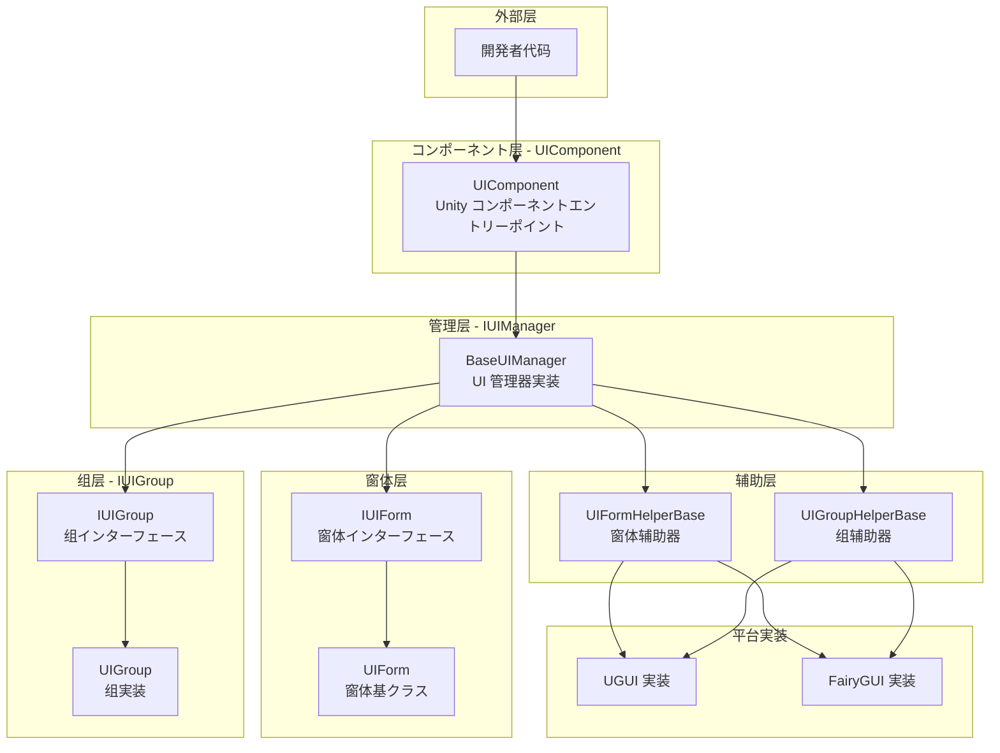
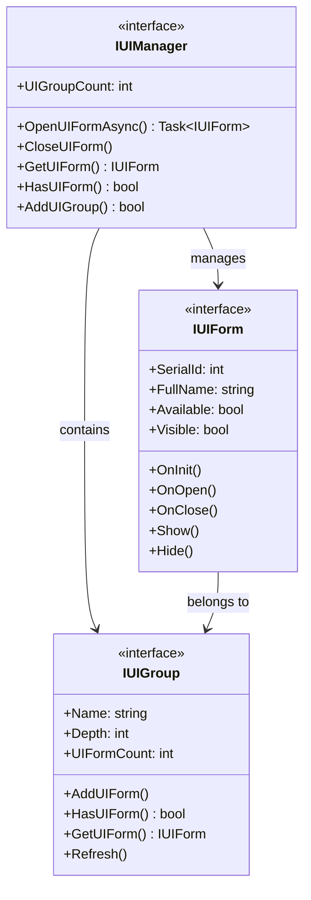
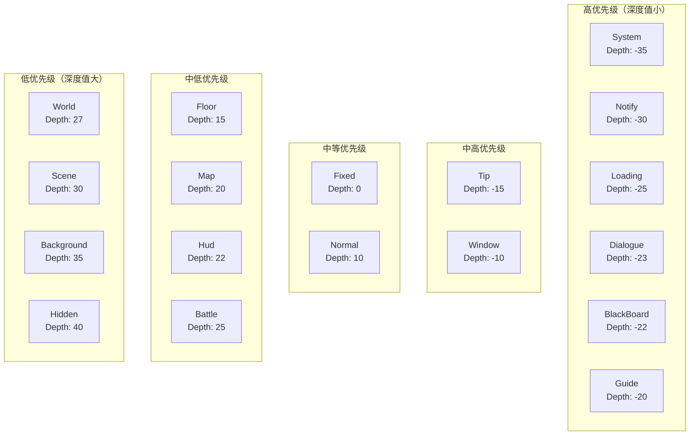
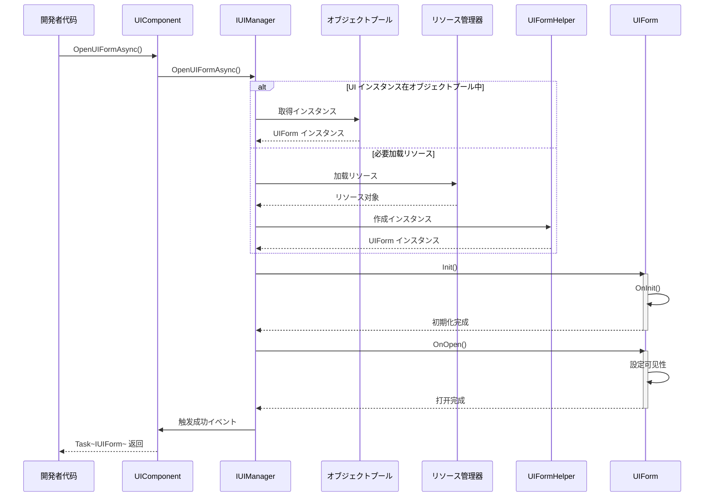
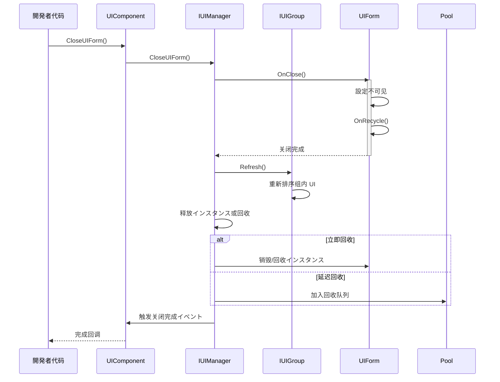

# 概要

Game Frame X UI 是 GameFrameX フレームワーク的 UI コンポーネント，提供します一套完整的 Unity UI 管理解決策。该系统サポート UGUI 和 FairyGUI 两种主流 UI 系统，提供します统一的インターフェース设计、分层管理、オブジェクトプール复用和完整的イベント驱动机制。

## 概要

Game Frame X UI 是 GameFrameX ゲームフレームワーク的コア UI 管理系统，专为 Unity ゲーム开发设计。该系统采用了近代化的アーキテクチャ設計，サポート UGUI 和 FairyGUI 两种 UI 渲染系统，開発者可能に基づいてプロジェクト需求灵活选择。UI 系统提供します完整的生命周期管理，从界面加载、显示、隐藏到关闭回收，每个环节都有完善的イベント回调机制，让開発者能够精确控制 UI 的行为。

该系统的コア设计理念是"统一インターフェース、灵活配置"。无论底层使用哪种 UI 系统，開発者都を通じて统一的 `IUIManager` インターフェース进行 UI 的打开、关闭、查询等操作。同时，系统サポート高度定制化，開発者可能配置不同的 UI 组辅助器和 UI 窗体辅助器来実装特定的機能需求。这种设计既保证了代码的简洁性，又提供します足够的灵活性来应对各种复杂的ゲーム UI シーン。

Game Frame X UI 还深度集成了 GameFrameX フレームワーク的其他コアコンポーネント，包括リソース管理系统、オブジェクトプールシステム和イベント系统。这种深度集成使得 UI 系统能够高效地管理 UI リソース的加载和回收，同时を通じてイベント系统実装了模块间的松耦合通信。開発者可能を通じて订阅 UI イベント来実装跨系统的逻辑联动，而无需直接依赖具体的 UI 実装クラス。

## アーキテクチャ設計

Game Frame X UI 采用了分层アーキテクチャ設計，从底层到顶层依次包括：インターフェース层、実装层、コンポーネント层和编辑器层。每一层都有明确的职责划分，层与层之间を通じてインターフェース进行通信，这种设计极大地提高了代码的可维护性和可扩展性。



**架构説明：**

- **コンポーネント层（UIComponent）**：作为 Unity ゲーム对象的コンポーネント，是整个 UI 系统的エントリーポイント点，负责初期化和管理 IUIManager 実装
- **管理层（IUIManager）**：コアインターフェース，定义了 UI 窗体和 UI 组的所有操作，包括打开、关闭、查询等メソッド
- **窗体层（IUIForm/UIForm）**：UI 窗体的インターフェース定义和基クラス実装，提供します完整的生命周期メソッド
- **组层（IUIGroup）**：UI 组インターフェース，に使用管理同一层级的 UI 窗体，控制显示深度和优先级
- **辅助层（Helper）**：平台特定的実装辅助クラス，分别处理 UGUI 和 FairyGUI 的底层差异
- **平台実装层**：具体的 UGUI 或 FairyGUI 実装，封装了各自平台的 API 呼び出し

### コアインターフェース关系

UI 系统的コアインターフェース包括 IUIManager、IUIForm 和 IUIGroup，它们共同构成了 UI 管理的基础。IUIManager 负责整体的 UI 管理，包括作成和销毁 UI 窗体、管理 UI 组、调度イベント等。IUIForm 定义了单个 UI 窗体的行为规范，包括初期化、打开、关闭、显示、隐藏等生命周期メソッド。IUIGroup 则负责管理一组関連的 UI 窗体，控制它们的深度和显示顺序。



这种インターフェース设计遵循了依赖倒置原则，上层模块依赖于抽象インターフェース而不是具体実装，使得系统具有良好的可测试性和可替换性。開発者可能を通じて実装自定义的辅助器来替换默认的 UGUI 或 FairyGUI 実装，而无需修改上层的业务逻辑代码。

## コアコンセプト

### UI 窗体（UIForm）

UI 窗体是 UI 系统中最基本的操作单元，每个可见的 UI 界面都对应一个 UIForm インスタンス。UIForm を継承 Unity 的 MonoBehaviour，可能直接挂载到 Prefab 上使用。作为基クラス，它提供します完整的生命周期钩子，開発者を通じて重写这些メソッド来处理 UI の具体的な論理。

```csharp
using GameFrameX.UI.Runtime;
using UnityEngine;

public class MainMenuUI : UIForm
{
    protected override void OnInit(object userData)
    {
        base.OnInit(userData);
        // 初期化 UI 元素引用
        // 绑定按钮イベント等
    }

    protected override void OnOpen(object userData)
    {
        base.OnOpen(userData);
        // UI 打开时的逻辑
        // 播放入场动画
        // 刷新界面数据
    }

    protected override void OnClose(bool isShutdown, object userData)
    {
        base.OnClose(isShutdown, userData);
        // UI 关闭时的清理工作
    }
}
```
> Source: [UIForm.cs](https://github.com/GameFrameX/com.gameframex.unity.ui/blob/main/Runtime/UIForm.cs#L39-L100)

UIForm 的生命周期包括以下关键メソッド：OnAwake 在 UI インスタンス作成后立即呼び出し，适合进行イベント订阅等初期化操作；OnInit 在 UI 首次初期化时呼び出し，に使用設定 UI 元素和绑定イベント处理器；OnOpen 在 UI 显示时呼び出し，可能接收和处理传入的用户数据；OnClose 在 UI 关闭时呼び出し，に使用清理リソース和保存ステータス；OnPause 和 OnResume 分别在 UI 被遮挡和恢复时呼び出し。

### UI コンポーネント（UIComponent）

UIComponent 是 Unity ゲームシーン中的コアコンポーネント，を継承 GameFrameworkComponent。它是開発者与 UI 系统交互的主要エントリーポイント点，提供します所有 UI 操作的静态メソッド封装。在实际使用中，開発者通常を通じて `GameEntry.GetComponent<UIComponent>()` 取得インスタンス，然后呼び出し其メソッド来管理 UI。

```csharp
// 取得 UI コンポーネントインスタンス
var uiComponent = GameEntry.GetComponent<UIComponent>();

// 同步打开 UI
uiComponent.OpenUIForm("MainMenuUI", "Normal");

// 异步打开 UI
var mainMenu = await uiComponent.OpenUIFormAsync("MainMenuUI", "Normal");

// 关闭 UI
uiComponent.CloseUIForm("MainMenuUI");

// 查询 UI 是否存在
if (uiComponent.HasUIForm("MainMenuUI"))
{
    // UI 已打开
}
```
> Source: [UIComponent.cs](https://github.com/GameFrameX/com.gameframex.unity.ui/blob/main/Runtime/UIComponent.cs#L48-L114)

UIComponent 封装了 IUIManager 的全機能，并添加了一些便捷メソッド。它还负责管理オブジェクトプール的関連配置，包括インスタンス容量、过期时间和自动回收间隔等。を通じて配置这些参数，開発者可能优化内存使用和性能表现。

### UI 组系统

UI 组是に使用组织和管理 UI 窗体的容器，每个 UI 组有一个名称和一个深度值。深度值决定了 UI 的显示优先级，深度值越小，UI 显示在越上层。当打开一个新的 UI 窗体时，必要指定它所属的 UI 组，系统会に基づいて组的深度值和窗体在组内的顺序来确定最终的显示层级。

```csharp
// 添加自定义 UI 组
uiComponent.AddUIGroup("CustomGroup", -5);

// 取得 UI 组
var group = uiComponent.GetUIGroup("Window");
```
> Source: [UIComponent.cs](https://github.com/GameFrameX/com.gameframex.unity.ui/blob/main/Runtime/BaseUIManager.cs#L200-L230)

系统预定义了 18 个标准 UI 组，涵盖了ゲーム中常见的 UI シーン，从系统公告到战斗界面都有对应的层级。開発者可能直接使用这些预定义组，也可能に基づいて必要作成自定义组。

## UI 组层级

Game Frame X UI 预定义了 18 个 UI 组，每个组都有特定的深度值。深度值越小，显示层级越高。这意味着深度值为 -35 的 System 组会显示在深度值为 40 的 Hidden 组之上。



### 预定义 UI 组

| 组名 | 深度值 | 典型用途 |
|------|--------|----------|
| System | -35 | 系统公告、VIP ヒント等顶级界面 |
| Notify | -30 | 通知弹窗、跑马灯 |
| Loading | -25 | 加载界面 |
| Dialogue | -23 | 对话剧情界面 |
| BlackBoard | -22 | 黑板/任务面板 |
| Guide | -20 | 新手引导遮罩 |
| Tip | -15 | ヒント弹窗、Toast |
| Window | -10 | 窗口クラス界面 |
| Fixed | 0 | 固定在底部的 UI |
| Normal | 10 | 普通界面 |
| Floor | 15 | 底板 UI |
| Map | 20 | 地图界面 |
| Hud | 22 | 头顶信息、BUFF 显示 |
| Battle | 25 | 战斗関連 UI |
| World | 27 | 世界地图 UI |
| Scene | 30 | シーン切换界面 |
| Background | 35 | 背景 UI |
| Hidden | 40 | 隐藏 UI（不可见） |

> Source: [UIGroupConstants.cs](https://github.com/GameFrameX/com.gameframex.unity.ui/blob/main/Runtime/UIGroupConstants.cs#L38-L202)

深度值的设计遵循以下原则：负深度に使用显示在ゲームシーン之上的 UI，如对话框、ヒント等；零和正深度に使用ゲーム内的 HUD 元素；较大的正深度に使用背景和低优先级 UI。这种设计确保了重要的 UI 始终显示在最上层。

## コアフロー

### UI 打开フロー

打开 UI 窗体是 UI 系统最常用的操作之一。整个フロー涉及リソース加载、インスタンス作成、初期化和显示等多个手順。下面是完整的异步打开フロー：



### UI 关闭フロー

关闭 UI 窗体同样涉及多个手順，包括隐藏、回收和イベント触发。系统サポート立即回收和延迟回收两种模式。



## イベント系统

Game Frame X UI 提供します完整的イベント系统，に使用通知 UI ステータス的变更。開発者可能を通じて订阅这些イベント来响应 UI 的各种ステータス变化，実装松耦合的代码架构。

### イベントクラス型

| イベントクラス | イベント ID | 説明 |
|--------|---------|------|
| OpenUIFormSuccessEventArgs | 打开界面成功イベント | UI 成功打开时触发 |
| OpenUIFormFailureEventArgs | 打开界面失败イベント | UI 打开失败时触发 |
| CloseUIFormCompleteEventArgs | 关闭界面完成イベント | UI 关闭完成时触发 |
| UIFormVisibleChangedEventArgs | 界面可见性变化イベント | UI 显示ステータス改变时触发 |

> Source: [Runtime/EventArgs/](https://github.com/GameFrameX/com.gameframex.unity.ui/blob/main/Runtime/EventArgs/)

### イベント订阅示例

```csharp
using GameFrameX.UI.Runtime;
using GameFrameX.Event.Runtime;

// 在ゲーム初期化时订阅イベント
var eventComponent = GameEntry.GetComponent<EventComponent>();
eventComponent.Subscribe(OpenUIFormSuccessEventArgs.EventId, OnOpenUIFormSuccess);
eventComponent.Subscribe(OpenUIFormFailureEventArgs.EventId, OnOpenUIFormFailure);
eventComponent.Subscribe(CloseUIFormCompleteEventArgs.EventId, OnCloseUIFormComplete);

private void OnOpenUIFormSuccess(object sender, GameEventArgs e)
{
    var args = (OpenUIFormSuccessEventArgs)e;
    Debug.Log($"UI 打开成功: {args.UIForm.UIFormAssetName}");
}

private void OnOpenUIFormFailure(object sender, GameEventArgs e)
{
    var args = (OpenUIFormFailureEventArgs)e;
    Debug.LogError($"UI 打开失败: {args.UIFormAssetName}, 错误: {args.ErrorMessage}");
}

private void OnCloseUIFormComplete(object sender, GameEventArgs e)
{
    var args = (CloseUIFormCompleteEventArgs)e;
    Debug.Log($"UI 关闭完成: {args.UIFormAssetName}");
}
```
> Source: [UIComponent.cs](https://github.com/GameFrameX/com.gameframex.unity.ui/blob/main/Runtime/UIComponent.cs#L436-L465)

## プラットフォーム対応

Game Frame X UI 同时サポート Unity 的 UGUI 系统和 FairyGUI 插件。这种双轨サポートを通じて条件编译和辅助器模式実装，開発者可能に基づいてプロジェクト需求选择合适的渲染后端，而业务代码无需任何修改。

### UGUI サポート

UGUI 是 Unity 内置的 UI 系统，兼容性好，是大多数 Unity プロジェクト的首选。系统提供します完整的 UGUI 実装，包括 Canvas 管理、イベント处理和リソース加载等。

### FairyGUI サポート

FairyGUI 是機能强大的第三方 UI 编辑器，提供します可视化的 UI 编辑体验和高效的リソース管理。对于必要复杂 UI 交互和高效迭代的プロジェクト，FairyGUI 是很好的选择。

切换 UI 系统非常简单，只需在 Unity 的 Scripting Define Symbols 中添加对应的编译符号（`ENABLE_UI_UGUI` 或 `ENABLE_UI_FAIRYGUI`）即可。UIComponent 会に基づいて编译符号自动加载对应的辅助器実装。

## 依赖项

Game Frame X UI 依赖于 GameFrameX フレームワーク的其他コアコンポーネント：

| 依赖项 | 最小バージョン | 説明 |
|--------|----------|------|
| com.gameframex.unity | >= 1.1.1 | コアフレームワーク |
| com.gameframex.unity.asset | >= 1.0.6 | リソース管理 |
| com.gameframex.unity.event | >= 1.0.0 | イベント系统 |
| com.gameframex.unity.localization | >= 1.0.0 | 本地化サポート |

> Source: [package.json](https://github.com/GameFrameX/com.gameframex.unity.ui/blob/main/package.json)

## 関連リンク

- [安装指南](./2-installation)
- [快速开始](./3-getting-started)
- [UI コンポーネント详解](./4-core-concepts.ui-component)
- [UI 窗体详解](./4-core-concepts.ui-form)
- [UI 组系统](./4-core-concepts.ui-group)
- [オブジェクトプール管理](./4-core-concepts.object-pool)
- [API 参考 - IUIManager](./5-api-reference.iuimanager)
- [API 参考 - UIComponent](./5-api-reference.ui-component)
- [API 参考 - UIForm](./5-api-reference.ui-form)
- [API 参考 - IUIGroup](./5-api-reference.iuigroup)
- [イベント系统详解](./6-event-system)
- [UI 组层级详解](./7-ui-group-hierarchy)
- [编辑器配置](./8-configuration.editor)
- [UI プロパティ配置](./8-configuration.attributes)
- [平台サポート](./9-platforms)
- [常见问题](./10-troubleshooting)
- 官方文档: https://gameframex.doc.alianblank.com/
- GitHub 仓库: https://github.com/GameFrameX/com.gameframex.unity.ui
