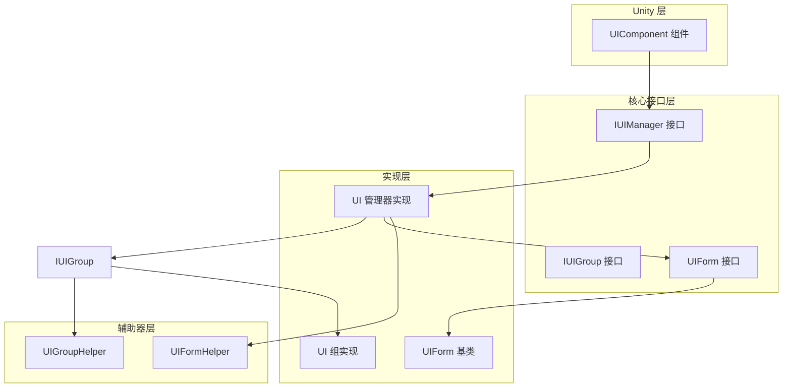
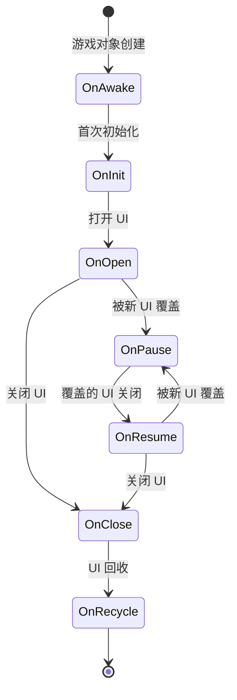
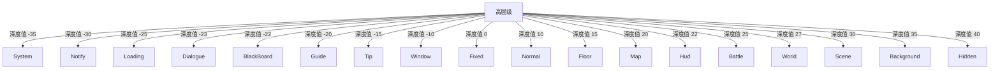

# クイックスタート

本ガイド将帮助您快速上手 GameFrameX Unity UI 系统。通过本ガイド，您将理解する如何設定 UI コンポーネント、作成 UI 窗体および进行基本的 UI 操作。

## 概要

GameFrameX Unity UI 是一套完全な的 UI 管理解決策，サポート UGUI 和 FairyGUI 两种 UI 系统。该系统提供します統一された的 UI 管理インターフェース、分层 UI 系统、对象池管理、イベント驱动机制および非同期ロード機能。

**前置条件：**
- Unity 2019.4 或更高バージョン
- 已インストール GameFrameX コアフレームワーク

## システムアーキテクチャ

GameFrameX UI 系统采用コンポーネント化アーキテクチャ設計，主な由以下几个コア部分组成：



**アーキテクチャ説明：**
- **UIComponent**：Unity コンポーネント，提供します面向開発者的 API 入口
- **IUIManager**：UI マネージャーインターフェース，定義了 UI 窗体的コア操作
- **IUIGroup**：UI 组インターフェース，管理 UI 的层级关系
- **UIForm**：UI 窗体基底クラス，所有自定義 UI 窗体都应継承此类

## 設定 UI コンポーネント

### ステップ 1：追加 UIComponent コンポーネント

在 Unity シーン中作成一个空 GameObject，并追加 `UIComponent` コンポーネント：

1. 在 Hierarchy パネル中右键选择 **Create Empty**
2. 将 GameObject 命名为 "UI"
3. 在 Inspector パネル中点击 **Add Component**
4. 検索并追加 **GameFrameX/UI** コンポーネント

> Source: [UIComponent.cs](https://github.com/GameFrameX/com.gameframex.unity.ui/blob/main/Runtime/UIComponent.cs#L48-L50)

### ステップ 2：設定コンポーネントプロパティ

在 Inspector パネル中設定 UIComponent 的プロパティ：

| プロパティ | タイプ | デフォルト值 | 説明 |
|------|------|--------|------|
| Enable Open UI Form Success Event | bool | true | 是否启用 UI 打开成功イベント |
| Enable Open UI Form Failure Event | bool | true | 是否启用 UI 打开失敗イベント |
| Enable Auto Release UI Form | bool | true | 是否自动回收 UI |
| Enable Close UI Form Complete Event | bool | true | 是否在閉じる UI 时トリガー完成イベント |
| Is Enable UI Show Animation | bool | false | 是否启用 UI 显示动画 |
| Is Enable UI Hide Animation | bool | false | 是否启用 UI 隐藏动画 |
| Instance Auto Release Interval | float | 60f | UI インスタンス自动解放间隔（秒） |
| Instance Capacity | int | 16 | UI インスタンス对象池容量 |
| Instance Expire Time | float | 60f | UI インスタンス过期时间（秒） |
| Recycle Interval | int | 60 | UI 回收间隔（秒） |

### ステップ 3：設定 UI 根节点

根据您使用的 UI 系统設定相应的根节点：

- **UGUI Root**：もし使用 UGUI，設定 UGUI Canvas 所在的 Transform
- **FairyGUI Root**：もし使用 FairyGUI，設定 FairyGUI 根容器所在的 Transform

> Source: [UIComponent.cs](https://github.com/GameFrameX/com.gameframex.unity.ui/blob/main/Runtime/UIComponent.cs#L145-L161)

## 作成 UI 窗体

### 継承 UIForm 作成自定義 UI

所有自定義 UI 窗体都〜する必要があります継承 `UIForm` 基底クラス。以下は完全な的主メニュー UI 例：

```csharp
using GameFrameX.UI.Runtime;
using UnityEngine;
using UnityEngine.UI;

public class MainMenuUI : UIForm
{
    [SerializeField] private Button startButton;
    [SerializeField] private Button settingsButton;
    [SerializeField] private Button exitButton;

    protected override void OnInit(object userData)
    {
        base.OnInit(userData);
        
        // 绑定按钮事件
        startButton.onClick.AddListener(OnStartButtonClick);
        settingsButton.onClick.AddListener(OnSettingsButtonClick);
        exitButton.onClick.AddListener(OnExitButtonClick);
    }

    protected override void OnOpen(object userData)
    {
        base.OnOpen(userData);
        
        // UI 打开时的逻辑
        Debug.Log("主菜单已打开");
    }

    protected override void OnClose(bool isShutdown, object userData)
    {
        base.OnClose(isShutdown, userData);
        
        // 清理资源
    }

    private void OnStartButtonClick()
    {
        // 关闭当前 UI 并打开游戏 UI
        UIComponent.CloseUIForm(this);
        GameEntry.GetComponent<UIComponent>().OpenUIFormAsync<GameUI>("UI/Game");
    }

    private void OnSettingsButtonClick()
    {
        // 打开设置 UI
        GameEntry.GetComponent<UIComponent>().OpenUIFormAsync<SettingsUI>("UI/Settings");
    }

    private void OnExitButtonClick()
    {
        // 退出游戏
        Application.Quit();
    }
}
```

> Source: [UIForm.cs](https://github.com/GameFrameX/com.gameframex.unity.ui/blob/main/Runtime/UIForm.cs#L47-L100)

### UIForm ライフサイクルメソッド

`UIForm` 提供します完全な的ライフサイクル钩子：



| ライフサイクルメソッド | 呼び出し时机 | 用途 |
|-------------|---------|------|
| OnAwake | Unity Awake 时 | 初期化イベント購読器 |
| OnInit | UI 首次初期化时 | 绑定 UI 元素、初期化数据 |
| OnOpen | UI 每次打开时 | 刷新 UI 数据、再生动画 |
| OnClose | UI 閉じる时 | 清理临时数据、保存ステータス |
| OnRecycle | UI 回收时 | 重置 UI ステータス |
| OnPause | UI 被覆盖时 | 暂停 UI 相关逻辑 |
| OnResume | UI 恢复显示时 | 恢复 UI 逻辑 |
| OnUpdate | 每帧アップデート | 轮询逻辑処理 |

> Source: [UIForm.cs](https://github.com/GameFrameX/com.gameframex.unity.ui/blob/main/Runtime/UIForm.cs#L530-L610)

## 基本操作

### 取得 UIComponent インスタンス

```csharp
// 通过 GameEntry 获取 UIComponent
var uiComponent = GameEntry.GetComponent<UIComponent>();
```

> Source: [UIComponent.cs](https://github.com/GameFrameX/com.gameframex.unity.ui/blob/main/Runtime/UIComponent.cs#L48-L50)

### 打开 UI 窗体

**异步方法（推奨）：**

```csharp
var uiComponent = GameEntry.GetComponent<UIComponent>();

// 方式1：使用泛型方法自动解析路径
var mainMenu = await uiComponent.OpenUIFormAsync<MainMenuUI>();

// 方式2：指定资源路径
var mainMenu = await uiComponent.OpenUIFormAsync<MainMenuUI>("UI/MainMenu");

// 方式3：传递用户数据
var userData = new { playerName = "Player1", level = 10 };
var mainMenu = await uiComponent.OpenUIFormAsync<MainMenuUI>("UI/MainMenu", userData);

// 方式4：指定是否暂停被覆盖的 UI
var mainMenu = await uiComponent.OpenUIFormAsync<MainMenuUI>("UI/MainMenu", false); // false 表示不暂停
```

> Source: [UIComponent.Open.cs](https://github.com/GameFrameX/com.gameframex.unity.ui/blob/main/Runtime/UIComponent.Open.cs#L115-L155)

### 閉じる UI 窗体

```csharp
var uiComponent = GameEntry.GetComponent<UIComponent>();

// 方式1：关闭当前 UI（从 UIForm 内部）
UIComponent.CloseUIForm(this);

// 方式2：通过类型关闭
uiComponent.CloseUIForm<MainMenuUI>();

// 方式3：通过实例关闭
uiComponent.CloseUIForm(mainMenuUI);

// 方式4：通过序列编号关闭
uiComponent.CloseUIForm(serialId);

// 方式5：关闭所有已加载的 UI
uiComponent.CloseAllLoadedUIForms();

// 方式6：立即回收（跳过对象池）
uiComponent.CloseUIForm(mainMenuUI, true); // isNowRecycle = true
```

> Source: [IUIManager.cs](https://github.com/GameFrameX/com.gameframex.unity.ui/blob/main/Runtime/UI/IUIManager.cs#L385-L455)

### 取得 UI 窗体

```csharp
var uiComponent = GameEntry.GetComponent<UIComponent>();

// 通过序列编号获取
var uiForm = uiComponent.GetUIForm(serialId);

// 通过资源名称获取
var uiForm = uiComponent.GetUIForm("MainMenuUI");

// 检查 UI 是否存在
if (uiComponent.HasUIForm("MainMenuUI"))
{
    // UI 已打开
}
```

> Source: [IUIManager.cs](https://github.com/GameFrameX/com.gameframex.unity.ui/blob/main/Runtime/UI/IUIManager.cs#L252-L290)

## UI 组系统

### 什么是 UI 组

UI 组用于管理 UI 的层级关系。フレームワーク预定義了 18 个 UI 组，每个组有特定的深度值。

### UI 组层级



**深度值説明：** 深度值越小，显示层级越高（越靠前）。例えば，System 组（-35）会显示在所有其他 UI 之上。

> Source: [UIGroupConstants.cs](https://github.com/GameFrameX/com.gameframex.unity.ui/blob/main/Runtime/UIGroupConstants.cs#L38-L202)

### 使用 UI 组

打开 UI 时〜できます指定所属的 UI 组：

```csharp
var uiComponent = GameEntry.GetComponent<UIComponent>();

// 打开普通 UI（使用默认 Normal 组）
await uiComponent.OpenUIFormAsync<MainMenuUI>("UI/MainMenu");

// 打开对话框（使用 Dialogue 组）
await uiComponent.OpenUIFormAsync<DialogueUI>("UI/Dialogue");

// 打开提示（使用 Tip 组）
await uiComponent.OpenUIFormAsync<TipUI>("UI/Tip");
```

### 预定義的 UI 组常量

| 组名 | 深度值 | 典型用途 |
|------|--------|---------|
| System | -35 | 系统公告、バージョン情報 |
| Notify | -30 | 通知、跑马灯 |
| Loading | -25 | ロード界面 |
| Dialogue | -23 | 对话框 |
| BlackBoard | -22 | 黑板界面 |
| Guide | -20 | 新手引导 |
| Tip | -15 | ヒント情報 |
| Window | -10 | ウィンドウ界面 |
| Fixed | 0 | 固定 UI（如底部ナビゲーション） |
| Normal | 10 | 普通界面 |
| Floor | 15 | 底板界面 |
| Map | 20 | 地图界面 |
| Hud | 22 | 头顶情報 |
| Battle | 25 | 战斗 UI |
| World | 27 | 世界 UI |
| Scene | 30 | シーン UI |
| Background | 35 | 背景 UI |
| Hidden | 40 | 隐藏 UI |

> Source: [UIGroupConstants.cs](https://github.com/GameFrameX/com.gameframex.unity.ui/blob/main/Runtime/UIGroupConstants.cs#L38-L202)

## イベント系统

### 購読 UI イベント

GameFrameX UI 系统提供します完全な的イベント通知机制：

```csharp
using GameFrameX.UI.Runtime;
using GameFrameX.Event.Runtime;

public class UIManagerExample : MonoBehaviour
{
    private void Start()
    {
        var eventComponent = GameEntry.GetComponent<EventComponent>();
        
        // 订阅 UI 打开成功事件
        eventComponent.Subscribe(OpenUIFormSuccessEventArgs.EventId, OnOpenUIFormSuccess);
        
        // 订阅 UI 打开失败事件
        eventComponent.Subscribe(OpenUIFormFailureEventArgs.EventId, OnOpenUIFormFailure);
        
        // 订阅 UI 关闭完成事件
        eventComponent.Subscribe(CloseUIFormCompleteEventArgs.EventId, OnCloseUIFormComplete);
    }

    private void OnOpenUIFormSuccess(object sender, GameEventArgs e)
    {
        var args = (OpenUIFormSuccessEventArgs)e;
        Debug.Log($"UI 打开成功: {args.UIForm.UIFormAssetName}");
    }

    private void OnOpenUIFormFailure(object sender, GameEventArgs e)
    {
        var args = (OpenUIFormFailureEventArgs)e;
        Debug.LogError($"UI 打开失败: {args.UIFormAssetName}, 错误: {args.ErrorMessage}");
    }

    private void OnCloseUIFormComplete(object sender, GameEventArgs e)
    {
        var args = (CloseUIFormCompleteEventArgs)e;
        Debug.Log($"UI 关闭完成: {args.UIFormAssetName}");
    }
}
```

> Source: [IUIManager.cs](https://github.com/GameFrameX/com.gameframex.unity.ui/blob/main/Runtime/UI/IUIManager.cs#L109-L142)

### 可用イベントタイプ

| イベントタイプ | 説明 | トリガー时机 |
|---------|------|---------|
| OpenUIFormSuccessEventArgs | UI 打开成功 | UI 成功打开后 |
| OpenUIFormFailureEventArgs | UI 打开失敗 | UI 打开失敗时 |
| CloseUIFormCompleteEventArgs | UI 閉じる完成 | UI 閉じる完成后 |
| UIFormVisibleChangedEventArgs | UI 可见性改变 | UI 显示/隐藏时 |

## 数据传递

### 打开 UI 时传递数据

```csharp
// 创建数据类
public class ShopUIData
{
    public int PlayerId { get; set; }
    public List<Item> Items { get; set; }
    public string CurrencyType { get; set; }
}

// 打开 UI 并传递数据
var shopData = new ShopUIData 
{ 
    PlayerId = 123, 
    Items = itemList,
    CurrencyType = "Gold"
};
await uiComponent.OpenUIFormAsync<ShopUI>("UI/Shop", shopData);
```

### 在 UI 中受信数据

```csharp
public class ShopUI : UIForm
{
    private ShopUIData _shopData;

    protected override void OnOpen(object userData)
    {
        base.OnOpen(userData);
        
        // 接收传递的数据
        _shopData = userData as ShopUIData;
        if (_shopData != null)
        {
            // 使用数据初始化 UI
            Debug.Log($"商店数据: 玩家 ID = {_shopData.PlayerId}");
            RefreshShopItems(_shopData.Items);
        }
    }
}
```

> Source: [IUIManager.cs](https://github.com/GameFrameX/com.gameframex.unity.ui/blob/main/Runtime/UI/IUIManager.cs#L358-L383)

## 性能最適化

### 对象池設定

通过設定对象池パラメータ〜できます最適化内存使用：

```csharp
var uiComponent = GameEntry.GetComponent<UIComponent>();

// 设置对象池容量
uiComponent.InstanceCapacity = 20;

// 设置实例过期时间（秒）
uiComponent.InstanceExpireTime = 120f;

// 设置自动释放间隔（秒）
uiComponent.InstanceAutoReleaseInterval = 60f;

// 设置回收间隔（秒）
uiComponent.RecycleInterval = 60;
```

> Source: [UIComponent.cs](https://github.com/GameFrameX/com.gameframex.unity.ui/blob/main/Runtime/UIComponent.cs#L320-L351)

### 性能最佳实践

1. **合理使用 UI 组**：将频繁切换的 UI 放在同一组，减少深度调整开销
2. **启用对象池**：保持デフォルト的对象池設定，避免频繁作成破棄
3. **非同期ロード**：使用异步 API 打开 UI，避免阻塞主线程
4. **閉じる不〜する必要があります的 UI**：及时閉じる不再使用的 UI，解放リソース
5. **禁用不必要的动画**：如不〜する必要があります显示/隐藏动画，閉じる以提升性能

## 完全な例

以下は完全な的游戏入口例，表示了如何初期化和使用 UI 系统：

```csharp
using GameFrameX.UI.Runtime;
using GameFrameX.Event.Runtime;
using UnityEngine;

public class GameEntryExample : MonoBehaviour
{
    private UIComponent _uiComponent;
    private EventComponent _eventComponent;

    private void Start()
    {
        // 获取组件
        _uiComponent = GetComponent<UIComponent>();
        _eventComponent = GetComponent<EventComponent>();
        
        // 配置 UI 组件
        ConfigureUIComponent();
        
        // 订阅事件
        SubscribeEvents();
        
        // 打开主菜单
        OpenMainMenu();
    }

    private void ConfigureUIComponent()
    {
        _uiComponent.InstanceCapacity = 16;
        _uiComponent.InstanceExpireTime = 60f;
        _uiComponent.RecycleInterval = 60;
    }

    private void SubscribeEvents()
    {
        _eventComponent.Subscribe(OpenUIFormSuccessEventArgs.EventId, OnOpenUIFormSuccess);
        _eventComponent.Subscribe(OpenUIFormFailureEventArgs.EventId, OnOpenUIFormFailure);
    }

    private async void OpenMainMenu()
    {
        try
        {
            var mainMenuUI = await _uiComponent.OpenUIFormAsync<MainMenuUI>("UI/MainMenu");
            Debug.Log("主菜单打开成功");
        }
        catch (System.Exception ex)
        {
            Debug.LogError($"主菜单打开失败: {ex.Message}");
        }
    }

    private void OnOpenUIFormSuccess(object sender, GameEventArgs e)
    {
        var args = (OpenUIFormSuccessEventArgs)e;
        Debug.Log($"UI 打开成功: {args.UIForm.UIFormAssetName}");
    }

    private void OnOpenUIFormFailure(object sender, GameEventArgs e)
    {
        var args = (OpenUIFormFailureEventArgs)e;
        Debug.LogError($"UI 打开失败: {args.UIFormAssetName}, 错误: {args.ErrorMessage}");
    }
}
```

## 関連リンク

- [概要](./1-overview) - 理解する更多关于 UI 系统的特性和アーキテクチャ
- [インストール](./2-installation) - 詳細的インストールガイド
- [UI コンポーネント](./4-core-concepts.ui-component) - UIComponent 詳細ドキュメント
- [UI 窗体](./4-core-concepts.ui-form) - UIForm 詳細ドキュメント
- [UI 组系统](./4-core-concepts.ui-group) - UI 组系统詳細ドキュメント
- [API リファレンス](./5-api-reference.ui-component) - 完全な的 API ドキュメント
- [イベント系统](./6-event-system) - イベント系统詳細説明
- [UI 组层级](./7-ui-group-hierarchy) - UI 组层级詳細説明