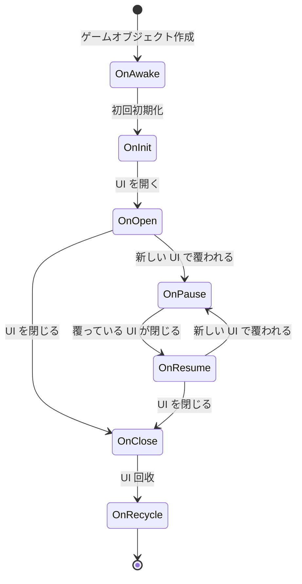
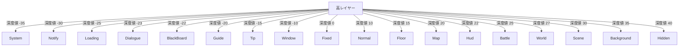

# クイックスタート

このガイドでは、GameFrameX Unity UI システムへの快速な入门を実現します。このガイドを通じて、UI コンポーネントの設定方法、UI フォームの作成方法、基本的な UI 操作方法を学びます。

## 概要

GameFrameX Unity UI は、UGUI と FairyGUI の2つの UI システムをサポートする完全な UI 管理ソリューションです。このシステムは、統一された UI 管理インターフェース、階層型 UI システム、オブジェクトプール管理、イベント駆動機構、非同期読み込み機能を提供します。

**前提条件：**
- Unity 2019.4 以降
- GameFrameX コアフレームワークがインストール済み

## システムアーキテクチャ

GameFrameX UI システムはコンポーネント化アーキテクチャ設計を採用しており、以下のコア部分で構成されています：


**アーキテクチャ説明：**
- **UIComponent**：Unity コンポーネントであり、開発者向け API エントリーポイントを提供します
- **IUIManager**：UI 管理器インターフェースであり、UI フォームのコア操作を定義します
- **IUIGroup**：UI グループインターフェースであり、UI の階層関係を管理します
- **UIForm**：UI フォーム基本クラスであり、すべてのカスタム UI フォームはこのクラスを継承します

## UI コンポーネントの設定

### 手順 1：UIComponent コンポーネントを追加

Unity シーンに空の GameObject を作成し、`UIComponent` コンポーネントを追加します：

1. Hierarchy パネルで右クリックし **Create Empty** を選択
2. GameObject の名前を "UI" に設定
3. Inspector パネルで **Add Component** をクリック
4. **GameFrameX/UI** コンポーネントを検索して追加

> Source: [UIComponent.cs](https://github.com/GameFrameX/com.gameframex.unity.ui/blob/main/Runtime/UIComponent.cs#L48-L50)

### 手順 2：コンポーネントプロパティの設定

Inspector パネルで UIComponent のプロパティを設定します：

| プロパティ | タイプ | デフォルト値 | 説明 |
|------|------|--------|------|
| Enable Open UI Form Success Event | bool | true | UI を開く成功イベントを有効にするか |
| Enable Open UI Form Failure Event | bool | true | UI を開く失敗イベントを有効にするか |
| Enable Auto Release UI Form | bool | true | UI を自動的に回收するか |
| Enable Close UI Form Complete Event | bool | true | UI を閉じる時に完了イベントが発生するか |
| Is Enable UI Show Animation | bool | false | UI 表示アニメーションを有効にするか |
| Is Enable UI Hide Animation | bool | false | UI 非表示アニメーションを有効にするか |
| Instance Auto Release Interval | float | 60f | UI インスタンス自動解放間隔（秒） |
| Instance Capacity | int | 16 | UI インスタンスオブジェクトプール容量 |
| Instance Expire Time | float | 60f | UI インスタンス过期時間（秒） |
| Recycle Interval | int | 60 | UI 回收間隔（秒） |

### 手順 3：UI ルートノードの設定

使用する UI システムに応じて対応するルートノードを設定します：

- **UGUI Root**：UGUI を使用する場合は、UGUI Canvas が配置されている Transform を設定
- **FairyGUI Root**：FairyGUI を使用する場合は、FairyGUI ルートコンテナが配置されている Transform を設定

> Source: [UIComponent.cs](https://github.com/GameFrameX/com.gameframex.unity.ui/blob/main/Runtime/UIComponent.cs#L145-L161)

## UI フォームの作成

### UIForm を継承してカスタム UI を作成

すべてのカスタム UI フォームは `UIForm` 基本クラスを継承する必要があります。以下は完全なメインメニュー UI の示例です：

```csharp
using GameFrameX.UI.Runtime;
using UnityEngine;
using UnityEngine.UI;

public class MainMenuUI : UIForm
{
    [SerializeField] private Button startButton;
    [SerializeField] private Button settingsButton;
    [SerializeField] private Button exitButton;

    protected override void OnInit(object userData)
    {
        base.OnInit(userData);
        
        // ボタンイベントのバインディング
        startButton.onClick.AddListener(OnStartButtonClick);
        settingsButton.onClick.AddListener(OnSettingsButtonClick);
        exitButton.onClick.AddListener(OnExitButtonClick);
    }

    protected override void OnOpen(object userData)
    {
        base.OnOpen(userData);
        
        // UI を開いた時のロジック
        Debug.Log("メインメニューが開かれました");
    }

    protected override void OnClose(bool isShutdown, object userData)
    {
        base.OnClose(isShutdown, userData);
        
        // リソースのクリーンアップ
    }

    private void OnStartButtonClick()
    {
        // 現在の UI を閉じてゲーム UI を開く
        UIComponent.CloseUIForm(this);
        GameEntry.GetComponent<UIComponent>().OpenUIFormAsync<GameUI>("UI/Game");
    }

    private void OnSettingsButtonClick()
    {
        // 設定 UI を開く
        GameEntry.GetComponent<UIComponent>().OpenUIFormAsync<SettingsUI>("UI/Settings");
    }

    private void OnExitButtonClick()
    {
        // ゲームを終了
        Application.Quit();
    }
}
```

> Source: [UIForm.cs](https://github.com/GameFrameX/com.gameframex.unity.ui/blob/main/Runtime/UIForm.cs#L47-L100)

### UIForm ライフサイクルメソッド

`UIForm` は完全なライフサイクルフックを提供します：



| ライフサイクルメソッド | 呼び出しタイミング | 用途 |
|-------------|---------|------|
| OnAwake | Unity Awake 時 | イベント購読の初期化 |
| OnInit | UI 初回初期化時 | UI エレメントのバインディング、データの初期化 |
| OnOpen | UI を開くたびに | UI データの更新、アニメーションの再生 |
| OnClose | UI を閉じる時 | 一時データのクリーンアップ、状態の保存 |
| OnRecycle | UI 回收時 | UI 状態のリセット |
| OnPause | UI が覆われた時 | UI 関連ロジックの一時停止 |
| OnResume | UI が再表示される時 | UI ロジックの再開 |
| OnUpdate | 毎フレーム更新 | ポーリングロジック処理 |

> Source: [UIForm.cs](https://github.com/GameFrameX/com.gameframex.unity.ui/blob/main/Runtime/UIForm.cs#L530-L610)

## 基本操作

### UIComponent インスタンスの取得

```csharp
// GameEntry から UIComponent を取得
var uiComponent = GameEntry.GetComponent<UIComponent>();
```

> Source: [UIComponent.cs](https://github.com/GameFrameX/com.gameframex.unity.ui/blob/main/Runtime/UIComponent.cs#L48-L50)

### UI フォームを開く

**非同期方法（推奨）：**

```csharp
var uiComponent = GameEntry.GetComponent<UIComponent>();

// 方法1：ジェネリックメソッドで自動解析パスを使用
var mainMenu = await uiComponent.OpenUIFormAsync<MainMenuUI>();

// 方法2：リソースパスを指定
var mainMenu = await uiComponent.OpenUIFormAsync<MainMenuUI>("UI/MainMenu");

// 方法3：ユーザーデータを渡す
var userData = new { playerName = "Player1", level = 10 };
var mainMenu = await uiComponent.OpenUIFormAsync<MainMenuUI>("UI/MainMenu", userData);

// 方法4：覆われた UI を一時停止するかを指定
var mainMenu = await uiComponent.OpenUIFormAsync<MainMenuUI>("UI/MainMenu", false); // false は一時停止しない
```

> Source: [UIComponent.Open.cs](https://github.com/GameFrameX/com.gameframex.unity.ui/blob/main/Runtime/UIComponent.Open.cs#L115-L155)

### UI フォームを閉じる

```csharp
var uiComponent = GameEntry.GetComponent<UIComponent>();

// 方法1：現在の UI を閉じる（UIForm 内部から）
UIComponent.CloseUIForm(this);

// 方法2：タイプで閉じる
uiComponent.CloseUIForm<MainMenuUI>();

// 方法3：インスタンスで閉じる
uiComponent.CloseUIForm(mainMenuUI);

// 方法4：シリアル番号で閉じる
uiComponent.CloseUIForm(serialId);

// 方法5：すべての読み込み済み UI を閉じる
uiComponent.CloseAllLoadedUIForms();

// 方法6：即座に回收（オブジェクトプールをスキップ）
uiComponent.CloseUIForm(mainMenuUI, true); // isNowRecycle = true
```

> Source: [IUIManager.cs](https://github.com/GameFrameX/com.gameframex.unity.ui/blob/main/Runtime/UI/IUIManager.cs#L385-L455)

### UI フォームの取得

```csharp
var uiComponent = GameEntry.GetComponent<UIComponent>();

// シリアル番号で取得
var uiForm = uiComponent.GetUIForm(serialId);

// リソース名称で取得
var uiForm = uiComponent.GetUIForm("MainMenuUI");

// UI が存在するかをチェック
if (uiComponent.HasUIForm("MainMenuUI"))
{
    // UI が開いている
}
```

> Source: [IUIManager.cs](https://github.com/GameFrameX/com.gameframex.unity.ui/blob/main/Runtime/UI/IUIManager.cs#L252-L290)

## UI グループシステム

### UI グループとは

UI グループは UI の階層関係を管理するために使用されます。フレームワークは18個の事前定義 UI グループを备え、各グループには特定の深度値があります。

### UI グループレイヤー



**深度値の説明：** 深度値が小さいほど、表示レイヤーが高くなります（前面に表示されます）。例えば、System グループ（-35）はすべての他の UI より上位に表示されます。

> Source: [UIGroupConstants.cs](https://github.com/GameFrameX/com.gameframex.unity.ui/blob/main/Runtime/UIGroupConstants.cs#L38-L202)

### UI 그룹の使用

UI を開く時に所属する UI グループを指定できます：

```csharp
var uiComponent = GameEntry.GetComponent<UIComponent>();

// 通常 UI を開く（デフォルトの Normal グループを使用）
await uiComponent.OpenUIFormAsync<MainMenuUI>("UI/MainMenu");

// ダイアログを開く（Dialogue グループを使用）
await uiComponent.OpenUIFormAsync<DialogueUI>("UI/Dialogue");

// ヒントを開く（Tip グループを使用）
await uiComponent.OpenUIFormAsync<TipUI>("UI/Tip");
```

### 事前定義 UI グループ定数

| グループ名 | 深度値 | 典型的な用途 |
|------|--------|---------|
| System | -35 | システム公告、バージョン情報 |
| Notify | -30 | 通知、ティッカー |
| Loading | -25 | ローディング画面 |
| Dialogue | -23 | ダイアログ |
| BlackBoard | -22 | 黒板画面 |
| Guide | -20 | 初心者ガイド |
| Tip | -15 | ヒント情報 |
| Window | -10 | ウィンドウ画面 |
| Fixed | 0 | 固定 UI（ナビゲーションなど） |
| Normal | 10 | 通常画面 |
| Floor | 15 | ベースボード画面 |
| Map | 20 | マップ画面 |
| Hud | 22 | 頭上情報 |
| Battle | 25 | 戦闘 UI |
| World | 27 | 世界 UI |
| Scene | 30 | シーン UI |
| Background | 35 | 背景 UI |
| Hidden | 40 | 非表示 UI |

> Source: [UIGroupConstants.cs](https://github.com/GameFrameX/com.gameframex.unity.ui/blob/main/Runtime/UIGroupConstants.cs#L38-L202)

## イベントシステム

### UI イベントの購読

GameFrameX UI システムは完全なイベント通知機構を提供します：

```csharp
using GameFrameX.UI.Runtime;
using GameFrameX.Event.Runtime;

public class UIManagerExample : MonoBehaviour
{
    private void Start()
    {
        var eventComponent = GameEntry.GetComponent<EventComponent>();
        
        // UI を開く成功イベントを購読
        eventComponent.Subscribe(OpenUIFormSuccessEventArgs.EventId, OnOpenUIFormSuccess);
        
        // UI を開く失敗イベントを購読
        eventComponent.Subscribe(OpenUIFormFailureEventArgs.EventId, OnOpenUIFormFailure);
        
        // UI を閉じる完了イベントを購読
        eventComponent.Subscribe(CloseUIFormCompleteEventArgs.EventId, OnCloseUIFormComplete);
    }

    private void OnOpenUIFormSuccess(object sender, GameEventArgs e)
    {
        var args = (OpenUIFormSuccessEventArgs)e;
        Debug.Log($"UI を開く成功: {args.UIForm.UIFormAssetName}");
    }

    private void OnOpenUIFormFailure(object sender, GameEventArgs e)
    {
        var args = (OpenUIFormFailureEventArgs)e;
        Debug.LogError($"UI を開く失敗: {args.UIFormAssetName}, エラー: {args.ErrorMessage}");
    }

    private void OnCloseUIFormComplete(object sender, GameEventArgs e)
    {
        var args = (CloseUIFormCompleteEventArgs)e;
        Debug.Log($"UI を閉じる完了: {args.UIFormAssetName}");
    }
}
```

> Source: [IUIManager.cs](https://github.com/GameFrameX/com.gameframex.unity.ui/blob/main/Runtime/UI/IUIManager.cs#L109-L142)

### 利用可能なイベントタイプ

| イベントタイプ | 説明 | 発生タイミング |
|---------|------|---------|
| OpenUIFormSuccessEventArgs | UI を開く成功 | UI が正常に開かれた後 |
| OpenUIFormFailureEventArgs | UI を開く失敗 | UI の 开openに失敗した時 |
| CloseUIFormCompleteEventArgs | UI を閉じる完了 | UI の閉じるが完了した後 |
| UIFormVisibleChangedEventArgs | UI 可視性変化 | UI の 表示/非表示時 |

## データの受け渡し

### UI を開く時にデータを送信

```csharp
// データクラスを作成
public class ShopUIData
{
    public int PlayerId { get; set; }
    public List<Item> Items { get; set; }
    public string CurrencyType { get; set; }
}

// UI を開いてデータを送信
var shopData = new ShopUIData 
{ 
    PlayerId = 123, 
    Items = itemList,
    CurrencyType = "Gold"
};
await uiComponent.OpenUIFormAsync<ShopUI>("UI/Shop", shopData);
```

### UI でデータを受け取る

```csharp
public class ShopUI : UIForm
{
    private ShopUIData _shopData;

    protected override void OnOpen(object userData)
    {
        base.OnOpen(userData);
        
        // 渡されたデータを受け取る
        _shopData = userData as ShopUIData;
        if (_shopData != null)
        {
            // データを使用して UI を初期化
            Debug.Log($"商店データ: プレイヤー ID = {_shopData.PlayerId}");
            RefreshShopItems(_shopData.Items);
        }
    }
}
```

> Source: [IUIManager.cs](https://github.com/GameFrameX/com.gameframex.unity.ui/blob/main/Runtime/UI/IUIManager.cs#L358-L383)

## パフォーマンス最適化

### オブジェクトプール設定

オブジェクトプールパラメータを設定してメモリ使用を最適化できます：

```csharp
var uiComponent = GameEntry.GetComponent<UIComponent>();

// オブジェクトプール容量を設定
uiComponent.InstanceCapacity = 20;

// インスタンス过期時間を設定（秒）
uiComponent.InstanceExpireTime = 120f;

// 自動解放間隔を設定（秒）
uiComponent.InstanceAutoReleaseInterval = 60f;

// 回收間隔を設定（秒）
uiComponent.RecycleInterval = 60;
```

> Source: [UIComponent.cs](https://github.com/GameFrameX/com.gameframex.unity.ui/blob/main/Runtime/UIComponent.cs#L320-L351)

### パフォーマンスのベストプラクティス

1. **UI グループを合理的に使用**：頻繁に切り替える UI を同じグループに配置し、深度調整的开销を削減
2. **オブジェクトプールを有効化**：デフォルトのオブジェクトプール設定を維持し、频繁な作成·销毁を避ける
3. **非同期読み込み**：非同期 API を使用して UI を開き、メルスレッドのブロッキングを避ける
4. **不要になった UI を閉じる**：使用しなくなった UI をタイムリーに关闭し、リソースを解放
5. **不要アニメーションを無効化**：表示/非表示アニメーションが不要な場合は無効化してパフォーマンスを向上

## 完全な示例

以下は、ゲームエントリーポイントの完全な示例であり、UI システムの初期化と使用方法を 实演します：

```csharp
using GameFrameX.UI.Runtime;
using GameFrameX.Event.Runtime;
using UnityEngine;

public class GameEntryExample : MonoBehaviour
{
    private UIComponent _uiComponent;
    private EventComponent _eventComponent;

    private void Start()
    {
        // コンポーネントの取得
        _uiComponent = GetComponent<UIComponent>();
        _eventComponent = GetComponent<EventComponent>();
        
        // UI コンポーネントの設定
        ConfigureUIComponent();
        
        // イベントの購読
        SubscribeEvents();
        
        // メインメニューを開く
        OpenMainMenu();
    }

    private void ConfigureUIComponent()
    {
        _uiComponent.InstanceCapacity = 16;
        _uiComponent.InstanceExpireTime = 60f;
        _uiComponent.RecycleInterval = 60;
    }

    private void SubscribeEvents()
    {
        _eventComponent.Subscribe(OpenUIFormSuccessEventArgs.EventId, OnOpenUIFormSuccess);
        _eventComponent.Subscribe(OpenUIFormFailureEventArgs.EventId, OnOpenUIFormFailure);
    }

    private async void OpenMainMenu()
    {
        try
        {
            var mainMenuUI = await _uiComponent.OpenUIFormAsync<MainMenuUI>("UI/MainMenu");
            Debug.Log("メインメニューを開く成功");
        }
        catch (System.Exception ex)
        {
            Debug.LogError($"メインメニューを開く失敗: {ex.Message}");
        }
    }

    private void OnOpenUIFormSuccess(object sender, GameEventArgs e)
    {
        var args = (OpenUIFormSuccessEventArgs)e;
        Debug.Log($"UI を開く成功: {args.UIForm.UIFormAssetName}");
    }

    private void OnOpenUIFormFailure(object sender, GameEventArgs e)
    {
        var args = (OpenUIFormFailureEventArgs)e;
        Debug.LogError($"UI を開く失敗: {args.UIFormAssetName}, エラー: {args.ErrorMessage}");
    }
}
```

## 関連リンク

- [概要](./1-overview) - UI システムの特性とアーキテクチャについて詳しく学ぶ
- [インストール](./2-installation) - 詳細なインストールガイド
- [UI コンポーネント](./4-core-concepts.ui-component) - UIComponent 詳細ドキュメント
- [UI フォーム](./4-core-concepts.ui-form) - UIForm 詳細ドキュメント
- [UI グループシステム](./4-core-concepts.ui-group) - UI グループシステム詳細ドキュメント
- [API リファレンス](./5-api-reference.ui-component) - 完全な API ドキュメント
- [イベントシステム](./6-event-system) - イベントシステム詳細説明
- [UI グループレイヤー](./7-ui-group-hierarchy) - UI グループレイヤー詳細説明