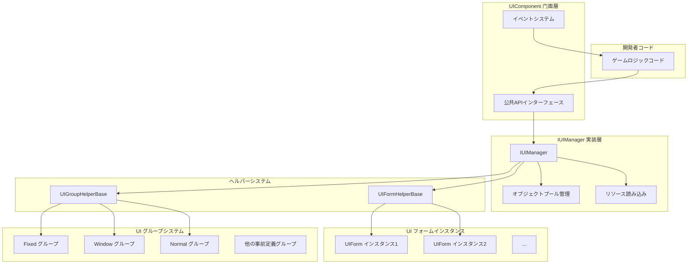
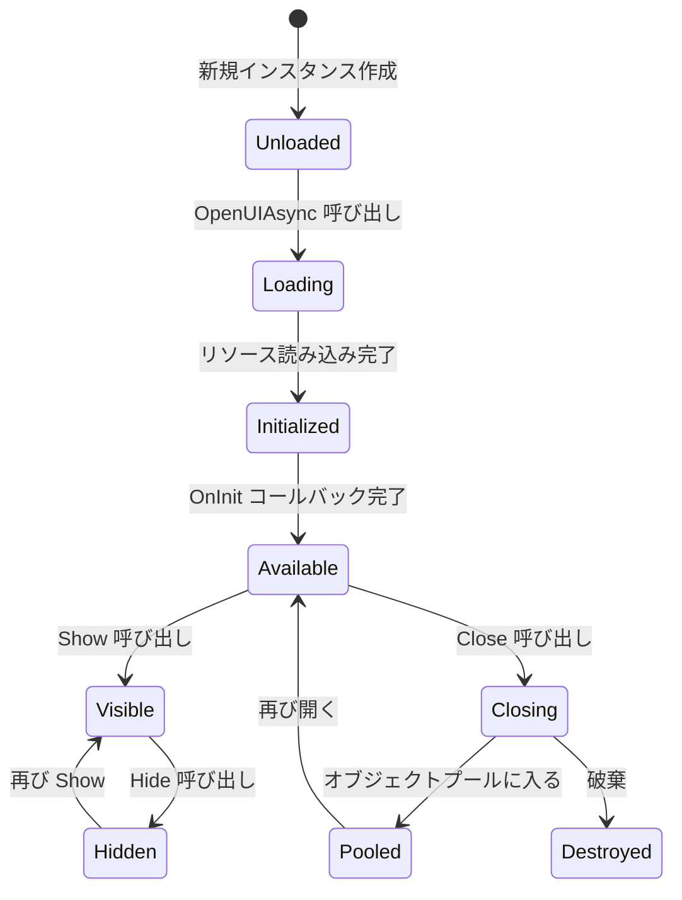
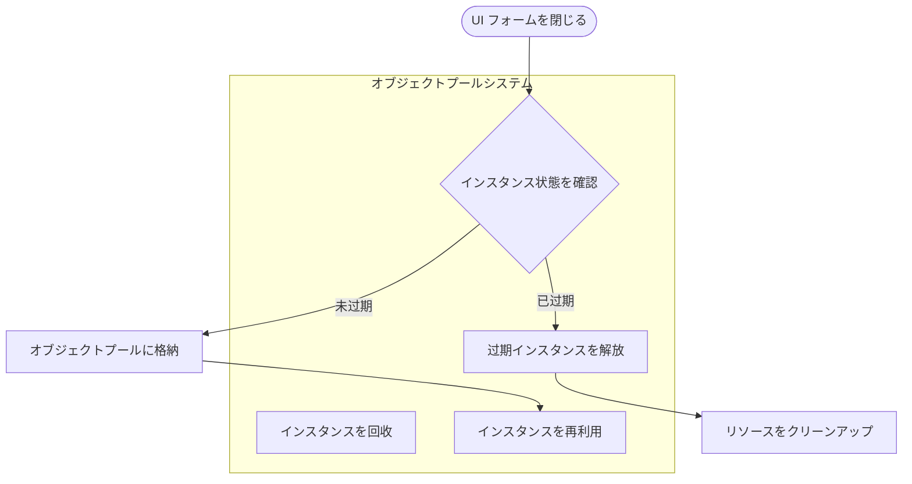
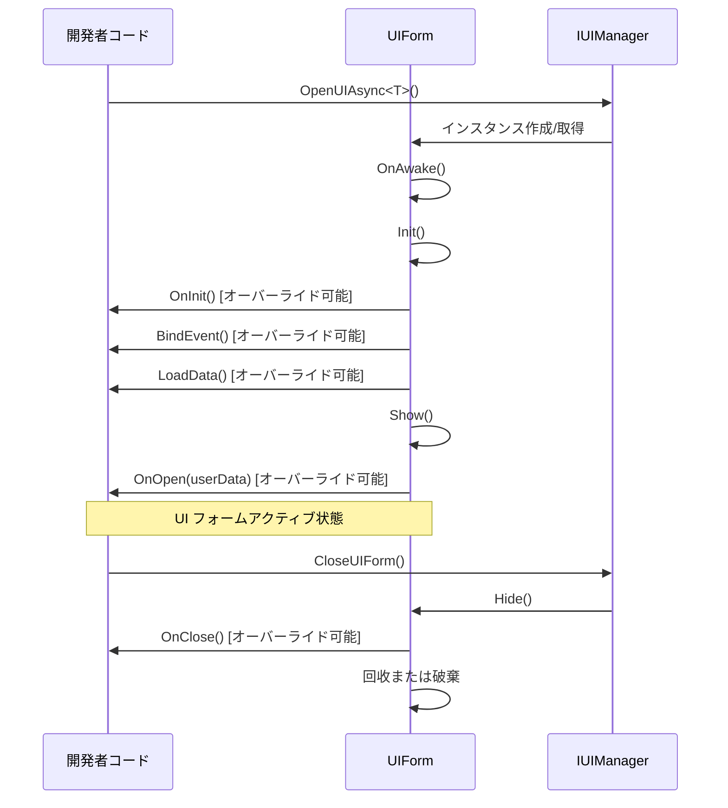

# UI コンポーネント

UI コンポーネント（UIComponent）は、GameFrameX フレームワークにおいて UI フォームの管理と操作を担当するコアコンポーネントです。UI システムの门面（Facade）として、底层の `IUIManager` の複雑な実装をカプセル化し、開発者に簡潔で使いやすい API インターフェースを提供します。

## 概要

UIComponent は Unity コンポーネント（GameFrameworkComponent を継承）であり、ゲームのライフサイクル全体を通じて UI フォームの読み込み、表示、非表示、閉じる、回收などのすべての管理工作を担当します。オブジェクトプールパターンを采用して UI フォームインスタンスを管理し、頻繁な作成·销毁によるパフォーマンス开销を効果的に削减します。

UIComponent は Unity 標準の UGUI と、サードパーティ UI フレームワーク FairyGUI を始めとする複数の UI レンダリング方案をサポートします。事前定義された18個の UI グループ（UIGroup）を通じて、精確なレイヤー制御と覆い関係管理を実現できます。

**コア機能：**
- UI フォームの非同期読み込みと開く
- UI フォームを閉じる複数の方法（直接閉じる、遅延閉じる、グループ閉じる）
- UI フォームオブジェクトプール管理
- UI グループレイヤー制御
- 表示/非表示アニメーションサポート
- 完全なイベントシステム

> UIComponent は UI システムのコアエントリーポイントです。詳細な API メソッドの説明は [UIComponent API リファレンス](./5-api-reference.ui-component) を参照してください。

## アーキテクチャ

UIComponent は门面パターン（Facade Pattern）を采用して設計されており、複雑な UI 管理ロジックを内部にカプセル化し、開発者に簡潔な API のみを공개します。



**アーキテクチャ説明：**

1. **门面層（UIComponent）**：統一された公共 API を提供し、UI を開く、閉じる、取得、UI グループ管理などのメソッドが含まれます。同時にイベントの配布を担当します。

2. **実装層（IUIManager）**：具体的なビジネスロジックを処理し、UI フォームの読み込み、キャッシュ、表示/非表示状態管理等を含みます。

3. **オブジェクトプール管理**：IObjectPoolManager を使用して UI フォームインスタンスの再利用を管理し、自动回收と过期解放をサポートします。

4. **ヘルパー層**：UIFormHelperBase（UI フォームインスタンスの作成と破棄を担当）と UIGroupHelperBase（UI グループの作成与管理を担当）が含まれます。

5. **UI フォーム層**：実際の UI フォームインスタンスであり、UIForm 基本クラスを継承します。

6. **UI グループ層**：同じレイヤーを持つ UI フォームを組織・管理するために使用されます。

## コアコンセプト

### UI フォーム（UIForm）

UI フォームは UI システムで管理される最小単位です。各 UI フォームは `UIForm` 基本クラスを継承し、`IUIForm` インターフェースを実装します。UI フォームは以下の状態を持ちます：

- **Available（可用）**：フォームが初期化を完了し、表示可能
- **Visible（表示）**：フォームが現在表示されている
- **FromPool（プールから）**：フォームインスタンスがオブジェクトプールから取得されたかどうか



### UI グループシステム

UI グループ（UIGroup）は、類似の表示レイヤー特性を持つ UI フォームを組織するために使用されます。各 UI グループには深度値（Depth）があり、深度値が大きいほどレイヤーが高くなります（前面に表示）。

**事前定義の18個の UI グループ：**

| UI グループ名 | 深度値 | 用途説明 |
|----------|--------|----------|
| Hidden | 40 | 非表示レイヤー、一時的な配置用 |
| Background | 35 | 背景レイヤー |
| Scene | 30 | シーンレイヤー |
| World | 27 | 世界レイヤー（3D シーン内の UI など） |
| Battle | 25 | 戦闘レイヤー |
| Hud | 22 | 頭上情報レイヤー |
| Map | 20 | マップレイヤー |
| Floor | 15 | 下層レイヤー |
| Normal | 10 | 通常レイヤー |
| Fixed | 0 | 固定レイヤー |
| Window | -10 | ウィンドウレイヤー |
| Tip | -15 | ヒントレイヤー |
| Guide | -20 | ガイドレイヤー |
| BlackBoard | -22 | 黒板レイヤー |
| Dialogue | -23 | ダイアログレイヤー |
| Loading | -25 | ローディングレイヤー |
| Notify | -30 | 通知レイヤー |
| System | -35 | システムレイヤー（最高優先度） |

> UI グループの详细信息は、[UI グループレイヤー](./7-ui-group-hierarchy) ドキュメントを参照してください。

### オブジェクトプール管理

UIComponent には強力なオブジェクトプール管理系统が組み込まれており、以下の主要パラメータを含みます：

- **InstanceCapacity**：オブジェクトプール容量、デフォルト 16
- **InstanceExpireTime**：オブジェクト过期時間（秒）、デフォルト 60 秒
- **InstanceAutoReleaseInterval**：自動解放間隔（秒）、デフォルト 60 秒
- **RecycleInterval**：回收間隔（秒）、デフォルト 60 秒
- **EnableAutoReleaseUIForm**：自動解放を有効にするか、デフォルト有効



## UI フォームを開く

### 基本使用方法

`OpenAsync<T>()` メソッドを使用して UI フォームを非同期で開くことができます：

```csharp
// 全画面 UI を開く
var mainMenuForm = await UIComponent.Instance.OpenFullScreenAsync<MainMenuForm>();

// 非全画面 UI を開く
var settingsForm = await UIComponent.Instance.OpenAsync<SettingsForm>(false);

// ユーザーデータ付きで開く
var dialogData = new DialogData { Title = "確認", Message = "確認しますか？" };
var confirmForm = await UIComponent.Instance.OpenAsync<ConfirmForm>(false, dialogData);
```

> 他の UI を開く API メソッドは、[UIComponent API リファレンス - Open メソッド](./5-api-reference.ui-component#open-メソッド) を参照してください。

### UI グループ属性の使用

`[OptionUIGroup]` 属性を使用して UI フォームの所属する UI グループを指定できます：

```csharp
[OptionUIGroup(UIGroupNameConstants.Window)]
public class MyWindowForm : UIForm
{
    // ウィンドウ内容
}
```

## UI フォームを閉じる

### 単一の UI を閉じる

```csharp
// インスタンスで閉じる
var form = UIComponent.Instance.GetLoaded<SettingsForm>();
UIComponent.Instance.CloseUIForm(form);

// タイプで閉じる（最初の一致を閉じる）
UIComponent.Instance.CloseUIForm<SettingsForm>();

// シリアル番号で閉じる
UIComponent.Instance.CloseUIForm(serialId);
```

### 複数の UI を閉じる

```csharp
// すべての読み込み済み UI を閉じる
UIComponent.Instance.CloseAllLoadedUIForms();

// 指定した UI グループのすべての UI を閉じる
UIComponent.Instance.CloseUIGroup(UIGroupNameConstants.Window);

// すべての読み込み中の UI を閉じる
UIComponent.Instance.CloseAllLoadingUIForms();
```

## UI フォームを取得

### 読み込み済みの UI をクエリ

```csharp
// タイプで単一の UI を取得
var form = UIComponent.Instance.GetLoaded<MainMenuForm>();

// 指定タイプすべての読み込み済み UI を取得
var forms = UIComponent.Instance.GetLoadedList<DialogForm>();

// 読み込み済み且つ表示中の UI を取得
var visibleForm = UIComponent.Instance.GetLoadedAndShowing<AlertForm>();

// 指定 UI が表示中かどうかを判定
bool isShowing = UIComponent.Instance.HasLoadedAndShowing("AlertForm");
```

### すべての UI を取得

```csharp
// すべての読み込み済み UI を取得
var allForms = UIComponent.Instance.GetAllLoadedUIForms();

// すべての読み込み中の UI のシリアル番号を取得
var loadingIds = UIComponent.Instance.GetAllLoadingUIFormSerialIds();
```

## UI グループ管理

### カスタム UI グループの追加

```csharp
// 新しい UI グループを追加
bool success = UIComponent.Instance.AddUIGroup("CustomGroup", 5);
```

### UI グループのクエリ

```csharp
// UI グループが存在するかをチェック
bool exists = UIComponent.Instance.HasUIGroup("Window");

// UI グループを取得
var group = UIComponent.Instance.GetUIGroup("Window");

// すべての UI グループを取得
var allGroups = UIComponent.Instance.GetAllUIGroups();

// UI グループ数を取得
int count = UIComponent.Instance.UIGroupCount;
```

## 設定オプション

UIComponent は 풍부な設定オプションを提供し、Inspector パネルまたはコードで設定できます：

| 設定項目 | タイプ | デフォルト値 | 説明 |
|--------|------|--------|------|
| EnableAutoReleaseUIForm | bool | true | 自動解放 UI を有効にするか |
| EnableCloseUIFormCompleteEvent | bool | true | UI を閉じる時に完了イベントが発生するするか |
| IsEnableUIShowAnimation | bool | false | UI 表示アニメーションを有効にするか |
| IsEnableUIHideAnimation | bool | false | UI 非表示アニメーションを有効にするか |
| InstanceAutoReleaseInterval | float | 60f | UI インスタンス自動解放間隔（秒） |
| InstanceCapacity | int | 16 | UI インスタンスオブジェクトプール容量 |
| InstanceExpireTime | float | 60f | UI インスタンス过期時間（秒） |
| RecycleInterval | int | 60 | UI 回收間隔（秒） |
| UGUIRoot | Transform | null | UGUI ルートノード |
| FairyGUIRoot | Transform | null | FairyGUI ルートノード |

### コード設定の示例

```csharp
// 自動解放を無効化
UIComponent.Instance.EnableAutoReleaseUIForm = false;

// オブジェクトプール容量を設定
UIComponent.Instance.InstanceCapacity = 32;

// インスタンス过期時間を設定
UIComponent.Instance.InstanceExpireTime = 120f;

// 回收間隔を設定
UIComponent.Instance.RecycleInterval = 30;
```

## UI フォームライフサイクル

UI フォームは完全なライフサイクルを持ち、開発者は対応するメソッドをオーバーライドして状態の変化に応答できます：



### オーバーライド可能なメソッド

カスタム UIForm で、以下のメソッドをオーバーライドしてライフサイクルイベントを処理できます：

| メソッド | 呼び出しタイミング | 用途 |
|------|----------|------|
| `OnAwake()` | インスタンス作成後、初期化前 | Awake ロジックを実行 |
| `OnInit()` | UI フォーム初回初期化時 | UI コンポーネントを初期化 |
| `BindEvent()` | 初期化時 | イベントリスナのバインディング |
| `LoadData()` | 初期化時 | データを読み込む |
| `OnOpen(object userData)` | UI フォームを開く時 | 開くロジックを処理 |
| `OnClose(bool isShutdown, object userData)` | UI フォームを閉じる時 | 閉じるロジックを処理 |
| `OnPause()` | UI が覆われた時 | 一時停止ロジックを処理 |
| `OnResume()` | UI が再表示される時 | 恢复ロジックを処理 |
| `OnUpdate(float elapseSeconds, float realElapseSeconds)` | 毎フレーム更新 | 更新ロジックを実行 |
| `UpdateLocalization()` | 言語変更時 | ローカライズテキストを更新 |

## イベントシステム

UIComponent は完善されたイベントシステムを提供し、UI フォームの状態変化を監視するために使用されます：

### 購読可能なイベント

| イベント名 | 説明 | イベントパラメータ |
|----------|------|----------|
| `OpenUIFormSuccess` | UI フォームを開く成功 | OpenUIFormSuccessEventArgs |
| `OpenUIFormFailure` | UI フォームを開く失敗 | OpenUIFormFailureEventArgs |
| `CloseUIFormComplete` | UI フォームを閉じる完了 | CloseUIFormCompleteEventArgs |

### イベント使用示例

```csharp
// 開く成功イベントを購読
UIComponent.Instance.OpenUIFormSuccess += OnOpenSuccess;

private void OnOpenSuccess(object sender, OpenUIFormSuccessEventArgs e)
{
    Debug.Log($"UI を開く成功: {e.UIFormAssetName}");
}

// 閉じる完了イベントを購読
UIComponent.Instance.CloseUIFormComplete += OnCloseComplete;

private void OnCloseComplete(object sender, CloseUIFormCompleteEventArgs e)
{
    Debug.Log($"UI を閉じる完了: {e.UIFormSerialId}");
}
```

> イベントシステムの詳細説明は、[イベントシステム](./6-event-system) ドキュメントを参照してください。

## 関連リンク

- [UIComponent API リファレンス](./5-api-reference.ui-component) - 完全な API メソッド説明
- [UI フォーム](./4-core-concepts.ui-form) - UIForm 基本クラス详解
- [UI グループシステム](./4-core-concepts.ui-group) - UI グループ管理详解
- [オブジェクトプール管理](./4-core-concepts.object-pool) - オブジェクトプールメカニズム详解
- [UI グループレイヤー](./7-ui-group-hierarchy) - UI グループレイヤー詳細説明
- [UI プロパティ](./8-configuration.attributes) - UI 関連属性の説明