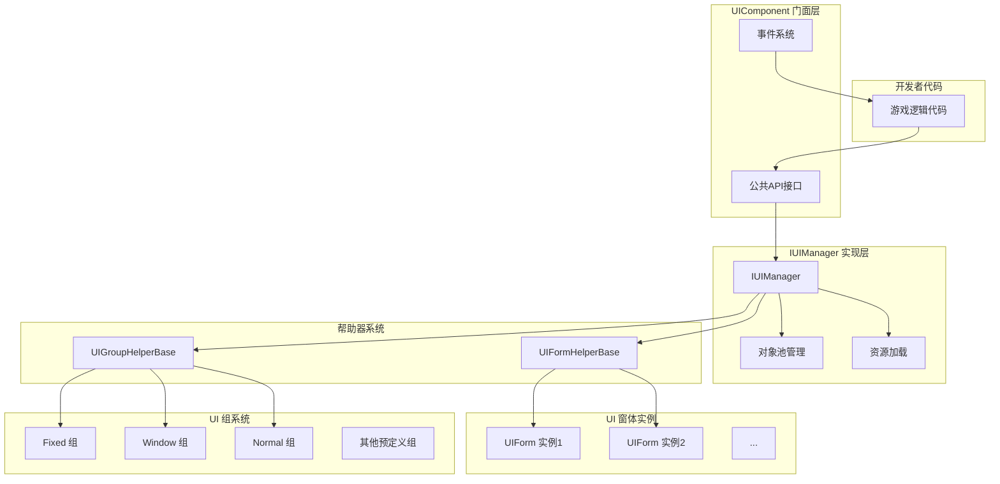
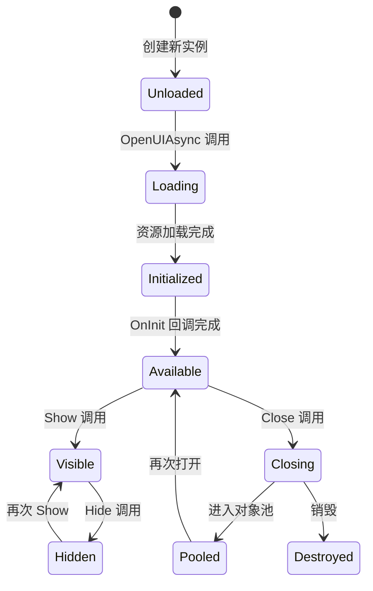
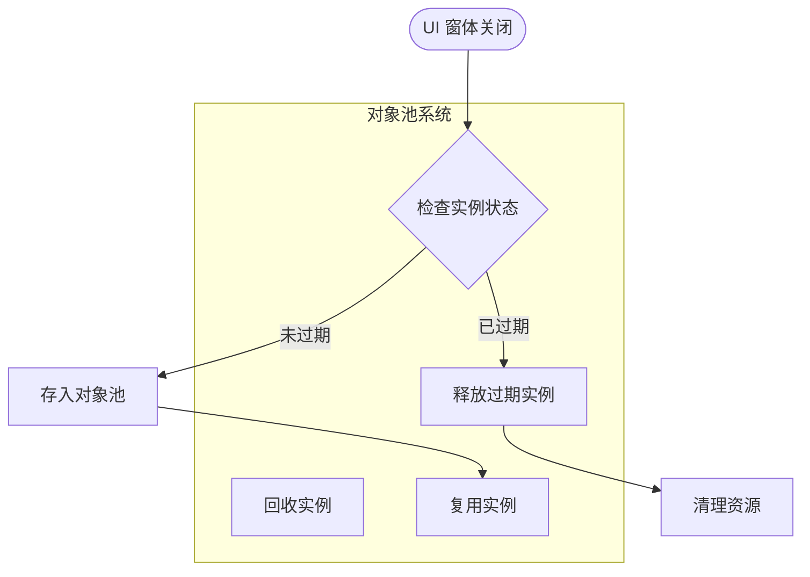
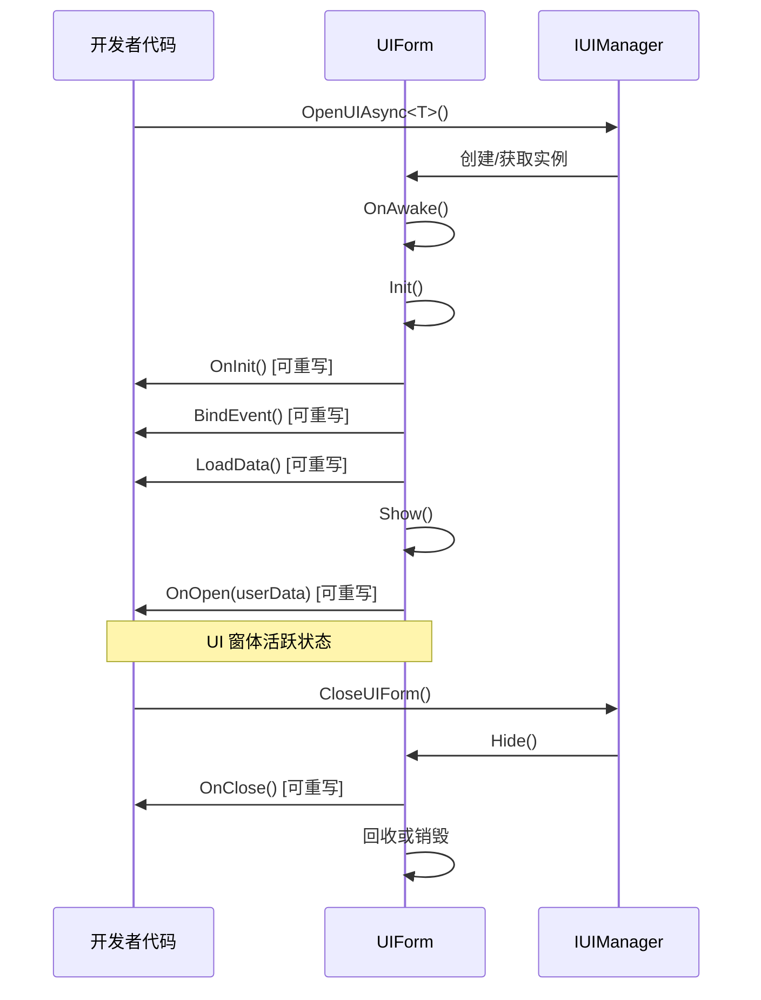

# UI コンポーネント

UI コンポーネント（UIComponent）是 GameFrameX フレームワーク中负责管理和操作 UI 窗体的コアコンポーネント。它作为 UI 系统的门面（Facade），カプセル化了底层 `IUIManager` 的複雑実装，为開発者提供シンプル易用的 API インターフェース。

## 概要

UIComponent は Unity コンポーネント（継承自 GameFrameworkComponent），在整个游戏ライフサイクル中负责 UI 窗体的ロード、显示、隐藏、閉じるおよび回收等全部管理工作。它采用对象池モード来管理 UI 窗体インスタンス，有效减少频繁作成破棄带来的性能开销。

UIComponent サポート多种 UI 渲染方案，含みます Unity 原生的 UGUI および第3方 UI フレームワーク FairyGUI。通过预定義的 18 个 UI 组（UIGroup），〜できます実装精确的层级控制和遮挡关系管理。

**コア機能：**
- 非同期ロード和打开 UI 窗体
- 多种方法閉じる UI 窗体（直接閉じる、延迟閉じる、组閉じる）
- UI 窗体对象池管理
- UI 组层级控制
- 显示/隐藏动画サポート
- 完全な的イベント系统

> UIComponent 是 UI 系统的コア入口，詳細的 API メソッド説明请参照 [UIComponent API リファレンス](./5-api-reference.ui-component)。

## アーキテクチャ

UIComponent 采用ファサードパターン（Facade Pattern）設計，将複雑的 UI 管理逻辑カプセル化在内部，仅暴露シンプル的 API 供開発者使用。



**アーキテクチャ説明：**

1. **门面层（UIComponent）**：提供統一された的公共 API，含みます打开、閉じる、取得 UI 窗体，管理 UI 组等メソッド。同時に负责イベント的分发。

2. **実装層（IUIManager）**：処理具体的业务逻辑，含みます UI 窗体的ロード、缓存、显示/隐藏ステータス管理等。

3. **对象池管理**：使用 IObjectPoolManager 管理 UI 窗体インスタンス的复用，サポート自动回收和过期解放。

4. **帮助器层**：含みます UIFormHelperBase（负责 UI 窗体インスタンス的作成和破棄）和 UIGroupHelperBase（负责 UI 组的作成和管理）。

5. **UI 窗体层**：实际的 UI 窗体インスタンス，継承自 UIForm 基底クラス。

6. **UI 组层**：用于组织和管理具有相同层级プロパティ的 UI 窗体。

## コアコンセプト

### UI 窗体（UIForm）

UI 窗体是 UI 系统管理的最小单位。每个 UI 窗体都継承自 `UIForm` 基底クラス，実装了 `IUIForm` インターフェース。UI 窗体具有以下ステータス：

- **Available（可用）**：窗体已完成初期化，〜できます被显示
- **Visible（可见）**：窗体当前〜中显示
- **FromPool（来自池）**：窗体インスタンス是否从对象池取得



### UI 组系统

UI 组（UIGroup）用于组织具有相似显示层级特性的 UI 窗体。每个 UI 组都有一个深度值（Depth），深度值越大，层级越高（越靠前显示）。

**预定義的 18 个 UI 组：**

| UI 组名称 | 深度值 | 用途説明 |
|----------|--------|----------|
| Hidden | 40 | 隐藏层，用于临时存放 |
| Background | 35 | 背景层 |
| Scene | 30 | シーン层 |
| World | 27 | 世界层（如 3D シーン中的 UI） |
| Battle | 25 | 战斗层 |
| Hud | 22 | 头顶情報层 |
| Map | 20 | 地图层 |
| Floor | 15 | 底层 |
| Normal | 10 | 常规层 |
| Fixed | 0 | 固定层 |
| Window | -10 | ウィンドウ层 |
| Tip | -15 | ヒント层 |
| Guide | -20 | 引导层 |
| BlackBoard | -22 | 黑板层 |
| Dialogue | -23 | 对话层 |
| Loading | -25 | ロード层 |
| Notify | -30 | 通知层 |
| System | -35 | 系统层（最高优先级） |

> 更多关于 UI 组的詳細情報，请参照 [UI 组层级](./7-ui-group-hierarchy) ドキュメント。

### 对象池管理

UIComponent 内置了強力的对象池管理系统，主なパッケージ含以下パラメータ：

- **InstanceCapacity**：对象池容量，デフォルト 16
- **InstanceExpireTime**：对象过期时间（秒），デフォルト 60 秒
- **InstanceAutoReleaseInterval**：自动解放间隔（秒），デフォルト 60 秒
- **RecycleInterval**：回收间隔（秒），デフォルト 60 秒
- **EnableAutoReleaseUIForm**：是否启用自动解放，デフォルト开启



## 打开 UI 窗体

### 基本用法

使用 `OpenAsync<T>()` メソッド〜できます异步打开一个 UI 窗体：

```csharp
// 打开全屏 UI
var mainMenuForm = await UIComponent.Instance.OpenFullScreenAsync<MainMenuForm>();

// 打开非全屏 UI
var settingsForm = await UIComponent.Instance.OpenAsync<SettingsForm>(false);

// 带用户数据打开
var dialogData = new DialogData { Title = "确认", Message = "是否确认？" };
var confirmForm = await UIComponent.Instance.OpenAsync<ConfirmForm>(false, dialogData);
```

> 更多打开 UI 的 API メソッド，请参照 [UIComponent API リファレンス - Open メソッド](./5-api-reference.ui-component#open-メソッド)。

### 使用 UI 组プロパティ

〜できます通过 `[OptionUIGroup]` 特性为 UI 窗体指定所属的 UI 组：

```csharp
[OptionUIGroup(UIGroupNameConstants.Window)]
public class MyWindowForm : UIForm
{
    // 窗口内容
}
```

## 閉じる UI 窗体

### 閉じる单个 UI

```csharp
// 通过实例关闭
var form = UIComponent.Instance.GetLoaded<SettingsForm>();
UIComponent.Instance.CloseUIForm(form);

// 通过类型关闭（关闭第一个匹配的）
UIComponent.Instance.CloseUIForm<SettingsForm>();

// 通过序列编号关闭
UIComponent.Instance.CloseUIForm(serialId);
```

### 閉じる多个 UI

```csharp
// 关闭所有已加载的 UI
UIComponent.Instance.CloseAllLoadedUIForms();

// 关闭指定 UI 组的所有 UI
UIComponent.Instance.CloseUIGroup(UIGroupNameConstants.Window);

// 关闭所有正在加载的 UI
UIComponent.Instance.CloseAllLoadingUIForms();
```

## 取得 UI 窗体

### 查询已ロード的 UI

```csharp
// 获取单个 UI（按类型）
var form = UIComponent.Instance.GetLoaded<MainMenuForm>();

// 获取所有符合类型的 UI
var forms = UIComponent.Instance.GetLoadedList<DialogForm>();

// 获取已加载且正在显示的 UI
var visibleForm = UIComponent.Instance.GetLoadedAndShowing<AlertForm>();

// 判断指定 UI 是否正在显示
bool isShowing = UIComponent.Instance.HasLoadedAndShowing("AlertForm");
```

### 取得所有 UI

```csharp
// 获取所有已加载的 UI
var allForms = UIComponent.Instance.GetAllLoadedUIForms();

// 获取所有正在加载的 UI 的序列编号
var loadingIds = UIComponent.Instance.GetAllLoadingUIFormSerialIds();
```

## 管理 UI 组

### 追加自定義 UI 组

```csharp
// 添加新的 UI 组
bool success = UIComponent.Instance.AddUIGroup("CustomGroup", 5);
```

### 查询 UI 组

```csharp
// 检查 UI 组是否存在
bool exists = UIComponent.Instance.HasUIGroup("Window");

// 获取 UI 组
var group = UIComponent.Instance.GetUIGroup("Window");

// 获取所有 UI 组
var allGroups = UIComponent.Instance.GetAllUIGroups();

// 获取 UI 组数量
int count = UIComponent.Instance.UIGroupCount;
```

## 設定オプション

UIComponent 提供します丰富的設定オプション，〜できます通过 Inspector パネル或コード进行設定：

| 設定项 | タイプ | デフォルト值 | 説明 |
|--------|------|--------|------|
| EnableAutoReleaseUIForm | bool | true | 是否启用自动解放 UI |
| EnableCloseUIFormCompleteEvent | bool | true | 是否在閉じる UI 时トリガー完成イベント |
| IsEnableUIShowAnimation | bool | false | 是否启用 UI 显示动画 |
| IsEnableUIHideAnimation | bool | false | 是否启用 UI 隐藏动画 |
| InstanceAutoReleaseInterval | float | 60f | UI インスタンス自动解放间隔（秒） |
| InstanceCapacity | int | 16 | UI インスタンス对象池容量 |
| InstanceExpireTime | float | 60f | UI インスタンス过期时间（秒） |
| RecycleInterval | int | 60 | UI 回收间隔（秒） |
| UGUIRoot | Transform | null | UGUI 根节点 |
| FairyGUIRoot | Transform | null | FairyGUI 根节点 |

### コード設定例

```csharp
// 禁用自动释放
UIComponent.Instance.EnableAutoReleaseUIForm = false;

// 设置对象池容量
UIComponent.Instance.InstanceCapacity = 32;

// 设置实例过期时间
UIComponent.Instance.InstanceExpireTime = 120f;

// 设置回收间隔
UIComponent.Instance.RecycleInterval = 30;
```

## UI 窗体ライフサイクル

UI 窗体具有完全な的ライフサイクル，開発者〜できます通过オーバーライド相应メソッド来响应ステータス变化：



### 可オーバーライド的メソッド

在自定義 UIForm 中，〜できますオーバーライド以下メソッド来処理ライフサイクルイベント：

| メソッド | 呼び出し时机 | 用途 |
|------|----------|------|
| `OnAwake()` | インスタンス作成后、初期化前 | 执行 Awake 逻辑 |
| `OnInit()` | UI 窗体首次初期化时 | 初期化 UI コンポーネント |
| `BindEvent()` | 初期化时 | 绑定イベント监听 |
| `LoadData()` | 初期化时 | ロード数据 |
| `OnOpen(object userData)` | UI 窗体打开时 | 処理打开逻辑 |
| `OnClose(bool isShutdown, object userData)` | UI 窗体閉じる时 | 処理閉じる逻辑 |
| `OnPause()` | UI 被遮挡时 | 処理暂停逻辑 |
| `OnResume()` | UI 恢复显示时 | 処理恢复逻辑 |
| `OnUpdate(float elapseSeconds, float realElapseSeconds)` | 每帧アップデート | 执行アップデート逻辑 |
| `UpdateLocalization()` | 语言变更时 | アップデート本地化文本 |

## イベント系统

UIComponent 提供します完善的イベント系统，用于监听 UI 窗体的ステータス变化：

### 可購読的イベント

| イベント名称 | 説明 | イベントパラメータ |
|----------|------|----------|
| `OpenUIFormSuccess` | UI 窗体打开成功 | OpenUIFormSuccessEventArgs |
| `OpenUIFormFailure` | UI 窗体打开失敗 | OpenUIFormFailureEventArgs |
| `CloseUIFormComplete` | UI 窗体閉じる完成 | CloseUIFormCompleteEventArgs |

### イベント使用例

```csharp
// 订阅打开成功事件
UIComponent.Instance.OpenUIFormSuccess += OnOpenSuccess;

private void OnOpenSuccess(object sender, OpenUIFormSuccessEventArgs e)
{
    Debug.Log($"UI 打开成功: {e.UIFormAssetName}");
}

// 订阅关闭完成事件
UIComponent.Instance.CloseUIFormComplete += OnCloseComplete;

private void OnCloseComplete(object sender, CloseUIFormCompleteEventArgs e)
{
    Debug.Log($"UI 关闭完成: {e.UIFormSerialId}");
}
```

> イベント系统的詳細説明请参照 [イベント系统](./6-event-system) ドキュメント。

## 関連リンク

- [UIComponent API リファレンス](./5-api-reference.ui-component) - 完全な的 API メソッド説明
- [UI 窗体](./4-core-concepts.ui-form) - UIForm 基底クラス详解
- [UI 组系统](./4-core-concepts.ui-group) - UI 组管理详解
- [对象池管理](./4-core-concepts.object-pool) - 对象池机制详解
- [UI 组层级](./7-ui-group-hierarchy) - UI 组层级詳細説明
- [UI プロパティ](./8-configuration.attributes) - UI 相关特性説明
